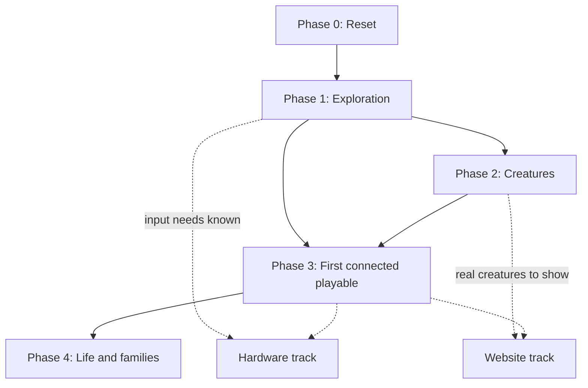

# Roadmap

The goal is a game people want to keep playing: exploring leads to samples worth
understanding, understanding leads to mibis worth keeping, and those mibis make
exploring richer. Everything is ordered by what that depends on. The world and the
creatures come first, because every screen, piece of art, device choice and
website page has to show them.

One main outcome is active at a time. The hardware and website tracks run
alongside only when they have something independent to do.

## Phase 0: Reset (now)

**Outcome:** a clean project with one current explanation of the game and a plan.

- New public and private repositories. The first prototype is imported intact
  under `v1/`, alongside the accepted art, original references and hardware
  concepts.
- Design documents rewritten from what holds up, with decided and open marked.
- A decisions log in the private repository.
- The previous website and online prototypes taken offline until there is
  something new to show.
- The old repositories archived.

**Review:** the project lead reads `design/` and this roadmap.

## Phase 1: Exploration (complete)

Status: complete. Step 1 done (the combined world-map + living-patch model was
chosen); step 2 done (the browser prototype in the sandbox, played and approved
as built); step 3 done ([world and exploration](design/world-and-exploration.md)
holds the decided design). Refinement continues once the full game loop is
sketched.

**Outcome:** the project lead plays an open-map expedition and judges whether it makes them
curious.

1. **Exploration options.** Two or three models of the world and what the player
   does in it. Each one is shown as the same expedition on a Companion-size screen:
   - what's there and what the player can do;
   - what changes and what comes home;
   - why they'd go back;
   - how it feeds the Station.

   The sketches are deliberately rough, and the options must answer the questions
   in [world and exploration](design/world-and-exploration.md).
   - Lead: game design.
   - With: UX (controls and screen), genomics (what finds contain).
   - Review: the project lead picks one, or rejects all with reasons.
2. **Rough playable version.** One expedition of the chosen model, using only the
   Companion's controls, with placeholder art, ending with cargo sent home. It is built
   either as a throwaway browser prototype (fast to tune) or in the v1 simulator
   (lasting, slower); the project lead chooses.
   - Lead: engineering.
   - Review: the project lead plays it. It succeeds if the player can say:
     - why they went where they went;
     - what they changed;
     - what they brought back;
     - what they want to do next.
3. **Write it down.** [World and exploration](design/world-and-exploration.md)
   becomes the decided design.

**Not included:** finished art, Station screens, breeding, care, hardware.

## Phase 2: Creatures

**Outcome:** a small starting set of species the project lead likes, and a decided way
to turn a genome into a creature on screen.

1. **Species.** Three to five species proposals. For each:
   - what it is in the world;
   - what defines it;
   - what varies between individuals;
   - which traits players can steer at creation;
   - which change only through breeding.

   Lead: game design with genomics; art direction for the look.
2. **Species art** in Miniature Lives at device size, several individuals per
   species to show variation. Lead: art direction.
3. **Creature pipeline decision.** How a genome becomes a sprite and portrait
   without per-creature hand art: layered parts, procedural assembly, or
   reviewed generation. Includes what to keep from the genome workbench. Lead:
   engineering with art direction.

**Review:** the project lead approves the species and the pipeline approach.

**Depends on:** phase 1, so species fit the world they're found in.

## Phase 3: First connected playable

**Outcome:** one complete loop with real creatures, played by people who aren't
on the team:

1. explore;
2. return;
3. identify;
4. optionally research;
5. create;
6. open;
7. meet the mibi.

Work in this phase:

- The Station research picture: how findings become visual, comparable and
  inviting without a labelled diagram. Lead: UX with game design.
- A UI kit and typography in Miniature Lives. Lead: art direction.
- Identification and research costs, and what repeat samples are worth. Lead:
  game design.
- Implementation in the chosen platform. It reuses v1's transfer, acceptance and
  save logic where it fits.
- A defined playtest: what to observe, and with whom.

**Review:** playtest findings and the project lead's own play.

## Phase 4: Life and families

**Outcome:** bonding, care, cooperative gathering and breeding that make players
attached to particular mibis and curious about their families.

Work in this phase:

- Decide what happens to a mibi while it's away from home (the open
  [architecture](design/architecture.md) question).
- Build care as designed: tending a carried mibi on the Companion builds its
  bond; missing care loses nothing, as a bonded juvenile simply waits at home
  until it is tended.
- Design how partners' abilities open the world, connecting back to phase 1.
- Breeding eligibility, viability and how refusal or failure is shown.
- Zones inside a vivarium, if they still earn their place.

## Hardware track

Starts once phase 1 settles what the Companion's controls and screen must do.

1. **Bench console.** The real Companion reference board running the phase 1
   expedition with physical buttons. This is also the KiCad learning project.
2. **Display and controls comparison** at real size, against the exploration and
   creature art.
3. **Power, charging, radio and printing** experiments, each measured.
4. **Enclosure and boards** only after measurements.
5. **Assembly, support and a small pilot**: ten kits, under a US$750 retail
   ceiling.

No purchases beyond bench parts without the project lead's approval.

## Website track

The direction for the site:
- **Format:** a Playdate-style consumer pitch in indie early-access language.
- **Lead with:** the distinctive hardware and screens.
- **Show:** the map and research mechanics.
- **Genetics:** presented as real genetics powering the game, without going
  academic.
- **Open source:** made visible.

1. **Now:** a short, honest page with Pip, a link to the repository, and the
   sandbox: every rough playable in `prototypes/` is published automatically at
   miniaturebeasts.com/sandbox/ by CI on each push to main, with a build stamp.
2. **After phase 2:** a real pitch built around the actual world and creatures,
   with the phase 1 or 3 playable as an embedded demo.
3. **Later:** builder documentation, devlog and kit sign-up.

## Decisions needed next

1. **The Station loop and UI**, the first piece of phase 3: the loop's rules are
   decided and run headless in CI; the screens move to the Station's LVGL face
   one at a time (`design/proposals/lvgl-switch.md`, decided 2026-10-09), each
   becoming the sandbox's default when it passes its gate. The earlier
   JavaScript drawing layer is deprecated.
2. **The cloud layer**, later: the optional, gated enhancements on top of the
   standalone kit.

Task tracking lives in GitHub issues, grouped by milestone per phase and labelled
by area.
