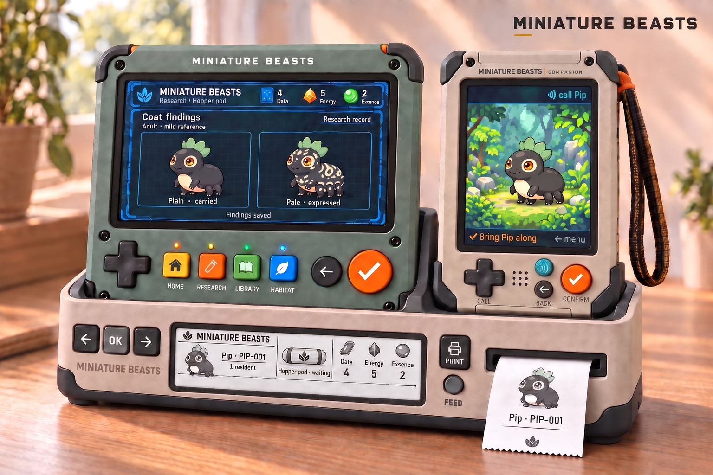
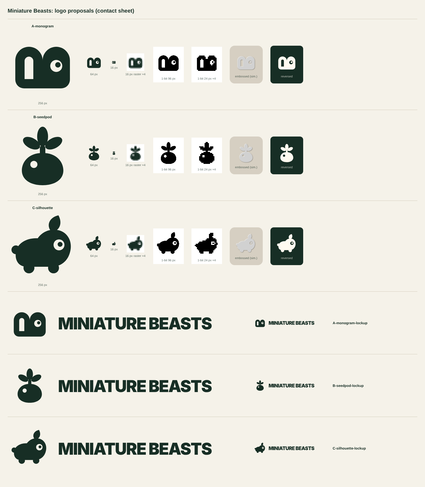

# Art

The creatures and the world have to carry the game. Players should understand a
mibi's inherited differences by looking at it, at the size of the device screen.

The accepted direction is **Miniature Lives**; its rules and the art still to
make are in [design/art-direction.md](../design/art-direction.md). This folder
holds the assets.

## What is here

| Folder | What it is | Status | Preview |
| --- | --- | --- | --- |
| `miniature-lives/` | Device-size proof of the accepted appearance, with prompts, sources and manifests | Accepted |  <em>companion-resident.png: the accepted Companion appearance reference.</em> |
| `visual-directions/` | The three directions that were compared; Miniature Lives was chosen | Reference |  <em>02-miniature-lives.png: the chosen direction, Miniature Lives.</em> |
| `references/` | Original concept images: device family, genome-field and research-terminal studies | Original references; keep unchanged |  <em>branded-family.png: original device-family concept.</em> |
| `companion-concept/` | Original Companion field-partner concept and early studies | Original reference |  <em>field-partner-concept.png: original field-partner concept.</em> |
| `concept-homepage/` | Generated homepage concept art for [`concept-brief-homepage.md`](concept-brief-homepage.md), with prompts and manifests | Candidates, none accepted |  <em>hero-kit.png: H1, the kit render, a candidate.</em> |
| `logo/` | Three logo and monogram proposals with a contact sheet | Proposals |  <em>contact-sheet.png: logo proposals A, B and C.</em> |

Original images keep their exact bytes; manifests and
[`../import-manifest.json`](../import-manifest.json) record hashes. Some READMEs
inside these folders link to older studies that stayed in the archived
repository ([critter-lab@63e824f](https://github.com/PacoCotera/critter-lab/tree/63e824f5dcae8ea5e3906b860873e1603c3c731b/design)).

Rejected studies were not imported: the six-screen discovery proposal
(route-shaped map, label clutter, table-style Station screens), the first-person
scenic and first-partner UI studies, and the header-image screens. They remain in
the archive for reference only.
