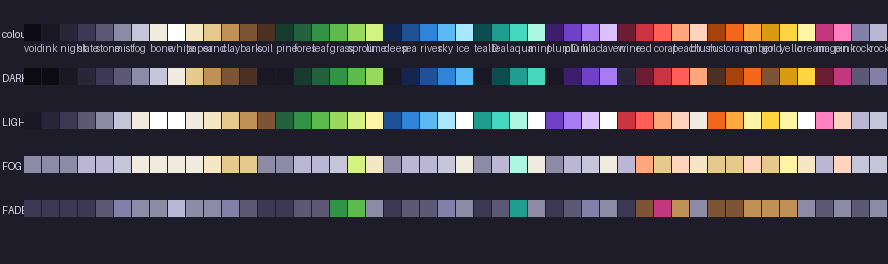

# The Companion's 48 colours: the signed palette file

**Signed by the art director, 2026-10-08.** This is the one palette every Companion sheet is indexed to ([companion-48px-redraw.md §4](../../../design/proposals/companion-48px-redraw.md), [ui-kit §2](../../../design/proposals/ui-kit.md)). It is read from the Companion page's own `PALETTE`, `DARK_OF` and `LIGHT_OF` (`prototypes/exploration/index.html`), so the sheets and the page can never disagree; nothing is added.

- [`palette.json`](palette.json): the 48 colours (index, name, hex, rgb), the tables **DARK**, **LIGHT**, **DARK2**, **FOG** and **FADE** as index lookups computed by the page's own rule (`mixLUT` toward bone at .62 and stone at .5 with the page's 3/4/2 weighted nearest colour), the 4×4 Bayer matrix, and the three rules (outline, blend, characters).
- [`palette.png`](palette.png): the 48 colours as a 48×1 indexed PNG, the `input_palette` for Retro Diffusion and the palette of every atlas.
- [`palette-tables.png`](palette-tables.png): the colours and the four tables, for the eye.

*Row one the colours in index order; then each colour's DARK, LIGHT, FOG and FADE lookups. Diagram, not art.*

**Checks.** [`../tools/check.py`](../tools/check.py) counts off-palette and semi-transparent pixels (both must be 0 on every sheet) and writes the four-grey rendering for the value check. [`../tools/pal.py`](../tools/pal.py) is the shared loader every sheet script uses.

**Discrepancy, recorded.** The hex values in ui-kit §2's table (N0 `#0e0c16`, N1 `#1e1a2b`, …) differ slightly from the page's `PALETTE` (`void #0c0a12`, `ink #1a1725`, …). The brief says the file is identical to the page's PALETTE, so the page's values are signed here; the kit's table should be brought to them when it is next edited. The Retro Diffusion trial's `companion-palette-48.json` already matched the page.
