# Companion 48 px redraw: the review place

The [Companion 48 px redraw](../../../design/proposals/companion-48px-redraw.md) (§9 Decided) on one place, the meadow and pond edge in a storm, with every piece it needs at 1× on the 48 ramps of the [signed palette](../palette/README.md). Everything here is **a candidate for the owner's review**: generated sources down-rendered by script, an Aseprite pass for the meadow, scripted chrome and water, Retro Diffusion sprites beside the scripted ones where one was picked, and Pip derived into the Loika token. Nothing is accepted; nothing touches `prototypes/exploration/index.html`.

**State: round 9 ready for the owner.** It answers the owner's five notes on round 1 and their answers on rounds 2 to 8 (below). Rounds 1 to 8 are frozen in [`round1/`](round1/) to [`round8/`](round8/).



*Every piece at 3× ([1× here](contact-sheet-1x.png)); a piece that changed since round 8 shows round 8 (r8) beside round 9 (r9). The shore test and the Retro Diffusion group are laid out in their own groups. Candidates, not accepted.*

## The owner's decision on the pawn, and what answers it

**The owner picked study H, the Retro Diffusion one: "better detail and proportions"; it overrides the art director's pick (A and C).** H is the pawn. The pawn is now built from H, all four facings and the cycles (walk 3, creep 3, react), below. Hut B at 64 px (in its round form, as the round 8 addendum delivered it) and the ground candidates are as delivered and are not touched this round.

## The art director's decisions on round 7, and what answers each

1. **Pawn: A's front with C's side view, in the concept's proportions.** Pawn I, drawn as the study (the down walk and the right walk frames); the full cycles wait for the lead's confirmation (below). The studies sheet's 1× captions no longer overlap.
2. **Hut B at 64 px, drawn at that size.** Seed 50's result is the base, the hand pass redone at 64 px (below).
3. **Ground: the still reads as a flat lime lawn.** A candidate still with the meadow a step deeper into forest green with tufts, beside the current one (below).

## The owner's answers on round 6, and what answers each

1. **The hut: "B; the hand-pixelled are flat, and A is too small, looks like a mushroom."** Hut B is the outpost now (below); the options A, C, D and the hand-pixelled pair are gone from the sheets and kept in [`round6/`](round6/) with their sources.
2. **The pawn: "need more studies: too much face, goggles look like floating, band is too thick, sideways face looks weird."** Eight studies, Pawn A to H, on one sheet; no cycles until the owner picks (below).

## The owner's answers on round 5, and what answers each

1. **The pawn: "its face is covered; it must show something closer to an Eskimo parka".** A parka hood with a fur ruff round an open face (below).
2. **The hut: "floating, too much work on the roof which comes across as a cupola, the rest falls flat and devoid of charm. Give me options."** Four options, A to D, each planted on the ground, with a calm roof and the charm in the walls, and a hand-pixelled pair as reference (below).

## The owner's answers on round 4, and what answers each

1. **The pawn's coat yellow-orange, between the concept's orange and round 4's yellow, keeping the four-grey margin.** Measured, then chosen (below): an orange coat with yellow-lit edges.
2. **Goggles on the hood instead of the dark opening with two eyes.** Two lenses with a strap and a catch-light each, no face, on every facing (below).
3. **Next hand pass: the hut (all three states) and the bushes (plain, fruit, shaken).** Through the Retro Diffusion recipe, then a hand pass (below).

## The owner's answers on round 3, and what answers each

1. **Water: a second tile variant per frame.** `water1b`/`water2b` (and `deep1b`/`deep2b`), laid by the compose script's seeded hash (below).
2. **Stones: the charged bolt is good; the warm stone is wrong ("a circular glow doesn't make sense, it's a rock").** The charged stones are kept as they were; the warm stone is redrawn as rock with a thin warm vein, no halo and no round core (below).
3. **The pawn: "it cannot look like a Teletubby".** Redrawn as a hooded explorer with a pack, a real hand pass in Aseprite on the VM (below).

## The owner's answers on round 2, and what answers each

1. **Light: the mild storm stands; the teal is rejected.** The teal variant is removed (table, still and figure); `--light storm` is the only light the compose script offers besides the no-table and DARK references.
2. **Water: the ripple rings repeat on a grid.** The tiles carry only the depth gradient, crests and glints; the rings are sparse overlay sprites (below).
3. **Shore: it breaks at certain corners.** Found by laying every neighbourhood; the set is closed (below).
4. **Stones: "redo them".** All six stones and the stepping stone through the Retro Diffusion recipe, then a hand pass for the states (below).
5. The hand-clean list: dew cup, grass2's repeating motif and the creep frames (below; the creep frames are now part of the new pawn).

## The owner's five notes on round 1, and what answers each

1. **"Dark, and the rain too heavy."** The round 1 still darkened everything one ramp step. Round 2 uses no DARK step: the ground, water and plain stones go through a *storm table* (each colour mixed 30 % toward river, nearest palette colour; sand, clay, paper, bone and white kept), and the canopies and the lit stones keep their own colours (decision below). The pawn and mibis never pass through a table. The rain tile has 10 streaks per 96 px (round 1: 26). Limit: the storm reads mild; the owner chose that over a stronger teal cast.
2. **"The grid is not seamless."** A real Aseprite pass (1.3.18, headless on the VM, `tools/aseprite-meadow.lua`): all eight meadow tiles (grass ×4, tall ×2, flowers ×2) take one shared outer band, the master's interior offset by half a tile, blended inward and snapped to the tile's colours; grass3 and grass4 took an 18 px band (8 px left a faint horizontal structure in their own 3×3). Any meadow tile joins any other.
3. **"Pawn, trees and stones good but dark."** Painted values lifted 18 % before quantising, nothing darkens them in the still beyond the storm cast on plain stones; Retro Diffusion sprites run through the same lift.
4. **"River borders too wavy."** The shoreline amplitude is 0.9 + 0.5 px (was 2.2 + 1.3); a shallows band lies between bank and water; the foam line stays.
5. **"Water flat."** Water redrawn (below), two frames.

## The ground, seamless

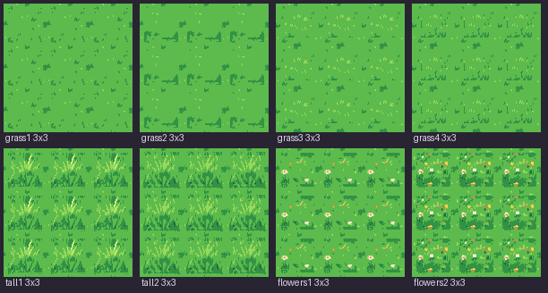

*Each meadow tile laid 3×3 at 1×, after the Aseprite pass (grass3, grass4 at band 18). Candidate.*

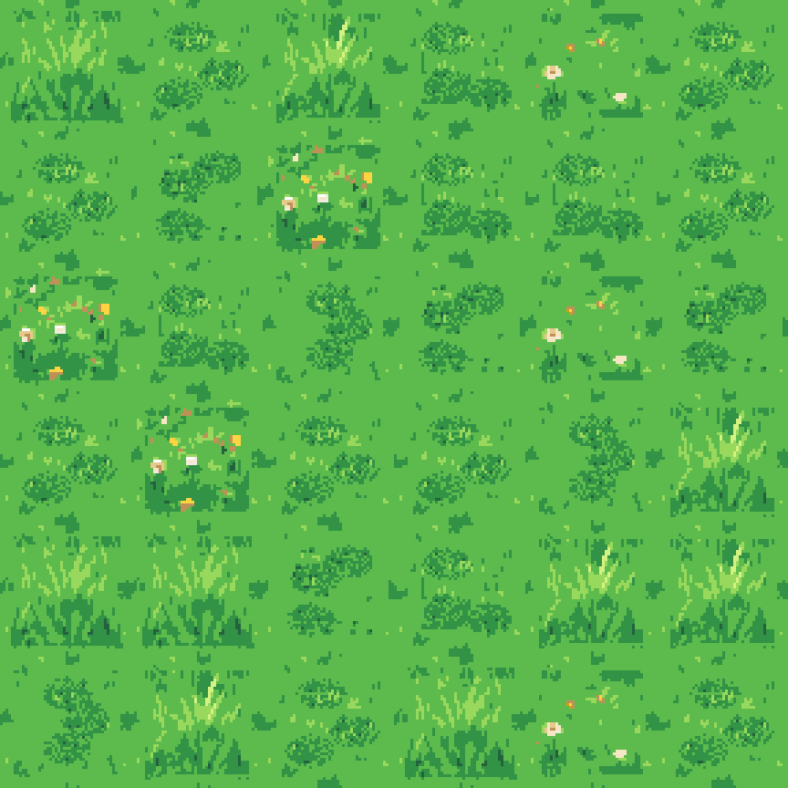

*All eight meadow tiles laid in a seeded random 6×6 ([1×](work/meadow-mixed-1x.png), `tools/meadow-check.py`): the mean colour step across a tile join is 4.8 against 13.4 inside the tiles, and no join shows at 1× or 3×. Candidate. Limit: grass2's dark bracket motif repeats visibly when it is laid several times near each other; it is the one tile to thin out at placement.*

The shore set (16 masks × 2 frames) is cut again from these tiles, the shallows and the new water ([contact sheet](contact-sheet-3x.png), group 2).

## Water

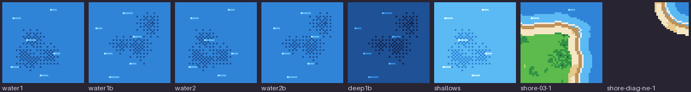

*Round 4 water tiles, 3×: water1, water1b, water2, water2b, deep1b, shallows, shore-03-1, shore-diag-ne-1. No rings in any tile. Scripted candidate (`tools/build-water.py`).*

Two variants (a, b) of each frame, so the page can lay them by a hash. Each carries a few small soft pools (blobs of the deeper step read through a 4×4 Bayer matrix, at most about half-dithered) that fade to nothing over the outer 8 px, so any variant joins any other at the tile edge with no seam, and short crests in the lighter step with an ice glint that keep clear of the left and right edges and drift 3 px between the two frames (the pools do not move). The deep tiles are the same one step down the ramp. The compose script gives each water cell a variant by a seeded hash (`RandomState(31)`, half and half) and the deep overlay takes the same cell's variant; the page can do the same. Limit: with two variants a pool pattern still recurs at a distance; at 1× it reads as texture, not as a grid.

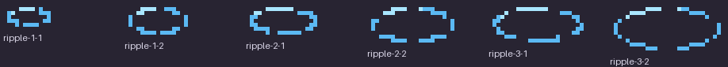

*Ripple overlay sprites, 5×: three sizes (13, 19 and 25 px wide in frame 1) × two frames; broken flat rings in the lighter step with an ice glint, the gaps moving and the ring widening by 2 px between the frames. They are pieces of the props sheet (`ripple-N-F`, sprites, anchor at the foot), never part of a tile.* Placement is the compose script's, and the page can do the same: a seeded hash (`RandomState(48)`) walks the view in 3×3-tile blocks, each block takes at most one ripple (75 % of blocks), at a hashed size and position inside the block; a ripple is drawn only where its whole ring lies over water, so none sits on the shore and none repeats on a tile boundary; one per block means none sits on the same spot twice. The still draws frame 1; the page alternates the frames.

The two Retro Diffusion water tiles of round 2 (`sources/rd/C48-R-r2-water1`, `-water2`) stay as labelled candidates, unused.

## The shore

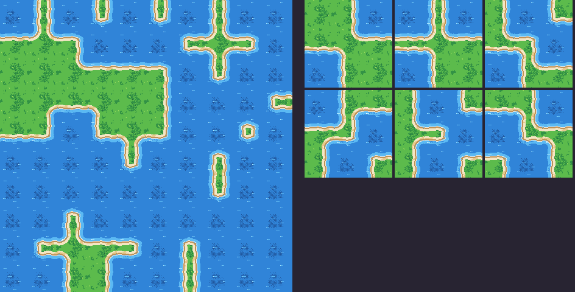

*Shore test: each land tile laid with every neighbourhood it can have; see the groups "Shore test" on [the contact sheet at 3×](contact-sheet-3x.png) and [the random pond at 1×](work/shore-test-pond/pond-outline-random.png). Scripted candidate.*

What was broken: a land tile with water only on a diagonal had no piece, so the pond's corner left a square notch where two bank strips met at a tile corner; and where two adjacent sides are water the land corner was square. Now: **16 cardinal masks** (N=1 E=2 S=4 W=8, water on that side, 2 frames) with the land corner rounded where two adjacent sides are water; **4 diagonal corners** (`shore-diag-ne/se/sw/nw`, 2 frames), a quarter-disc of water with its bank bands, transparent where it would be plain grass, laid over any land tile that has water on a diagonal and on neither side of that corner. Their depth carries the neighbouring strips' wave so the bands meet at the tile join. `tools/shoregrid.py` lays all 256 neighbourhoods and 40 random ponds and counts the pixels where the land / bank / water class differs across a tile join: round 2's set **14 976** broken pixels over the 256 neighbourhoods and **20 085** over the ponds; round 3's **768** and **1 030**, at most 4 pixels per join, which is a one-pixel offset of a band edge, not a gap (every join has the same classes, within a pixel). The page does the same pass: for each land tile, the cardinal mask, then each diagonal corner whose two sides are land.

## The ground: one tile set, two light states

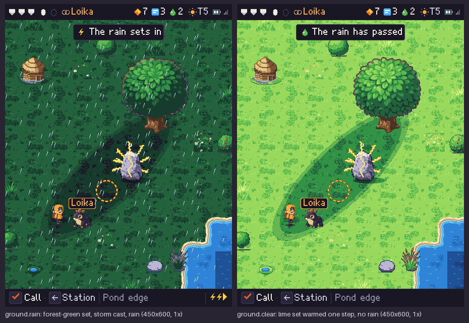

*Left, `ground.rain` (the storm still, the review place's default: `still/companion-place-storm-48.png`); right, `ground.clear` (rain over: `still/companion-place-clear-48.png`). Both 450×600 at 1×. Candidates.*

One tile set (the lime meadow, pond and shallows in `work/ground`) in two light states through palette tables (`P.rain`, `P.clear` in `tools/pal.py`), written into the atlas [`sheets/ground.json`](sheets/ground.json) as the named states `ground.rain` and `ground.clear` (`tools/ground-states.py`: 48 entries each, index in to index out). **Clear is right** (the art director: the warmed lime reads as the bright day): the G ramp warmed one step, every other colour unchanged. **Rain, round 10, one step deeper than round 9:** the art director found that rain did not read as reduced visibility (the ground was leaf green, luma 120, where the concept's is 84 to 93): the table now takes the lime body to **forest (luma 82)**, the tufts' leaf and forest to **pine**, sprout to leaf, lime to grass, and every other colour through the storm cast (30 % toward river; sand, clay, paper, bone and white kept). The canopies and bushes go **one green step deeper in rain** (`P.canopy_rain`; they were the brightest green on screen), unchanged in clear. The outpost's patch of grass takes the ground's table (`P.ground_rain`, `P.ground_clear`).

**Tufts, grouped into darker patches** (`tools/ground-tufts.py`, run once on round 8's four grass tiles): an even speckle read as noise, so each grass tile has **three patches** (an ellipse of the body turned to leaf on about 55 % of its pixels) with **three to five tufts** in each, a root in forest and blades in leaf; kept 12 px from the tile's edge so the tiles still join. The tufts and patches are darker than the body under both tables (pine on forest in rain). The shore set is cut again from these tiles (`build-shore.py`).

## The still

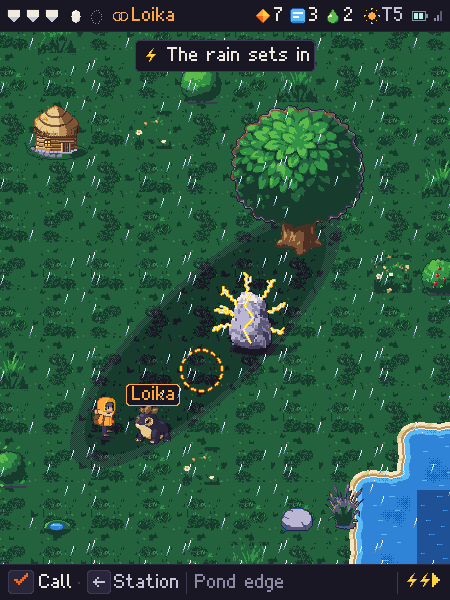

*450×600 at 1×, **one event, now on a diagonal as the concept's runs**: the pawn at the lower left facing up and to the right, Loika by the pawn, the warned strike's ring on the tile between, and the **big charged stone** at the upper right of the ring (`tools/stone-big.py`: its body 60 px, 1.5 times the pawn's 40, with a **big yellow-white crackle**: a thick zigzag bolt across its face and eight long arms off the whole silhouette, white core, yellow flank, gold tips; frame 1 is the charge building, a thin vein and four short arms; the two frames share one canvas) with **a real shadow** (a flat ellipse on the grass under and to its right, dithered rim, drawn by the still) instead of the 1 px bar. **The tree** (135 × 151, no grey disc under its trunk) stands over the group and its shade lies down the diagonal, a soft ellipse in the ground's own colours, over the stone, the ring, the pawn and Loika. The outpost, two bushes and a small pond are at the edges. HUD 32, view 532, bottom line 36. `compose-still.py --state rain` (the default) or `--state clear` (no rain, no storm bolts, "The rain has passed"): the ground's table on ground, shore, water and ripples; the canopies and bushes one step deeper in rain; the pawn and mibis untouched. 0 off-palette pixels. "Loika" is a text layer, never baked. Candidate.*

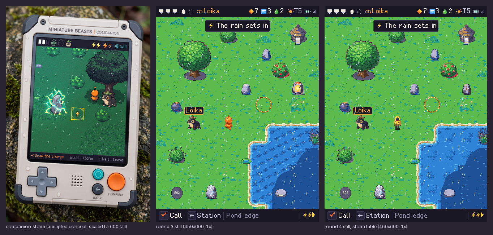

*Left, the accepted Companion concept; middle, the round 3 still; right, the round 4 still. Candidate.*

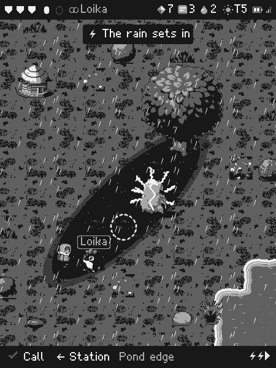

*The round 5 still in four greys (also [sheets](sheets/four-gray/)). Re-read: the grass body is luma 159 (grey 3 of 4); the pawn's coat and hood are orange (luma 127, grey 2) with a deep rust shade and yellow lit edges, its trousers and boots dark: 62 % of its pixels sit in grey 2, 30 % in grey 1, 5 % in grey 4 and only 2 % in the ground's grey 3. In round 1 the pawn's orange body and the darkened grass landed in one grey; now the pawn is a darker figure on lighter ground, one grey clear, by value as well as by outline. The margin is one grey step, and it holds for the project's check (Rec. 709 luma): the coat's luma is 127.1 against a grey edge at 128, so a different grey conversion would move it (see the pawn section).*

**Four greys, re-read on both grounds (round 10).** One amber coat for both grounds, no table (body amber, luma 179, grey 3; shade orange 127; light yellow 211). **Rain:** the ground body is forest (luma 82, grey 2) and the shade under the tree two steps darker still (pine, grey 1): the pawn is two greys off the ground in the shade and one outside it. **Clear:** the ground body is sprout (193, grey 4); the tree's shade was grass green (159) and shared the amber's grey, so on the clear ground the shade table is now **two ramp steps below the lit ground** (`P.shade_clear`: sprout to leaf, 120, grey 2), which puts the pawn (grey 3) on a grey 2 shade and the lit ground at grey 4. The pawn's pixels over all 28 frames: 34 / 29 / 31 / 6 % in greys 1 to 4. Renderings: [`still/four-gray/`](still/four-gray/) for both stills, [`sheets/four-gray/`](sheets/four-gray/).

### The storm light: the art director's decision

- **Greens keep their ramp under the storm.** The tree's canopy went teal under the table and lost its identity; trees and bushes (tree, bush, bush-fruit, bush-shaken) are exempt and read as the lit, living thing against a cooler ground. The lit stones (warm, charged) are exempt too: their glow is the point and the table turned it grey.
- **The ground takes a blue cast only in its shade strokes**, not its body: the grass body keeps its value; the pawn is lighter than it. The owner confirmed this light and rejected the teal; a stronger cast is not offered.
- Water, plain stones, the hut and the shore go through the table.

## The sprites: Retro Diffusion beside the scripted piece, and the art director's pick

Each painted piece was cropped, its key-colour halo and purple ground shadow removed (alpha eroded one pixel, purple-cast pixels sent to white), put on white and sent as `input_image` (strength 0.5) to `rd_pro__topdown` with the 48-colour `input_palette` and `remove_bg`; the result is lifted 18 %, quantised onto the piece's ramps, despeckled and outlined by the ramp rule (`tools/rd-snap.py`). HiBit on the 48 ramps, ramp outline never black, no alpha, no anti-aliasing, 0 off-palette after the snap.

| Piece | Pick | Reason |
| --- | --- | --- |
| tree | scripted | Retro Diffusion draws a crisper canopy but loses the trunk to a stub and the ground shadow. |
| bush, bush-fruit, bush-shaken | **Retro Diffusion + hand pass** | The result keeps the leaf texture and the bumpy silhouette of a real shrub, but came back dark with a grey patch artefact. Hand pass: the volume re-lit as a dome from the top left, cut into four steps of the G ramp (forest, leaf, grass, sprout) with pine on the rim and leaf tips and notches from the result's own texture; the fruit redrawn as 3×3 apples (peach catch-light, red, wine shade, a stalk) so they read as fruit; the shaken bush's flying leaves kept as sprout and grass flecks; a shadow. |
| stone, stone-plain2 | **Retro Diffusion + hand pass** | Facets and a lit top give volume; the scripted stones are smooth slabs with a skirt. Hand pass: a ground shadow. |
| stone-warm1, stone-warm2 | **Retro Diffusion rock + hand pass** | The owner: a circular glow is wrong on a rock. Both frames are the plain stone (stone-plain2's Retro Diffusion result) with a thin jagged heat vein drawn across it, a branch, and a shadow: frame 1 a dim rust vein with a few orange pixels, frame 2 the same vein a step brighter with amber and a yellow spark at two points. No halo, no round core, no spill. |
| stone-charged1, stone-charged2 | **Retro Diffusion + hand pass** | Retro Diffusion alone keeps the stone and loses the charge to faint cracks; the hand pass takes out the teal specks and draws a jagged bolt of white with ice beside it, a branch in sky, sparks off the silhouette, a shadow: the state reads at 1×. |
| stone-step (new, the stepping stone, same family) | **Retro Diffusion + hand pass** | A low flat stone from the plain stone's crop; a dark water line under it so it sits in the water. |
| outpost-lit, outpost-dark, outpost-dark2 | **Retro Diffusion + hand pass (hut B)** | The owner's choice from round 6's four options; see [The outpost: hut B](#the-outpost-hut-b). |
| pod | scripted | Retro Diffusion turned the dark pod into a cream egg: a different object. |
| pawn (down, up, left, right) | **hand-drawn** (neither) | Retro Diffusion drew a different character and only the walk2 frame per facing; the round 3 pawn was a scripted down-render of a painted plush-like figure. Redrawn (below). |

The picks are in [`work/props/`](work/props/) and the sheets; the round 2 scripted stones in [`work/props-scripted/`](work/props-scripted/); every Retro Diffusion result, snapped and before the hand pass, in [`work/props-rd/`](work/props-rd/) and [`work/pawn-rd/`](work/pawn-rd/); raw results, inputs and sidecars in [`sources/rd-sprites/`](sources/rd-sprites/). The hand pass is `tools/hand-pass.py`, scripted so it can be re-run.

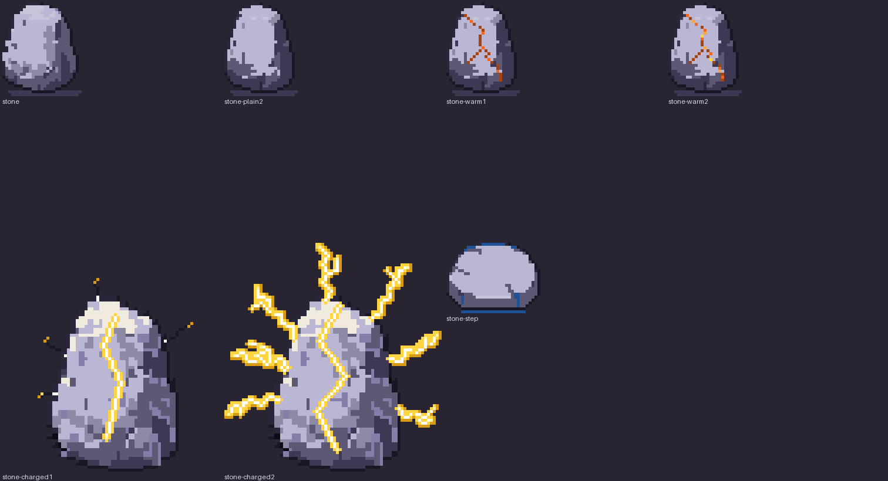

*The stone family at 5× after the hand pass: stone, stone-plain2, stone-warm1, stone-warm2, stone-charged1, stone-charged2, stone-step. Candidates.*

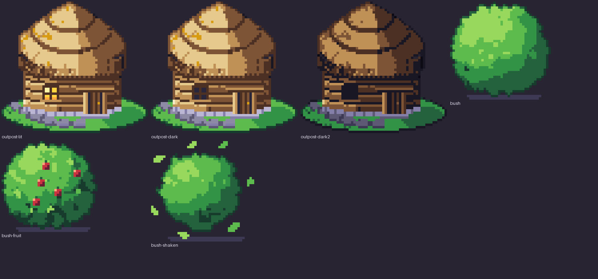

*The outpost (hut B: lit, dark, dark2) and the bushes (plain, fruit, shaken) at 6× after the hand pass (`tools/hut-b.py`, `tools/hand-pass-props.py`). Candidates.* Limit: the bushes are about 38 px wide, smaller than the painted ones.

## The pawn: built from study H

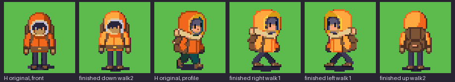

*Left to right: study H's original front frame, the finished down walk2 (the same frame, put through the pass); H's original profile frame, the finished right walk1, the finished left walk1 (the right mirrored), the finished up walk2, on a meadow green at 3× ([1×](work/pawn-h-vs-original-1x.png)). Candidates.*

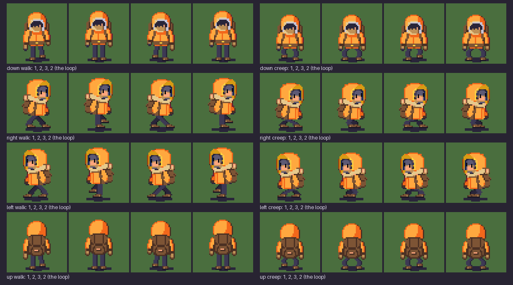

*The cycles, four facings: walk1, walk2, walk3, walk2 (left) and creep1, creep2, creep3, creep2 (right) at 3×. Candidates.*

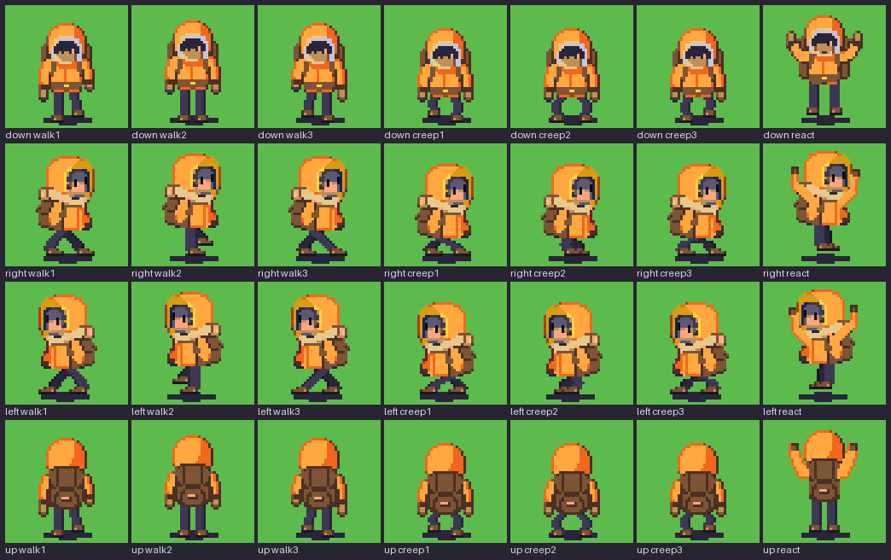

*The pawn's 28 frames at 3×: four facings (down, right, left, up) × walk 3, creep 3, react ([1×](work/pawn-h-frames-1x.png)). Candidates.*

**What H is, kept exactly:** an orange hooded parka with a deep hood, the face in shadow inside it showing a silver-rimmed opening and two eyes and a nose (front) or a gold-trimmed hood with a grey face, an eye and a nose (profile), a cream fur collar, a brown backpack with a roll, dark trousers, brown boots, 39 to 40 px tall. The proportions, the detail and the read are H's (the owner's words: better detail and proportions).

**How the frames were made.** Study H itself is two frames, the down walk (the passing pose) and the right walk (the contact pose); they are the originals and they are the finished down walk2 and right walk1. Every other frame is a Retro Diffusion call, img2img from H's own frame (`tools/rd-pawn-h.py`): one seed (48), one prompt, `rd_pro__topdown` with the 48-colour `input_palette`, `remove_bg`, 48 × 48. The prompt is H's own words ("a small explorer in an orange hooded parka, a backpack, dark trousers, brown boots, pixel art sprite on a plain white background, the face in shadow inside the hood showing only two eyes and a nose, no goggles, a thin fur collar at the neck, not too much face") with only the facing words (from the front, from the right side in profile, from behind, facing away) and the pose words (mid-stride with the left or right foot forward; crouching low; startled with both arms raised) changing. The right facing is drawn from H's profile frame, the down facing from H's front frame, the up facing from its own first frame (a call from H's front frame, "seen from behind", at a higher strength: the service had to turn the character round); the left facing is the right mirrored. 25 calls in all, $4.50: 19 at strength 0.45 and 6 repeats at 0.32 (`sources/rd-pawn-h/`, the first results of the six in `first-pass/`).

**Where the service redrew the character** (the finding): at 0.45 it redrew the character on six frames (the down react came back as a lit window in a wooden wall; the down and up crouches as a kneeling figure with a huge pack; the right crouch as a hunched figure with a spiral on the back; the up walk and react showing a face from behind). Repeated at 0.32 the character holds, and four of the six came back usable (down creep2 and react, right creep1, up walk1). It also moves a stride only a little at the front and the back (the down walk1 and walk3 came back as the walk2), so **the service's frames stand only where they keep the character and move the pose**; the rest are derived by hand from H's own parts, never from the older pawns.

**The hand pass** (`tools/pawn-h-pass.py`), over every frame:
- the stray blobs the service leaves in a frame removed (only the figure's connected mass stays);
- the palette snap onto the pawn's ramps (orange, wood and fur, ink and white, yellow, skin, lens blue), despeckled, **outlined by the ramp rule so every frame has one outline weight**;
- **the trousers one colour set in every facing**: the service drew navy in the front and teal in the profile; they are now a stone grey ramp (stone, slate, night), a little lighter than H's navy so the legs read against the shadow (the one place a frame is not H's exact pixel: the coat, the hood, the face, the pack and the boots are);
- **the ground shadow one shape** under every frame (the service's own is dropped and an ellipse of the same two rows is set under the feet), the lowest pixel of the figure on **the foot line (y 46)**, a react frame lifted two rows off the ground over its shadow.
- **The strides, drawn by hand (round 10, `tools/pawn_limbs.py`)**, after the art director's verdict that every walk and creep cycle failed (the service redraws the character at 0.45 and barely moves at 0.32, so no more service calls for poses; the earlier derivations that slid H's legs up and cut rows out of the torso are gone). H's head, torso and pack stay as **one pixel-locked block** (never resampled); the legs, boots and arms are drawn pixel by pixel on the palette indices, as code-set pixels (not strokes in Aseprite's editor; the frames are assembled there):
  - **down and up walk1 and walk3** are real contact poses: the body drops a row, one leg is carried to a raised foot with the leg drawn down to it and a boot sprite set at its end (so the boot is attached to the leg), the other planted on the shadow, and the hands stay on their sleeves (each arm is stretched or compressed between the shoulder and the hand, two rows, in opposite senses). The shadow is drawn last under them.
  - **all creeps** (four facings): the hood is **dropped three rows at the same size** (the whole upper block moves down; no rows are removed) and the legs are drawn short with the knees out, one foot lifted on creep1 and creep3, both wide on creep2.
  - **The art director's round 10 notes on these** (every other frame signed): the down and up contacts now put the front sole on row 45 and the back sole (lifted two rows) on row 43, both on the shadow, with the body one row down (no longer a hop); **right walk1 is redrawn** as walk3's open V with the legs swapped, both soles on row 43 (H's original profile legs, a bar joining the boots and a back boot on its toe, read as a kneel; H's head, torso and pack are still the original's, and `work/pawn-h-vs-original-*` shows the original beside it); **the down react's plank under the feet (a skateboard) is out**, a clean hop over the shadow; **right and left walk2 are raised a row** as the front and back ones are.
  - **right walk2** is a true passing pose (the near leg planted straight, the far leg lifted with the knee forward and the foot under it); **right walk3** is the second contact (near leg forward, far leg back) on walk1's own upper block, so its size and mass are walk1's; **right creep3** likewise; the **right react** keeps H's shadowed face inside the cell (the service's open mouth and swollen hood are out) with both arms drawn raised; the **up react** has real raised arms (the sleeves taken off the back and drawn again). **Left is the right mirrored.** The down react is the service's (it passes).
  - Every stride is shown as a strip at 3×, walk1 walk2 walk3 walk2 and creep1 creep2 creep3 creep2, per facing, in [`work/pawn-cycles-3x.png`](work/pawn-cycles-3x.png).
The 28 frames are then assembled in Aseprite on the VM (`tools/aseprite-pawn.lua`: one tagged sprite, [`work/pawn-aseprite/pawn.aseprite`](work/pawn-aseprite/pawn.aseprite), every frame exported back; 0 pixels differ). `sh tools/pawn-h-build.sh` runs the pass, the VM step and the install.

**Four greys, re-read** (Rec. 709 luma, four equal bands) on all 28 frames, after the round 9 coat lightening and the round 10 strides: 34 % of the pawn's pixels fall in grey 1, 29 % in grey 2, 31 % in grey 3 (the amber body, luma 179) and 6 % in grey 4 (yellow light, face); the orange shade (luma 127) is grey 2. On both grounds see "Four greys, re-read on both grounds" under the still.

Limits: the down walk1 and walk3 are hand-derived strides of H's front frame (a raised foot and swung arms), not drawn walking; the creeps and the up react are derived (rows removed, arms raised), so they are stiffer than H; the service's right walk2, walk3, creep2 (derived), react and down react frames are H's character but not pixel-identical in scale (up to 3 rows taller with the arms raised); the right and left react are tall (47 rows with the arms raised and the lift) and touch the top of the cell; the profile has the teal trousers' colour taken out. The pawn in the still is the left facing, walk2 (the mirrored profile).

## Pawn studies (the owner picked H)

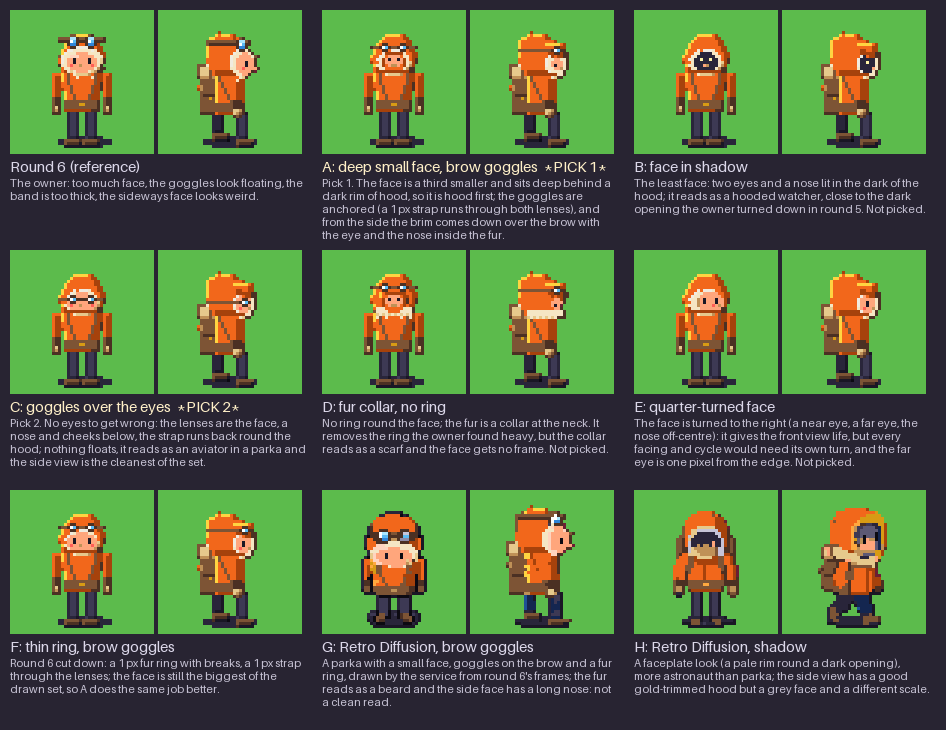

*Pawn A to H, each the down walk frame and the right walk frame, and the round 6 pawn for reference, at 3× on a meadow green ([1× here](work/pawn-studies-1x.png)). Under each, the art director's critique; the two picks are marked. Candidates, not accepted: no cycles exist for any study until the owner picks.*

What the owner said: too much face, goggles that look floating, a band that is too thick, a sideways face that looks weird. What the studies vary:

- **The amount of face:** A a small face deep in the hood behind a dark rim; B the face in shadow with only eyes and nose lit; E a quarter-turned face; the thin-ring faces (A, B, C, E, F) are a third smaller than round 6's.
- **The goggles:** A, D, F on the brow on a **1 px strap that runs through both lenses** (so they sit on something, and the thick two-row band is gone); C dropped over the eyes (the lenses are the face, the strap runs back round the hood); B, E none.
- **The ruff:** A, B, C, E, F a **1 px ring of fur with breaks** where the hood shows through; D a collar at the neck instead of a ring.
- **The side view:** the hood's **brim comes down in front of the brow**, the eye and the nose lie inside the fur (nothing leaves its edge), the strap runs back round the hood and one lens sits on the brim.
- **Retro Diffusion (G, H):** the round 6 down walk and right walk frames as img2img at 48 px with the owner's words in the prompt (G: a small face deep in the hood, goggles on the brow on a thin strap; H: the face in shadow with only eyes and a nose, no goggles, a thin fur collar; 4 calls, $0.72, `tools/rd-pawn-studies.py`), snapped onto the pawn's ramps (`tools/pawn-study-snap.py`). Neither is clean (G's fur reads as a beard and its side face has a long nose; H is a faceplate), which is the finding: the service redraws the whole figure, so it is useful for ideas and not for this pixel pass.
- **A to F** are hand-pixelled on the parts of the round 6 pawn (`tools/pawn-study.py`: masks, polygons and pixel sets with the rim-rule shading; the legs, coat, arms, pack, shadow and outline are the pawn's own).

**Pawn I (round 8), the art director's study (not chosen: the owner picked H):** A's front with C's side view, in the concept's proportions (`tools/pawn-chunky.py`; the down walk passing frame and the right walk contact frame, [3×](work/pawn-studies-3x.png) and [1×](work/pawn-studies-1x.png), last on the sheet, with the round 6 pawn and A to H). Chunky and head-heavy: a hood 20 rows tall over a torso of 11, legs of 6 and boots of 3 (round 6: hood 12, torso 13, legs 11); a bigger hood mass (18 px wide); **trousers a light stone grey** (fog, mist, stone), not navy, so the legs are not two black sticks. **The goggles' lenses rest on the hood's brim and the 1 px strap stays inside the hood's outline** (the script draws a strap pixel only where the pixel and its neighbours in the row are in the hood's mask, so it can never pass the silhouette). **The nose is 1 px** in the front view and 1 px inside the fur in the side view, and the fur is a thin ring with breaks, so nothing reads as a snout. Front: a small face deep behind a dark rim of hood (A). Side: the goggles over the eye, the strap running back inside the hood, a thin crescent of fur (C). It is a study: the pawn in the sheets, the atlas and the still stays round 6's until the lead confirms Pawn I and the cycles (4 facings, walk 3, creep 3, react) are drawn. Four greys for Pawn I: the coat and the ground are unchanged from round 6 (the pawn's body one grey darker than the lime grass); on the candidate forest ground the coat shares the ground's grey (below).

The picks, **A and C**, two different directions: **A** because it is hood first, the face a small light spot deep in it, the goggles anchored on a 1 px strap, and the side view is a believable profile under a brim; **C** because it removes the problem rather than shrinking it, the lenses over the eyes mean no floating goggles and no eye to get wrong, and the side view is the cleanest of the set. F is A with a bigger face; B is the dark opening the owner turned down in round 5; D's collar reads as a scarf; E would need a turn drawn for every facing.

Four greys are not re-read for the studies (the coat is round 6's and the ground is unchanged; the face is smaller than round 6's, so the share of the pawn in the ground's grey is lower than round 6's 8 %). The pawn in the sheets, the atlas and the still stays round 6's until the owner picks.

## The outpost: hut B

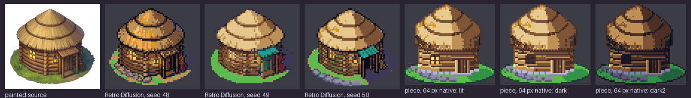

*Left to right: the painted source (hut B of `sources/C48-H-r6-a1`); three Retro Diffusion lit candidates at 64 px (seeds 48, 49, 50); the pieces used at 64 px, lit, dark and dark2 (seed 50 body, the hand pass redone on it). Candidates.*

The owner chose B (the log hut with its porch). It replaces the outpost (`outpost-lit`, `outpost-dark`, `outpost-dark2`) in the props sheet, its atlas and the still; the other options are out of the sheets.

How it was made: the painted B hut (a planted hut on a patch of grass with a base row of stones and a shadow, two bands of thatch, log walls, a porch over the door, a lantern, a bundle of sticks; Gemini Pro, `sources/C48-H-r6-a1`) cropped, its key halo removed, put on white and sent as `input_image` (strength 0.4) to `rd_pro__topdown` at 64 px with the 48-colour `input_palette` and `remove_bg`, the owner's words in the prompt, three seeds of one family (`tools/rd-hut-b.py lit`). **Seed 50 is the body**: it kept the logs and the grass base. The service's own dark and dark2 results (img2img of the lit result) came back as different drawings of the hut, so they are kept as raw candidates and not used: the dark and night states are derived from the lit hut. Hut B cost 7 Retro Diffusion calls in all, $1.26.

**Round 10: seed 50's thatch to the pixel, the wall redrawn as log courses** (`tools/hut-b-edit.py`; the art director's round 9 verdict on the first edit: it is B, planted, the owner's form; the per-column shift of the service's wall texture broke the log rows into vertical streaks, a palisade, the eave was flat across ten centre columns and overhung only on the right, the porch left no wall at its right, and the apex was cut). Raw beside edit at 3×:

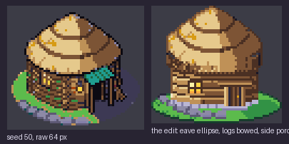

- **The thatch is the service's own pixels**, snapped to the palette, its **apex kept to the pixel** (the outline pixels of the service's rim are recoloured by the ramp rule instead of dropped, so the peak is the service's three-pixel peak, and the grey flecks of its rim light are the thatch's own colour); the yellow specks go to the straw's light. The stones at the base are the service's.
- **The wall is drawn as log courses, each ONE continuous line bowed 3 px** (4 px pitch: a soil gap, a light edge, two rows of body, shifted down by the same curve d(x) = 3·√(1 − u²) along the whole row; lit on the left, shaded on the right, a few knots, log ends at both edges, two rows of stone along the base curve). The 3 px bow is kept (the art director: enough).
- **The eave is one continuous arc**: an ellipse, centre lowest (5 px of rise from the ends to the middle), overhanging the wall by **2 px on both sides** (roof x 9 to 53, wall x 11 to 51), the shade of the eave on the logs under it.
- **A narrow side porch at the right** (11 px: posts, a plank door, a lean-to roof of planks under the eave, a stone step), so **round wall shows 4 px at the right of it and 23 px at the left**; the eave's arc passes over it and shows past the porch roof.
- **One small window**, no lantern, no stick bundle. The patch of grass in the lime ramp (it takes the ground's state through the ground tables) with tufts darker than the grass, and the shadow on the grass in leaf green.

Dark is the same drawing with the window dark; dark2 is dark one DARK step down. Assembled in Aseprite on the VM (`tools/aseprite-huts.lua`, `tools/huts-assemble.sh B ...`, [`work/hut-b-aseprite/hut-B.aseprite`](work/hut-b-aseprite/hut-B.aseprite), 0 pixels differ). The piece is 61 × 55 px.

Limits: the wall's log courses are code-drawn, not the service's pixels (the service's texture was the streaked part); the porch is 11 px wide with a 5 px door, small at 1×.

### The hand-clean list

grass2: the long bar, bracket and ramp of dark pixels that repeated on the grid are gone, small clumps in their place, the two outer pixels untouched so it still joins (see the meadow figures above). The dew cup: 29×17, a curled leaf with a pool of sea-to-sky dew, an ice highlight and two sparks; it reads at 1×. The creep frames are the pawn's own (above).

## What is generated, scripted, derived

| Group | Source | Script | Stage |
| --- | --- | --- | --- |
| Ground: grass ×4, tall ×2, flowers ×2, shade, sand, wet shore | One Pro-painted 4×4 grid ([`sources/C48-T-r1-a1`](sources/C48-T-r1-a1.json)): cut by the magenta margins, 10 % trim, wrap-blend, level-match across the meadow set, BOX to 48, quantise per ramps, despeckle (`tools/build-ground.py`); then the Aseprite pass on the VM for the eight meadow tiles | generated source, scripted down-render, Aseprite pass |
| Water, deep (2 variants × 2 frames each), shallows | Scripted (`tools/build-water.py`) | scripted |
| Ripple overlay sprites 3 sizes × 2 frames | Scripted (`tools/build-ripples.py`) | scripted |
| Shore set: 16 cardinal masks and 4 diagonal corners × 2 frames | Cut from grass1, sand, shallows and water along a wavy shoreline; rounded land corners; bone foam (frame 1), white (frame 2) (`tools/build-shore.py`); tested by `tools/shoregrid.py` | scripted |
| Props | One Pro-painted sheet on magenta ([`sources/C48-P-r1-a1`](sources/C48-P-r1-a1.json)): key, fit, lift 1.18, quantise per ramps, despeckle, outline (`tools/build-props.py`); the six stones, the stepping stone, the three bushes and the three outposts from Retro Diffusion (`tools/rd-sprites.py`, `rd-snap.py`) with the hand passes (`tools/hand-pass.py`: the stones, the warm ones as rock with a heat vein; `tools/hand-pass-props.py`: the bushes and the outposts) | generated source, scripted down-render; Retro Diffusion pieces with a hand pass |
| Warned strike ×2, HUD icons, key caps, condition bolts, 9-slices | Drawn by script on the ramps from the page's own icon forms (`tools/build-ui.py`) | scripted |
| Pawn: 4 facings × walk 3, creep 3, react | Drawn as masks and pixel sets (`tools/pawn-draw.py`), assembled and exported in Aseprite on the VM (`tools/aseprite-pawn.lua`) | hand-drawn, Aseprite |
| Outpost, hut B (lit, dark, dark2; in the props sheet) | A Gemini Pro painted source ([`sources/C48-H-r6-a1`](sources/C48-H-r6-a1.json)) through Retro Diffusion at 64 px (`tools/rd-hut-b.py`), the hand pass (`tools/hut-b.py`), assembled in Aseprite (`tools/aseprite-huts.lua`) | generated source, Retro Diffusion, hand pass |
| Pawn studies A to H (not in the sheets) | A to F hand-pixelled (`tools/pawn-study.py`); G, H Retro Diffusion from round 6's frames (`tools/rd-pawn-studies.py`, `tools/pawn-study-snap.py`); the sheet by `tools/pawn-studies-sheet.py` | studies |
| Tokens: Pip as Loika (idle 2, walk 3); placeholders S02–S04 | The accepted Pip painting, quantised and outlined (`tools/build-tokens.py`) | derived, scripted |
| Weather: rain tile 96×96, 2 leans × 2 frames | Scripted, 10 streaks per tile (`tools/build-weather.py`); Retro Diffusion stages rejected and kept in `sources/rd/` | scripted |

Sheets: six indexed PNGs (the ground sheet holds the tiles and the whole shore set; the props sheet the props and the ripple sprites) (indices 0–47 as signed, 48 transparent) with JSON atlases in [`sheets/`](sheets/); anchor = foot for sprites, top-left for tiles and chrome. Working pieces, one PNG each, in [`work/`](work/).

## Checks

- `tools/check.py` on the six sheets and the still: **0 off-palette, 0 semi-transparent pixels** on every one.
- Four-grey renderings: [`sheets/four-gray/`](sheets/four-gray/) and [`still/four-gray/`](still/four-gray/).
- Meadow joins: the 3×3 figure and the mixed 6×6 above (mean step across joins 4.8 against 13.3 inside the tiles, after grass2's hand pass).
- Shore joins: `tools/shoregrid.py`, 768 broken pixels over the 256 neighbourhoods, none wider than 4 per join.

## Sign-off checklist, §2 Painted master, art director's column (round 9)

From [`design/style-guide/sign-off.md`](../../../design/style-guide/sign-off.md) §2. Yes/no per line; failures listed, not hidden. The capabilities column is the builder's and is not signed here.

| Art direction | |
| --- | --- |
| From the accepted candidate, owner's notes applied (SS Decided) | **Yes**, with limits. The five notes are answered above; the forms, colours and light come from the accepted Companion concept through the painted sources. The owner's answers on round 2 are applied (the mild storm kept, the teal gone, the rings out of the tiles, the shore closed, the stones redone). Limit: the storm reads mild against the concept's dark teal, as the owner chose. |
| Station: painted light, soft shadows, no dither bands or flat fills (SG) | n/a: Companion pieces. |
| Companion: hand-pixelled on the 48 ramps, ramp outline never black, no alpha, Bayer only (SG; UK §2) | **Partial.** On the 48 ramps, outlines by the ramp rule, no alpha, no AA, Bayer only (water depth). **Not hand-pixelled:** the terrain, props, pawn and tokens are scripted down-renders of painted or Retro Diffusion sources with despeckling; the meadow had a real Aseprite pass, nothing else did. The stones are Retro Diffusion results with a scripted hand pass; the dew cup is a scripted redraw. The pawn is study H (Retro Diffusion, the owner's pick) with a scripted hand pass and hand-derived poses, assembled in Aseprite; the outpost is a Retro Diffusion result with a hand pass, assembled in Aseprite; the stones, bushes and outposts are Retro Diffusion results with a scripted hand pass. Failures: the outpost is drawn after the service's B, not a service result (the round form needed it); the tree, pod and tokens remain scripted down-renders without a hand pass; the pawn's hand pass is code over the service's frames and nine of its 28 poses are derived by moving H's parts, not drawn with strokes in Aseprite's editor; a pool pattern in the water recurs at a distance. |
| Creature at its area, 300×310+ Station, 280×300 Companion, same trait boundaries (SG Creatures) | **Yes** for the one creature present: Loika is the placed Pip, derived from the accepted 280×300 painting, same individual; S02–S04 are labelled placeholders. |
| Same individual in four-gray and on paper; nothing childish (AD) | **Yes**, with limits. Four-grey renderings made for every sheet and the stills; Pip's token reads as Pip. The round 1 value fail is **fixed**, re-read on the round 9 frames: 9 % of the pawn's pixels share the current ground's grey, the body (the same orange, luma 127) one grey below it, but the orange sits 1 unit from a grey edge, so the margin depends on the project's Rec. 709 check, and on the forest-green candidate the coat shares the ground's grey. Nothing childish: the pawn is study H, the owner's pick, a hooded explorer with a fur collar, a face in shadow and a pack, shown beside the original at 1× and 3×; the outpost is a built log hut with a calm roof, the bushes shrubs with leaf texture, the fruit apples; the placeholders are plain grey stones with a code. Not tested on paper (no paper render exists for the Companion). |

Signed, art director, 2026-10-08. The pawn is the owner's pick (study H), built as the lead briefed and not the art director's pick. Failures: those listed in line three (no hand pass on the tree, pod and tokens; the pawn's derived poses; the water's pool pattern recurring at a distance), the one-unit margin of the pawn's coat, and the service's scale drift on a few pawn frames.

## Spend

| Call | Tool | USD |
| --- | --- | --- |
| C48-T-r1-a1 ground grid, C48-P-r1-a1 props, C48-W-r1-a1 pawn | Pro, 1K each | 0.53 |
| C48-R-r1-a1, a2 rain | Retro Diffusion rd_pro__topdown 96×96 | 0.36 |
| C48-R-r2-water1, water2 | Retro Diffusion rd_pro__topdown 48×48 | 0.36 |
| C48-S-r2 first sprite batch, 12 calls (superseded: magenta fringe on the inputs) | Retro Diffusion rd_pro__topdown | 2.16 |
| C48-S-r2 second sprite batch, 12 calls | Retro Diffusion rd_pro__topdown | 2.16 |
| C48-S-r2 stones batch (stone-plain2, stone-warm2, stone-charged2, stone-step), round 3 | Retro Diffusion rd_pro__topdown | 0.72 |
| Round 4: no paid call (the pawn, the warm stone and the water variants are scripted) | | 0.00 |
| C48-S-r2 outposts (lit, dark, dark2) and shaken bush, round 5 (the lit hut's first result, $0.18, was overwritten and is in `extra-spend.json`) | Retro Diffusion rd_pro__topdown | 0.72 |
| C48-H-r6-a1 painted hut sheet, round 6 | Pro, 1K | 0.17 |
| C48-H-r6 huts A to D, three states each, 12 calls, round 6 | Retro Diffusion rd_pro__topdown 64×58 | 2.16 |
| C48-H-r7-B hut B: three lit seeds, two state calls for seed 48, two for seed 50, round 7 | Retro Diffusion rd_pro__topdown 64×58 | 1.26 |
| C48-W-r7-G, C48-W-r7-H pawn studies, 4 calls, round 7 | Retro Diffusion rd_pro__topdown 48×48 | 0.72 |
| Round 8: no paid call (hut B at 64 px reuses round 7's seed 50; Pawn I and the forest ground are scripted) | | 0.00 |
| Round 10: no paid call (the strides are drawn by hand, no more service calls for poses) | | 0.00 |
| Round 9, hut B and the ground states: no paid call (seed 50's own pixels edited; the tree refit from the painted sheet; the tables scripted) | | 0.00 |
| C48-W-r9 the pawn from H: 19 calls at 0.45 and 6 repeats at 0.32, 25 calls, round 9 | Retro Diffusion rd_pro__topdown 48×48 | 4.50 |
| **Total** | | **15.83** |

Re-summed from the sidecars by `tools/budget.py` into [`sources/budget.json`](sources/budget.json) (the superseded batch in [`sources/extra-spend.json`](sources/extra-spend.json)). The service's balance is topped up automatically, so it is not a limit.

## Limits and what the next round needs

- Only the stones, the bushes, the outposts, the dew cup, grass2, the pawn and the meadow had a hand pass or an Aseprite pass; the tree, pod and tokens are scripted down-renders. The hand passes are code-set pixels, not strokes in Aseprite's editor (the pawn is assembled there).
- The pawn: the pawn is H (the owner's pick), all 28 frames; Pawn I stays a study.
- The ground states: the pawn's coat margin on `ground.clear` is small (amber one grey under the sprout body); an orange coat would be clearer there but falls into `ground.rain`'s grey.
- Two water variants per frame: a pool pattern still recurs at a distance; a third and fourth variant would break it.
- The pawn's coat margin is one luma unit from a grey edge; the face adds 6 points of the pawn to the ground's grey.
- The map pawn, the reach variant, bubbles, settle pips, the partner ring, signs, map props, cloud and rim pieces are not in this round (the brief stops at the review place).
