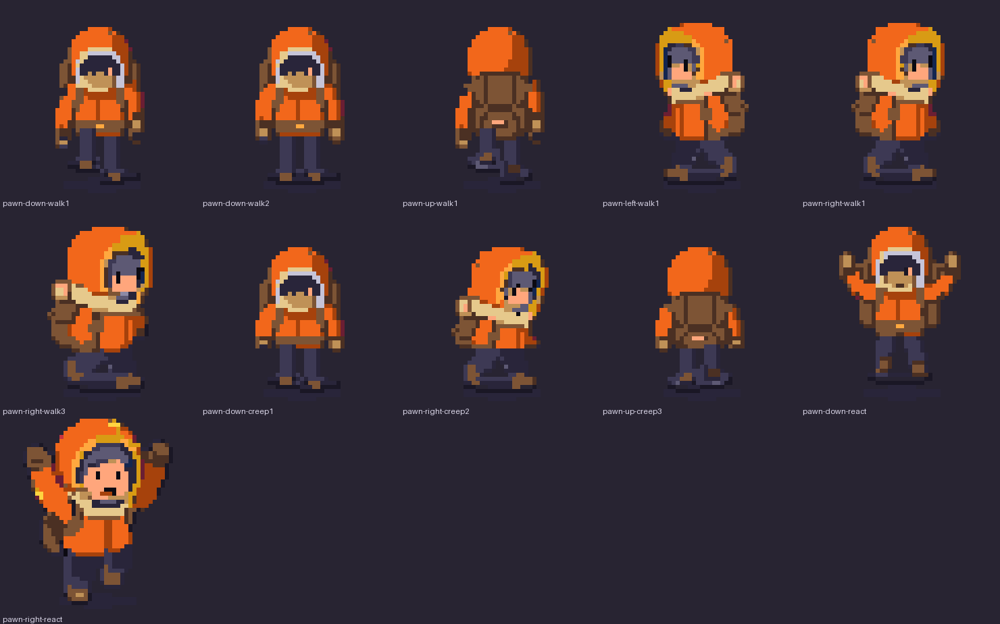
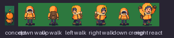
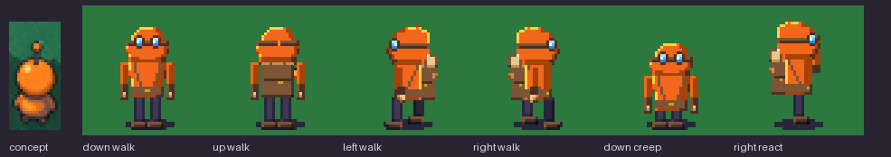
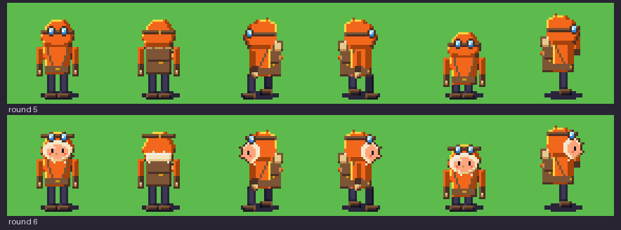

# Companion 48 px redraw: the review place

The [Companion 48 px redraw](../../../design/proposals/companion-48px-redraw.md) (§9 Decided) on one place, the meadow and pond edge in a storm, with every piece it needs at 1× on the 48 ramps of the [signed palette](../palette/README.md). Everything here is **a candidate for the owner's review**: generated sources down-rendered by script, an Aseprite pass for the meadow, scripted chrome and water, Retro Diffusion sprites beside the scripted ones where one was picked, and Pip derived into the Loika token. Nothing is accepted; nothing touches `prototypes/exploration/index.html`.

**State: round 7 ready for the owner.** It answers the owner's five notes on round 1 and their answers on rounds 2 to 6 (below). Rounds 1 to 6 are frozen in [`round1/`](round1/) to [`round6/`](round6/). How every group is made and how to rebuild: [`../HANDOVER.md`](../HANDOVER.md) and `sh tools/build-all.sh`.

*Every piece at 3× ([1× here](contact-sheet-1x.png)); a piece that changed since round 6 shows round 6 (r6) beside round 7 (r7). The shore test and the Retro Diffusion group are laid out in their own groups. Candidates, not accepted.*

## The owner's answers on round 6, and what answers each

1. **The hut: "B; the hand-pixelled are flat, and A is too small, looks like a mushroom."** Hut B is the outpost now (below); the options A, C, D and the hand-pixelled pair are gone from the sheets and kept in [`round6/`](round6/) with their sources.
2. **The pawn: "need more studies: too much face, goggles look like floating, band is too thick, sideways face looks weird."** Eight studies, Pawn A to H, on one sheet; no cycles until the owner picks (below).

## The owner's answers on round 5, and what answers each

1. **The pawn: "its face is covered; it must show something closer to an Eskimo parka".** A parka hood with a fur ruff round an open face (below).
2. **The hut: "floating, too much work on the roof which comes across as a cupola, the rest falls flat and devoid of charm. Give me options."** Four options, A to D, each planted on the ground, with a calm roof and the charm in the walls, and a hand-pixelled pair as reference (below).

## The owner's answers on round 4, and what answers each

1. **The pawn's coat yellow-orange, between the concept's orange and round 4's yellow, keeping the four-grey margin.** Measured, then chosen (below): an orange coat with yellow-lit edges.
2. **Goggles on the hood instead of the dark opening with two eyes.** Two lenses with a strap and a catch-light each, no face, on every facing (below).
3. **Next hand pass: the hut (all three states) and the bushes (plain, fruit, shaken).** Through the Retro Diffusion recipe, then a hand pass (below).

## The owner's answers on round 3, and what answers each

1. **Water: a second tile variant per frame.** `water1b`/`water2b` (and `deep1b`/`deep2b`), laid by the compose script's seeded hash (below).
2. **Stones: the charged bolt is good; the warm stone is wrong ("a circular glow doesn't make sense, it's a rock").** The charged stones are kept as they were; the warm stone is redrawn as rock with a thin warm vein, no halo and no round core (below).
3. **The pawn: "it cannot look like a Teletubby".** Redrawn as a hooded explorer with a pack, a real hand pass in Aseprite on the VM (below).

## The owner's answers on round 2, and what answers each

1. **Light: the mild storm stands; the teal is rejected.** The teal variant is removed (table, still and figure); `--light storm` is the only light the compose script offers besides the no-table and DARK references.
2. **Water: the ripple rings repeat on a grid.** The tiles carry only the depth gradient, crests and glints; the rings are sparse overlay sprites (below).
3. **Shore: it breaks at certain corners.** Found by laying every neighbourhood; the set is closed (below).
4. **Stones: "redo them".** All six stones and the stepping stone through the Retro Diffusion recipe, then a hand pass for the states (below).
5. The hand-clean list: dew cup, grass2's repeating motif and the creep frames (below; the creep frames are now part of the new pawn).

## The owner's five notes on round 1, and what answers each

1. **"Dark, and the rain too heavy."** The round 1 still darkened everything one ramp step. Round 2 uses no DARK step: the ground, water and plain stones go through a *storm table* (each colour mixed 30 % toward river, nearest palette colour; sand, clay, paper, bone and white kept), and the canopies and the lit stones keep their own colours (decision below). The pawn and mibis never pass through a table. The rain tile has 10 streaks per 96 px (round 1: 26). Limit: the storm reads mild; the owner chose that over a stronger teal cast.
2. **"The grid is not seamless."** A real Aseprite pass (1.3.18, headless on the VM, `tools/aseprite-meadow.lua`): all eight meadow tiles (grass ×4, tall ×2, flowers ×2) take one shared outer band, the master's interior offset by half a tile, blended inward and snapped to the tile's colours; grass3 and grass4 took an 18 px band (8 px left a faint horizontal structure in their own 3×3). Any meadow tile joins any other.
3. **"Pawn, trees and stones good but dark."** Painted values lifted 18 % before quantising, nothing darkens them in the still beyond the storm cast on plain stones; Retro Diffusion sprites run through the same lift.
4. **"River borders too wavy."** The shoreline amplitude is 0.9 + 0.5 px (was 2.2 + 1.3); a shallows band lies between bank and water; the foam line stays.
5. **"Water flat."** Water redrawn (below), two frames.

## The ground, seamless

*Each meadow tile laid 3×3 at 1×, after the Aseprite pass (grass3, grass4 at band 18). Candidate.*

*All eight meadow tiles laid in a seeded random 6×6 ([1×](work/meadow-mixed-1x.png), `tools/meadow-check.py`): the mean colour step across a tile join is 4.8 against 13.4 inside the tiles, and no join shows at 1× or 3×. Candidate. Limit: grass2's dark bracket motif repeats visibly when it is laid several times near each other; it is the one tile to thin out at placement.*

The shore set (16 masks × 2 frames) is cut again from these tiles, the shallows and the new water ([contact sheet](contact-sheet-3x.png), group 2).

## Water

*Round 4 water tiles, 3×: water1, water1b, water2, water2b, deep1b, shallows, shore-03-1, shore-diag-ne-1. No rings in any tile. Scripted candidate (`tools/build-water.py`).*

Two variants (a, b) of each frame, so the page can lay them by a hash. Each carries a few small soft pools (blobs of the deeper step read through a 4×4 Bayer matrix, at most about half-dithered) that fade to nothing over the outer 8 px, so any variant joins any other at the tile edge with no seam, and short crests in the lighter step with an ice glint that keep clear of the left and right edges and drift 3 px between the two frames (the pools do not move). The deep tiles are the same one step down the ramp. The compose script gives each water cell a variant by a seeded hash (`RandomState(31)`, half and half) and the deep overlay takes the same cell's variant; the page can do the same. Limit: with two variants a pool pattern still recurs at a distance; at 1× it reads as texture, not as a grid.

*Ripple overlay sprites, 5×: three sizes (13, 19 and 25 px wide in frame 1) × two frames; broken flat rings in the lighter step with an ice glint, the gaps moving and the ring widening by 2 px between the frames. They are pieces of the props sheet (`ripple-N-F`, sprites, anchor at the foot), never part of a tile.* Placement is the compose script's, and the page can do the same: a seeded hash (`RandomState(48)`) walks the view in 3×3-tile blocks, each block takes at most one ripple (75 % of blocks), at a hashed size and position inside the block; a ripple is drawn only where its whole ring lies over water, so none sits on the shore and none repeats on a tile boundary; one per block means none sits on the same spot twice. The still draws frame 1; the page alternates the frames.

The two Retro Diffusion water tiles of round 2 (`sources/rd/C48-R-r2-water1`, `-water2`) stay as labelled candidates, unused.

## The shore

*Shore test: each land tile laid with every neighbourhood it can have; see the groups "Shore test" on [the contact sheet at 3×](contact-sheet-3x.png) and [the random pond at 1×](work/shore-test-pond/pond-outline-random.png). Scripted candidate.*

What was broken: a land tile with water only on a diagonal had no piece, so the pond's corner left a square notch where two bank strips met at a tile corner; and where two adjacent sides are water the land corner was square. Now: **16 cardinal masks** (N=1 E=2 S=4 W=8, water on that side, 2 frames) with the land corner rounded where two adjacent sides are water; **4 diagonal corners** (`shore-diag-ne/se/sw/nw`, 2 frames), a quarter-disc of water with its bank bands, transparent where it would be plain grass, laid over any land tile that has water on a diagonal and on neither side of that corner. Their depth carries the neighbouring strips' wave so the bands meet at the tile join. `tools/shoregrid.py` lays all 256 neighbourhoods and 40 random ponds and counts the pixels where the land / bank / water class differs across a tile join: round 2's set **14 976** broken pixels over the 256 neighbourhoods and **20 085** over the ponds; round 3's **768** and **1 030**, at most 4 pixels per join, which is a one-pixel offset of a band edge, not a gap (every join has the same classes, within a pixel). The page does the same pass: for each land tile, the cardinal mask, then each diagonal corner whose two sides are land.

## The still

*450×600 at 1×: HUD 32, view 532, bottom line 36. `compose-still.py --light storm`: the storm table on ground, water and plain stones; canopies and lit stones exempt; pawn and mibis untouched; the pond closed by the shore set; ripples as overlay sprites; the six stones from the Retro Diffusion recipe (warm as a vein); the water laid in two variants by hash; the explorer pawn; the dew cup on the shore. Rain from the weather sheet; the message box, name tag, key caps and condition bolts from the ui sheet; the page's Mibi 7×9 font at 2×. 0 off-palette pixels. "Loika" is a text layer, never baked. Candidate.*

*Left, the accepted Companion concept; middle, the round 3 still; right, the round 4 still. Candidate.*

*The round 5 still in four greys (also [sheets](sheets/four-gray/)). Re-read: the grass body is luma 159 (grey 3 of 4); the pawn's coat and hood are orange (luma 127, grey 2) with a deep rust shade and yellow lit edges, its trousers and boots dark: 62 % of its pixels sit in grey 2, 30 % in grey 1, 5 % in grey 4 and only 2 % in the ground's grey 3. In round 1 the pawn's orange body and the darkened grass landed in one grey; now the pawn is a darker figure on lighter ground, one grey clear, by value as well as by outline. The margin is one grey step, and it holds for the project's check (Rec. 709 luma): the coat's luma is 127.1 against a grey edge at 128, so a different grey conversion would move it (see the pawn section).*

### The storm light: the art director's decision

- **Greens keep their ramp under the storm.** The tree's canopy went teal under the table and lost its identity; trees and bushes (tree, bush, bush-fruit, bush-shaken) are exempt and read as the lit, living thing against a cooler ground. The lit stones (warm, charged) are exempt too: their glow is the point and the table turned it grey.
- **The ground takes a blue cast only in its shade strokes**, not its body: the grass body keeps its value; the pawn is lighter than it. The owner confirmed this light and rejected the teal; a stronger cast is not offered.
- Water, plain stones, the hut and the shore go through the table.

## The sprites: Retro Diffusion beside the scripted piece, and the art director's pick

Each painted piece was cropped, its key-colour halo and purple ground shadow removed (alpha eroded one pixel, purple-cast pixels sent to white), put on white and sent as `input_image` (strength 0.5) to `rd_pro__topdown` with the 48-colour `input_palette` and `remove_bg`; the result is lifted 18 %, quantised onto the piece's ramps, despeckled and outlined by the ramp rule (`tools/rd-snap.py`). HiBit on the 48 ramps, ramp outline never black, no alpha, no anti-aliasing, 0 off-palette after the snap.

| Piece | Pick | Reason |
| --- | --- | --- |
| tree | scripted | Retro Diffusion draws a crisper canopy but loses the trunk to a stub and the ground shadow. |
| bush, bush-fruit, bush-shaken | **Retro Diffusion + hand pass** | The result keeps the leaf texture and the bumpy silhouette of a real shrub, but came back dark with a grey patch artefact. Hand pass: the volume re-lit as a dome from the top left, cut into four steps of the G ramp (forest, leaf, grass, sprout) with pine on the rim and leaf tips and notches from the result's own texture; the fruit redrawn as 3×3 apples (peach catch-light, red, wine shade, a stalk) so they read as fruit; the shaken bush's flying leaves kept as sprout and grass flecks; a shadow. |
| stone, stone-plain2 | **Retro Diffusion + hand pass** | Facets and a lit top give volume; the scripted stones are smooth slabs with a skirt. Hand pass: a ground shadow. |
| stone-warm1, stone-warm2 | **Retro Diffusion rock + hand pass** | The owner: a circular glow is wrong on a rock. Both frames are the plain stone (stone-plain2's Retro Diffusion result) with a thin jagged heat vein drawn across it, a branch, and a shadow: frame 1 a dim rust vein with a few orange pixels, frame 2 the same vein a step brighter with amber and a yellow spark at two points. No halo, no round core, no spill. |
| stone-charged1, stone-charged2 | **Retro Diffusion + hand pass** | Retro Diffusion alone keeps the stone and loses the charge to faint cracks; the hand pass takes out the teal specks and draws a jagged bolt of white with ice beside it, a branch in sky, sparks off the silhouette, a shadow: the state reads at 1×. |
| stone-step (new, the stepping stone, same family) | **Retro Diffusion + hand pass** | A low flat stone from the plain stone's crop; a dark water line under it so it sits in the water. |
| outpost-lit, outpost-dark, outpost-dark2 | **Retro Diffusion + hand pass (hut B)** | The owner's choice from round 6's four options; see [The outpost: hut B](#the-outpost-hut-b). |
| pod | scripted | Retro Diffusion turned the dark pod into a cream egg: a different object. |
| pawn (down, up, left, right) | **hand-drawn** (neither) | Retro Diffusion drew a different character and only the walk2 frame per facing; the round 3 pawn was a scripted down-render of a painted plush-like figure. Redrawn (below). |

The picks are in [`work/props/`](work/props/) and the sheets; the round 2 scripted stones in [`work/props-scripted/`](work/props-scripted/); every Retro Diffusion result, snapped and before the hand pass, in [`work/props-rd/`](work/props-rd/) and [`work/pawn-rd/`](work/pawn-rd/); raw results, inputs and sidecars in [`sources/rd-sprites/`](sources/rd-sprites/). The hand pass is `tools/hand-pass.py`, scripted so it can be re-run.

*The stone family at 5× after the hand pass: stone, stone-plain2, stone-warm1, stone-warm2, stone-charged1, stone-charged2, stone-step. Candidates.*

*The outpost (hut B: lit, dark, dark2) and the bushes (plain, fruit, shaken) at 6× after the hand pass (`tools/hut-b.py`, `tools/hand-pass-props.py`). Candidates.* Limit: the bushes are about 38 px wide, smaller than the painted ones.

## The pawn

*The explorer at 6×: down walk1 and walk2, up walk1, left walk1, right walk1 and walk3, creep (down creep1, right creep2, up creep3), react (down, right). Candidates.*

*Left, the concept's pawn (cut from companion-storm, scaled to the pawn's 40 px height); then the four facings' walk frames, a down creep and a right react on a meadow green, at 1× and 3×. Candidates.*

*Round 5 (goggles over a covered face) above round 6 (parka hood, fur ruff, open face), the same six frames at 3× ([1×](work/pawn-r5-vs-r6-1x.png)). Candidates.*

What it is: a parka-hooded explorer. **The hood** is the coat's orange with its yellow-lit edge, open on a face inside a ring of **fur ruff** (bone, paper and sand, with tufts breaking its outline). **The face** is in a warm skin ramp (blush, peach, a clay shade): two dark eyes (a 1×2 ink mark each), a small clay nose, a coral cheek mark each side, and no mouth. From the side the face shows in profile inside a crescent of the ruff, the eye, the nose standing out past the fur, the cheek; from behind the hood's seam and the ruff's back at the neck. **The goggles are pushed up on the hood**: a two-row strap round the hood above the ruff and a lens each side on the crown (a dark brown rim, ice and sky glass, a white catch-light), seen from the front as two blue points above the face, from the side one lens, from behind the strap with its gold buckle. The rest as before: the pack with a bedroll and a small amber lantern, straps across the chest, a belt with a gold buckle, three-pixel arms with sand mitts, dark trousers, brown boots, a two-row ground shadow in the cell. 37 px tall in the 48 px cell, foot at y 46; four facings (the left is the right mirrored), walk 3, creep 3, react. The coat stays this orange with yellow-lit edges.

**Four greys, re-read** (Rec. 709 luma, four equal bands; the grass body is luma 159, grey 3): the pawn's pixels fall 30 % in grey 1, 50 % in grey 2, **8 % in grey 3 (the ground's)** and 12 % in grey 4. The 8 % are the skin (peach, luma 182) and the cheeks; the 12 % in grey 4 the fur ruff, the lens glass and the yellow edges. Round 5's pawn had 2 % in the ground's grey; the face costs 6 points and puts a lighter, ringed face on the dark coat: the body stays one grey darker than the grass, the face is a light spot inside a lighter ring. The earlier limit stands: the orange's luma is 127.06 against a grey edge at 128, and under a Rec. 601 conversion 26 % of the pawn's pixels would share the ground's grey (round 4's yellow coat does not have this limit).

How it was made: every part is a hand-set mask shaded by the rim rule (`tools/pawn-draw.py --coat glow`: coordinates, polygons, pixel-set folds, the ruff's tufts, the face, the goggles, the straps, the buckle, the lantern); the 28 frames are **assembled in Aseprite on the VM** as one tagged sprite (`tools/aseprite-pawn.lua`: tags `down-walk`, `down-creep`, `down-react` and so on, saved as [`work/pawn-aseprite/pawn.aseprite`](work/pawn-aseprite/pawn.aseprite), every frame exported back; 0 pixels differ from the drawn frames). The Retro Diffusion pawn frames stay in [`work/pawn-rd/`](work/pawn-rd/), unused.

Limits: the pawn's pixels are set by code and assembled in Aseprite, not drawn with strokes in its editor; the eyes are two ink marks, the face is 10 px wide, so it reads as a face, not as an expression; at 1× the ruff and the face are about 14 px; the lenses read as a pair of blue points; the pawn carries no tool in hand. A Retro Diffusion pass for the face was not used: round 2's pawn results drew a different character, and the hand-set face is legible at 1×.

## Pawn studies

*Pawn A to H, each the down walk frame and the right walk frame, and the round 6 pawn for reference, at 3× on a meadow green ([1× here](work/pawn-studies-1x.png)). Under each, the art director's critique; the two picks are marked. Candidates, not accepted: no cycles exist for any study until the owner picks.*

What the owner said: too much face, goggles that look floating, a band that is too thick, a sideways face that looks weird. What the studies vary:

- **The amount of face:** A a small face deep in the hood behind a dark rim; B the face in shadow with only eyes and nose lit; E a quarter-turned face; the thin-ring faces (A, B, C, E, F) are a third smaller than round 6's.
- **The goggles:** A, D, F on the brow on a **1 px strap that runs through both lenses** (so they sit on something, and the thick two-row band is gone); C dropped over the eyes (the lenses are the face, the strap runs back round the hood); B, E none.
- **The ruff:** A, B, C, E, F a **1 px ring of fur with breaks** where the hood shows through; D a collar at the neck instead of a ring.
- **The side view:** the hood's **brim comes down in front of the brow**, the eye and the nose lie inside the fur (nothing leaves its edge), the strap runs back round the hood and one lens sits on the brim.
- **Retro Diffusion (G, H):** the round 6 down walk and right walk frames as img2img at 48 px with the owner's words in the prompt (G: a small face deep in the hood, goggles on the brow on a thin strap; H: the face in shadow with only eyes and a nose, no goggles, a thin fur collar; 4 calls, $0.72, `tools/rd-pawn-studies.py`), snapped onto the pawn's ramps (`tools/pawn-study-snap.py`). Neither is clean (G's fur reads as a beard and its side face has a long nose; H is a faceplate), which is the finding: the service redraws the whole figure, so it is useful for ideas and not for this pixel pass.
- **A to F** are hand-pixelled on the parts of the round 6 pawn (`tools/pawn-study.py`: masks, polygons and pixel sets with the rim-rule shading; the legs, coat, arms, pack, shadow and outline are the pawn's own).

The picks, **A and C**, two different directions: **A** because it is hood first, the face a small light spot deep in it, the goggles anchored on a 1 px strap, and the side view is a believable profile under a brim; **C** because it removes the problem rather than shrinking it, the lenses over the eyes mean no floating goggles and no eye to get wrong, and the side view is the cleanest of the set. F is A with a bigger face; B is the dark opening the owner turned down in round 5; D's collar reads as a scarf; E would need a turn drawn for every facing.

Four greys are not re-read for the studies (the coat is round 6's and the ground is unchanged; the face is smaller than round 6's, so the share of the pawn in the ground's grey is lower than round 6's 8 %). The pawn in the sheets, the atlas and the still stays round 6's until the owner picks.

## The outpost: hut B

*Left to right: the painted source (hut B of `sources/C48-H-r6-a1`); three Retro Diffusion lit candidates at 64 px (seeds 48, 49, 50); the pieces used, lit, dark and dark2 (seed 50 body, the walls hand-drawn over it). Candidates.*

The owner chose B (the log hut with its porch, as the service drew it; the walls and the porch are what they liked, the hand-pixelled C and D they called flat). It replaces the outpost (`outpost-lit`, `outpost-dark`, `outpost-dark2`) in the props sheet, its atlas and the still; the other options are out of the sheets.

How it was made: the painted B hut (a planted hut on a patch of grass with a base row of stones and a shadow, two bands of thatch, log walls, a porch over the door, a lantern, a bundle of sticks; Gemini Pro, `sources/C48-H-r6-a1`) cropped, its key halo removed, put on white and sent as `input_image` (strength 0.4) to `rd_pro__topdown` at 64 px with the 48-colour `input_palette` and `remove_bg`, the owner's words in the prompt ("a calm low thatched roof of two bands with no cupola, a base row of stones meeting the grass, a hanging lantern, a bundle of sticks against the wall"), three seeds of one family (`tools/rd-hut-b.py lit`). **Seed 50 is the body**: it has the clearest planted base (stones meeting the grass patch), the porch posts and the log walls; seed 48 lost the grass patch and the base, and seed 49's thatch is patchier. The service's own dark and dark2 results (img2img of the lit result, 4 calls for seeds 48 and 50) came back as different drawings of the hut, so they are kept as raw candidates and **not used**: the dark and night states are derived from the lit hut. Hut B cost 7 Retro Diffusion calls in all, $1.26.

The hand pass (`tools/hut-b.py`), in two steps. **The palette snap's damage:** the roof's role colours (the thatch took green and teal: the roof takes the result's own luminance structure cut in four thatch steps), the porch roof (teal and stone grey in the result: recoloured to wood tones by luminance), a lift of the walls (the result came back dark: ×1.35 before the snap), and the base meeting the grass (the grass patch kept at the ground from the greens ramp); brought down from 64 to 56 px wide. **The walls, drawn over the body** (`walls()`): the roof, the porch roof, the base course, the grass patch and the shadow are the service's; the **log walls** are redrawn as horizontal logs, a clay top and a soil gap every three rows, the round log ends on the lit left edge, lit on the left and in shade on the right; the **porch door** is a plank door with a gold handle under the porch's shade, between two posts, **on a stone step** (it was an orange block); a **window with a warm light** (yellow glass, a cream catch-light, an amber sill-side row, a soil cross, a sill); a **hanging lantern** with its glow; a bundle of sticks leaning on the wall, tied with a cord. **Dark** is the same drawing with the glass dark and the lantern out, and **dark2** is dark one DARK step down. Assembled in Aseprite on the VM (`tools/aseprite-huts.lua`, `tools/huts-assemble.sh B ...`: one tagged sprite, [`work/hut-b-aseprite/hut-B.aseprite`](work/hut-b-aseprite/hut-B.aseprite), every piece exported back, 0 pixels differ). In the still the outpost is no longer put through the storm table (the table turned its shaded thatch blue-grey), like the canopies and the lit stones.

It is 56 px wide with its patch (the round 5 hut was 40): it answers "too small, looks like a mushroom". Limits: the roof is the service's blob with its bands, not a cone; the window and the lantern are 4 px; at 1× the logs read as horizontal bands with round ends.

### The hand-clean list

grass2: the long bar, bracket and ramp of dark pixels that repeated on the grid are gone, small clumps in their place, the two outer pixels untouched so it still joins (see the meadow figures above). The dew cup: 29×17, a curled leaf with a pool of sea-to-sky dew, an ice highlight and two sparks; it reads at 1×. The creep frames are the pawn's own (above).

## What is generated, scripted, derived

| Group | Source | Script | Stage |
| --- | --- | --- | --- |
| Ground: grass ×4, tall ×2, flowers ×2, shade, sand, wet shore | One Pro-painted 4×4 grid ([`sources/C48-T-r1-a1`](sources/C48-T-r1-a1.json)): cut by the magenta margins, 10 % trim, wrap-blend, level-match across the meadow set, BOX to 48, quantise per ramps, despeckle (`tools/build-ground.py`); then the Aseprite pass on the VM for the eight meadow tiles | generated source, scripted down-render, Aseprite pass |
| Water, deep (2 variants × 2 frames each), shallows | Scripted (`tools/build-water.py`) | scripted |
| Ripple overlay sprites 3 sizes × 2 frames | Scripted (`tools/build-ripples.py`) | scripted |
| Shore set: 16 cardinal masks and 4 diagonal corners × 2 frames | Cut from grass1, sand, shallows and water along a wavy shoreline; rounded land corners; bone foam (frame 1), white (frame 2) (`tools/build-shore.py`); tested by `tools/shoregrid.py` | scripted |
| Props | One Pro-painted sheet on magenta ([`sources/C48-P-r1-a1`](sources/C48-P-r1-a1.json)): key, fit, lift 1.18, quantise per ramps, despeckle, outline (`tools/build-props.py`); the six stones, the stepping stone, the three bushes and the three outposts from Retro Diffusion (`tools/rd-sprites.py`, `rd-snap.py`) with the hand passes (`tools/hand-pass.py`: the stones, the warm ones as rock with a heat vein; `tools/hand-pass-props.py`: the bushes and the outposts) | generated source, scripted down-render; Retro Diffusion pieces with a hand pass |
| Warned strike ×2, HUD icons, key caps, condition bolts, 9-slices | Drawn by script on the ramps from the page's own icon forms (`tools/build-ui.py`) | scripted |
| Pawn: 4 facings × walk 3, creep 3, react | Drawn as masks and pixel sets (`tools/pawn-draw.py`), assembled and exported in Aseprite on the VM (`tools/aseprite-pawn.lua`) | hand-drawn, Aseprite |
| Outpost, hut B (lit, dark, dark2; in the props sheet) | A Gemini Pro painted source ([`sources/C48-H-r6-a1`](sources/C48-H-r6-a1.json)) through Retro Diffusion at 64 px (`tools/rd-hut-b.py`), the hand pass (`tools/hut-b.py`), assembled in Aseprite (`tools/aseprite-huts.lua`) | generated source, Retro Diffusion, hand pass |
| Pawn studies A to H (not in the sheets) | A to F hand-pixelled (`tools/pawn-study.py`); G, H Retro Diffusion from round 6's frames (`tools/rd-pawn-studies.py`, `tools/pawn-study-snap.py`); the sheet by `tools/pawn-studies-sheet.py` | studies |
| Tokens: Pip as Loika (idle 2, walk 3); placeholders S02–S04 | The accepted Pip painting, quantised and outlined (`tools/build-tokens.py`) | derived, scripted |
| Weather: rain tile 96×96, 2 leans × 2 frames | Scripted, 10 streaks per tile (`tools/build-weather.py`); Retro Diffusion stages rejected and kept in `sources/rd/` | scripted |

Sheets: six indexed PNGs (the ground sheet holds the tiles and the whole shore set; the props sheet the props and the ripple sprites) (indices 0–47 as signed, 48 transparent) with JSON atlases in [`sheets/`](sheets/); anchor = foot for sprites, top-left for tiles and chrome. Working pieces, one PNG each, in [`work/`](work/).

## Checks

- `tools/check.py` on the six sheets and the still: **0 off-palette, 0 semi-transparent pixels** on every one.
- Four-grey renderings: [`sheets/four-gray/`](sheets/four-gray/) and [`still/four-gray/`](still/four-gray/).
- Meadow joins: the 3×3 figure and the mixed 6×6 above (mean step across joins 4.8 against 13.3 inside the tiles, after grass2's hand pass).
- Shore joins: `tools/shoregrid.py`, 768 broken pixels over the 256 neighbourhoods, none wider than 4 per join.

## Sign-off checklist, §2 Painted master, art director's column (round 7)

From [`design/style-guide/sign-off.md`](../../../design/style-guide/sign-off.md) §2. Yes/no per line; failures listed, not hidden. The capabilities column is the builder's and is not signed here.

| Art direction | |
| --- | --- |
| From the accepted candidate, owner's notes applied (SS Decided) | **Yes**, with limits. The five notes are answered above; the forms, colours and light come from the accepted Companion concept through the painted sources. The owner's answers on round 2 are applied (the mild storm kept, the teal gone, the rings out of the tiles, the shore closed, the stones redone). Limit: the storm reads mild against the concept's dark teal, as the owner chose. |
| Station: painted light, soft shadows, no dither bands or flat fills (SG) | n/a: Companion pieces. |
| Companion: hand-pixelled on the 48 ramps, ramp outline never black, no alpha, Bayer only (SG; UK §2) | **Partial.** On the 48 ramps, outlines by the ramp rule, no alpha, no AA, Bayer only (water depth). **Not hand-pixelled:** the terrain, props, pawn and tokens are scripted down-renders of painted or Retro Diffusion sources with despeckling; the meadow had a real Aseprite pass, nothing else did. The stones are Retro Diffusion results with a scripted hand pass; the dew cup and the creep frames are scripted redraws and derivations. The pawn is drawn (masks and pixel sets; assembled in Aseprite); the outpost is a Retro Diffusion result with a hand pass, assembled in Aseprite; the stones, bushes and outposts are Retro Diffusion results with a scripted hand pass. Failures: the outpost's walls read as dark log bands, not individual logs; the tree, pod and tokens remain scripted down-renders without a hand pass; the pawn's pixels are set by code, not drawn with strokes in Aseprite's editor; a pool pattern in the water recurs at a distance. |
| Creature at its area, 300×310+ Station, 280×300 Companion, same trait boundaries (SG Creatures) | **Yes** for the one creature present: Loika is the placed Pip, derived from the accepted 280×300 painting, same individual; S02–S04 are labelled placeholders. |
| Same individual in four-gray and on paper; nothing childish (AD) | **Yes**, with limits. Four-grey renderings made for every sheet and the stills; Pip's token reads as Pip. The round 1 value fail is **fixed**, re-read on the round 6 still: the pawn's body is one grey darker than the grass body, its face and ruff lighter (8 % of its pixels in the ground's grey, the skin), but the orange's luma sits 1 unit from a grey edge, so the margin depends on the project's Rec. 709 check (above). The pawn in the sheets is round 6's while the owner picks among the studies (the owner's notes on its face and goggles are open). Nothing childish: the pawn is a parka-hooded explorer with fur ruff, an open face (two eyes, a nose, cheek marks, no mouth), goggles pushed up and a pack, judged at 1× and 3× against the concept's ball-headed figure; the outpost is a built log hut with a calm roof, the bushes shrubs with leaf texture, the fruit apples; the placeholders are plain grey stones with a code. Not tested on paper (no paper render exists for the Companion); the coat is orange-and-yellow where the owner asked for between, which the owner has not yet seen. |

Signed, art director, 2026-10-08. Failures: those listed in line three (no hand pass on the tree, pod and tokens; the pawn's pixels set by code; the water's pool pattern recurring at a distance) and the one-unit margin of the pawn's coat.

## Spend

| Call | Tool | USD |
| --- | --- | --- |
| C48-T-r1-a1 ground grid, C48-P-r1-a1 props, C48-W-r1-a1 pawn | Pro, 1K each | 0.53 |
| C48-R-r1-a1, a2 rain | Retro Diffusion rd_pro__topdown 96×96 | 0.36 |
| C48-R-r2-water1, water2 | Retro Diffusion rd_pro__topdown 48×48 | 0.36 |
| C48-S-r2 first sprite batch, 12 calls (superseded: magenta fringe on the inputs) | Retro Diffusion rd_pro__topdown | 2.16 |
| C48-S-r2 second sprite batch, 12 calls | Retro Diffusion rd_pro__topdown | 2.16 |
| C48-S-r2 stones batch (stone-plain2, stone-warm2, stone-charged2, stone-step), round 3 | Retro Diffusion rd_pro__topdown | 0.72 |
| Round 4: no paid call (the pawn, the warm stone and the water variants are scripted) | | 0.00 |
| C48-S-r2 outposts (lit, dark, dark2) and shaken bush, round 5 (the lit hut's first result, $0.18, was overwritten and is in `extra-spend.json`) | Retro Diffusion rd_pro__topdown | 0.72 |
| C48-H-r6-a1 painted hut sheet, round 6 | Pro, 1K | 0.17 |
| C48-H-r6 huts A to D, three states each, 12 calls, round 6 | Retro Diffusion rd_pro__topdown 64×58 | 2.16 |
| C48-H-r7-B hut B: three lit seeds, two state calls for seed 48, two for seed 50, round 7 | Retro Diffusion rd_pro__topdown 64×58 | 1.26 |
| C48-W-r7-G, C48-W-r7-H pawn studies, 4 calls, round 7 | Retro Diffusion rd_pro__topdown 48×48 | 0.72 |
| **Total** | | **11.33** |

Re-summed from the sidecars by `tools/budget.py` into [`sources/budget.json`](sources/budget.json) (the superseded batch in [`sources/extra-spend.json`](sources/extra-spend.json)). The service's balance is topped up automatically, so it is not a limit.

## Limits and what the next round needs

- Only the stones, the bushes, the outposts, the dew cup, grass2, the pawn and the meadow had a hand pass or an Aseprite pass; the tree, pod and tokens are scripted down-renders. The hand passes are code-set pixels, not strokes in Aseprite's editor (the pawn is assembled there).
- The pawn: the owner picks among the studies; then the full cycles (4 facings, walk 3, creep 3, react) are drawn for the pick.
- Two water variants per frame: a pool pattern still recurs at a distance; a third and fourth variant would break it.
- The pawn's coat margin is one luma unit from a grey edge; the face adds 6 points of the pawn to the ground's grey.
- The map pawn, the reach variant, bubbles, settle pips, the partner ring, signs, map props, cloud and rim pieces are not in this round (the brief stops at the review place).
