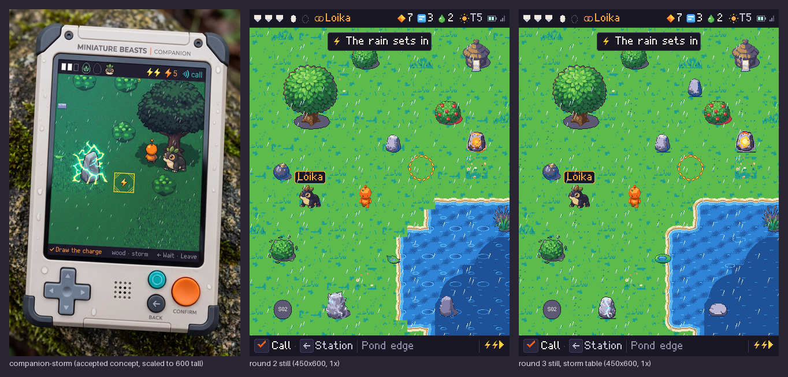
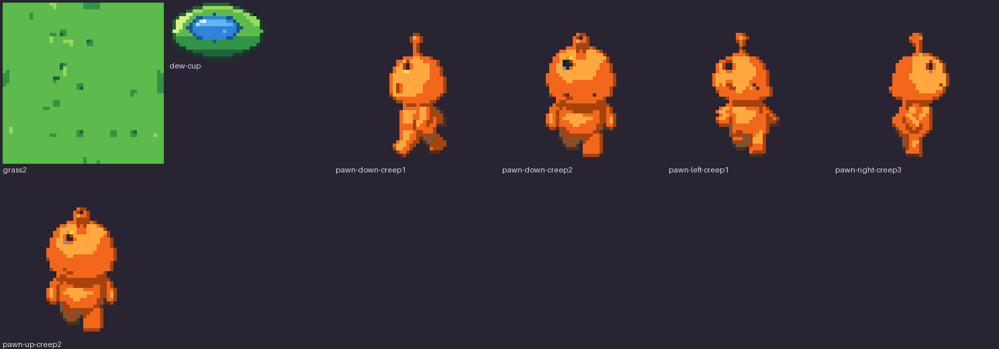

# Companion 48 px redraw: the review place

The [Companion 48 px redraw](../../../design/proposals/companion-48px-redraw.md) (§9 Decided) on one place, the meadow and pond edge in a storm, with every piece it needs at 1× on the 48 ramps of the [signed palette](../palette/README.md). Everything here is **a candidate for the owner's review**: generated sources down-rendered by script, an Aseprite pass for the meadow, scripted chrome and water, Retro Diffusion sprites beside the scripted ones where one was picked, and Pip derived into the Loika token. Nothing is accepted; nothing touches `prototypes/exploration/index.html`.

**State: round 3 ready for the owner.** It answers the owner's five notes on round 1 and their answers on round 2 (below). Round 1 and round 2 are frozen in [`round1/`](round1/) and [`round2/`](round2/). How every group is made and how to rebuild: [`../HANDOVER.md`](../HANDOVER.md) and `sh tools/build-all.sh`.

*Every piece at 3× ([1× here](contact-sheet-1x.png)); a piece that changed since round 2 shows round 2 (r2) beside round 3 (r3). The shore test and the Retro Diffusion group are laid out in their own groups. Candidates, not accepted.*

## The owner's answers on round 2, and what answers each

1. **Light: the mild storm stands; the teal is rejected.** The teal variant is removed (table, still and figure); `--light storm` is the only light the compose script offers besides the no-table and DARK references.
2. **Water: the ripple rings repeat on a grid.** The tiles carry only the depth gradient, crests and glints; the rings are sparse overlay sprites (below).
3. **Shore: it breaks at certain corners.** Found by laying every neighbourhood; the set is closed (below).
4. **Stones: "redo them".** All six stones and the stepping stone through the Retro Diffusion recipe, then a hand pass for the states (below).
5. The hand-clean list: dew cup, grass2's repeating motif and the creep frames (below).

## The owner's five notes on round 1, and what answers each

1. **"Dark, and the rain too heavy."** The round 1 still darkened everything one ramp step. Round 2 uses no DARK step: the ground, water and plain stones go through a *storm table* (each colour mixed 30 % toward river, nearest palette colour; sand, clay, paper, bone and white kept), and the canopies and the lit stones keep their own colours (decision below). The pawn and mibis never pass through a table. The rain tile has 10 streaks per 96 px (round 1: 26). Limit: the storm reads mild; the owner chose that over a stronger teal cast.
2. **"The grid is not seamless."** A real Aseprite pass (1.3.18, headless on the VM, `tools/aseprite-meadow.lua`): all eight meadow tiles (grass ×4, tall ×2, flowers ×2) take one shared outer band, the master's interior offset by half a tile, blended inward and snapped to the tile's colours; grass3 and grass4 took an 18 px band (8 px left a faint horizontal structure in their own 3×3). Any meadow tile joins any other.
3. **"Pawn, trees and stones good but dark."** Painted values lifted 18 % before quantising, nothing darkens them in the still beyond the storm cast on plain stones; Retro Diffusion sprites run through the same lift.
4. **"River borders too wavy."** The shoreline amplitude is 0.9 + 0.5 px (was 2.2 + 1.3); a shallows band lies between bank and water; the foam line stays.
5. **"Water flat."** Water redrawn (below), two frames.

## The ground, seamless

*Each meadow tile laid 3×3 at 1×, after the Aseprite pass (grass3, grass4 at band 18). Candidate.*

*All eight meadow tiles laid in a seeded random 6×6 ([1×](work/meadow-mixed-1x.png), `tools/meadow-check.py`): the mean colour step across a tile join is 4.8 against 13.4 inside the tiles, and no join shows at 1× or 3×. Candidate. Limit: grass2's dark bracket motif repeats visibly when it is laid several times near each other; it is the one tile to thin out at placement.*

The shore set (16 masks × 2 frames) is cut again from these tiles, the shallows and the new water ([contact sheet](contact-sheet-3x.png), group 2).

## Water

*Round 3 water tiles, 3×: water1, water2, deep1, deep2, shallows, shore-03-1, shore-diag-ne-1. No rings in any tile. Scripted candidate (`tools/build-water.py`).*

The tiles carry a depth gradient (a periodic depth field read through a 4×4 Bayer matrix between two neighbouring ramp steps, so the colour moves softly from lighter to deeper) and short crests in the lighter step with an ice glint, drifting 3 px between the two frames; the deep tile is the same one step down the ramp. They repeat every 48 px. Limit: the depth pools and crests still repeat on the tile grid, faintly; only the rings were the owner's note, and a second tile variant per frame would break the rest too.

*Ripple overlay sprites, 5×: three sizes (13, 19 and 25 px wide in frame 1) × two frames; broken flat rings in the lighter step with an ice glint, the gaps moving and the ring widening by 2 px between the frames. They are pieces of the props sheet (`ripple-N-F`, sprites, anchor at the foot), never part of a tile.* Placement is the compose script's, and the page can do the same: a seeded hash (`RandomState(48)`) walks the view in 3×3-tile blocks, each block takes at most one ripple (75 % of blocks), at a hashed size and position inside the block; a ripple is drawn only where its whole ring lies over water, so none sits on the shore and none repeats on a tile boundary; one per block means none sits on the same spot twice. The still draws frame 1; the page alternates the frames.

The two Retro Diffusion water tiles of round 2 (`sources/rd/C48-R-r2-water1`, `-water2`) stay as labelled candidates, unused.

## The shore

*Shore test: each land tile laid with every neighbourhood it can have; see the groups "Shore test" on [the contact sheet at 3×](contact-sheet-3x.png) and [the random pond at 1×](work/shore-test-pond/pond-outline-random.png). Scripted candidate.*

What was broken: a land tile with water only on a diagonal had no piece, so the pond's corner left a square notch where two bank strips met at a tile corner; and where two adjacent sides are water the land corner was square. Now: **16 cardinal masks** (N=1 E=2 S=4 W=8, water on that side, 2 frames) with the land corner rounded where two adjacent sides are water; **4 diagonal corners** (`shore-diag-ne/se/sw/nw`, 2 frames), a quarter-disc of water with its bank bands, transparent where it would be plain grass, laid over any land tile that has water on a diagonal and on neither side of that corner. Their depth carries the neighbouring strips' wave so the bands meet at the tile join. `tools/shoregrid.py` lays all 256 neighbourhoods and 40 random ponds and counts the pixels where the land / bank / water class differs across a tile join: round 2's set **14 976** broken pixels over the 256 neighbourhoods and **20 085** over the ponds; round 3's **768** and **1 030**, at most 4 pixels per join, which is a one-pixel offset of a band edge, not a gap (every join has the same classes, within a pixel). The page does the same pass: for each land tile, the cardinal mask, then each diagonal corner whose two sides are land.

## The still

*450×600 at 1×: HUD 32, view 532, bottom line 36. `compose-still.py --light storm`: the storm table on ground, water and plain stones; canopies and lit stones exempt; pawn and mibis untouched; the pond closed by the shore set; ripples as overlay sprites; the six stones from the Retro Diffusion recipe; the dew cup on the shore. Rain from the weather sheet; the message box, name tag, key caps and condition bolts from the ui sheet; the page's Mibi 7×9 font at 2×. 0 off-palette pixels. "Loika" is a text layer, never baked. Candidate.*

*Left, the accepted Companion concept; middle, the round 2 still; right, the round 3 still. Candidate.*

*The round 3 still in four greys (also [sheets](sheets/four-gray/)). Re-read: the pawn (orange, luma 127) sits one grey below the grass body (luma 159) and separates by value as well as by outline; in round 1 both landed in one grey. Unchanged from round 2; the margin is one grey step, not wide.*

### The storm light: the art director's decision

- **Greens keep their ramp under the storm.** The tree's canopy went teal under the table and lost its identity; trees and bushes (tree, bush, bush-fruit, bush-shaken) are exempt and read as the lit, living thing against a cooler ground. The lit stones (warm, charged) are exempt too: their glow is the point and the table turned it grey.
- **The ground takes a blue cast only in its shade strokes**, not its body: the grass body keeps its value because the four-grey check needs the ground lighter than the pawn. The owner confirmed this light and rejected the teal; a stronger cast is not offered.
- Water, plain stones, the hut and the shore go through the table.

## The sprites: Retro Diffusion beside the scripted piece, and the art director's pick

Each painted piece was cropped, its key-colour halo and purple ground shadow removed (alpha eroded one pixel, purple-cast pixels sent to white), put on white and sent as `input_image` (strength 0.5) to `rd_pro__topdown` with the 48-colour `input_palette` and `remove_bg`; the result is lifted 18 %, quantised onto the piece's ramps, despeckled and outlined by the ramp rule (`tools/rd-snap.py`). HiBit on the 48 ramps, ramp outline never black, no alpha, no anti-aliasing, 0 off-palette after the snap.

| Piece | Pick | Reason |
| --- | --- | --- |
| tree | scripted | Retro Diffusion draws a crisper canopy but loses the trunk to a stub and the ground shadow. |
| bush | scripted | Retro Diffusion's is darker with a grey patch artefact; the scripted bush is lighter and rounder. |
| bush-fruit | scripted | Retro Diffusion's berries mix with purple specks; the scripted red berries read at once. |
| stone, stone-plain2 | **Retro Diffusion + hand pass** | Facets and a lit top give volume; the scripted stones are smooth slabs with a skirt. Hand pass: a ground shadow. |
| stone-warm1, stone-warm2 | **Retro Diffusion + hand pass** | The glow sits in the stone's core as a warm stone should. Hand pass: the orange halo the snap left at the rim taken off, the core re-stepped by distance (cream, yellow, amber, orange, rust), a clay spill under it, a shadow. |
| stone-charged1, stone-charged2 | **Retro Diffusion + hand pass** | Retro Diffusion alone keeps the stone and loses the charge to faint cracks; the hand pass takes out the teal specks and draws a jagged bolt of white with ice beside it, a branch in sky, sparks off the silhouette, a shadow: the state reads at 1×. |
| stone-step (new, the stepping stone, same family) | **Retro Diffusion + hand pass** | A low flat stone from the plain stone's crop; a dark water line under it so it sits in the water. |
| outpost-lit | scripted | Retro Diffusion's hut is dark brown with a teal halo; the owner asked for lighter. |
| pod | scripted | Retro Diffusion turned the dark pod into a cream egg: a different object. |
| pawn (down, up, left, right) | scripted | Retro Diffusion drew a different character and only the walk2 frame per facing. |

The picks are in [`work/props/`](work/props/) and the sheets; the round 2 scripted stones in [`work/props-scripted/`](work/props-scripted/); every Retro Diffusion result, snapped and before the hand pass, in [`work/props-rd/`](work/props-rd/) and [`work/pawn-rd/`](work/pawn-rd/); raw results, inputs and sidecars in [`sources/rd-sprites/`](sources/rd-sprites/). The hand pass is `tools/hand-pass.py`, scripted so it can be re-run.

*The stone family at 5× after the hand pass: stone, stone-plain2, stone-warm1, stone-warm2, stone-charged1, stone-charged2, stone-step. Candidates.*

### The hand-clean list

*grass2 (the long bar, bracket and ramp of dark pixels that repeated on the grid are gone, small clumps in their place, the two outer pixels untouched so it still joins), the dew cup (29×17, a curled leaf with a pool of sea-to-sky dew, an ice highlight and two sparks: it reads at 1× now), and creep frames (down creep1, creep2; left creep1; right creep3; up creep2). Candidates.*

The creep frames are derived from the walk frames as a crouch (three rows cut from the body below the head so the figure stands lower, the upper part shifted one to two pixels toward the facing, the down and up facings rocking a pixel side to side, the foot at y 46): a creep now differs from a walk in height and lean at 1×. Limit: it is a derivation, not a hand-drawn cycle; the arms do not change.

## What is generated, scripted, derived

| Group | Source | Script | Stage |
| --- | --- | --- | --- |
| Ground: grass ×4, tall ×2, flowers ×2, shade, sand, wet shore | One Pro-painted 4×4 grid ([`sources/C48-T-r1-a1`](sources/C48-T-r1-a1.json)): cut by the magenta margins, 10 % trim, wrap-blend, level-match across the meadow set, BOX to 48, quantise per ramps, despeckle (`tools/build-ground.py`); then the Aseprite pass on the VM for the eight meadow tiles | generated source, scripted down-render, Aseprite pass |
| Water ×2, deep ×2, shallows | Scripted (`tools/build-water.py`) | scripted |
| Ripple overlay sprites 3 sizes × 2 frames | Scripted (`tools/build-ripples.py`) | scripted |
| Shore set: 16 cardinal masks and 4 diagonal corners × 2 frames | Cut from grass1, sand, shallows and water along a wavy shoreline; rounded land corners; bone foam (frame 1), white (frame 2) (`tools/build-shore.py`); tested by `tools/shoregrid.py` | scripted |
| Props | One Pro-painted sheet on magenta ([`sources/C48-P-r1-a1`](sources/C48-P-r1-a1.json)): key, fit, lift 1.18, quantise per ramps, despeckle, outline (`tools/build-props.py`); the six stones and the stepping stone from Retro Diffusion (`tools/rd-sprites.py`, `rd-snap.py`) with the hand pass (`tools/hand-pass.py`) | generated source, scripted down-render; Retro Diffusion stones with a hand pass |
| Warned strike ×2, HUD icons, key caps, condition bolts, 9-slices | Drawn by script on the ramps from the page's own icon forms (`tools/build-ui.py`) | scripted |
| Pawn: 4 facings × walk 3, creep 3, react | One Pro-painted 8×4 sheet ([`sources/C48-W-r1-a1`](sources/C48-W-r1-a1.json)) to 40 px tall, lifted, foot at y 46; up derived from down (`tools/build-pawn.py`) | generated source, scripted down-render |
| Tokens: Pip as Loika (idle 2, walk 3); placeholders S02–S04 | The accepted Pip painting, quantised and outlined (`tools/build-tokens.py`) | derived, scripted |
| Weather: rain tile 96×96, 2 leans × 2 frames | Scripted, 10 streaks per tile (`tools/build-weather.py`); Retro Diffusion stages rejected and kept in `sources/rd/` | scripted |

Sheets: six indexed PNGs (the ground sheet holds the tiles and the whole shore set; the props sheet the props and the ripple sprites) (indices 0–47 as signed, 48 transparent) with JSON atlases in [`sheets/`](sheets/); anchor = foot for sprites, top-left for tiles and chrome. Working pieces, one PNG each, in [`work/`](work/).

## Checks

- `tools/check.py` on the six sheets and the still: **0 off-palette, 0 semi-transparent pixels** on every one.
- Four-grey renderings: [`sheets/four-gray/`](sheets/four-gray/) and [`still/four-gray/`](still/four-gray/).
- Meadow joins: the 3×3 figure and the mixed 6×6 above (mean step across joins 4.8 against 13.3 inside the tiles, after grass2's hand pass).
- Shore joins: `tools/shoregrid.py`, 768 broken pixels over the 256 neighbourhoods, none wider than 4 per join.

## Sign-off checklist, §2 Painted master, art director's column (round 3)

From [`design/style-guide/sign-off.md`](../../../design/style-guide/sign-off.md) §2. Yes/no per line; failures listed, not hidden. The capabilities column is the builder's and is not signed here.

| Art direction | |
| --- | --- |
| From the accepted candidate, owner's notes applied (SS Decided) | **Yes**, with limits. The five notes are answered above; the forms, colours and light come from the accepted Companion concept through the painted sources. The owner's answers on round 2 are applied (the mild storm kept, the teal gone, the rings out of the tiles, the shore closed, the stones redone). Limit: the storm reads mild against the concept's dark teal, as the owner chose. |
| Station: painted light, soft shadows, no dither bands or flat fills (SG) | n/a: Companion pieces. |
| Companion: hand-pixelled on the 48 ramps, ramp outline never black, no alpha, Bayer only (SG; UK §2) | **Partial.** On the 48 ramps, outlines by the ramp rule, no alpha, no AA, Bayer only (water depth). **Not hand-pixelled:** the terrain, props, pawn and tokens are scripted down-renders of painted or Retro Diffusion sources with despeckling; the meadow had a real Aseprite pass, nothing else did. The stones are Retro Diffusion results with a scripted hand pass; the dew cup and the creep frames are scripted redraws and derivations. Failures: tree, bushes, hut, pod, pawn and tokens remain scripted down-renders without a hand pass; the creep frames are a derived crouch, not a drawn cycle; the water's depth pools and crests repeat faintly on the tile grid. |
| Creature at its area, 300×310+ Station, 280×300 Companion, same trait boundaries (SG Creatures) | **Yes** for the one creature present: Loika is the placed Pip, derived from the accepted 280×300 painting, same individual; S02–S04 are labelled placeholders. |
| Same individual in four-gray and on paper; nothing childish (AD) | **Partial.** Four-grey renderings made for every sheet and the still; Pip's token reads as Pip. The round 1 value fail is **reduced, not gone**, re-read on the round 3 still: the pawn sits one grey below the grass body, a one-step margin. Not tested on paper (no paper render exists for the Companion). Nothing childish: painted-source finish; placeholders are plain grey stones with a code. |

Signed, art director, 2026-10-08. Failures: the three listed in line three (no hand pass beyond the stones, dew cup, grass2 and creep; derived creep; the water's faint repetition) and the pawn's one-step four-grey margin.

## Spend

| Call | Tool | USD |
| --- | --- | --- |
| C48-T-r1-a1 ground grid, C48-P-r1-a1 props, C48-W-r1-a1 pawn | Pro, 1K each | 0.53 |
| C48-R-r1-a1, a2 rain | Retro Diffusion rd_pro__topdown 96×96 | 0.36 |
| C48-R-r2-water1, water2 | Retro Diffusion rd_pro__topdown 48×48 | 0.36 |
| C48-S-r2 first sprite batch, 12 calls (superseded: magenta fringe on the inputs) | Retro Diffusion rd_pro__topdown | 2.16 |
| C48-S-r2 second sprite batch, 12 calls | Retro Diffusion rd_pro__topdown | 2.16 |
| C48-S-r2 stones batch (stone-plain2, stone-warm2, stone-charged2, stone-step), round 3 | Retro Diffusion rd_pro__topdown | 0.72 |
| **Total** | | **6.29** |

Re-summed from the sidecars by `tools/budget.py` into [`sources/budget.json`](sources/budget.json) (the superseded batch in [`sources/extra-spend.json`](sources/extra-spend.json)). Retro Diffusion balance left: $1.32.

## Limits and what the next round needs

- Only the stones, the dew cup, grass2, the creep frames and the meadow had a hand pass or an Aseprite pass; the tree, bushes, hut, pod, pawn and tokens are scripted down-renders.
- The water tiles' depth pools and crests repeat faintly on the tile grid; a second variant per frame would break that.
- The pawn has no ground shadow in the still; one under the pawn would add value separation.
- The map pawn, the reach variant, bubbles, settle pips, the partner ring, signs, map props, cloud and rim pieces are not in this round (the brief stops at the review place).
