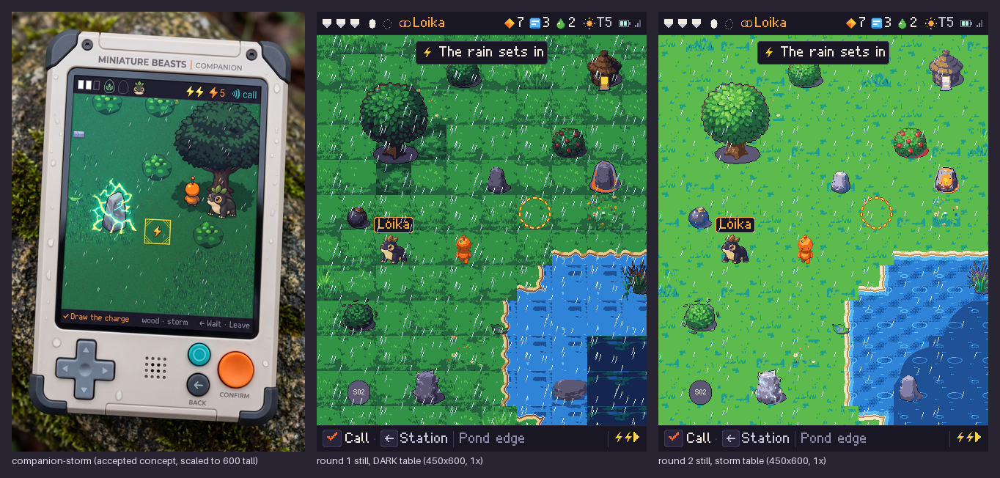

# Companion 48 px redraw: the review place

The [Companion 48 px redraw](../../../design/proposals/companion-48px-redraw.md) (§9 Decided) on one place, the meadow and pond edge in a storm, with every piece it needs at 1× on the 48 ramps of the [signed palette](../palette/README.md). Everything here is **a candidate for the owner's review**: generated sources down-rendered by script, an Aseprite pass for the meadow, scripted chrome and water, Retro Diffusion sprites beside the scripted ones where one was picked, and Pip derived into the Loika token. Nothing is accepted; nothing touches `prototypes/exploration/index.html`.

**State: round 2 ready for the owner.** It answers the owner's five notes on round 1 (below). Round 1's pieces, still and contact sheets are frozen in [`round1/`](round1/). How every group is made and how to rebuild: [`../HANDOVER.md`](../HANDOVER.md) and `sh tools/build-all.sh`.

*Every piece at 3× ([1× here](contact-sheet-1x.png)); a piece that changed since round 1 shows round 1 (r1) beside round 2 (r2). The Retro Diffusion group puts the scripted piece (a) beside the Retro Diffusion one (b). Candidates, not accepted.*

## The owner's five notes, and what answers each

1. **"Dark, and the rain too heavy."** The round 1 still darkened everything one ramp step. Round 2 uses no DARK step: the ground, water and plain stones go through a *storm table* (each colour mixed 30 % toward river, nearest palette colour; sand, clay, paper, bone and white kept), and the canopies and the lit stones keep their own colours (decision below). The pawn and mibis never pass through a table. The rain tile has 10 streaks per 96 px (round 1: 26). Limit: the storm now reads mild; the stronger teal cast is kept as [an alternative still](still/companion-place-storm-48-cool.png) and fails the four-grey check (below).
2. **"The grid is not seamless."** A real Aseprite pass (1.3.18, headless on the VM, `tools/aseprite-meadow.lua`): all eight meadow tiles (grass ×4, tall ×2, flowers ×2) take one shared outer band, the master's interior offset by half a tile, blended inward and snapped to the tile's colours; grass3 and grass4 took an 18 px band (8 px left a faint horizontal structure in their own 3×3). Any meadow tile joins any other.
3. **"Pawn, trees and stones good but dark."** Painted values lifted 18 % before quantising, nothing darkens them in the still beyond the storm cast on plain stones; Retro Diffusion sprites run through the same lift; picks below.
4. **"River borders too wavy."** The shoreline amplitude is 0.9 + 0.5 px (was 2.2 + 1.3); a shallows band lies between bank and water; the foam line stays.
5. **"Water flat."** Water redrawn (below), two frames.

## The ground, seamless

*Each meadow tile laid 3×3 at 1×, after the Aseprite pass (grass3, grass4 at band 18). Candidate.*

*All eight meadow tiles laid in a seeded random 6×6 ([1×](work/meadow-mixed-1x.png), `tools/meadow-check.py`): the mean colour step across a tile join is 4.8 against 13.4 inside the tiles, and no join shows at 1× or 3×. Candidate. Limit: grass2's dark bracket motif repeats visibly when it is laid several times near each other; it is the one tile to thin out at placement.*

The shore set (16 masks × 2 frames) is cut again from these tiles, the shallows and the new water ([contact sheet](contact-sheet-3x.png), group 2).

## Water

*Round 2 water, 3×: water1, water2, deep1, deep2, shallows, two shore tiles. Scripted candidate (`tools/build-water.py`).*

Judged against the guide (storms go blue; water with depth, highlights and a soft ripple over two frames): it reads as water with depth at 1× and 3×, in the still and on its own. How it is made: a periodic depth field read through a 4×4 Bayer matrix between two neighbouring ramp steps, so the colour moves softly from lighter to deeper over the tile; short crests in the lighter step with an ice glint, drifting 3 px between the frames; two flat elliptical ripple rings that widen between the frames; the deep tile one step down the ramp; the deep water drawn with a wavy edge over the water in the still, not as a tile boundary. It tiles at 48 px. The two Retro Diffusion water tiles (`sources/rd/C48-R-r2-water1`, `-water2`; on-palette after the snap but stylised: teal ring ripples, dark blue with diamonds) are kept as labelled candidates, not used. Limit: the Bayer depth shows as a fine pattern at 3×; at 1× it reads as soft depth.

## The still

*450×600 at 1×: HUD 32, view 532, bottom line 36. The storm table on ground, water and plain stones; canopies and lit stones exempt; pawn and mibis untouched. Rain from the weather sheet; the message box, name tag, key caps and condition bolts from the ui sheet; the page's Mibi 7×9 font at 2×. 0 off-palette pixels. "Loika" is a text layer, never baked. Candidate.*

*Left, the accepted Companion concept; middle, the round 1 still (DARK table); right, the round 2 still. Candidate.*

*The round 2 still in four greys (also [sheets](sheets/four-gray/)). The pawn (orange, luma 127) sits one grey below the grass body (luma 159) and separates by value as well as by outline; in round 1 both landed in one grey. The margin is one grey step, not wide.*

Alternatives kept beside: [no table](still/companion-place-storm-48-plain.png) and [the stronger cool cast](still/companion-place-storm-48-cool.png) (grass body to teal, luma 129, the pawn's grey again: it fails the value check and is not the pick).

### The storm light: the art director's decision

- **Greens keep their ramp under the storm.** The tree's canopy went teal under the table and lost its identity; trees and bushes (tree, bush, bush-fruit, bush-shaken) are exempt and read as the lit, living thing against a cooler ground. The lit stones (warm, charged) are exempt too: their glow is the point and the table turned it grey.
- **The ground takes a blue cast only in its shade strokes**, not its body: the grass body keeps its value because the four-grey check needs the ground lighter than the pawn, and the owner asked for lighter. This is a trade: a stronger blue ground costs the pawn's value separation. If the owner wants a darker, bluer storm, the pawn needs a lighter body or a ground shadow, which is a pawn redraw.
- Water, plain stones, the hut and the shore go through the table.

## The sprites: Retro Diffusion beside the scripted piece, and the art director's pick

Each painted piece was cropped, its key-colour halo and purple ground shadow removed (alpha eroded one pixel, purple-cast pixels sent to white, so the input carries no key colour), put on white and sent as `input_image` (strength 0.5) to `rd_pro__topdown` with the 48-colour `input_palette` and `remove_bg`; the result is lifted 18 %, quantised onto the piece's ramps, despeckled and outlined by the ramp rule (`tools/rd-snap.py`). HiBit on the 48 ramps, ramp outline never black, no alpha, no anti-aliasing, 0 off-palette after the snap.

| Piece | Pick | Reason |
| --- | --- | --- |
| tree | scripted | Retro Diffusion draws a crisper canopy but loses the trunk to a stub and the ground shadow, so the tree stops reading as a tree. |
| bush | scripted | Retro Diffusion's is darker with a grey patch artefact at its top right; the scripted bush is lighter and rounder. |
| bush-fruit | scripted | Retro Diffusion's berries mix with purple specks; the scripted red berries read at once. |
| stone | **Retro Diffusion** | Facets and a lit top give the stone volume; the scripted stone is a smooth slab with a skirt. Smaller than the scripted one (26×31). |
| stone-warm1 | **Retro Diffusion** | The amber glow sits in the stone's core as a warm stone should; the scripted one is a grey slab with a warm rim, round 1's failure. |
| stone-charged1 | scripted | Retro Diffusion keeps the stone and loses the charge to faint white cracks; the scripted crackle still says charged. |
| outpost-lit | scripted | Retro Diffusion's hut is dark brown with a teal halo and a tiny lamp; the owner asked for lighter. |
| pod | scripted | Retro Diffusion turned the dark pod into a cream egg: a different object. |
| pawn (down, up, left, right) | scripted | Retro Diffusion drew a different character (a hooded person, a lantern, one with a stone tile behind it) and only the walk2 frame per facing; no cycle could be built, and the scripted pawn is the accepted individual. |

The picks are in [`work/props/`](work/props/) and the sheets; the scripted versions of the two replaced pieces are in [`work/props-scripted/`](work/props-scripted/); every Retro Diffusion result, snapped, in [`work/props-rd/`](work/props-rd/) and [`work/pawn-rd/`](work/pawn-rd/); raw results, inputs and sidecars in [`sources/rd-sprites/`](sources/rd-sprites/). Limit: the stone family is now mixed (two Retro Diffusion pieces, four scripted: stone-plain2, stone-warm2, stone-charged2 and the stepping stones were not re-run); in the still they sit apart, and a third batch on the same recipe would unify them.

## What is generated, scripted, derived

| Group | Source | Script | Stage |
| --- | --- | --- | --- |
| Ground: grass ×4, tall ×2, flowers ×2, shade, sand, wet shore | One Pro-painted 4×4 grid ([`sources/C48-T-r1-a1`](sources/C48-T-r1-a1.json)): cut by the magenta margins, 10 % trim, wrap-blend, level-match across the meadow set, BOX to 48, quantise per ramps, despeckle (`tools/build-ground.py`); then the Aseprite pass on the VM for the eight meadow tiles | generated source, scripted down-render, Aseprite pass |
| Water ×2, deep ×2, shallows | Scripted (`tools/build-water.py`) | scripted |
| Shore corner set 16 masks × 2 frames | Cut from grass1, sand, shallows and water along a wavy shoreline; bone foam (frame 1), white (frame 2) (`tools/build-shore.py`) | scripted |
| Props | One Pro-painted sheet on magenta ([`sources/C48-P-r1-a1`](sources/C48-P-r1-a1.json)): key, fit, lift 1.18, quantise per ramps, despeckle, outline (`tools/build-props.py`); stone and stone-warm1 from Retro Diffusion (`tools/rd-sprites.py`, `rd-snap.py`) | generated source, scripted down-render; two Retro Diffusion picks |
| Warned strike ×2, HUD icons, key caps, condition bolts, 9-slices | Drawn by script on the ramps from the page's own icon forms (`tools/build-ui.py`) | scripted |
| Pawn: 4 facings × walk 3, creep 3, react | One Pro-painted 8×4 sheet ([`sources/C48-W-r1-a1`](sources/C48-W-r1-a1.json)) to 40 px tall, lifted, foot at y 46; up derived from down (`tools/build-pawn.py`) | generated source, scripted down-render |
| Tokens: Pip as Loika (idle 2, walk 3); placeholders S02–S04 | The accepted Pip painting, quantised and outlined (`tools/build-tokens.py`) | derived, scripted |
| Weather: rain tile 96×96, 2 leans × 2 frames | Scripted, 10 streaks per tile (`tools/build-weather.py`); Retro Diffusion stages rejected and kept in `sources/rd/` | scripted |

Sheets: six indexed PNGs (indices 0–47 as signed, 48 transparent) with JSON atlases in [`sheets/`](sheets/); anchor = foot for sprites, top-left for tiles and chrome. Working pieces, one PNG each, in [`work/`](work/).

## Checks

- `tools/check.py` on the six sheets, the still and its two alternatives: **0 off-palette, 0 semi-transparent pixels** on every one.
- Four-grey renderings: [`sheets/four-gray/`](sheets/four-gray/) and [`still/four-gray/`](still/four-gray/).
- Meadow joins: the 3×3 figure and the mixed 6×6 above.

## Sign-off checklist, §2 Painted master, art director's column (round 2)

From [`design/style-guide/sign-off.md`](../../../design/style-guide/sign-off.md) §2. Yes/no per line; failures listed, not hidden. The capabilities column is the builder's and is not signed here.

| Art direction | |
| --- | --- |
| From the accepted candidate, owner's notes applied (SS Decided) | **Yes**, with limits. The five notes are answered above; the forms, colours and light come from the accepted Companion concept through the painted sources. Limit: the storm reads mild against the concept's dark teal; the stronger cast is an alternative, not the pick. |
| Station: painted light, soft shadows, no dither bands or flat fills (SG) | n/a: Companion pieces. |
| Companion: hand-pixelled on the 48 ramps, ramp outline never black, no alpha, Bayer only (SG; UK §2) | **Partial.** On the 48 ramps, outlines by the ramp rule, no alpha, no AA, Bayer only (water depth). **Not hand-pixelled:** the terrain, props, pawn and tokens are scripted down-renders of painted or Retro Diffusion sources with despeckling; the meadow had a real Aseprite pass, nothing else did. Failures: grass2's bracket motif repeats visibly in a run of the same tile; `stone-warm2`, `stone-plain2` and the stepping stones are scripted slabs beside two Retro Diffusion stones; `dew-cup` is too small to read at 1×; the pawn's creep frames differ from the walk by little. |
| Creature at its area, 300×310+ Station, 280×300 Companion, same trait boundaries (SG Creatures) | **Yes** for the one creature present: Loika is the placed Pip, derived from the accepted 280×300 painting, same individual; S02–S04 are labelled placeholders. |
| Same individual in four-gray and on paper; nothing childish (AD) | **Partial.** Four-grey renderings made for every sheet and the still; Pip's token reads as Pip. The round 1 value fail is **reduced, not gone**: the pawn now sits one grey below the grass body, a one-step margin; the stronger blue ground would bring the fail back. Not tested on paper (no paper render exists for the Companion). Nothing childish: painted-source finish; placeholders are plain grey stones with a code. |

Signed, art director, 2026-10-08. Failures: the three listed in line three (hand-clean; grass2 repeat; mixed stone family; dew cup; creep frames) and the pawn's one-step four-grey margin.

## Spend

| Call | Tool | USD |
| --- | --- | --- |
| C48-T-r1-a1 ground grid, C48-P-r1-a1 props, C48-W-r1-a1 pawn | Pro, 1K each | 0.53 |
| C48-R-r1-a1, a2 rain | Retro Diffusion rd_pro__topdown 96×96 | 0.36 |
| C48-R-r2-water1, water2 | Retro Diffusion rd_pro__topdown 48×48 | 0.36 |
| C48-S-r2 first sprite batch, 12 calls (superseded: magenta fringe on the inputs) | Retro Diffusion rd_pro__topdown | 2.16 |
| C48-S-r2 second sprite batch, 12 calls | Retro Diffusion rd_pro__topdown | 2.16 |
| **Total** | | **5.57** |

Re-summed from the sidecars by `tools/budget.py` into [`sources/budget.json`](sources/budget.json) (the superseded batch in [`sources/extra-spend.json`](sources/extra-spend.json)). Retro Diffusion balance left: $2.04.

## Limits and what the next round needs

- Only the meadow had a real Aseprite pass; hand-cleaning the rest (props, pawn, tokens) is the remaining step to "hand-pixelled".
- The shore set is cardinal masks only (no diagonals); the island, canopy shade and a shore for the second water frame would follow.
- The pawn has no ground shadow in the still; one under the pawn would add value separation.
- The map pawn, the reach variant, bubbles, settle pips, the partner ring, signs, map props, cloud and rim pieces are not in this round (the brief stops at the review place).
