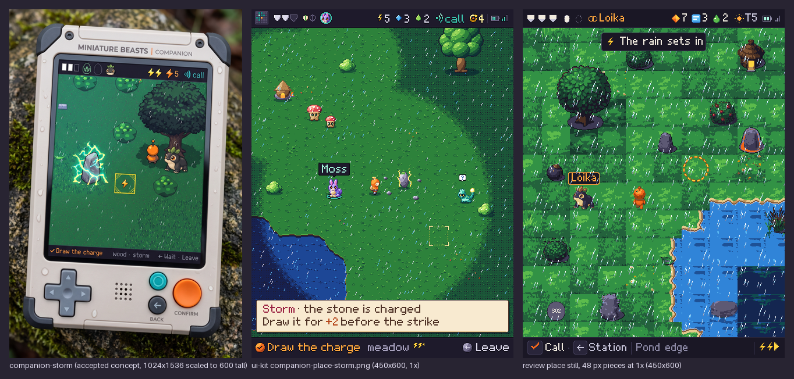

# Companion 48 px redraw, round 1: the review place

The first round of the [Companion 48 px redraw](../../../design/proposals/companion-48px-redraw.md) (§9 Decided): one place, the meadow and pond edge in a storm, with every piece it needs at 1× on the 48 ramps of the [signed palette](../palette/README.md). Everything here is **a candidate for the owner's review**: generated sources down-rendered by script, scripted chrome, and Pip derived into the Loika token. Nothing is accepted; nothing touches `prototypes/exploration/index.html`.

*Every piece at 3× ([1× here](contact-sheet-1x.png)). Candidates, not accepted.*

## The still

*450×600 at 1×: HUD 32, view 532, bottom line 36. The ground and props pass once through the DARK table (strong rain over you); the pawn and the mibis never. Rain from the weather sheet over the view; the message box, the name tag, the key caps and the condition bolts from the ui sheet; the page's Mibi 7×9 font at 2×. 0 off-palette pixels by `tools/check.py`; its four-grey rendering is in [`still/four-gray/`](still/four-gray/). "Loika" is a text layer, never baked.*

*Left, the accepted Companion concept; middle, the ui-kit's `companion-place-storm.png` (the page as it draws today at 32 px); right, this round's still.*

## What is generated, scripted, derived

| Group | How it was made | Stage |
| --- | --- | --- |
| Ground (grass ×4, tall ×2, flowers ×2, shade, sand, water ×2, deep, reeds, wet shore, stepping stone) | One Pro-painted 4×4 grid ([`sources/C48-T-r1-a1`](sources/C48-T-r1-a1.json)) cut, wrap-blended, level-matched across the meadow set, BOX-resized to 48 and quantised onto each tile's ramps (`tools/build-ground.py`) | generated source, scripted down-render |
| Shore corner set (16 masks × 2 frames) | Cut by script from the grass, sand and water tiles along a wavy shoreline that repeats every 48 px; a foam line of bone (frame 1) or white (frame 2) (`tools/build-shore.py`) | scripted |
| Props: tree, bush ×3, stone, warm stone ×2, charged stone ×2, outpost ×3, pod, reeds, dew cup | One Pro-painted sheet on magenta ([`sources/C48-P-r1-a1`](sources/C48-P-r1-a1.json)) keyed, resized to each piece's size, quantised onto its ramps, outlined by the rule (`tools/build-props.py`) | generated source, scripted down-render |
| Warned strike ×2 | A dashed yellow ring with a rust rim, two dash phases (`tools/build-ui.py`) | scripted |
| Pawn: 4 facings × walk 3, creep 3, react | One Pro-painted 8×4 sheet ([`sources/C48-W-r1-a1`](sources/C48-W-r1-a1.json)) down-rendered to 40 px tall in 48 px cells, foot at y 46; the up facing derived from down (`tools/build-pawn.py`) | generated source, scripted down-render |
| Tokens: Pip as Loika (idle 2, walk 3); placeholders S02–S04 | Derived from the accepted Pip painting (`art/miniature-lives/assets/hibit-plain-280x300.png`): 40 px tall, quantised, outlined; the frames by 1 px shifts of the legs and body (`tools/build-tokens.py`); placeholders as grey stones with the code in the page font | derived, scripted |
| Weather: rain tile 96×96, 2 leans × 2 frames | The page's 4×11 streak (white, ice, mist) laid 26 times by a hash so the tile wraps; frame 2 is frame 1 fallen half a tile (`tools/build-weather.py`). Two Retro Diffusion `rd_pro__topdown` stages with the palette as `input_palette` were made and rejected: [a1](sources/rd/C48-R-r1-a1-rd.png) painted a side-view sky with lightning on an opaque ground; [a2](sources/rd/C48-R-r1-a2-rd.png) with `remove_bg` gave usable streak forms in teal and lilac, not seamless, with an edge artefact | scripted; generated stages kept and labelled |
| HUD icons (Energy, Data, Essence, Shield, Shield gone, Pod, free slot, World turn, Call, Storm ×2, hollow bolt, Fog bank, Pin, Battery, Radio, bond, crate), key caps ✓ ← Call, condition bolts ◀ ▶ ×2, 9-slices (message box, danger, name tag, paper) | Drawn by script on the ramps at 16 px (caps 24 tall with the glyph at 2×), from the page's own icon forms (`tools/build-ui.py`) | scripted |

Sheets: six indexed PNGs (indices 0–47 as signed, 48 transparent) with JSON atlases in [`sheets/`](sheets/): frame rects, anchor (foot for sprites, top-left for tiles and chrome). Working pieces, one PNG each, in [`work/`](work/). Sources, prompts and sidecars in [`sources/`](sources/); the spend in [`sources/budget.json`](sources/budget.json).

## Checks

- `tools/check.py` on the six sheets and the still: **0 off-palette, 0 semi-transparent pixels** on every one.
- Four-grey renderings of every sheet in [`sheets/four-gray/`](sheets/four-gray/) and of the still in [`still/four-gray/`](still/four-gray/). Fail noted below: under the storm's DARK table the pawn's orange body lands in the same grey as the darkened grass; only its outline separates it.

## Sign-off checklist, §2 Painted master, art director's column

From [`design/style-guide/sign-off.md`](../../../design/style-guide/sign-off.md) §2. Yes/no per line; failures listed, not hidden. The capabilities column is the builder's and is not signed here.

| Art direction | |
| --- | --- |
| From the accepted candidate, owner's notes applied (SS Decided) | **Yes**, with a limit: the forms, colours and light are taken from the accepted Companion concept (`companion-storm.png`) through the painted sources; the redraw's two choices (§9) are followed. No owner notes exist yet on 48 px pieces; this is the first round. |
| Station: painted light, soft shadows, no dither bands or flat fills (SG) | n/a: Companion pieces. |
| Companion: hand-pixelled on the 48 ramps, ramp outline never black, no alpha, Bayer only (SG; UK §2) | **Partial.** On the 48 ramps, outlines by the ramp rule (never void; the N ramp's edge is ink), no alpha, no AA. **Not hand-pixelled:** the terrain, props, pawn and tokens are scripted down-renders of painted sources, with despeckling; the Aseprite clean-up pass the proposal names has not happened (Aseprite is not on this VM). Fails to list: faint tile seams remain across the meadow set; `stone-warm` reads as a grey slab with a warm top rather than a warm stone; `dew-cup` is too small to read at 1×; the pawn's creep frames differ from the walk by little. |
| Creature at its area, 300×310+ Station, 280×300 Companion, same trait boundaries (SG Creatures) | **Yes** for the one creature present: Loika is the placed Pip, derived from the accepted 280×300 painting, same individual, never regenerated; S02–S04 are labelled placeholders. |
| Same individual in four-gray and on paper; nothing childish (AD) | **Partial.** Four-grey renderings made for every sheet and the still; Pip's token still reads as Pip in four greys; **the pawn under the DARK table does not separate from the ground in four greys** (outline only). Nothing childish: the sources are painted in the concept's finish; the placeholders are plain grey stones with a code, no faces. |

Signed, art director, 2026-10-08. Failures: the three listed above (not hand-cleaned; tile seams, the warm stone, the dew cup, the creep frames; the pawn's four-grey value under the storm).

## Spend

| Call | Tool | USD |
| --- | --- | --- |
| C48-T-r1-a1 ground grid, C48-P-r1-a1 props, C48-W-r1-a1 pawn | Pro, 1K each | 0.53 |
| C48-R-r1-a1, C48-R-r1-a2 rain | Retro Diffusion rd_pro__topdown 96×96 | 0.36 |
| **Total** | | **0.89** |

## Limits and what the next round needs

- The down-render is the scripted stand-in for the Aseprite pass; the next round cleans the pieces by hand where the script leaves noise (tile seams, the warm stone, the dew cup, the creep cycle) and takes the owner's notes.
- The shore set is cardinal masks only (no diagonal corners); the island, canopy shade and the second water frame's shore are cut from the same rule and would follow.
- The rain tile is scripted; Retro Diffusion gave streak forms but not a palette-true seamless tile in two tries, so the scripted tile stands and the stages are kept labelled.
- The map pawn, the reach variant, bubbles, settle pips, the partner ring, signs, map props, cloud and rim pieces are not in this round (the brief stops at the review place).
