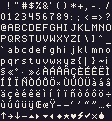
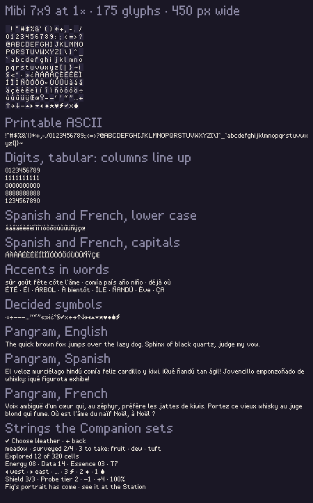
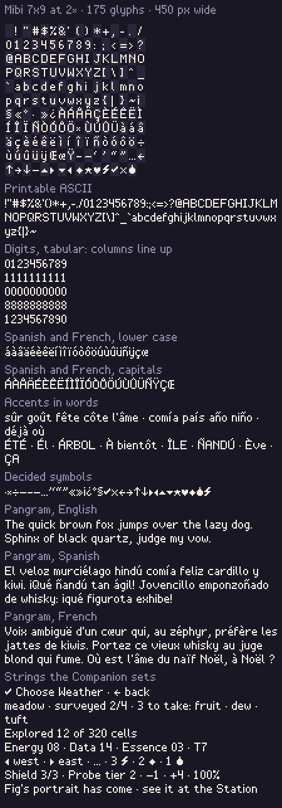
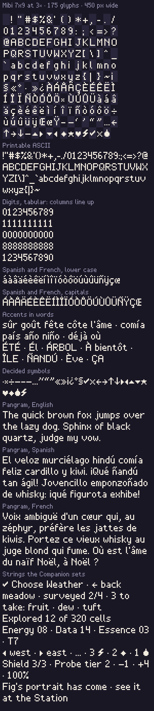

# Mibi 7×9, the Companion's bitmap face

The master glyph sheet for the face [ui-kit §2](../../../design/proposals/ui-kit.md) and the [style guide](../../../design/style-guide/README.md) (Type) decide for the Companion: cap height 7, x-height 5, descenders 2, rounded bowls, tabular digits, one pixel of tracking, set at **2× for HUD, bottom line and body, 3× for titles and names, never 1×**. No sheet existed until now. The Companion page still sets its 5×7 stand-in (`GLYPHS` in `prototypes/exploration/index.html`; the comment in [`../tools/font.py`](../tools/font.py) that calls it Mibi 7×9 is a misnomer), so nothing in the page changes with this delivery.

**Status: signed by the art director, 2026-10-08.** The glyphs are hand-pixelled in the source and built into the sheet by script. The builder's column of the checklist below is still open, and the page does not set the face yet.

## Files

| File | What it is |
| --- | --- |
| [`mibi-7x9.txt`](mibi-7x9.txt) | **The source.** One block per glyph: a header (`U+0041 A`) and nine rows of seven characters, `.` empty and `#` ink. An accented letter whose mark rides above the cap line has ten rows (lower case) or eleven (capitals), the extra rows on top. Edit this and rebuild. |
| [`mibi-7x9.png`](mibi-7x9.png) | The sheet: 16 columns of 7×11 cells in code-point order, 112×121: the 7×9 body with the cap line on cell row 2, under the two headroom rows the accent marks use. Indexed, two palette colours (ink `#1a1725` index 1 as ground, bone `#f1ebdf` index 7 as the letter), no alpha. Read it as a mask. |
| [`mibi-7x9.json`](mibi-7x9.json) | The atlas: per code point the cell, its pixel rect in the sheet, `ink_x`, `ink_w`, `advance` and `above` (how many headroom rows the glyph inks: 0, 1 or 2); the cell size, the cap-line row and the metrics. |
| [`../tools/build-mibi.py`](../tools/build-mibi.py) | `python3 -I tools/build-mibi.py`, run from `art/companion-48/`, builds the PNG, the JSON and the three contact sheets from the `.txt`. Standard library only (it writes its own indexed PNGs from [`palette.json`](../palette/palette.json)); it refuses a block that is not 7 wide and 9 to 11 rows high, has ink in a bearing column, repeats a code point, or leaves a printable ASCII character out. |
| [`contact-1x.png`](contact-1x.png), [`-2x`](contact-2x.png), [`-3x`](contact-3x.png) | The full set, accents in words and the pangrams, set in the face at each scale on a 450 px wide screen. |

## The face

- **Body 7×9.** Columns 0 and 6 are the side bearings and stay empty; ink is in columns 1–5. Caps rows 0–6 (cap height 7), lower case rows 2–6 (x-height 5), ascenders rows 0–6, the baseline under row 6, descenders rows 7–8.
- **Marks never touch the lower case.** A lower-case acute, grave, circumflex or tilde sits on rows −1 and 0 with row 1 clear; the i's dot and every diaeresis sit on row 0 with the same clear row. An accented capital keeps all seven rows and carries its mark on rows −2 and −1, on the cap top. Rows −2 and −1 are the line's leading (the pitch is 11), so the sheet's cell is 7×11 and the atlas gives each glyph's `above`. A text slot keeps 2 font px clear above its first cap line (4 px at 2×, 6 px at 3×).
- **Advance** is the ink extent plus one pixel of tracking, so letters sit one font pixel apart as the kit says. Put the cell's column 1 on the pen and its row 2 on the cap line, draw, then move the pen by the atlas `advance`. Space advances 3. **Digits are tabular**: every digit advances 5 (4 wide ink), so `1111111111` and `0000000000` are the same width. The recommended line pitch is 11 font pixels (22 px at 2×, 33 px at 3×).
- **Width.** Set at 2×, seven of the page's bottom-line and card strings measure 93–97% of what the 5×7 takes, so they fit where they fit now.
- **Rounded, never childish.** One-pixel strokes, clean verticals, bowls with their corners cut, no diagonal noise except where a letter is a diagonal (the V W X Y Z K, the k v w x y and the arrows). The signs (⚡ ◆ ❀ ★ ♥ and the triangles) are solid, as icons are, and sit on row 4, the axis of `· − + ← →`.

## What it covers: 175 glyphs

| Group | Characters |
| --- | --- |
| Printable ASCII (95) | space and `! " # $ % & ' ( ) * + , - . / 0–9 : ; < = > ? @ A–Z [ \ ] ^ _ ` a–z { \| } ~` |
| Typographic (17) | `· × ÷ − – — … ’ ‘ “ ” « » ¡ ¿ ° §` |
| Keys, arrows, materials, signs (15) | `✓ ✕ ← → ↑ ↓ ▶ ◀ ▲ ▼ ★ ♥ ◆ ❀ ⚡` |
| Lower-case accents (24) | `á à â ä é è ê ë í ì î ï ó ò ô ö ú ù û ü ñ ÿ ç œ` |
| Capital accents (24) | `Á À Â Ä É È Ê Ë Í Ì Î Ï Ó Ò Ô Ö Ú Ù Û Ü Ñ Ÿ Ç Œ` |

Every character the Companion page's strings use today, and the symbols the Station's strings carry, is in it: `· × – — ’ ‘ “ ” … ← → ▶ ◀ ✓ −`, `§`, `↑ ↓`, and `⚡ ◆ ❀ ★` (the Station draws those four as material icons inside text; the glyphs are the fallback). The one character in the page that is not here is `⌘`, which only appears in DOM text (a comment and the copy message), never on the canvas. Spanish (`á é í ó ú ñ ü ¿ ¡` and capitals) and French (`à â ç è é ê ë î ï ô ù û œ ÿ` and capitals) are complete.

## Art director's decisions, 2026-10-08

The pixel artist's two questions, answered.

1. **Accented capitals are full seven-row capitals with the mark in the two rows of headroom above the cell (7×11 cells for those).** On the five-row body an accented capital stands at x-height, so it reads as lower case or loses its mark. "Él" read as "él", "Óscar" as "óscar", the Á of "ÁRBOL" as a plain A, and "ÉTÉ" jumped between two heights. That breaks the cap line and the even colour of a line, and both matter most in titles and names at 3×. With full capitals, every one of them reads at 2× and at 3×. One-row marks with a clear row under them were tried in the headroom too; they read as macrons (Ē, Ā), so on a capital the two-row mark touches the cap top, where it reads as a mark, not as part of the letter. The cost is accepted: at pitch 11 a capital's mark on row −2 lies directly under the line above's lowest descender row, so the two can touch when a `g j p q y ç ,` stands exactly above it. That is rare, and accented capitals only appear at the start of a sentence and in capitalised names.
   The lower case had the same fault the other way round: a two-row mark on rows 0–1 sat on the x-height and fused with the letter, so `û` read as a 0 and `ñ` as a capital. Its marks are lifted one row into the leading (rows −1 and 0) to leave row 1 clear. Lower-case marks never reach row −2, so they cannot touch the line above.
2. **`❀` is drawn as the Essence drop.** In every string in the project, `❀` stands for Essence and nothing else: prices, counters, the bottom line. The style guide says materials keep one shape on both devices (Energy a bolt, Data a diamond, Essence a drop). A flower at that code point would give Essence a second shape wherever the icon swap does not run, and a flower dingbat in running text is the cute-font note the guide rules out. The drop is redrawn to the 16 px icon's silhouette, a pointed top over a full round belly, so the glyph and the icon are one shape at two sizes.

## Art director's critique and changes, 2026-10-08

I judged the contact sheets at 2× and 3× as the device shows them, and set the strings in words. **Passed as drawn (132 glyphs):** every ASCII glyph, the digits (one rhythm, and the columns line up; the `1` sits half a pixel left of centre, as the grid requires), the typographic set, `✓ ✕ ← → ↑ ↓ ★ ♥ ◆ ⚡`, the diaeresis letters `ä ë ï ö ü ÿ`, `ç œ Ç Œ`. Strokes are one pixel throughout, the baseline, x-height and cap line hold, `I l 1 |` and `0 O` stay apart, and nothing is cute-fonty. **Changed (43 glyphs)**, all in `mibi-7x9.txt`:

| Glyphs | What was wrong | What changed |
| --- | --- | --- |
| `û` | The circumflex ran into both stems and closed the letter into a tall O: "sûr", "goût", "flûte" read "s0r", "go0t", "fl0te". | Pointed circumflex on rows −1–0, row 1 clear. |
| `ñ` | The tilde sat on the n and made a seven-row letter: "ñandú", "año", "emponzoñado" read with a capital Ñ. | Tilde on rows −1–0, row 1 clear. |
| `â ê ô` | The rounded arch closed against the bowl into an 8 ("l'âme"). | Pointed circumflex on rows −1–0, row 1 clear. |
| `í` | The stem sat in column 2 under the acute, leaving a hole before it: "com ía", "pa ís", "d ía". | Stem on column 1, acute on rows −1–0 (advance 4 → 3). |
| `ì î` | The mark sat on the stem and lengthened it. | Stem in column 2 under the mark on rows −1–0, row 1 clear. |
| `á à é è ó ò ú ù` | Legible, but the mark sat on the bowl. | Lifted one row, so every lower-case mark has one height and one clear row. |
| `Á À Â Ä É È Ê Ë Í Ì Î Ï Ó Ò Ô Ö Ú Ù Û Ü Ñ Ÿ` | Five-row bodies read as lower case (decision 1). | Full seven-row capitals, the mark on rows −2–−1; the diaeresis on row −2 with row −1 clear. |
| `◀ ▶` | 4×7 solid wedges: the heaviest marks in any line, and not ▲ ▼ turned. | 3×5 on rows 2–6, centred on row 4 (advance 5 → 4). |
| `▲ ▼` | 5×3 on the baseline (rows 4–6), off the axis the other signs share. | Rows 3–5, centred on row 4. |
| `❀` | Read as a bell, with a straight neck on a square belly. | The drop (decision 2). |

No string is wider than before; the ◀ ▶ string is 2 font px shorter. The build script now takes 10- and 11-row blocks, writes 7×11 cells with `above` in the atlas, keeps the headroom clear under the contact sheets' labels, and adds an "Accents in words" line to the contact sheets.

## Where 7×9 did not hold, and what was done

1. **Accent marks.** A seven-row capital leaves no room for a mark in the nine-row cell, and a two-row mark over the x-height leaves no clear row, so marks use the leading (decision 1 above).
2. **Wide marks.** Em dash, ellipsis and the two chevrons are the full five columns; an em dash cannot be wider than an en dash plus one here (5 and 4). The minus and the em dash are the same five pixels.
3. **`1`.** Its ink is three wide in a four-wide tabular slot, so it sits half a pixel left of centre; moving it would break the one-pixel grid.

## The sheet and the contact sheets

*mibi-7x9.png at 1×, pixel-exact: 16 columns of 7×11 cells, code-point order (row 1 is U+0020–002F, the ASCII rows follow, then the Latin-1 and symbol cells). Signed by the art director, 2026-10-08; built by script from the hand-pixelled source.*

*contact-1x.png: the full set as the sheet, as running text, digits with the tabular check, accents alone and in words, symbols, the English, Spanish and French pangrams and the page's strings, at 1× on 450 px. For reference only: the face is never set at 1× on the Companion.*

*contact-2x.png: the same at 2×, the body, HUD and bottom-line size (14 px caps, 22 px pitch). Signed by the art director, 2026-10-08.*

*contact-3x.png: the same at 3×, the title and name size (21 px caps). Signed by the art director, 2026-10-08.*

The sheet labels are set in the face itself (at 2×), so each contact sheet is 48 colours only.

## Checks

- `python3 -I tools/check.py type/mibi-7x9.png type/contact-1x.png type/contact-2x.png type/contact-3x.png`, run from `art/companion-48/`: **0 off-palette, 0 semi-transparent pixels** on all four. The sheet holds exactly two indices (1 and 7).
- The source is validated on every build: 175 blocks, all 7 wide; 137 of 9 rows, 16 of 10 (`á à â é è ê í ì î ó ò ô ú ù û ñ`), 22 of 11 (the accented capitals but `Ç Œ`); bearings empty, no duplicate code point, ASCII complete.
- Not done: the four-grey value check (the sheet is two colours, so it holds trivially); a test on the real 2.41" panel; the Companion page does not use the face yet.

## Sign-off checklist, §4 Companion screen build: the lines that apply

This is a type asset, not a screen. Each of §4's art-direction lines is answered below. Lines with nothing to judge in a face are n/a, with the reason. The standing rules the art director enforces on type follow them. The builder's lines that do not apply (frame, tiles, keys, derived resident) are not repeated.

| Art direction (art director's column) | Capabilities (builder's column) |
| --- | --- |
| Reads first what the guide names, at 1× (CS): n/a. A face has no screen. It is judged where it is set, at 2× and 3× on the 450 px contact sheets, and at its first screen. | Mibi 7×9 bitmap at 2× or 3×, never 1×: **yes**, the contact sheets for 2× and 3× are the reference; the 1× sheet is labelled reference only. The face's metrics are in the atlas for the builder to enforce whole-number scales. **Pending: builder.** |
| Tokens HiBit; the pawn reads in sun, storm, fog and veil (SG; CS Place): n/a, no tokens in a face. | 48 colours, 0 off-palette pixels: **yes**, by `tools/check.py`, 0 and 0 on the sheet and on all three contact sheets. **Pending: builder.** |
| Weather (SG): n/a, no weather in a face. | The text slots fit the decided strings (§2): **yes**, seven sample strings from the page measure 93–97% of the 5×7's width at 2×; after the art director's pass nothing is wider (the ◀ ▶ string is 2 font px shorter). A slot keeps 2 font px clear above its first cap line for accent marks. **Pending: builder.** |
| The 280×300 resident is the same individual as at the Station (CS; AP §1.1): n/a, no creature. | |
| Play language; numbers only as prices and counts beside icons (CS): n/a to the wording; the strings on the sheets are the page's own, set to test fit, not new wording. **Yes** for what the face carries: `⚡ ◆ ❀` read as their materials at 2×, so a price or count can stand beside its sign. | |
| The screen's "Pass when" list (CS): **yes** for the lines about type: 2× for hints, lines and labels and 3× for titles and names both hold on the sheets, and `✓ ←` read as the keys they stand for. n/a for the rest (no screen). | |
| Never childish (AD; the owner's bar of 2026-10-08): **yes**. One-pixel strokes, cut-corner bowls, solid signs without faces or glints, no rounded-blob or sticker forms, and the flower dingbat gone. Judged on the pangrams at 3×. | |
| Text is a live layer, never baked into art (SG): **yes**. The face is data for live text; no string is baked into any asset here. | |
| The face as decided (UK §2, §6): **yes**. Cap height 7, x-height 5, descenders 2, rounded bowls, tabular 4 px digits, one pixel of tracking, and the decided keys and signs. | |
| Every glyph legible at 2× and 3×, one stroke, one baseline, x-height and cap line, even colour across a line, signs reading as their meaning, Spanish and French reading in words: **yes**, after the 43 changes above. | |

**Failures in the art-direction column: none.** Open, and not failures of the face: the test on the real 2.41" panel, due with the first screen that sets the face; and the possible touch between a capital's mark and a descender in the line above at pitch 11, accepted under decision 1.

Art director's sign-off: **signed, 2026-10-08.** Builder's: not yet checked.

## Questions for the art director

Both answered under the art director's decisions above: full-height accented capitals with the mark above the cell, and `❀` as the Essence drop.

## To edit

Change a block in `mibi-7x9.txt` and run the build script; the sheet, atlas and contact sheets are regenerated together. Do not edit the PNGs. A mark that rides above the cap line goes in extra rows at the top of its block (one for the lower case, two for capitals); nothing else uses them.
