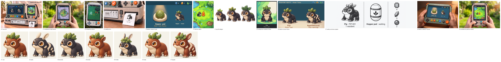

# Homepage concept art: generated candidates

Everything in this folder is a **generated candidate** for the shots in
[`../concept-brief-homepage.md`](../concept-brief-homepage.md). Nothing is accepted
yet, nothing is placed on the page, and every image is concept art: caption it so
("Concept art"; "Concept screen, not from the build"), never as a capture.

[`prompts.json`](prompts.json) holds every call: the brief's prompt verbatim, the
reference images and their roles, the model, the sizes, the result and its hashes.
[`manifest.json`](manifest.json) lists every file with dimensions and SHA-256, the
crop and keying steps behind the derivatives, and the caveats. `raw/` keeps the
unaltered JPEG the API returned for each kept candidate; `rejected/` keeps the
other attempts as PNG, named by shot and attempt.

Tool: Gemini API, `generateContent` with image output at 2K. Two image models were
available to the key and both were used: `gemini-3.1-flash-image` and
`gemini-3-pro-image`. Outputs are 2528×1696 JPEG (or the portrait equivalent),
resampled with LANCZOS to the brief's sizes and stored as PNG. The API offers no
transparent output, so L1's alpha is keyed from a flat white background.

**Where generation stopped.** During the second L1 attempt the API returned
HTTP 429, "Your project has exceeded its monthly spending cap". No shot got a third
attempt and L1 has a single attempt. Each other shot had two attempts, one per model
(H1 pass A had three).

**Second batch.** After the cap was raised, a second run with a hard budget of 8
calls produced the remaining shots: H1 pass C (the card string), D1, D2 and E1.
It used 7 calls (4 Flash, 3 Pro), one attempt per shot and one more only where the
first failed its checklist (H1 pass C, D1 and E1 each took two; D2 took one). Four
small layout images in `layout/` were sent as extra inputs in that batch: two flat
templates drawn with PIL (the Companion screen block with its HUD and bottom-line
strips; the Station band with its header strip) and two crops (the K1 card Pip and
the pass B e-paper panel). They are inputs, not candidates.

**Third batch.** After the homepage spec added S2, C3 and the V1–V7 Pip-species
variants to the brief, a third run with a hard budget of 11 calls (9 shots and at
most 2 retries) used all 11: 8 on Flash, 3 on Pro. Order: V1–V7 one attempt each
on Flash, with the accepted rich Pip attached to every call (and the pale-marked
Pip for V2 and V7); one variant retry went to V4, the worst failure; then S2 on
Pro (one retry) and C3 on Flash. The variants come back on a flat cream
background, keyed afterwards to the `-512.png` RGBA portraits the genealogy tree
uses; `tree-preview.png` tiles them beside the accepted Pip at the tree's two sizes
(160 px and 76 px) as a species-consistency check.

**Fourth batch.** The owner rejected L1's elder: the drooping leaves and half-lidded
eyes read as depressing. With a hard budget of 3 calls, one Pro call edited the kept
L1 raw output (`raw/L1-attempt1.jpg`) with the rich Pip attached as identity, changing
only the right-hand figure: eyes fully open, three deep-green leaves held up with
frosted tips, a small moss patch on the back as the only sign of age. It passed its
checklist, so no retry was made. The new file is `pip-life-stages.png` (keyed as
before); the first one is kept as `pip-life-stages-v1.png`. The L1 cell of
`contact-sheet.png` was re-pasted; `tree-preview.png` does not include L1.

## The candidates

| Shot | File | Kept attempt | Model |
| --- | --- | --- | --- |
| H1 `hero-kit` | `hero-kit.png` 1536×1024 | pass A attempt 3, pass B attempt 2, pass C attempt 2 | A: pro, B: flash, C: pro |
| C1 `companion-map-hands` | `companion-map-hands.png` 1536×1024 | attempt 2 | flash |
| C2 `companion-storm` | `companion-storm.png` 1024×1536 | attempt 2 | flash |
| K1 `caddy-print` | `caddy-print.png` 1536×1024 | attempt 1 | pro |
| S1 `station-research-pod` | `station-research-pod.png` 1024×600 (crop of `-canvas.png`) | attempt 1 | pro |
| P1 `partner-patch` | `partner-patch.png` 900×1200, `-450x600.png` (crops of `-canvas.png`) | attempt 2 | flash |
| L1 `pip-life-stages` | `pip-life-stages.png` 1536×1024 RGBA (`-v1.png` is the superseded first one) | attempt 3 (edit of attempt 1) | pro |
| D1 `companion-resident-home` | `companion-resident-home.png` 900×1200, `-450x600.png` (crops of `-canvas.png`) | attempt 2 | flash |
| D2 `station-known-forms` | `station-known-forms.png` 1024×600 (crop of `-canvas.png`) | attempt 1 | pro |
| E1 `caddy-summary-epaper` | `caddy-summary-epaper.png` 1600×479 (scaled and padded from `-canvas.png`) | attempt 2 | pro |
| S2 `station-research-hands` | `station-research-hands.png` 1536×1024 | attempt 2 | pro |
| C3 `companion-partner-hands` | `companion-partner-hands.png` 1536×1024 | attempt 1 | flash |
| V1 Rust | `v1-rust.png` 1024×1024, `v1-rust-512.png` RGBA | attempt 1 | flash |
| V2 Sable | `v2-sable.png` 1024×1024, `v2-sable-512.png` RGBA | attempt 1 (only one; fails) | flash |
| V3 Bramble | `v3-bramble.png` 1024×1024, `v3-bramble-512.png` RGBA | attempt 1 | flash |
| V4 Ember | `v4-ember.png` 1024×1024, `v4-ember-512.png` RGBA | attempt 2 | flash |
| V5 Thistle | `v5-thistle.png` 1024×1024, `v5-thistle-512.png` RGBA | attempt 1 | flash |
| V6 Moss | `v6-moss.png` 1024×1024, `v6-moss-512.png` RGBA | attempt 1 | flash |
| V7 Dapple | `v7-dapple.png` 1024×1024, `v7-dapple-512.png` RGBA | attempt 1 | flash |

`hero-kit-passA.png` is the pass A result (four-button Companion, new screen) that
pass B edited, and `hero-kit-passB.png` is the pass B result that pass C edited;
both are kept because C1, C2, K1 and E1 were generated against the pass B result,
so the device reference chain is on record.

## Checklist results per candidate

Judged at the size the page shows each image and, for screens, at 1×.

### H1 `hero-kit`
- Pass: Call sits directly above Back, both left of a visibly larger Confirm; Call is
  teal and ringed; the pad is on the left; speaker holes between; no extra controls.
  Shell labels CALL, BACK, CONFIRM are present, though CALL sits under the pad.
- Pass: Companion screen shows the HiBit clearing, "))) call Pip" top right,
  "✓ Bring Pip along" and "← menu" on the bottom line, spelled exactly.
- Pass: Station header "MINIATURE BEASTS / Research · Hopper pod", Data 4, Energy 5,
  Essence 2, footer "Findings saved"; Caddy e-paper "Hopper pod · waiting", counts
  4, 5, 2, "Pip · PIP-001", "1 resident"; Cached and Connections lines removed.
- Pass: Pip is plain-coated with cream belly, orange eyes and three leaves on all
  three devices.
- Pass (pass C): the printed card now reads "Pip · PIP-001" over the thin rule and
  the leaf mark; the printed Pip, PRINT and FEED labels and the card's curl are kept.
- **Fail (pass C drift):** the edit was asked to change nothing else, but the
  re-render drifted three strings: the Station header's "Essence" reads "Excence",
  the e-paper "Essence" reads "Exsence", and the Station subtitle "Hopper pod" reads
  "Happer pod". Counts, every other label and both creature portraits are intact.
  Rule 5 allows garbled screen strings to be set in the page instead; the owner
  may also prefer `hero-kit-passB.png` with the card string covered on the page.
- Rejected: pass C attempt 1 (flash) got the card right and kept "Essence" and
  "Adult", but garbled the PRINT button label to "PUINT" and the same "Hopper pod"
  to "Happer pod"; a wrong physical label cannot be fixed in the page, so the pro
  attempt was kept.
- Partial: outside the edits the render matches family-concept-v2 to the eye; small
  drift is visible on the Station header's original layout and the pad is drawn a
  little larger. The 50 % overlay check is for the owner.
- Rejected: pass A attempt 1 leaked the screen's bottom line onto the whole render
  and turned the pad teal; pass A attempt 2 drew no Back button; pass B attempt 1
  dropped the Station's "MINIATURE BEASTS" header line and garbled "call Pip".

### C1 `companion-map-hands`
- Pass: buttons follow rule 3 and the thumbs rest on the pad and on Confirm.
- Partial: seen cells (muted) and visited cells (white dots) read; **no cleared cell
  with a tick** is drawn. The dotted range square encloses 3×3 cells, not 5×5. All
  five signs read (paw prints, pulse arcs, bolt, pin, burrow).
- Pass: fog dominates and the revealed patch is small; the rain band is at the left.
- Pass: HUD "⚡5" and "))) pin 1"; bottom line "✓ Go down · wood · slow beat ·
  ← Wait · Send home", spelled exactly. The shield row shows two bright bars and one
  dimmed rather than three white.
- Minor: a ring on one finger, which the prompt excluded.
- Rejected: attempt 1 drew a Companion with no buttons at all; its map was the
  stronger one (all three cell states and all five signs), kept in `rejected/` as
  a screen reference.

### C2 `companion-storm`
- Pass: HUD reads as Shield 2 of 3, a filled pod outline and an empty one, a tiny
  Pip face, two storm bolts, "⚡5" and a teal "))) call" at the right.
- Pass: the charged stone, the warned tile (yellow outline with a bolt) and the
  shelter of the tree are each distinct; Pip stands beside the pawn under the tree.
- Pass: Pip matches the HiBit Pip (charcoal, cream belly, orange eyes, three leaves).
- Partial: it reads as a storm and is green rather than brown or grey, but darker and
  less playful than the brief asks.
- **Fail (minor):** a small purple-grey token at the left edge of the screen is an
  invented element (carried over from the prototype reference).
- Rejected: attempt 1 is more saturated and playful but its shield icon does not read
  as 2 of 3 and its bottom line wraps onto two lines.

### K1 `caddy-print`
- Pass: the printed Pip has the same silhouette, crown and plain coat as the screen
  Pip, in black dithered print on white only.
- Pass: the card says only "Pip" and "PIP-001" with a thin rule.
- Pass: no status lights; no Critter Lab mark; the Caddy matches the hero's Caddy
  (materials, PRINT and FEED, slot, e-paper beside it, docked bases in frame).
- Partial: the Dirty Pawz Press mark the prompt asks for is not visible in this
  crop, and the MINIATURE BEASTS embossing sits outside the frame. (The checklist's
  "no marks other than MINIATURE BEASTS" line conflicts with rule 4 and the prompt;
  the brief should say which it means.)
- Rejected: attempt 2 re-rendered the whole kit, greyed out the Station screen,
  lifted the Companion off the dock with a blank screen and floated the card in
  mid-air with two Dirty Pawz Press marks.

### S1 `station-research-pod`
- Pass: the sealed pod is the subject, in a padded cradle under a warm pool of light,
  with the three-leaf mark; nothing inside is shown.
- Pass: "Hopper pod", amber "Needs 2 more Essence", "Hopper · known" and the counts
  4, 5, 2 read at 1024×600.
- Pass: Pip matches the rich Pip (plain coat, cream belly, orange eyes, three
  leaves, three-quarter pose facing viewer-left).
- Pass: no tables, lab glassware or report look; it reads as a game screen.
- Note: the model placed the header bar in the canvas's top margin, so the
  1024×600 crop is the top 900/1024 band of the canvas, not the centred band.
- Rejected: attempt 2 is close (olive pod in a bowl cradle, Pip in a tile); the kept
  one follows the prompt's pod colour, cradle and spot light more closely.

### P1 `partner-patch`
- Pass: Pip reads as the HiBit Pip at 450×600, 1× (`partner-patch-450x600.png`).
- Pass: the Call ring around the pawn, the glinting soil and Pip beside the pawn
  read as one moment; Pip looks up at the pawn.
- Partial: the HUD (three shield bars, two pod outlines, tiny Pip face, "⚡3",
  "))) call") and the bottom line ("✓ Dig here · meadow · ← Wait · Leave") follow
  rule 5 and are spelled exactly, but the model drew them on the dark margin
  **outside** the 900×1200 block. The cropped screen therefore holds the scene only;
  see `partner-patch-canvas.png` for the HUD and bottom line as generated.
- Minor: the buried pod is drawn visibly in the soil rather than only as a glint;
  the pixel grid is generated, not an exact 2× of 450×600.
- Rejected: attempt 1 filled the whole canvas with the screen (no 3:4 block to
  crop), drew the dew cups as large bowls and its HUD's Pip face as a white blob.

### L1 `pip-life-stages`
Fourth batch: `pip-life-stages.png` is attempt 3, a Pro edit of attempt 1 that changed
only the elder; attempt 1 is kept as `pip-life-stages-v1.png`.
- Pass: coat, cream belly, orange eyes and three crown lobes are the same in all
  three; no added marks, horns or tails. The elder's only sign of age besides
  proportion is a small muted-green moss patch on its upper back.
- Pass: age reads from proportion and bearing: the juvenile is smaller and rounder
  with larger eyes and bright buds; the elder is heavier and lower-set with broader,
  deeper green leaves held up, their tips lightly frosted.
- Pass (the owner's note): the elder reads as calm and dignified, not sad. Both eyes
  are fully open and bright with the adult's cream rings, and it has the same small
  smile; nothing droops.
- Pass: the juvenile and adult are the attempt 1 figures. Against the attempt 1 raw
  output, 0.25 % of pixels in the left third and 0.69 % in the middle third differ by
  more than 24 levels (JPEG re-encode noise); the elder's third differs by 13.9 %.
- Partial (carried over): the adult is close to the rich Pip but not an exact copy;
  the three figures are not confined to equal 512×1024 cells. The elder's crown is
  drawn larger than the adult's, and the elder is not visibly lower-set than before.
- Pass: transparent alpha with no halo (keyed from a flat white background; canvas
  corners are alpha 0). This is keyed, not generated, alpha.
- Rejected by the owner: attempt 1 (`pip-life-stages-v1.png`), whose elder had
  drooping leaves and half-lidded eyes. Attempt 2 was refused by the spending cap.

### D1 `companion-resident-home`
- Pass: Pip reads as the HiBit Pip at 450×600, 1× (`companion-resident-home-450x600.png`):
  plain coat, cream belly, orange eyes with cream rings, tiny smile, three leaves.
  The crown leaves are drawn larger than the source's and the backdrop is a soft
  green and cream wash rather than clover tufts on grass, though two clovers are there.
- Pass: the HUD shows three shield bars (two white, the third half dim), two empty
  pod outlines, a tiny Pip face, "⚡5" and a teal "))) " Call slot, with the far
  right left as an empty dark slot and no battery or connectivity glyph.
- Pass: "Pip", "Plain coat", "✓ Spend time together", "home" and "← Menu" are
  spelled exactly and nothing else is written.
- **Fail:** everything is not inside the 900×1200 block. As with P1, the model drew
  the HUD and the bottom line on the dark margin around the picture, even with the
  layout template as an input, and "home" dropped under the bottom line. The
  900×1200 crop therefore holds the scene and the two labels only; the HUD and
  bottom line are in `companion-resident-home-canvas.png`.
- Rejected: attempt 1 (no layout template) put the HUD and bottom line outside the
  block too, wrapped the bottom line onto two lines at twice the size, and set
  "home" and "← Menu" on a second row.

### D2 `station-known-forms`
- Pass: both figures share silhouette, cream belly, orange eyes with cream rings and
  exactly three leaves; the only difference is the cream islands on the right one's
  back and flanks. No horns, tails or colour changes.
- Pass: the pale one is labelled "Hypothetical" / "Pale markings" and the plain one
  "Pip" / "Plain coat"; the plain one matches the rich Pip's pose and treatment.
- Pass: header "MINIATURE BEASTS · Known forms" with chip 4, crystal 5, droplet 2,
  inside the band; all four quoted strings read at 1024×600; no genotype letters.
- Pass: it reads as a designed game screen, not a lab report; teal-blue backdrop,
  sand floor, no symbols between the figures.
- Partial: the prompt asks for the two figures facing each other; both face
  viewer-left in the same pose. The model inset the screen on all four sides, so the
  1024×600 crop is the inset band, trimmed to 1024:600 at the empty floor.
- One attempt (pro); it passed, so no second attempt was made.

### E1 `caddy-summary-epaper`
- Pass: four greys to the eye (white, light grey, dark grey, black) with ordered
  dither for shading; no hue. Measured on the raw JPEG, one percent of pixels carry
  faint chroma noise and the edges are anti-aliased, so it is not a literal
  four-value image.
- Pass: the e-paper Pip has the card Pip's silhouette, three-leaf crown and plain
  coat, in black, dark grey and white with dither.
- Pass: "Pip · PIP-001", "1 resident", "Hopper pod · waiting" and the counts 4, 5, 2
  with chip, crystal and droplet icons are spelled exactly; thin dark rules divide
  the three areas; no Cached, Connections, clock, QR or marks of any kind.
- Partial: the model filled the whole 21:9 canvas instead of the centred 1600×479
  band, so `caddy-summary-epaper.png` is a uniform scale of the canvas padded with
  paper white at the sides (nothing redrawn); the counts column sits at the right
  as on the Caddy, but the three areas are spaced more widely than the Caddy's panel.
- Rejected: attempt 1 (flash, with the K1 photograph and the hero render as inputs)
  returned a blurred photograph of the dock with a card, not a flat screen.

### S2 `station-research-hands`
- Pass: the Station is the H1 Station: sage shell, screws, the cross at left, the
  four square HOME / RESEARCH / LIBRARY / HABITAT buttons with their small lights,
  one round dark Back with `←`, one larger orange Confirm with `✓`, MINIATURE
  BEASTS on the top bezel; held in two hands at a wooden table in warm lamp light,
  no other device.
- Pass: the S1 screen fills the display edge to edge and reads at page size: the
  sealed pod in its cradle under the pool of light, "Hopper pod", amber "Needs 2
  more Essence", small Pip with "Hopper · known", header chip 4, crystal 5,
  droplet 2, every string spelled exactly.
- **Partial:** the corner bumpers are orange, where H1's Station has charcoal
  bumpers with a small orange accent. The owner may prefer to accept the drift or
  ask for a shell-only edit pass.
- Rejected: attempt 1 (pro) had the right charcoal bumpers and the same exact
  strings but drew two round Back buttons; a wrong physical control cannot be fixed
  in the page, so the retry went here.

### C3 `companion-partner-hands`
- Pass: the HUD (three shield bars, two pod outlines, tiny Pip face, "⚡3", teal
  "))) call") and the bottom line ("✓ Dig here", "meadow", "← Wait · Leave") are
  inside the screen block, top and bottom, nothing on the bezel; the P1 problem is
  fixed in the device render.
- Pass: buttons follow rule 3: pad at left, speaker holes, teal ringed Call directly
  above dark Back, both left of the larger orange Confirm; thumbs on the pad and on
  Confirm; shell, bumpers, strap and bezel wordmark as in C1; a brighter morning
  garden behind.
- Pass: the scene is the P1 meadow: Pip beside the pawn inside the teal ring, the
  glinting dig patch, pond edges, the flowering bush, dew cups; Pip reads as the
  HiBit Pip.
- Minor: a stray "·" before "meadow" on the bottom line; C1's finger ring is kept
  from the source render.
- One attempt (flash); it passed, so no retry.

### V1–V7 Pip-species variants
Judged on `tree-preview.png` at 160 px and 76 px and on the `-512.png` portraits.
Common to all seven: same three-quarter pose facing viewer-left, same upper-left
light, same sculpted ceramic treatment, cream belly, orange eyes with cream rings,
tiny smile; the flat cream background keyed with no halo and the contact shadow
kept as partial alpha; the species reads as one at both sizes.
- V1 Rust: pass. Russet coat, short rounded ears, three leaves, nothing else changed.
- V2 Sable: **fail.** Cream pale islands on back and flanks (as the pale-marked
  reference) and long upright ears are right, but the model dropped the three leaf
  crown lobes entirely. The one variant retry went to V4, whose first attempt was
  worse; Sable needs a second attempt in a later batch (ask to keep the leaves, as
  the V4 retry did).
- V3 Bramble: pass. Five leaf lobes; visibly heavier and broader body; charcoal,
  plain coat.
- V4 Ember: pass on attempt 2. Russet coat, short ears, three leaves, ceramic
  surface. Rejected attempt 1 lost the leaves and came back felted rather than
  sculpted. Ember and Rust are near-identical by design (the spec gives them the
  same visible traits).
- V5 Thistle: pass. Five leaves drawn as a wreath, long upright ears, a smaller
  lighter body; charcoal, plain coat.
- V6 Moss: pass. Russet coat, three leaves curled at the tips, heavier body.
- V7 Dapple: pass. Russet coat with cream islands, long upright ears, five leaves.
- Limit for the whole set: each portrait is a separate generation, so the size
  traits (+20 %, −15 %, +15 %) are not measurable between files and
  `tree-preview.png` fits every figure to the same cell; the page must scale those
  three portraits if size is to read. The returned background is a flat warm cream
  near (244, 237, 224) rather than #f5f2e9; the keying uses the measured colour.

## Limits

- Generated pixel-style screens are resampled 2K outputs, not authored native
  450×600 masters; a production renderer still has to draw the real HUD and bottom
  line from the design.
- Device renders show the devices as designed as far as the model followed the
  prompt; the checklist lines above say where it did not.
- The brief-size E1 file is scaled and padded, not generated at 1600×479; the D1
  and D2 screens are crops of a larger canvas, as recorded in `manifest.json`.
- Spend: first batch 17 calls (one refused by the cap); second batch 7 calls of the
  8 allowed, 4 on `gemini-3.1-flash-image` and 3 on `gemini-3-pro-image`; third
  batch 11 calls of the 11 allowed, 8 Flash and 3 Pro; fourth batch (L1 elder redo)
  1 call of the 3 allowed, on Pro.
- The variant portraits' alpha is keyed from a flat background, not generated;
  `v2-sable` fails its checklist (no leaf crown) and has only one attempt.
- Nothing here establishes a runtime, a renderer or hardware behaviour.
