# The genome stamp, styled: concept candidates

The stamp's cells are the encoder's and never move; this folder styles what the prototype's README allows around and within them (paper, the perforation's shape, the cell ink's shape, the clan border's ink and silhouette, the glyph halo, copy hues, chapter tints, unread hairlines) and shows the stamp in its three homes: the research bench, the Library's botanical tome and the Caddy's thermal paper. The brief is [`brief-stamp.md`](brief-stamp.md). **Every candidate was run through the prototype's decoder** (`node prototypes/genome-stamp/decode.mjs`); a candidate that does not decode is rejected. Decoder output per candidate is in [`decode/`](decode/), the one-line results in [`decode/results.txt`](decode/results.txt).

**How it is made.** [`tools/style-stamp.mjs`](tools/style-stamp.mjs) imports the prototype's frames and codec, so the dark/light pattern is the encoder's cell for cell, and re-dresses the marks: one engraved family per clan (Trebola: leaf-tipped rounded cells and diamond perforations in moss ink; Fanalia: cut-corner lantern cells and round dots in umber; an unassigned future species: plain graphite), copy 1 in lagoon blue and copy 2 in brick red with pale tints for zero, chapter tints keyed by chapter name so Coat is the same tint on every species, hairline outlines for unread blocks, a light halo behind the glyph corner (clipped to the 5×5 at 17×17), warm cream paper for the tome and a cool pale plate for the bench. [`tools/render-svg.cjs`](tools/render-svg.cjs) rasterizes the SVG with Chromium. The Caddy label ([`tools/caddy-label.py`](tools/caddy-label.py)) uses the encoder's own 20 mm monochrome print untouched, a rule and the code; nothing else and no name. The tome and bench surroundings are **generated** (prompts and hashes in [`prompts.json`](prompts.json)), and the real stamp is composited into their empty centre by [`tools/composite-plate.py`](tools/composite-plate.py); the composite is what gets decoded. Nothing styled is drawn by hand; nothing generated carries a cell.

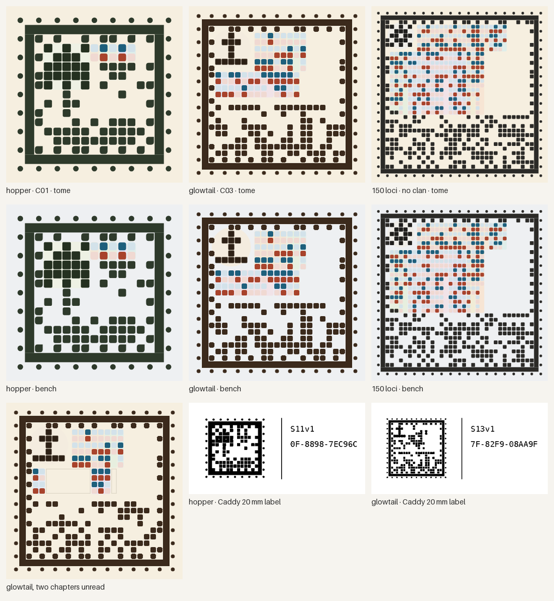

*The styled faces. Row 1: tome paper; row 2: bench plate; row 3: the glowtail with two chapters unread, and the Caddy labels. Every one decodes. The faces are encoder cells, styled in code, not generated.*

## Decode results

| Candidate | Size | Decodes | Code |
| --- | --- | --- | --- |
| hopper · Trebola · tome paper | 300 px (17×17) | yes | `S11v1-0F-8898-7EC96C` |
| hopper · Trebola · bench plate | 300 px | yes | same |
| glowtail · Fanalia · tome paper | 300 px (25×25) | yes | `S13v1-7F-82F9-08AA9F` |
| glowtail · Fanalia · bench plate | 300 px | yes | same |
| glowtail, two chapters unread · tome and bench | 300 px | yes | `S13v1-37-FAC1-07667D` |
| 150 loci · unassigned · tome paper | 300 px (37×37) | yes | `S22v1-FF-20AC-66DBCD` |
| 150 loci · unassigned · bench plate | 300 px | yes | same |
| hopper, glowtail, 150 loci · bench plate | 120 px | yes | each its own |
| hopper, glowtail, 150 loci · Caddy 20 mm print (203 dpi, bilevel) | 160 px | yes | each its own |
| hopper, glowtail, 150 loci · Caddy 58 mm label | 160 px stamp | yes | each its own |
| hopper, 150 loci on the Trebola plates; glowtail on the round-2 Fanalia plates (composites) | 512 px stamps in 1024 px plates | yes, default search | each its own |
| glowtail Caddy label warped onto the photographed strip | about 330 px stamp, tilted | yes | `S13v1-7F-82F9-08AA9F` |
| glowtail on the round-1 Fanalia plates | 430 px stamp | **no** (a1: grid not found; a2: only with the full search) | plates rejected |

## The surroundings: generated, then the real stamp placed

Nine generations (of 16 allowed), all on Pro: round 1 with two trefoil plates for Trebola, two lantern plates for Fanalia, one thermal-paper strip for the Caddy and two style references; round 2 with two more Fanalia plates after the first two failed the decode test. The real styled stamp is composited into each plate's empty centre; the composite is what the decoder reads.

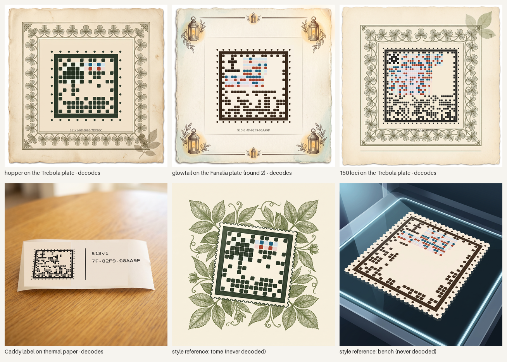

*Row 1: the three tome composites, each decoded. Row 2: the Caddy label warped onto the photographed strip (decoded), and the two style references, which are illustrations and were never decoded. Concept art, generated surroundings with real stamp faces.*

<table>
<tr>
<td align="center" valign="top">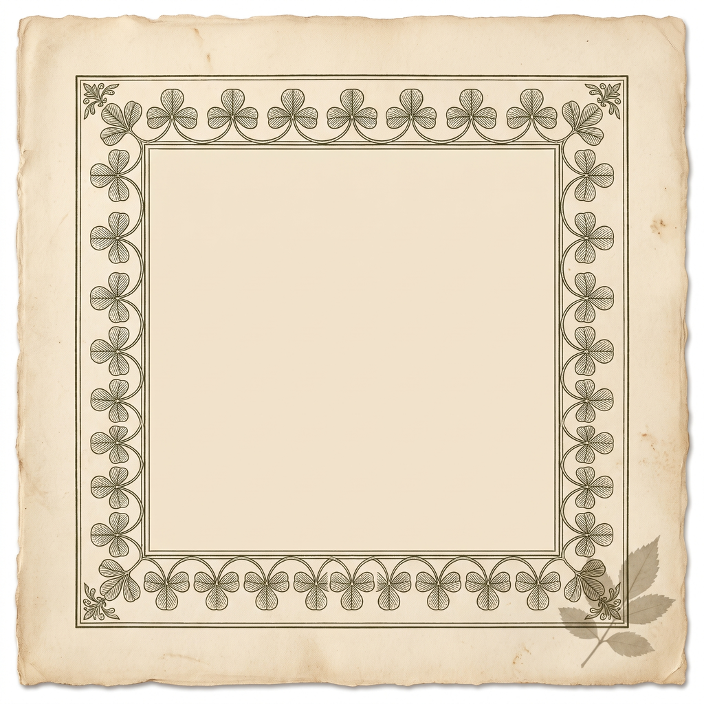 <em>ST-T-r1-a1: Trebola plate, trefoil border. Kept, recommended.</em></td>
<td align="center" valign="top">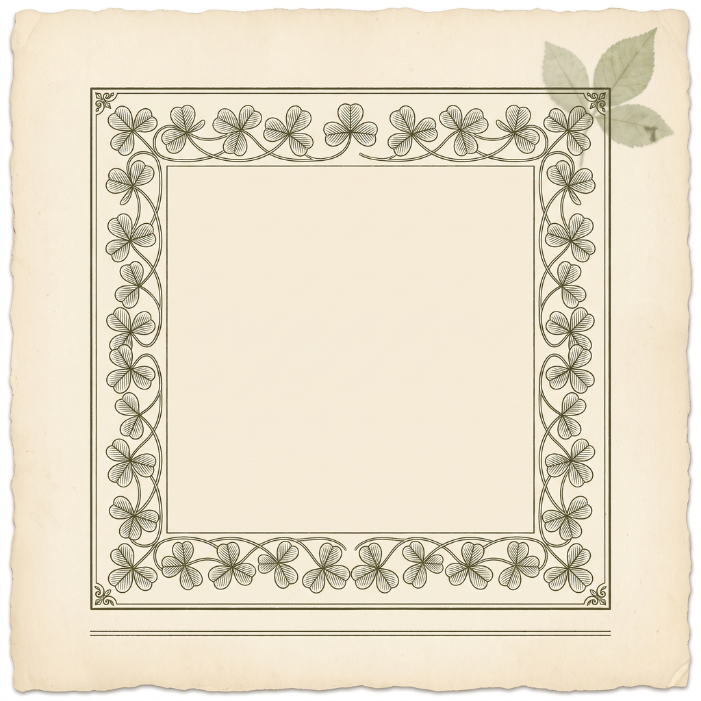 <em>ST-T-r1-a2: Trebola plate, lighter border. Kept as alternative.</em></td>
<td align="center" valign="top">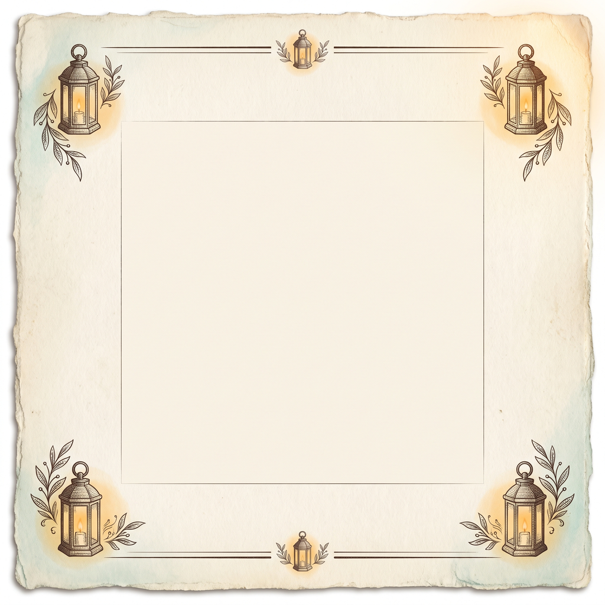 <em>ST-F-r2-a1: Fanalia plate, round 2, lanterns at the corners. Kept, recommended.</em></td>
</tr>
</table>

**Trebola plates.** Both are herbarium plates with an engraved trefoil border in moss ink on deckled cream paper and a clean inner square; a1 adds a pressed leaf in the corner and a heavier frame, a2 a rule under the frame. The hopper stamp sits at half the width inside either; both composites decode. a1 is recommended: its border is denser and reads as one family with the stamp's leaf-tipped cells and diamond perforations.

**Fanalia plates, round 1: both rejected by the decoder.** a1 drew the plate as an open book on a blue-grey table and a2 a flat deckled page, each with a dense lantern border inside a double rectangular frame. Both look right for the tome and both fail the test that matters: with the glowtail stamp at a safe size, a1 returns "grid not found" ([composites/rejected-glowtail-on-ST-F-r1-a1.png](composites/rejected-glowtail-on-ST-F-r1-a1.png)) and a2 decodes only when the reader is told to try every candidate square, not with its default search ([composites/glowtail-on-ST-F-r1-a2.png](composites/glowtail-on-ST-F-r1-a2.png)). The nested engraved frames are square candidates that the reader tries before the stamp. That is the brief's rule made concrete, and sharper than written: a plate must not put rectangular frames around the stamp at all, not only keep clear of its quiet margin.

<table>
<tr>
<td align="center" valign="top">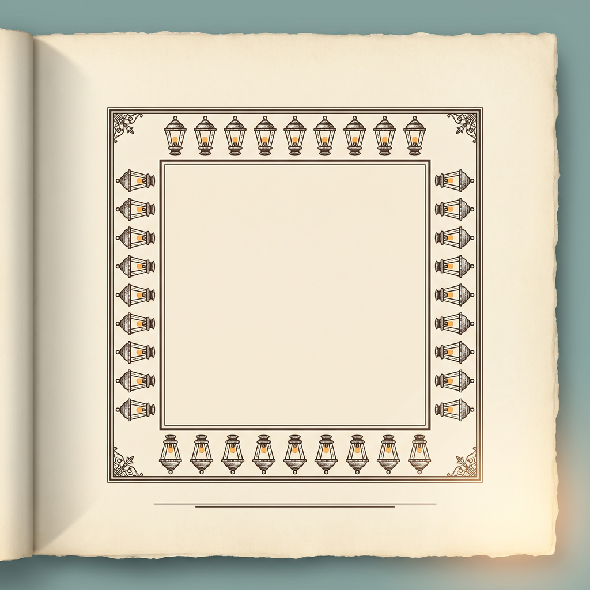 <em>ST-F-r1-a1: rejected (grid not found; off-vibe table).</em></td>
<td align="center" valign="top">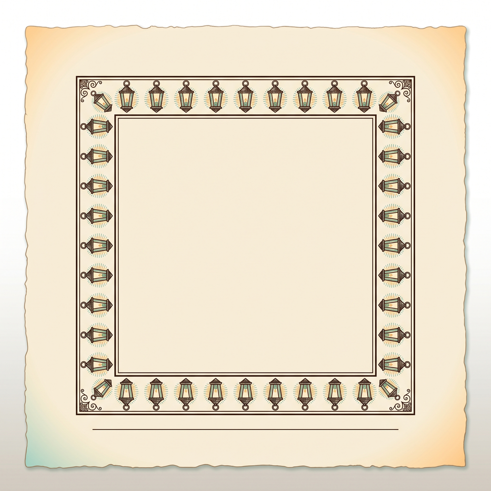 <em>ST-F-r1-a2: rejected (decodes only with the full candidate search).</em></td>
<td align="center" valign="top">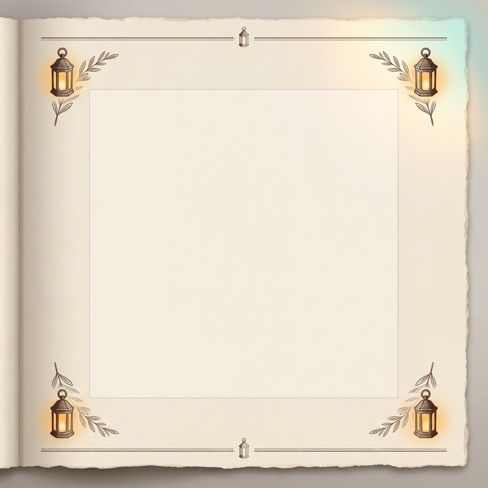 <em>ST-F-r2-a2: round 2 on an open book. Kept as alternative; decodes.</em></td>
</tr>
</table>

**Fanalia plates, round 2.** The prompt dropped the inner frame and the lantern border and asked for lanterns at the four corners and one rule top and bottom. Both attempts decode with the default search; a1, a deckled page with watercolour-warm corners, is recommended, a2 (the same on an open book) the alternative. The two Trebola plates passed the default search in round 1 because their border is a vine, not a frame of boxes.

**The Caddy strip.** A photograph of blank 58 mm thermal paper on a table with its left third flat. The monochrome label (the encoder's 20 mm print, a rule, the code) is warped onto the paper in perspective ([tools/composite-strip.py](tools/composite-strip.py)); the decoder reads it through the tilt.

**Style references.** R-a1 illustrates the real hopper face as a stamp among engraved leaves; R-a2 as a label on the lab's dark glass plate. Neither is decodable (the model redraws cells), and neither is a candidate; they show the owner how the stamp can feel in each room and they guided the perforation and ink choices in the code.

## Recommended

<table>
<tr>
<td align="center" valign="top">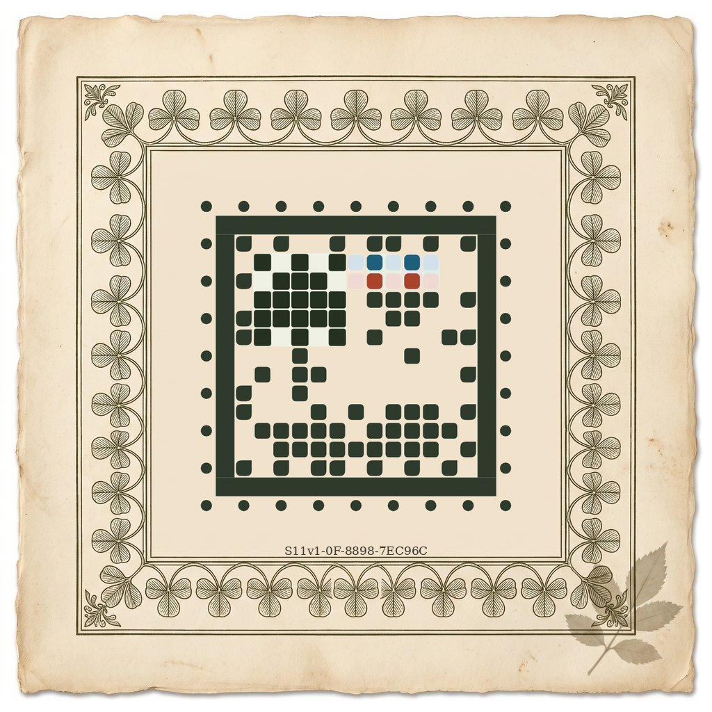 <em>Tome: the hopper stamp on the Trebola plate. Decodes: S11v1-0F-8898-7EC96C.</em></td>
<td align="center" valign="top">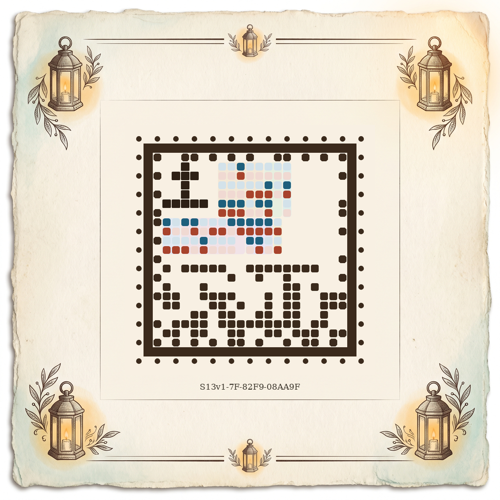 <em>Tome: the glowtail stamp on the round-2 Fanalia plate. Decodes: S13v1-7F-82F9-08AA9F.</em></td>
</tr>
<tr>
<td align="center" valign="top">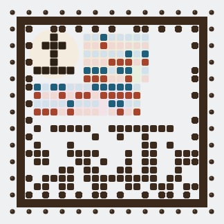 <em>Bench: the glowtail face on the cool plate, 300 px. Decodes.</em></td>
<td align="center" valign="top">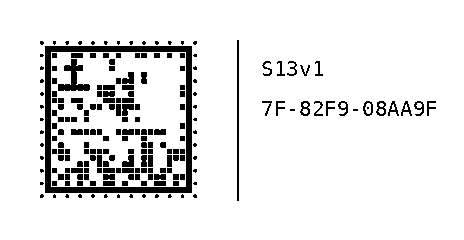 <em>Caddy: the 58 mm label, 20 mm stamp in plain dots, rule and code. Decodes.</em></td>
</tr>
</table>

The styling system in `tools/style-stamp.mjs` is the recommendation: one engraved family per clan (leaf cells and diamond perforations for Trebola, cut-corner lantern cells and round dots for Fanalia, plain graphite for a species without a clan yet), copy 1 lagoon and copy 2 brick with pale zeros, chapter tints by name, unread blocks as hairlines, a light glyph halo, cream for the tome and a cool plate for the bench, plain black dots on the Caddy.

Checklist from the brief (section 8):

- [x] 1. Decodes with the prototype's decoder: every Station render, every kept composite, every 20 mm print and label.
- [x] 2. No cell moved: the geometry comes from the encoder's `encodeCells`; only shapes, hues and paper change.
- [x] 3. Reads as a stamp at a glance: perforation, frame, border, glyph corner.
- [x] 4. One family per clan across sizes 17 to 37 (the neutral family stands in for species without a clan).
- [x] 5. Copy colours mean copy 1 and copy 2; pale means zero; empty means unread.
- [x] 6. Chapter tints consistent across species, keyed by chapter name.
- [x] 7. Fine in one colour: every ink greys dark, every tint light (the 20 mm prints are the proof).
- [x] 8. The Caddy label is plain and 20 mm: black dots, a rule, the code.
- [x] 9. No name baked in: the code only, on the Caddy label and the tome caption.
- [x] 10. The tome plates fit the botanical tome; the bench plate is a quiet cool label.

## Limits

- The plates are generated and composited; the pressed-specimen caption face is a stand-in (DejaVu Serif), not the tome's chosen face.
- The 150-loci stamp has no clan, so it wears the neutral family and sits on a Trebola plate only to show scale; its own plate waits for its clan.
- Plates are decode-tested with the reader's default search, which tries the five likeliest squares; a plate with rectangular frames around the stamp can pass only with the full search, and is rejected here. Plate templates need a measured quiet margin and no nested frames.
- The perforation and border shapes are tested on screen and at 203 dpi prints only through the prototype's own pipeline; a real print of the styled face is not needed, since the Caddy prints plain dots.

## Three questions for the owner

1. **Diamond or round perforations for Trebola?** The diamond dots make the clan family stronger, but they are the one place the stamp edge departs from a classic round perforation. Keep per-clan perforation shapes, or keep perforations round everywhere and let the border cells alone carry the clan?
2. **Copy hues: lagoon and brick, or the game's Data blue and Essence green?** The current pair is chosen to grey dark and stay apart; tying copy 1 and copy 2 to the counters' hues would mean something to the player but one of them would have to darken.
3. **Which chapter gets amber?** The tints are keyed by chapter name; none uses amber, which Home reserves for "needs you". Should a glinting chapter's block carry a faint amber tint on the stamp too, or does the glint stay on the pod list only?
