# Station Home: generated concept candidates

> **Names.** The species this folder calls the hopper, the puffcap and the glowtail are now **Loika** (clan Lophessa), **Untuva** (Kausida) and **Tuikis** (Stilbera). Captions use the new names; file names, prompts and quoted briefs keep the earlier words.

Everything in this folder is **generated concept art** for the Station's Home screen, made in rounds against [`brief-home.md`](brief-home.md) and the style guide's Home section ([design/style-guide/station-screens.md](../../design/style-guide/station-screens.md)). Nothing is a build capture, nothing is an authored master, and nothing is accepted until the owner says so. Caption every use as "Concept art, generated".

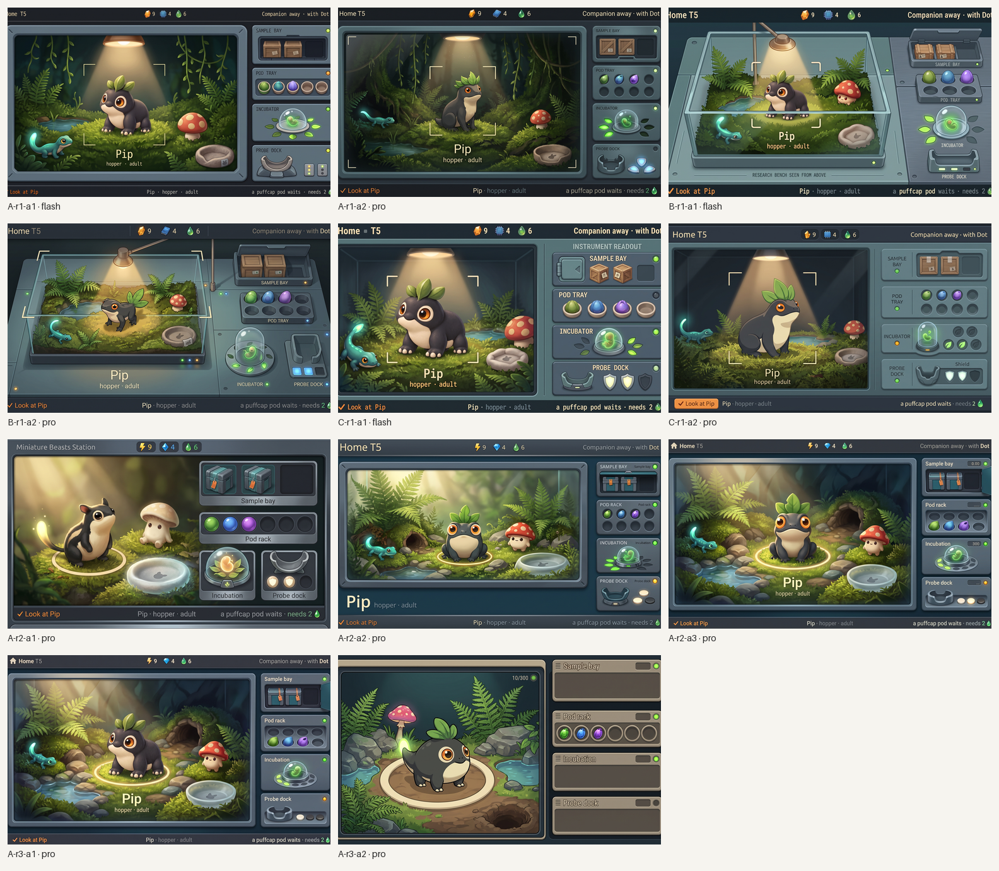

*All candidates, every round, 1024×600 each. Concept art, not accepted.*

**The brief in one breath.** Home is the always-on view: a research instrument holding one living window. The vivarium takes the left two thirds and is the only warm light on the screen; residents in the matched rich Miniature Lives treatment keep their routines, the focused one lifted under a cream ring. The right third is a column of four instrument modules, each a drawn object with a status lamp and a few-word readout: the sample bay with sealed crates, the pod rack with six wells, the incubation chamber with its ring of leaves, the Probe dock with its Shield plates. Cool chrome, clean painted light as in the approved `station-research-hands` concept, nothing wooden, nothing felt, no lamp-lit bench. The top bar carries the turn, the three counters and the Companion's state; the bottom line says what ✓ does, what is focused and what needs you.

**Where the brief and the guide differed, the guide won** (bolt, diamond and drop icons; no wood or felt; cream ring instead of brackets; daylight instead of a lamp cone). The brief's section 7b lists the differences. Round 1 was dispatched before the guide arrived and shows the older choices.

**Next screens, same process:** [Pods](pods/README.md) (the trait windows and the whorl, as a modern digital lab; recommended `pods/round3/P-D-r3-a2`) and [Dock and arrival](dock/README.md) (the arrival playing on this Home; recommended `dock/round3/D-E-r3-a1`). Each folder has its own brief, prompts.json, contact sheet and owner questions. Both were rejected by the owner once the research loop was designed; the Pods screen is redone on the loop in [Pods v2, Pod list and Read](pods-v2/README.md) (recommended `pods-v2/placed/PV-D-r3-a4-stamped-1024x600.png`, with the real genome stamp placed and decoded), and the stamp's own styling lives in [art/concept-stamp](../concept-stamp/README.md). After the owner's Pods decisions, the bench continues with [Create, the review](create/README.md) (recommended `create/placed/CR-C2-stamped-1024x600.png`, a composite of one-change edits with the real stamp placed and decoded) and the [Incubator](incubator/README.md) (recommended `incubator/placed/IN-D-r1-a3-stamped-1024x600.png`, with the ready frame as a composite). The tome room follows with the [Library](library/README.md) (recommended `library/placed/LB-D-r3-a2-fit-stamped-named-1024x600.png`, with the real stamp on its tome plate and the species name as a placed text layer). The owner kept the book and rejected the shelf, so the Library became two screens: the [Cabinet](library-cabinet/README.md) (recommended `library-cabinet/placed/CB-B-r2-a1-pip-named-1024x600.png`, with Pip and the names placed) and the book reworked to the full screen.

[`prompts.json`](prompts.json) holds every call in the homepage file's schema: prompt verbatim, references and their roles with hashes, model, sizes, the result's hashes and its disposition. Each round folder keeps `raw/{tag}.jpg` byte-exact, `{tag}-canvas.png` (the 16:9 canvas at 1536×864) and `{tag}-1024x600.png` (the screen: the centred 1024:600 band, 2 percent bleed trimmed each side) with a JSON sidecar per call. [`layout/`](layout/) holds the two flat layout inputs sent to the generator: the brief's wireframe rendered at 1024×600 and a block template; they are inputs, not candidates.

Tool: Gemini API, `generateContent` with image output, 16:9 at 2K (2752×1536 JPEG), `gemini-3.1-flash-image` for the layout round and `gemini-3-pro-image` for the refinements, references attached as inline images each preceded by its role. The exact call pattern is the one recorded in [`../concept-homepage/prompts.json`](../concept-homepage/prompts.json).
## Round 1: three directions, two models each

Judged against the brief's checklist and the style guide's "Pass when" list, at 1024×600.

<table>
<tr>
<td align="center" valign="top">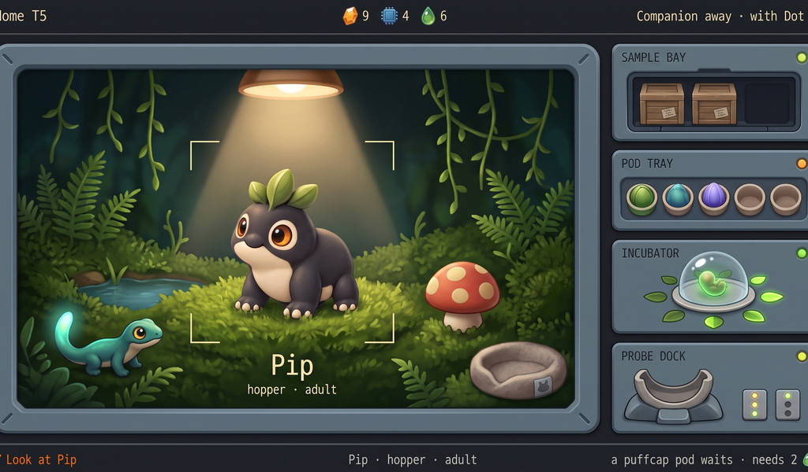 <em>A-r1-a1 (flash). Round 1 pick. Kept: edit target for round 2.</em></td>
<td align="center" valign="top">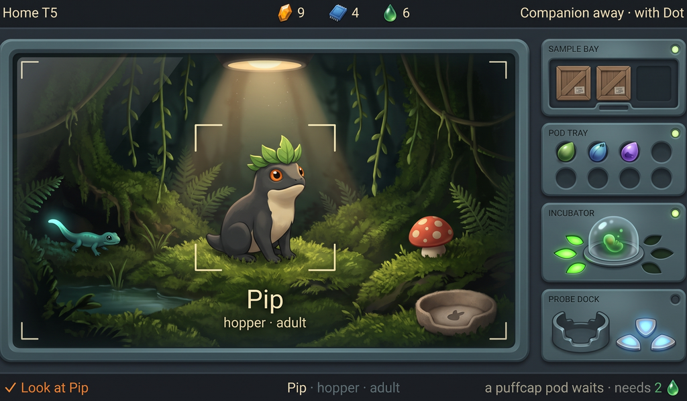 <em>A-r1-a2 (pro). Kept as a light and type reference; Pip's pose is wrong.</em></td>
</tr>
</table>

**A instrument-window.** The brief's layout as drawn: bezelled vivarium window, slate module column, lamps, all strings spelled right in both attempts.
- Pass: reads as an instrument holding something alive; cool chrome, one warm window; the four modules read by shape; top bar and bottom line in place; Pip in a1 is the rich Pip (squat, cream belly, orange eyes with cream rings, three leaves) at about 300 px.
- Fail (guide): wooden crates in the bay, a felt bed, a lamp fixture drawn at the top of the window, corner brackets instead of a cream ring, the concept's chip and crystal icons instead of bolt, diamond and drop.
- Fail: the Untuva is a plain mushroom, not a mibi; a1 has five wells, a2 eight; a2's Pip sits upright and slim, a different pose from the reference.
- Minor: module labels are engraved caps that lean toward title bars; a2's Probe dock has no cradle.

<table>
<tr>
<td align="center" valign="top">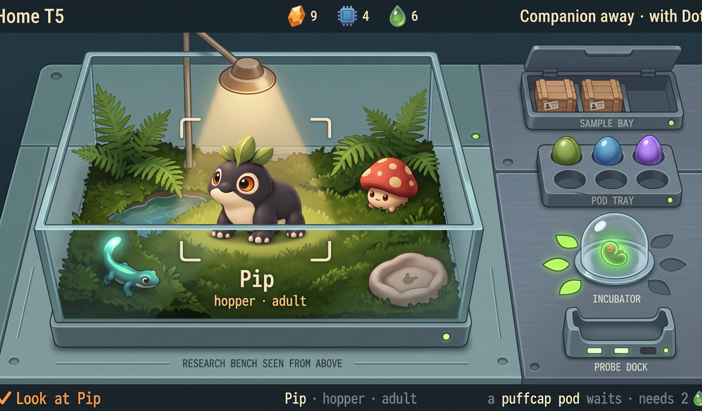 <em>B-r1-a1 (flash). Rejected.</em></td>
<td align="center" valign="top">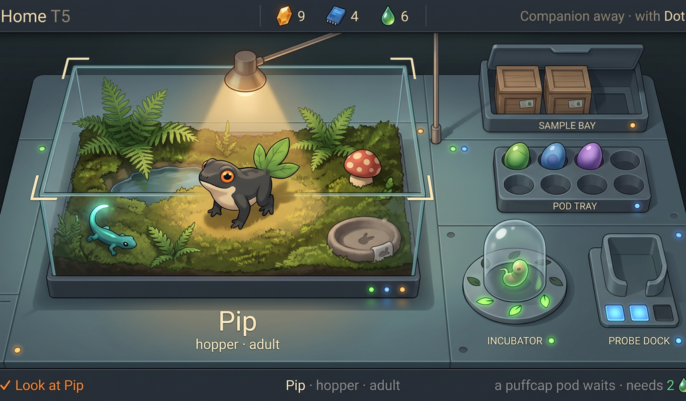 <em>B-r1-a2 (pro). Rejected.</em></td>
<td align="center" valign="top">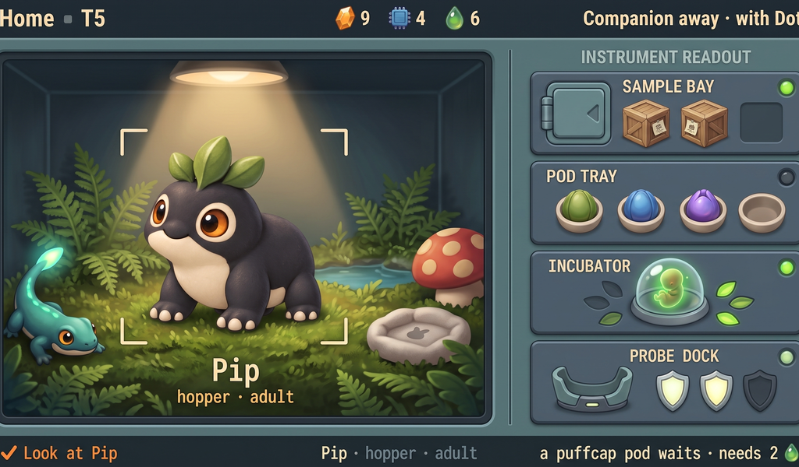 <em>C-r1-a1 (flash). Rejected.</em></td>
</tr>
</table>

**B bench-above.** Rejected as a direction. Both attempts are the lamp-lit bench with a desk lamp on an arm that the style guide rules out ("never a cottage: no lamp-lit bench"), even in cool slate. a1 also leaked the instruction "RESEARCH BENCH SEEN FROM ABOVE" onto the bench and clipped the top-right and bottom-right strings; a2 draws Pip as a frog in side view. The pod and incubator objects in a2 are the best-modelled of the round and are worth stealing later.

**C two-pane.** Rejected as a direction. The right pane became a labelled readout with a title ("INSTRUMENT READOUT") and bold module titles, the panel-with-title-bar look the owner rejected in the engineers' mock-up. a1's Pip is a faithful rich Pip; a2's is the frog pose again, with eight wells, a "Shield" caption and a boxed orange Confirm button, which the kit forbids. The split gives the vivarium only half the width.

**Choice.** Direction A. Round 2 keeps a1's composition and Pip and applies the guide: slate-and-teal crates with orange seal tags, a frosted-glass nest, warm daylight instead of a lamp fixture, a cream ring, six wells, an Untuva mibi, bolt, diamond and drop icons, an empty cradle with Shield plates.
## Round 2: three refinements of A, all on Pro

The guide's Home section arrived between the rounds, so round 2 also carries its changes: slate-and-teal crates with orange seal tags, a frosted-glass nest, warm daylight in place of the lamp fixture, a cream ring, bolt, diamond and drop icons, module names "Sample bay", "Pod rack", "Incubation", "Probe dock".

<table>
<tr>
<td align="center" valign="top">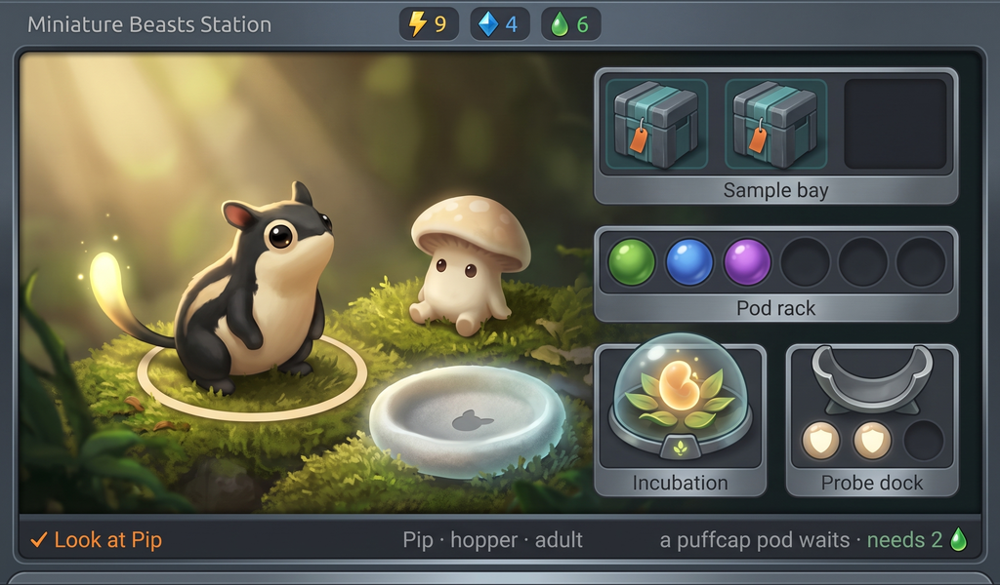 <em>A-r2-a1 (pro, edit of A-r1-a1). Rejected: the edit drifted.</em></td>
<td align="center" valign="top">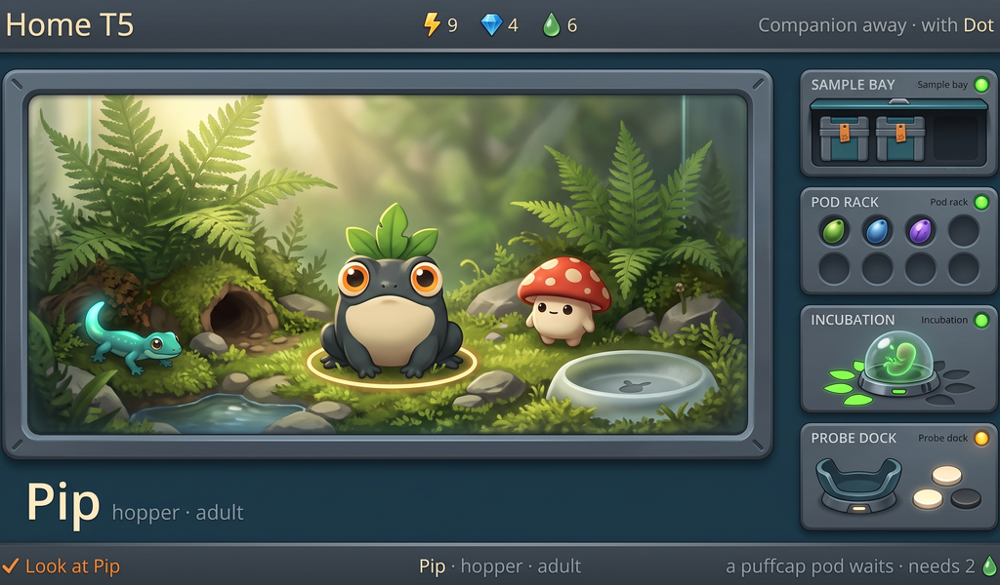 <em>A-r2-a2 (pro, fresh, A-r1-a1 as composition reference). Runner-up.</em></td>
<td align="center" valign="top">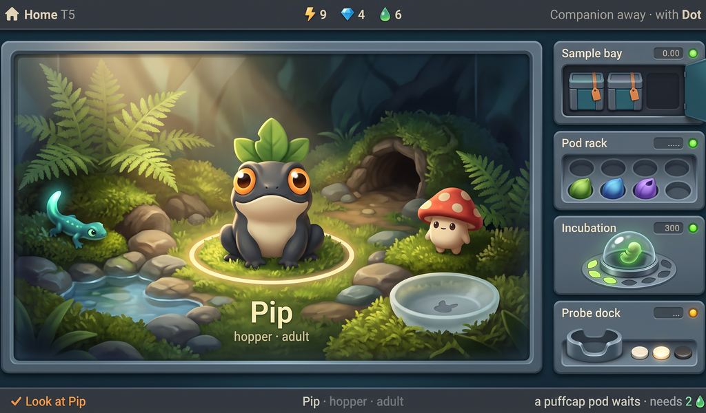 <em>A-r2-a3 (pro, fresh, A-r1-a2 as atmosphere reference). Near-pass; round 3's edit target.</em></td>
</tr>
</table>

**A-r2-a1, the ten-change edit.** Rejected. Asked to change ten things and keep the rest, the model re-rendered everything: Pip became a striped rodent, the module column slid over the vivarium, the top bar lost "Home  T5" and the Companion state. What it did get right is the material set the guide asks for, and that carried into the two fresh generations. Lesson for round 3: an edit holds only when it asks for two or three changes.

**A-r2-a2.** Runner-up. Every module reads by shape; crates, wells (six), dome with leaves, cradle with two cream plates and one dark; the Probe dock's lamp is amber because the Companion is away; icons are bolt, diamond and drop; every string is spelled right; the vivarium is bright daylight and the only warm light. Fails: Pip is a toad sitting up (orange eyes and three leaves, but a frog's body), module labels are doubled (caps plus a small repeat), and the name label moved out of the window onto the chrome, which is clean but not the brief.

**A-r2-a3.** Near-pass, the strongest picture of the set. The vivarium has depth (burrow, pool, rocks, ferns), the ring reads, the Untuva is a mibi, the Tuikis glows, the nest is frosted glass with its Companion mark, the module column is calm slate with single sentence-case labels, and the whole thing reads as an instrument holding something alive. Fails: Pip is again a toad rather than the squat four-legged rich Pip; three small readout boxes carry junk digits ("0.00", "....", "300"), which the brief forbids on the bench; the pod rack has eight wells; a house icon crept into the top bar. One specific change, Pip, is what stands between it and a pass, with the digits and the wells as housekeeping; that is round 3.
## Round 3: one edit, two attempts

A three-change edit of A-r2-a3 on Pro: put the rich Pip inside the ring, remove the readout digits, six wells. Two attempts of the same edit, because round 2 showed edits can drift.

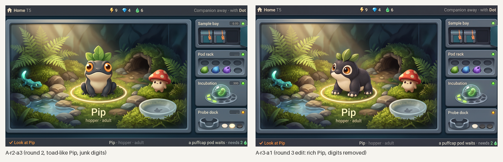

*Left: A-r2-a3, round 2. Right: A-r3-a1, the round 3 edit. Concept art, generated.*

<table>
<tr>
<td align="center" valign="top">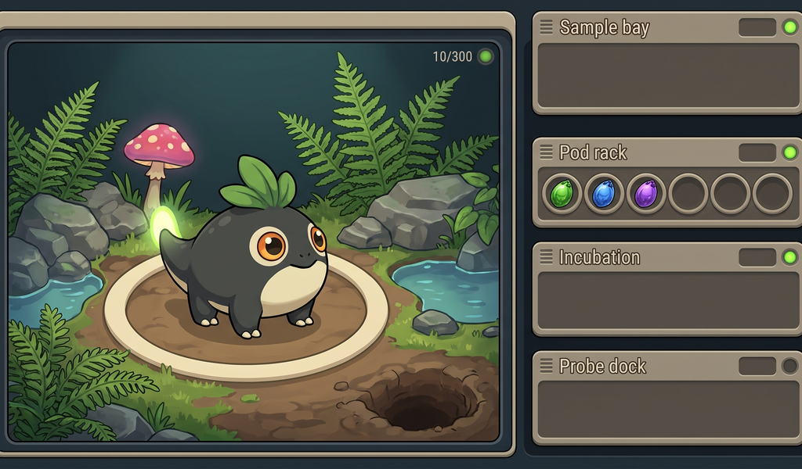 <em>A-r3-a2 (pro, the same edit). Rejected: the edit drifted into a flat cartoon with empty modules and a "10/300" readout.</em></td>
</tr>
</table>

**A-r3-a1.** Kept and recommended. Pip is the accepted rich Pip, squat and four-legged, cream belly, orange eyes with cream rings, three leaves, inside the cream ring, lit by the same warm daylight as the rest of the window; the junk digits are gone; everything else of A-r2-a3 survived the edit to the eye. Still open: the pod rack kept eight wells, the Probe dock shows one lit plate rather than two, a house icon sits before "Home", and the two small Shield plates read as buttons. All four are things the build or the master fixes; none is a wrong object or a wrong light.

**A-r3-a2.** Rejected. Same prompt, same inputs: the model re-drew the screen as a flat cartoon, emptied three modules, invented a "10/300" readout and dropped the top bar and bottom line. It is kept as the clearest warning that a generated edit has to be checked pixel by pixel.

## Recommended: A-r3-a1

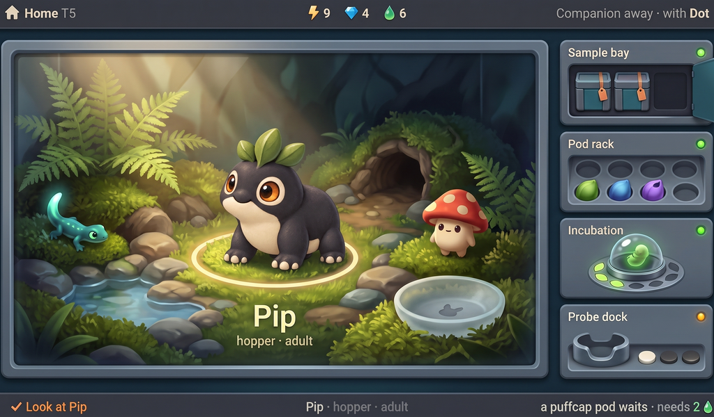

*A-r3-a1 at 1024×600, 1×. Concept art, generated; not a build capture, not accepted.*

Checklist from the brief (section 8) and the guide's "Pass when":

- [x] 1. Reads as a hardware research instrument, not a room or cottage.
- [x] 2. One key light from upper left; clean painted shading like the approved concept; no noise.
- [x] 3. Vivarium is the lively warm element and fills the left two thirds.
- [x] 4. A resident matches the rich Pip (charcoal, cream belly, orange eyes with cream rings, three leaves).
- [ ] 5. The four bench items read as objects: crates in a bay, dome with leaf ring, dock with Shield plates pass; the pod rack shows eight wells, not six.
- [x] 6. Status lamps and engraved readouts on the chrome; the Probe dock's lamp is amber because the Companion is away.
- [x] 7. Top bar with turn, three counters (bolt, diamond, drop) and the Companion state.
- [x] 8. Bottom line with ✓ action · subject · what needs you.
- [x] 9. No tables, title bars, bullet lists, digits as timers, graphs or letters for genes.
- [x] 10. Text legible at 1024×600 and spelled right (an extra house icon before "Home" is the one stray glyph).
- [x] 11. No logos; no bezel shown.
- [x] 12. The screen fills its canvas edge to edge; flat screen design.
- [x] 13. (guide) No wood, felt, shelves or lamp-lit bench; the vivarium is the only warm light; modules read by shape first.
- [x] (guide) Residents are the matched rich treatment, never upscaled tokens: Pip yes; the Tuikis and Untuva are generated stand-ins for species not yet designed.
- [x] (guide) What needs you is found in one glance: the bottom line's right part and the amber lamp.

What it still lacks: six wells; two lit Shield plates; the Companion-docked, bay-empty and incubation-ready states; a decision on pixel indication; and a painted master, since this is a generated 16:9 canvas trimmed to 1024:600, not a screen drawn at 1024×600.
## Limits

- Generated 16:9 canvases trimmed to 1024:600, not screens drawn at 1024×600; type sizes, icon shapes and well counts drift between generations, and live text will be set by the build, never baked in.
- No candidate shows the Companion docked, the bay empty, the incubation chamber ready or the idle fade; those states are described in the brief and wait for the chosen direction to be painted.
- Pip's identity is the hard part for the generator: four of the eleven candidates draw a toad or a rodent. The accepted rich Pip must be placed, not re-imagined, in the master.
- Nothing here establishes a renderer, animation or hardware behaviour.

## Three questions for the owner

1. **Name label: inside the window or on the chrome?** The brief puts "Pip · hopper · adult" under Pip inside the vivarium (A-r2-a3); A-r2-a2 moved it onto the chrome below the window, which keeps the living window free of text, as the guide's "Words: none" column suggests. Which?
2. **How much pixel indication on the Station?** The candidates are fully painted. The guide's decision 3 offers none, a fine grain on creatures and world only, or everything on a 2 px grid. The recommended candidate can carry a fine grain in the vivarium with crisp chrome; say which before the master is painted.
3. **Module labels: words or shapes only?** The candidates carry one engraved word per module ("Sample bay", "Pod rack", "Incubation", "Probe dock"). The guide says each module must read by its shape before its words; the words could go entirely, leaving the lamp and the object. Keep the words, or drop them?
