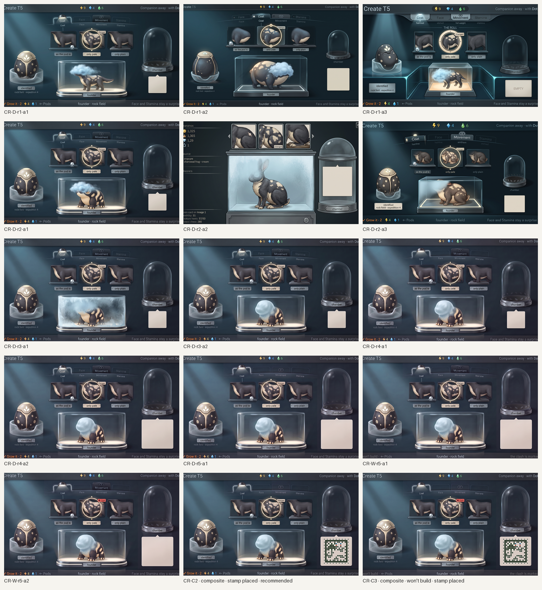
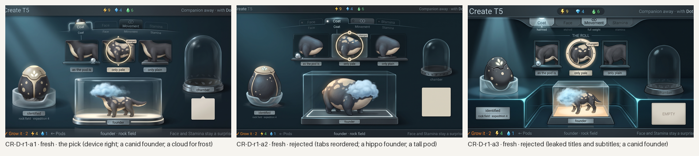
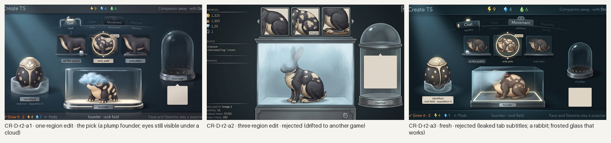
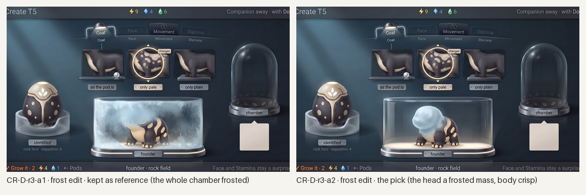
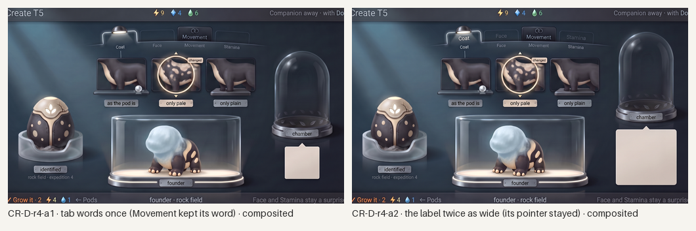
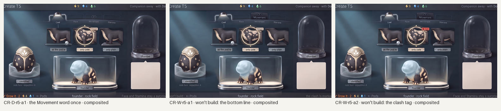
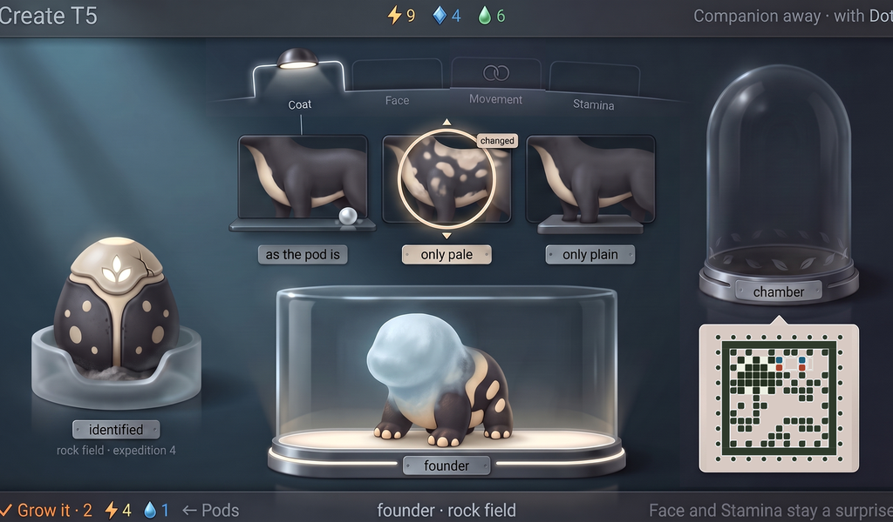
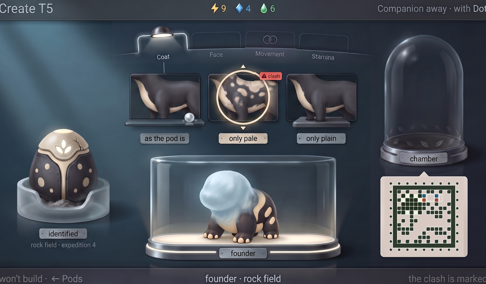

# Station Create, the review: generated concept candidates

Everything in this folder is **generated concept art** for the research bench's Create screen (where a founder is shaped and its cost shown), made in rounds against [`brief-create.md`](brief-create.md), the research loop's §8 "Shape" row and the style guide's "Create (the review)" section, on the bench the owner decided after Pods (the dark glass lab, the stamp on a square label). Nothing is a build capture or an authored master; nothing is accepted until the owner says so.

**What is placed, not generated.** The genome stamp on the label at the right is the real styled face from [`../../concept-stamp/`](../../concept-stamp/README.md) for exactly this screen's state (S01, C01 family, Coat and Movement read, Face and Stamina unread, Markings shaped to pale patches: [`layout/genome-s01-create.json`](layout/genome-s01-create.json)), composited into the empty label by [`tools/place-stamp.py`](tools/place-stamp.py) after generation and then **decoded from the finished 1024×600 screen**. The generator never draws a cell. The final candidates are **composites of one-change edits**: each edit changed one region of the current pick, and [`tools/composite-regions.py`](tools/composite-regions.py) pastes that region by rectangle onto the pick, so the result is still the generator's pixels and every paste is recorded in [`prompts.json`](prompts.json). The layout was given to the generator as a flat template drawn to the brief's numbers ([`layout/`](layout/)).

**Where this departs from the brief.** The founder is the generator's creature, not Pip: across thirteen calls it drew a canid, a hippo, a rabbit and a plump toad-like animal, and the kept one is the last. Its body carries the chosen look (cream pale patches on charcoal) and its head is frosted, so the screen's logic reads; its identity is the painted master's job (see the questions). The stamp label came out at about 185×170 px instead of the decided 220 px square, so the placed stamp is 167 px; it decodes.

*All candidates, every round, 1024×600 each; the last two are the composites with the real stamp placed. Concept art, not accepted.*

## Round 1: the brief's layout, fresh

Three generations on Pro from the same prompt, with the decided Pods screen (before its stamp) as the room's reference, Home as the device, the two accepted Pip assets for the founder and the roll, and the layout template.

*Round 1. Concept art, generated.*

- **CR-D-r1-a1 (the pick).** The device is right: four tabs on the arc with lamps (Coat lit, Face and Stamina hairline, Movement full weight with its joined rings), the roll of three flank panes with the chosen one lifted in the cream ring, ▲▼ notches and a "changed" tag, three plates with the exact words, the pod on its frosted cradle with its glyph, crack and dust, the glass chamber on its lit base, the dark dome with its ring of leaves, a pale label. Fails: the founder is a long-snouted canid; the frost is a literal blue cloud; the tab words are printed twice (on the tab and under it); the label is small and wears a pointer; the left and right strings are clipped; the bottom line's counters are misdrawn (no diamond). Kept as the edit target.
- **CR-D-r1-a2.** Rejected: the tabs came out reordered (Coat second), the founder is a hippo, the roll's panes a whale-like blob, the pod tall.
- **CR-D-r1-a3.** Rejected: a lighter cyan treatment with a leaked title ("THE ROLL"), the tab descriptions leaked as subtitles, "EMPTY" written in the label, a canid founder and a cracked-open pod.

## Round 2: edits of the pick, and one corrected fresh

*Round 2. Concept art, generated.*

- **CR-D-r2-a1 (one-region edit of r1-a1, the pick).** The founder became a plump, squat creature with pale patches, as asked, and everything else held. The frost did not: the head is still drawn, eyes visible under a cloud.
- **CR-D-r2-a2 (three-region edit).** Rejected: the same base, asked for the founder, the roll and the label at once, drifted into another game's screen with garbled text and a rabbit. The rule holds again: one change per edit.
- **CR-D-r2-a3 (fresh, corrected creature description).** Rejected for leaks (tab subtitles again) and a rabbit founder, but it drew the frost as frosted glass over the head, which worked and set round 3's wording; it also drew the roll as three whole miniature founders, which raises a question for the owner.

## Round 3: the frost

*Round 3: two one-change edits of r2-a1. Concept art, generated.*

- **CR-D-r3-a1.** The frost spread over the whole chamber: handsome, but the body must stay crisp; kept as reference only.
- **CR-D-r3-a2 (the pick).** "The head sculpted from frosted ice": a smooth, matte frosted mass where the head is, no eyes, the body crisp and warmly lit, nothing else moved. This is the rule drawn: only what is known.

## Rounds 4 and 5: one-change edits, composited

*Rounds 4 and 5: five one-change edits, each pasted back by rectangle. Concept art, generated.*

- **CR-D-r4-a1**: the tab words once (Coat, Face and Stamina lost their doubled word; Movement kept it). **CR-D-r4-a2**: the label about twice as wide, the dome moved up to make room; the pointer stayed. Both regions pasted onto r3-a2 give **CR-C1**.
- **CR-D-r5-a1**: the Movement word removed from its tab face. Pasted onto C1 gives **CR-C2, the recommended candidate**.
- **CR-W-r5-a1** (the bottom line: grey, no ✓ cap, "won't build · ← Pods" and "the clash is marked") and **CR-W-r5-a2** (the red "clash" tag with its triangle) pasted onto C2 give **CR-C3, the companion frame** of a shape that won't build.

## Recommended: CR-C2, with the stamp placed

*CR-C2 at 1024×600, 1×, with the real S01 stamp for this state (C01 family, bench paper) placed on the label. The decoder reads it from this very image: `S11v1-05-CF57-6F5406`, Coat and Movement read, Face and Stamina unread. Concept art, generated and composited; not a build capture, not accepted.*

*The companion frame: the same screen when the shape won't build. No ✓ cap in the bottom line, the clash tagged in red, nothing spent. Decodes the same.*

Checklist from brief-create.md (section 7), judged on the placed screens:

- [x] 1. Founder, changes, surprises and cost are all visible at once.
- [x] 2. The founder's misty parts match the unread chapters: the head frosted (Face unread), the body crisp.
- [x] 3. The roll offers three pictures from the pod's own two copies (plain with the bud, pale patches, plain on a base); the chosen one is lifted, notched and tagged "changed".
- [x] 4. No code anywhere; the label was empty until the real stamp was placed, and the placed stamp decodes from the finished screen.
- [x] 5. The same four tabs in Pods' order; Movement wears the joined rings.
- [x] 6. The founder is the warmest, brightest thing; the chrome cool; the dome dark.
- [x] 7. One device with Home and Pods in the dark glass lab.
- [x] 8. No digits of progress, locus counts, letters or ratios; no species name; labels one quiet word, read second; captions on plates.
- [ ] 9. Strings: the words are exact, but the top bar's first and last words are clipped at the trim and the bottom line's price icons are misdrawn (a bolt and a drop, no diamond); live text the build sets, a minor fail.
- [x] 10. The companion frame shows a shape that won't build with no ✓ cap and the clash marked.

What it still lacks: the founder as Pip (the generator's creature stands in); the stamp at the decided 220 px (167 px here); the roll's flanks drawn from Pip; a painted master.

## Limits

- The founder is not Pip. Four fresh and edited attempts gave four different animals; the kept one has the right body logic (plump, charcoal, cream belly, the chosen patches, the frosted head) and the wrong species. The master should place the accepted rich asset the way the stamp is placed here.
- Edits hold for one change in one region and for nothing more; the three-region edit drifted completely. The final candidates are therefore composites of single edits, pasted by rectangle; each paste is recorded.
- The label is the generator's: at its largest it came out about 185×170 px with a pointer on its top edge; the placer trims the pointer and fits the stamp to the square part, so the stamp is 167 px rather than 220.
- The stamp is the only exact element. The pod, tabs, roll pictures and frost are the generator's reading of the template and brief and are judged, not exact.
- Generated 16:9 canvases trimmed to 1024:600; the model keeps putting the top bar's first and last words in the trimmed 2 percent despite the brief; live text is set by the build.

## Owner decisions (2026-10-08)

Relayed by the programme lead for the painted master; no new generation here. The accepted Pip asset is **placed** into the master, the same drawing on every screen, never regenerated. The roll's pictures are **flank close-ups of the changed part**. Doings chapters that are still sealed are **named in one status-bar line**, not shown as greyed tabs. The chapter rail carries as many chapters as the species has, never a fixed four; the temperament chapter is named Character (taxonomy §5).

## Three questions for the owner (answered above)

1. **Place Pip, or keep asking for it?** No generation held Pip's identity for the founder. Should the Create master place the accepted rich Pip asset in the chamber (as the stamp is placed), with the frost as a mask over the unread parts, and stop asking any generator to redraw the species? (Recommended: place it.)
2. **The roll's three pictures: flank close-ups or whole founders?** The brief and this candidate show the trait's flank, as on Pods' page; one rejected candidate drew three tiny whole founders instead, which reads "this is what you get" at a glance but hides the trait boundary. Which should the master draw?
3. **Where do doings chapters show as surprises?** Face is a body part and frosts; Movement and Stamina have no part to frost. Here they appear only in the bottom line ("Face and Stamina stay a surprise"). Is that enough, or should an unread doings tab carry its own small surprise mark on this screen?
