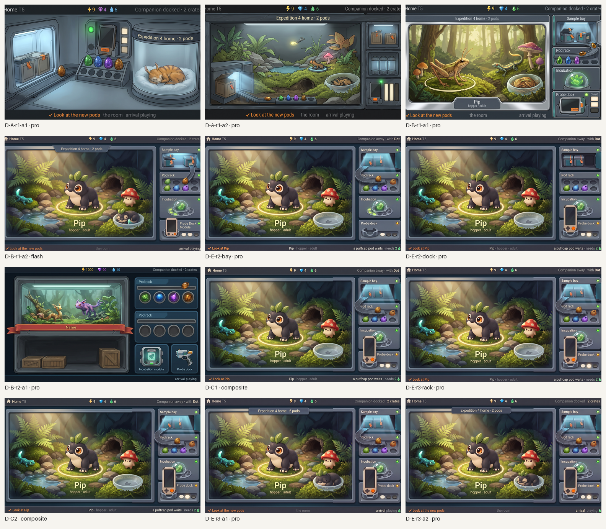
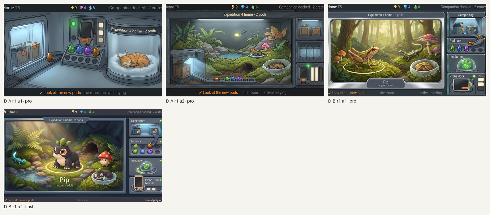
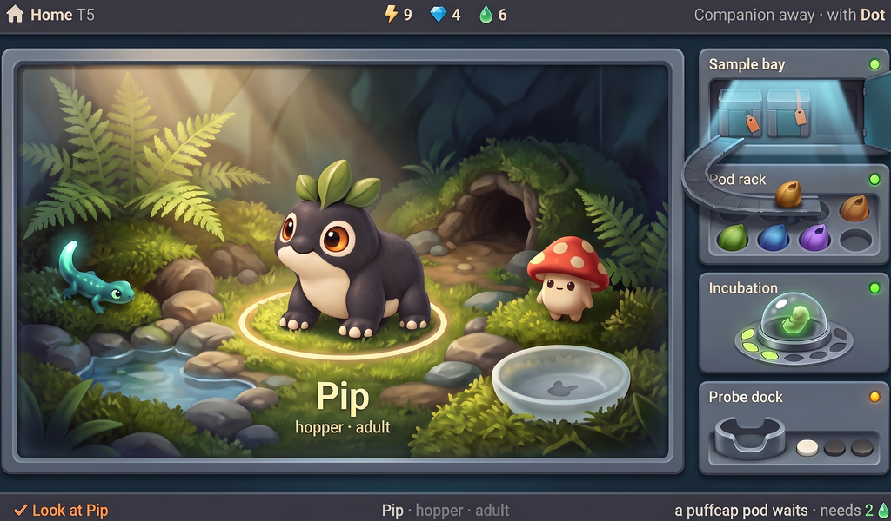
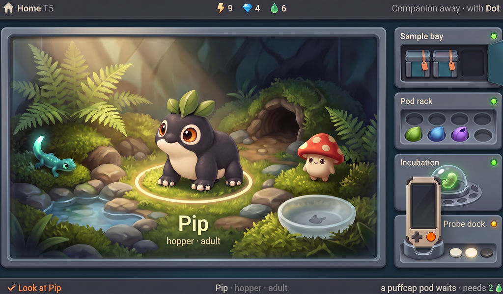
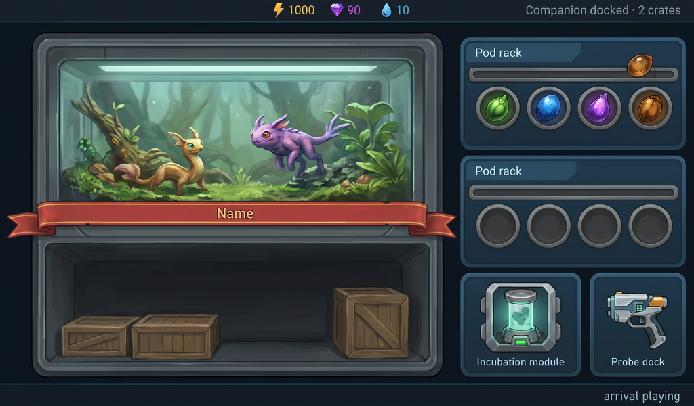
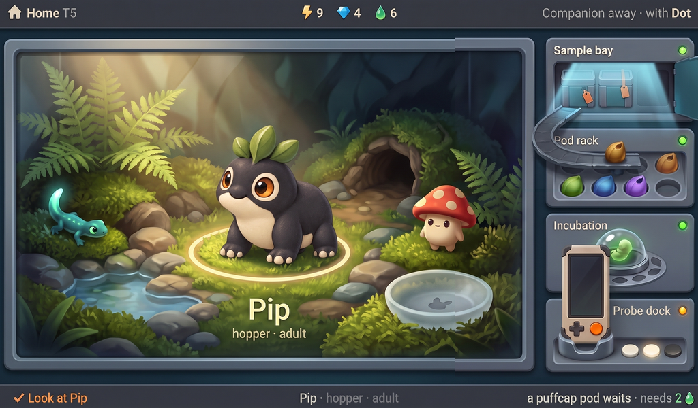
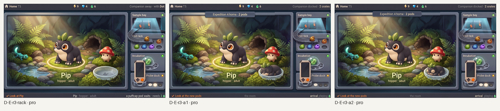
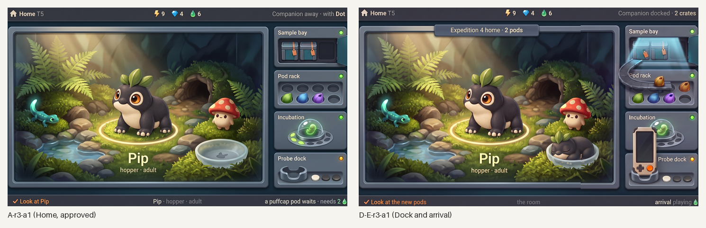
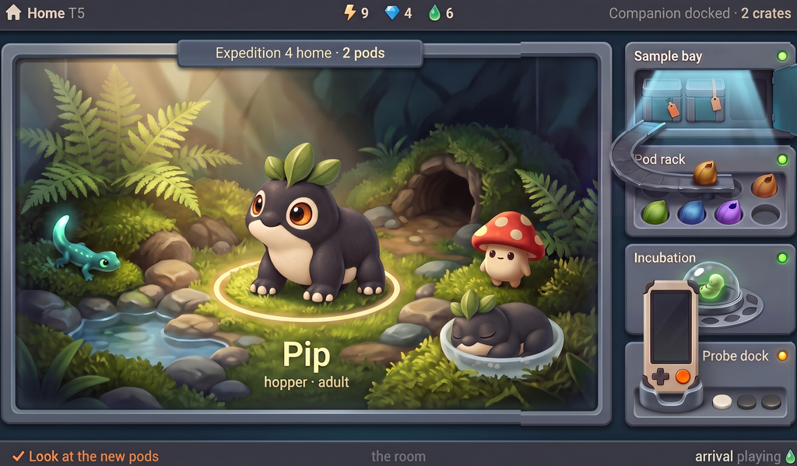

# Station Dock and arrival: generated concept candidates

Everything in this folder is **generated concept art** for the Station's Dock and arrival moment, made in rounds against [`brief-dock.md`](brief-dock.md) and the style guide's Dock section ([design/style-guide/station-screens.md](../../../design/style-guide/station-screens.md)). Nothing is a build capture or an authored master, and nothing is accepted until the owner says so. Caption every use as "Concept art, generated". The arrival plays on the Home screen, so every candidate is judged against the approved Home candidate [`A-r3-a1`](../round3/A-r3-a1-1024x600.png): same chrome, modules, vivarium, light and type, one moment later.

*All Dock candidates, every round, 1024×600 each. Concept art, not accepted.*

**The brief in one breath.** The Companion has docked and the player has pressed ✓ to open the bay. One still frame tells it: the Companion seated in the Probe dock with its screen dark, the bay door open under a cool inner beam, one crate's seal broken and its pods travelling along a rail into the rack (four of six wells filled), a second sealed crate waiting, the free mend showing as two lit Shield plates, a slim ribbon "Expedition 4 home · 2 pods" across the top of the stage, the counters mid-tick, the residents turning toward the bay, and the partner Dot asleep in the nest. Nothing of the field is drawn. Carried in: Inter type, fine grain on creatures and world only, quiet engraved labels, the name on a plate, six wells, Pip placed not re-imagined.

[`prompts.json`](prompts.json) records every call in the homepage schema. Round folders keep `raw/{tag}.jpg` for kept candidates, `{tag}-canvas.png` (16:9 at 1536×864), `{tag}-1024x600.png` (the centred 1024:600 band) and a sidecar per call. [`layout/`](layout/) holds the generator's layout inputs: the proposal's wireframe rendered to PNG and a notes-free flat template. They are inputs, not candidates.
## Round 1: two approaches, four candidates

Judged against the brief's checklist and the guide's Dock "Pass when" list. The vibe for this screen is the hardware overview: A-r3-a1's chrome stays.

*Round 1: two four-change edits of the approved Home (A) and two fresh generations with Home as the composition reference (B); Pro, Pro, Pro, Flash. Concept art, generated.*

**A arrival-edit** (two Pro edits of A-r3-a1, four changes each). Both rejected: as with Home's ten-change edit, four changes were too many and the model re-rendered the whole screen. a1 lost the vivarium and put a cat in a glass jar under the ribbon; a2 kept a terrarium but replaced Pip with a rodent and Dot with a kitten. Lesson carried into round 2: an edit of the approved Home holds only when it names one module.

**B arrival-fresh** (Pro, then Flash).
- a1 (Pro), rejected: the bay, rail, rack and docked Companion read well, but Pip became a grasshopper and Dot a kitten. The species word "hopper" in the plate text primes the model; round 2 keeps it out of the prompt and describes Pip physically.
- a2 (Flash), kept, the near-pass: Pip is placed exactly, Dot sleeps in the frosted nest as the same species, the ribbon crosses the stage top as a tab, the bay stands open with one crate unsealed and a rail to the rack, the Companion sits in the dock with its screen dark and its orange button showing, two Shield plates are lit, the incubation dome is untouched. Fails: seven wells in two rows with five pods (the brief wants six in one row, four filled), "Probe Dock Module" with a leaked word, the right-hand strings at the trim, the counters not brighter, and the residents still facing the viewer rather than the bay.

**Choice.** Round 2 takes two routes to the same frame: a three-change edit of B a2, and two single-module edits of the approved Home (bay and rack; Probe dock) that are composited back onto it by rectangle, so the vivarium is A-r3-a1's pixel for pixel.
## Round 2 and 3: region edits and a composite

Two routes to the same frame: a three-change edit of the round-1 near-pass, and single-module edits of the approved Home composited back onto it by rectangle.

<table>
<tr>
<td align="center" valign="top"> <em>D-E-r2-bay (pro): bay and rack region edit of the approved Home. Kept.</em></td>
<td align="center" valign="top"> <em>D-E-r2-dock (pro): Probe dock region edit. Kept.</em></td>
<td align="center" valign="top"> <em>D-B-r2-a1 (pro): three-change edit of the near-pass. Rejected: drifted.</em></td>
</tr>
</table>

**D-B-r2-a1.** Rejected. The three-change edit of the Flash near-pass re-rendered everything: a "Name" banner, invented creatures, wooden crates. On this family of images the model holds an edit only when it is confined to one module of the approved Home.

**D-E-r2-bay.** Kept. The bay door swung open under a cool beam, a rail runs from the bay into the rack with two amber pods on it, the vivarium is untouched. Fails: both crates still sealed (one should be open), and the rack came back with four wells.

**D-E-r2-dock.** Kept. The Companion sits upright in the dock with its screen dark and its orange button showing; two Shield plates lit, one dark. Fails: it rises over the Incubation module, and the lamp is amber rather than green.

**Composite D-C1.** The two region rectangles pasted onto the approved Home canvas ([composite/D-C1.json](composite/D-C1.json) records the rectangles). Nothing generated; the vivarium is A-r3-a1 pixel for pixel.

*D-C1: the approved Home with the bay, rack, incubation and dock regions from the two edits. A composite of generated parts, not accepted.*

**Round 3, rack.** A one-change edit of D-C1 asking for six wells returned the rack unchanged (four wells); it is composited as D-C2 and kept as the base for the final edits. Six wells remains the open fail on this screen as on Home.
## Round 3: the final edit on the composite

*Round 3: the rack-only edit (a no-op), then the three-change edit of composite D-C2, twice. Concept art, generated.*

- **D-E-r3-a1**, kept and recommended: the edit held. The top bar reads "Companion docked · 2 crates", the ribbon "Expedition 4 home · 2 pods" sits as a tab over the vivarium's top bezel, Dot sleeps in the frosted nest as a smaller Pip with its leaves showing, the bottom line reads "✓ Look at the new pods · the room · arrival playing"; the vivarium, Pip, the glowtail, the puffcap and every module are the composite's pixels.
- **D-E-r3-a2**, kept as runner-up: the same result with a slightly less clean Dot.

*Left: the approved Home, A-r3-a1. Right: D-E-r3-a1, the same device a moment after the bay is opened. Concept art, generated.*

## Recommended: D-E-r3-a1

*D-E-r3-a1 at 1024×600, 1×. Concept art, generated from region edits and a composite; not a build capture, not accepted.*

Checklist from the brief (section 7):

- [x] 1. Same device as Home: chrome, modules, vivarium, light and type are A-r3-a1's; nothing moved or re-skinned.
- [x] 2. The open door reads as the result of a press: swung open, cool beam on.
- [ ] 3. Each crate's arrival as one event: the rail carries two pods and the second crate waits, but both crates still read sealed; no seal is broken.
- [x] 4. The free mend shows on the Probe dock: two Shield plates lit, one dark.
- [x] 5. Nothing of the field is drawn; the Companion's screen is dark.
- [x] 6. A still frame tells the story: crates in the lit bay, then the ribbon.
- [x] 7. The Companion in the dock is the kit's Companion: stone shell, charcoal bumpers, portrait screen, cross pad, orange button, upright.
- [ ] 8. Six wells, four filled: the rack shows four wells with three pods, plus two pods on the rail. Three edits could not change the count.
- [ ] 9. Residents react: Dot sleeps in the nest as Pip's species; Pip, the glowtail and the puffcap still face the viewer, not the bay.
- [x] 10. The vivarium stays the only warm light; the bay's beam is cool.
- [x] 11. Labels engraved and quiet; smooth type; chrome crisp.
- [ ] 12. Strings spelled right and no others: all present and inside the trim, but a stray green drop icon follows "arrival playing"; flat screen, no bezel, fills the canvas.

What it still lacks: a broken seal on the open crate; six wells with four filled; the residents turning toward the bay; the counters mid-tick; the dock lamp green rather than amber; the Companion sized to its module rather than rising over Incubation; the stray drop icon removed. All are small and local; none is a wrong object or a wrong light.

## Limits

- The recommended frame is a chain: two region edits and one rack edit composited by rectangle onto the approved Home, then one three-change edit. The composites are recorded in `composite/*.json` and in `prompts.json`; nothing in the vivarium was regenerated.
- Edits of the approved Home hold only when they name one module or two or three small changes; the four-change edits and the edit of the Flash near-pass re-rendered the whole screen.
- The species word in the prompt ("hopper") pulls the generator toward grasshoppers and frogs; the final edits describe the creatures physically and keep the word only in the plate text.
- Generated 16:9 canvases trimmed to 1024:600; live text will be set by the build.

## Three questions for the owner

1. **Ribbon as a tab or a band?** The generator drew the ribbon as a short slate tab over the bezel; the brief asked for a slim band across the whole stage top. The tab keeps the vivarium clear. Which?
2. **How much of the arrival is one frame?** This candidate freezes the moment after the bay opens: one crate open, pods on the rail. The alternative still is the docked, unopened state (crates behind glass, "✓ Open the bay · 2 crates"). Which is the Dock screen the owner wants to see first?
3. **Companion in the dock: full handheld or the Probe only?** The guide's Probe dock holds "the Probe and its Shield plates"; the brief seats the whole Companion. The full handheld reads as docking but outgrows the module. Full device, or the Probe alone with a docked lamp?
