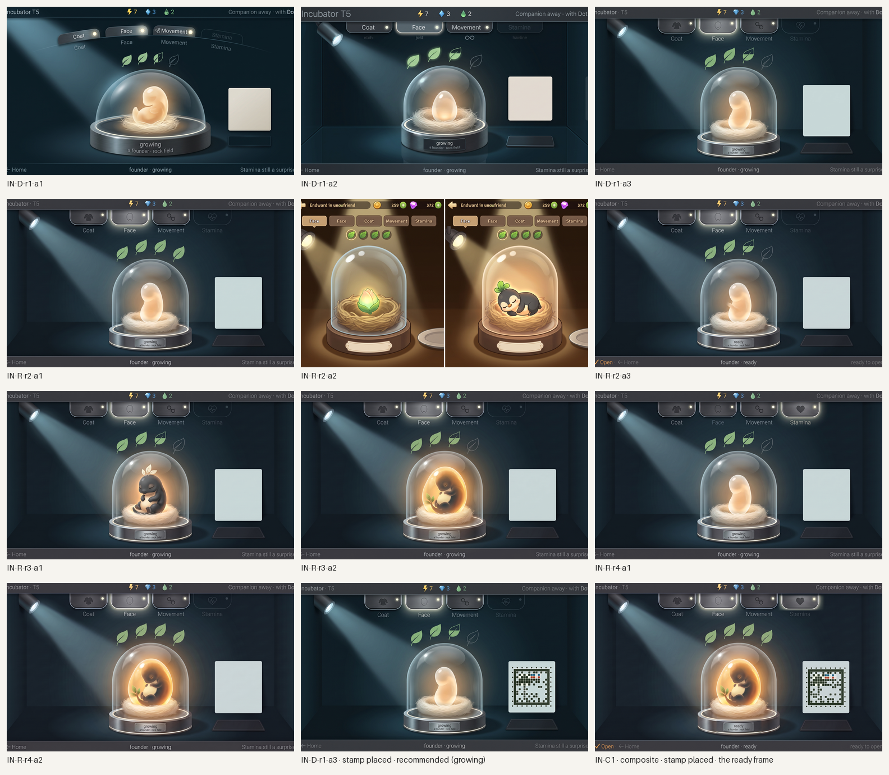
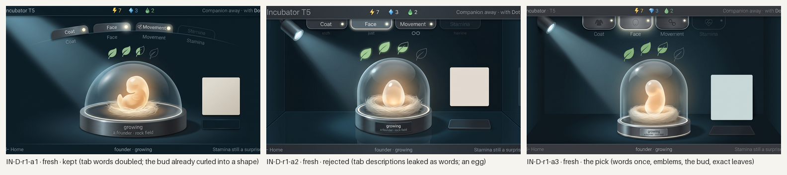
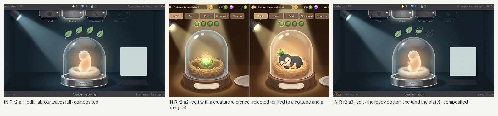
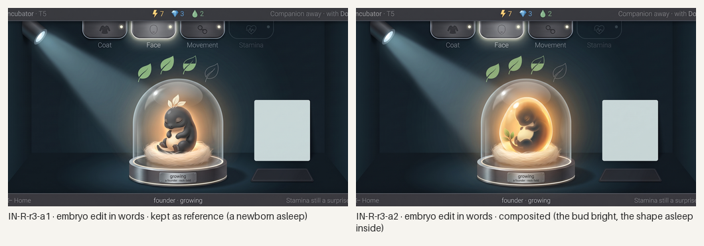
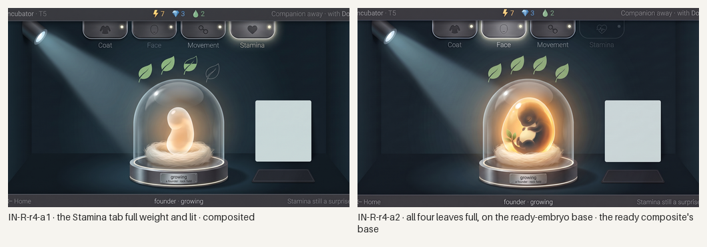
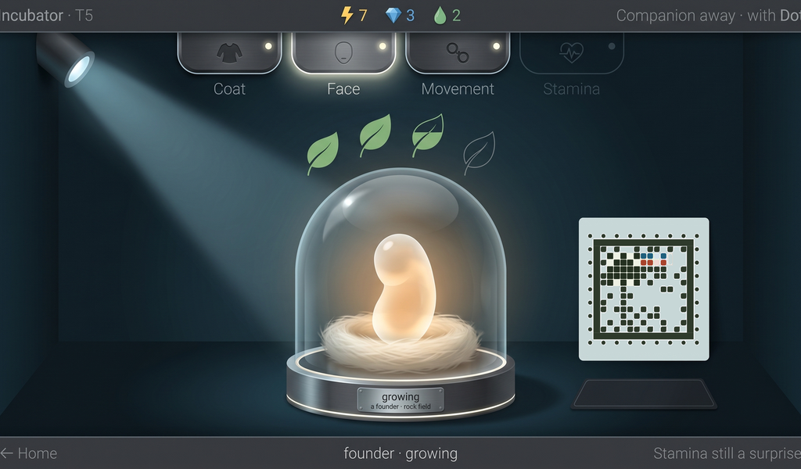

# Station Incubator: generated concept candidates

Everything in this folder is **generated concept art** for the research bench's Incubator screen (the embryo growing under the dome, the leaf timer, the chapters clearing), made in rounds against [`brief-incubator.md`](brief-incubator.md), the research loop's §8 "Incubate" row and the style guide's "Incubator" section, on the decided bench (the dark glass lab, the stamp on a square label). Nothing is a build capture or an authored master; nothing is accepted until the owner says so.

**What is placed, not generated.** The genome stamp on the label at the right is the real styled face from [`../../concept-stamp/`](../../concept-stamp/README.md), in two states: growing (S01, C01 family, Coat, Face and Movement read, Stamina an empty block: [`layout/genome-s01-incubator.json`](layout/genome-s01-incubator.json)) and ready (every chapter read: [`layout/genome-s01-ready.json`](layout/genome-s01-ready.json)). Each is composited into the empty label by [`tools/place-stamp.py`](tools/place-stamp.py) after generation and **decoded from the finished 1024×600 screen**. The generator never draws a cell. The ready frame is a **composite of one-change edits**, pasted by rectangle with [`tools/composite-regions.py`](tools/composite-regions.py) (every paste recorded in [`prompts.json`](prompts.json)); the growing frame is one fresh generation, untouched. The layout went to the generator as a flat template drawn to the brief's numbers ([`layout/`](layout/)).

**Where this departs from the brief.** The code that appears at Grow is live text and is left off the small plate under the label (an empty plate in the art). The stamp label came out at about 165 px rather than the decided 220 px square; the placed stamp decodes at that size.

*All candidates, every round, 1024×600 each; the last two carry the real stamp. Concept art, not accepted.*

## Round 1: the brief's layout, fresh

Three generations on Pro from the same prompt, with the Create and Pods screens of the same bench and Home as the device.

*Round 1. Concept art, generated.*

- **IN-D-r1-a3 (the pick).** Four tabs with emblems, each word once; Coat and Movement lit, Face lit with a soft glow (just cleared), Stamina a hairline; four leaves exactly as briefed (two full, one half, one empty), no digits; the large dome on its brushed base with the bud glowing warm in a nest of pale fibre, the only warm light; the lamp housing high at the left and its cool beam; the plate "growing · a founder · rock field"; a clean pale label and an empty code plate; a read-only bottom line with no ✓ cap. Fail: the top-left word is clipped at the trim. The bud is a plain bean, the brief's bud stage.
- **IN-D-r1-a1 (the alternative).** The same scene with a deeper dome and a bud already curled into an embryo shape; the tab words are doubled and the lamp housing is not drawn. Kept, with the stamp placed, for the owner's eye on the embryo's stage.
- **IN-D-r1-a2.** Rejected: the tab descriptions leaked as words under the tabs ("etch", "just", "hairline"); the embryo an egg. Otherwise clean, and the one candidate whose top-left string survived the trim.

## Rounds 2 to 4: the ready frame, from one-change edits

*Rounds 2 to 4: one-change edits of the pick. Concept art, generated.*

- **IN-R-r2-a1** (all four leaves full) and **IN-R-r2-a3** (the bottom line: orange "✓ Open · ← Home", "founder · ready", "ready to open"; the plate turned to "ready" on its own) held exactly.
- **IN-R-r2-a2** (the embryo becomes the sleeping newborn) was given the accepted creature as a second image and drifted into a two-panel cottage scene with a penguin and another game's bars. Rejected; the lesson joins Create's: an edit holds for one change described in words, and a reference image inside an edit invites a redraw.
- **IN-R-r3-a1** and **IN-R-r3-a2**: the same embryo edit in words alone, twice, both held. a1 opens the bud and lays a newborn asleep in the nest (charcoal, cream belly, three-leaf crest, eyes shut); a2 keeps the bud, grown bright and thin so the sleeping shape shows inside it. a2 is composited, a1 kept as reference and put to the owner.
- **IN-R-r4-a1**: the Stamina tab full weight and lit (every chapter has cleared when the dome is ready). **IN-R-r4-a2**: the leaves again, edited on the r3-a2 base, because pasting r2-a1's leaves onto the brighter ready base left a faint rectangle in the glow. The ready frame **IN-C1** is r4-a2 with the bottom line and plate from r2-a3 and the Stamina tab from r4-a1.

## Recommended: IN-D-r1-a3, with the stamp placed

*Growing: IN-D-r1-a3 at 1024×600, 1×, with the real S01 stamp for this state placed (C01 family, bench paper). The decoder reads it from this very image: `S11v1-07-C85B-501D8D`, Coat, Face and Movement read, Stamina unread. Concept art, generated; not a build capture, not accepted.*

*Ready: the composite IN-C1 with the fully read stamp placed. Every leaf full, every tab lit, the dome glowing with the sleeping shape inside the bud, "✓ Open". Decodes: `S11v1-0F-DDCB-4DEAF4`, every chapter read.*

Checklist from brief-incubator.md (section 7), judged on the placed screens:

- [x] 1. Time reads as leaves, never digits: two full, one filling, one empty; all four full when ready.
- [x] 2. The embryo is the only warm, living thing; chrome, leaves and label cool.
- [x] 3. Ready reads from across a table: the dome glows and every leaf is full.
- [x] 4. Unread chapters clear as it grows: Face just lit, Stamina still hairline; the placed stamp shows the same and decodes; the ready frame's tabs and stamp are all read.
- [x] 5. The bottom line draws no ✓ cap while growing, and offers "✓ Open" when ready.
- [x] 6. The dome centred and large, the leaves over it, the arcs above, the plate below.
- [x] 7. One device with Home, Pods and Create in the dark glass lab.
- [x] 8. No digits of progress or time, no species name; labels one word; captions on plates; the code plate empty (live).
- [ ] 9. Strings: exact words, but the top-left word is clipped at the trim on the pick and "ready to open" is clipped at the right on the ready frame; live text, a minor fail.
- [x] 10. A still frame shows progress.

What it still lacks: the stamp at the decided 220 px; the code on its plate (live); the "just started" state; the Open motion and the juvenile stepping out; a painted master.

## Limits

- The stamp is the only exact element; the dome, bud, leaves and tabs are the generator's reading of the template and are judged, not exact. The leaf count held on every attempt this screen, unlike the well count on Pods.
- Edits hold for one change described in words; an edit carrying a creature reference image drifted completely (as a three-region edit did on Create). Pastes of edits made on a darker base onto a brighter one leave a rectangle in soft glow; the leaves were therefore re-edited on the ready base rather than pasted.
- The tab emblems are the generator's (a garment for Coat, a face, joined rings, a heart) and are not specs.
- Generated 16:9 canvases trimmed to 1024:600; the model keeps putting the top bar's first word in the trimmed 2 percent; live text is set by the build.

## Three questions for the owner

1. **What does Ready show?** The composite keeps the bud, grown bright with the sleeping shape visible inside, so the creature itself first appears on Open; the kept reference IN-R-r3-a1 opens the bud early and shows the newborn asleep in the nest. Shape inside the bud (recommended, it keeps Open as the reveal), or the newborn already visible?
2. **The embryo's middle stage.** The pick's bud is a plain glowing bean; the alternative IN-D-r1-a1 already curls it into an embryo shape at the same stage. How much of the shape should show before the last leaf?
3. **The code plate.** The stamp's code appears at Grow and is live text; here its plate under the label is empty. Should the master show it under the label on the bench as well (as the Caddy label does), or is the stamp alone enough on the Station?
