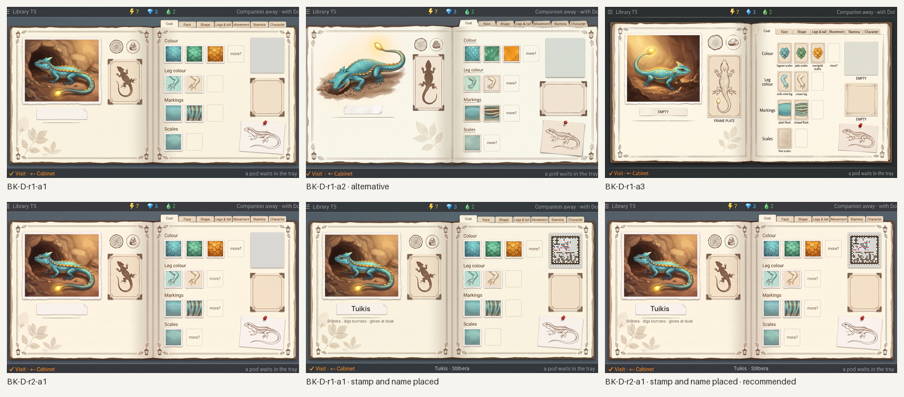
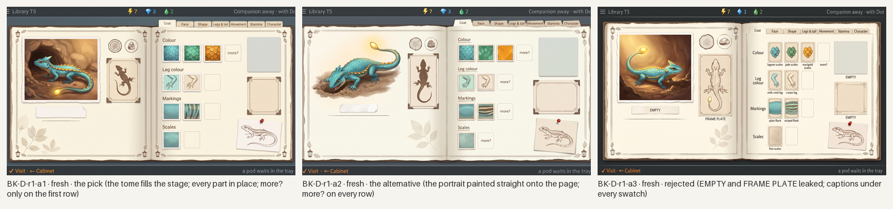
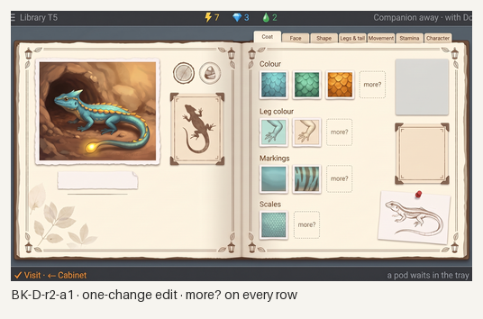

# Station Library, the Book: generated concept candidates

Everything in this folder is **generated concept art** for the Library's second screen, the book (one species' field guide with the whole screen to itself), made against [`brief-book.md`](brief-book.md) and the style guide's rewritten Library section after the owner kept the book's treatment from the [first Library round](../library/README.md) and rejected its shelf. It opens from the [cabinet](../library-cabinet/README.md). Nothing is a build capture or an authored master; nothing is accepted until the owner says so.

**What is placed, not generated.** The **genome stamp** is the real styled tome face from [`../../concept-stamp/`](../../concept-stamp/README.md) (S03 Tuikis, every chapter read, C03 family, tome paper), composited by [`tools/place-stamp.py`](tools/place-stamp.py) onto the plain pale plate the generator left ([`tools/find-plate.py`](tools/find-plate.py) finds it by its own tone, since on cream paper the whole page is pale) and **decoded from the finished, named 1024×600 screen**. The **species name** and its line, and the bottom line's subject, are a text layer set in Inter by [`tools/place-text.py`](tools/place-text.py) from [`layout/text-book.json`](layout/text-book.json); the generator leaves the label empty, so no name is baked into a plate. The **family tree panel** is an empty mounted frame: its display is being designed (`design/proposals/family-tree.md`, to come) and nothing is invented here. The layout went to the generator as a flat template ([`layout/`](layout/)).

**Scenario.** Tuikis (clan Stilbera), Coat open with three colours, two leg colours, two markings and one scale look found, each row ending in "more?"; the other six tabs closed, Character the seventh; one mibi's stamp; one wish pinned; the tree's frame waiting.

*All candidates, 1024×600 each; the last two carry the real stamp and the placed name. Concept art, not accepted.*

## Round 1: the tome at full screen

Three generations on Pro from one prompt, with the first round's book as the treatment reference and Home as the device.

*Round 1. Concept art, generated.*

- **BK-D-r1-a1 (the pick).** The open tome fills the stage; on the left page the portrait digging with its tail-lamp (the one warm thing), two round place stamps, the pressed frame plate, an empty name label with its rule and pressed leaves below; on the right page seven tabs ending in Character, four rows of pressed-specimen plates, a plain pale plate, an empty mounted frame with corner ticks, and the pinned wish sketch. Fails: "more?" only on the first row's dotted plate; a menu glyph before the screen name; the right string clipped.
- **BK-D-r1-a2 (the alternative).** The portrait painted straight onto the page without a frame, a torn tape strip for the label, "more?" on every row, a larger plate; a looser, lovely page. Kept for the owner's eye.
- **BK-D-r1-a3.** Rejected: the words EMPTY and FRAME PLATE leaked onto the label, the plate and the frame, and captions appeared under every swatch.

## Round 2: one-change edit

*Round 2. Concept art, generated.*

- **BK-D-r2-a1 (the recommended base).** "more?" written on the three remaining dotted plates; nothing else moved.

## Recommended: BK-D-r2-a1, with the stamp and the name placed

*BK-D-r2-a1 at 1024×600, 1×. The real Tuikis stamp (C03 family, tome paper) sits on the plain plate at about 115 px, and the name layer is set in Inter. The decoder reads the stamp from this very image: `S13v1-7F-82F9-08AA9F`, every chapter read. Concept art, generated and placed; not a build capture, not accepted.*

Checklist from brief-book.md (section 5), judged on the placed, named screen:

- [x] 1. The page has the whole screen: portrait, places, frame plate, tabs, looks, stamp, tree panel, wish, all at once.
- [x] 2. Seven tabs for Tuikis with Character the seventh.
- [x] 3. Every look found is a picture on a plate; each row ends in "more?"; no counts.
- [x] 4. The stamp is the prototype's cells placed on a plain plate with no frame around it, at about 115 px (the generator's plate came out 118×124), and decodes from the finished screen.
- [x] 5. The family tree panel is a clearly framed, empty region; no tree is invented.
- [x] 6. Knowledge, never material; never a text page.
- [x] 7. The portrait is the only warm thing; the archive cool and even; a tome, not a cottage.
- [x] 8. No species name in the generated art; the names are a placed text layer; no digits but the counters.
- [x] 9. One device with Home and the cabinet; the bottom line returns to the Cabinet.
- [ ] 10. Strings: exact, but a menu glyph leaked before "Library" and the right string is clipped at the trim; live text, a minor fail.

What it still lacks: the family tree once its design lands; the other chapter pages; the tab-turn motion; a painted master.

## Limits

- The stamp and the name are the only exact elements; the portrait, plates, stamps and sketches are the generator's reading of the template and brief.
- The plate came out at 118×124 px, so the stamp sits at about 115 px rather than 120; the 25×25 face decodes there with margin.
- The tree panel is a placeholder by instruction; its frame is the generator's, its contents will be the family tree proposal's.
- Edits hold for one change described in words; none here carried a reference image.
- Generated 16:9 canvases trimmed to 1024:600; the names are live text and would be set by the build, as the layer does here.

## Three questions for the owner

1. **Portrait framed or painted on the page?** The recommended page mounts the portrait as a plate with a frame; the alternative paints it straight onto the paper, which reads more like a naturalist's watercolour and less like a photograph. Which should the master take?
2. **The tree panel's size.** Here it is about 180×160 px under the stamp. Is that enough room for parents, siblings and children with rings at 40 px, or should the tree take the page's whole right column and the wish move under the portrait?
3. **The name label.** A paper label with a rule (recommended) or the alternative's torn tape strip? The label also carries the habit line; the tape has room for the name alone.
