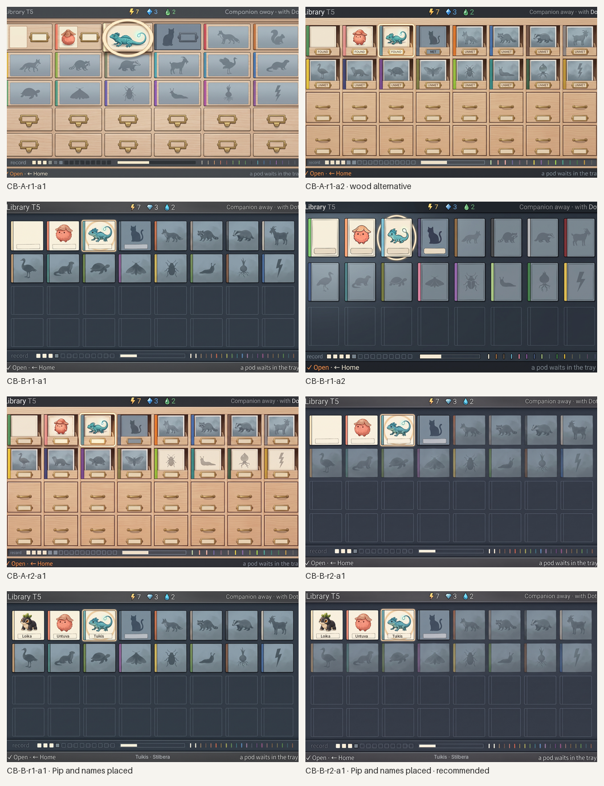
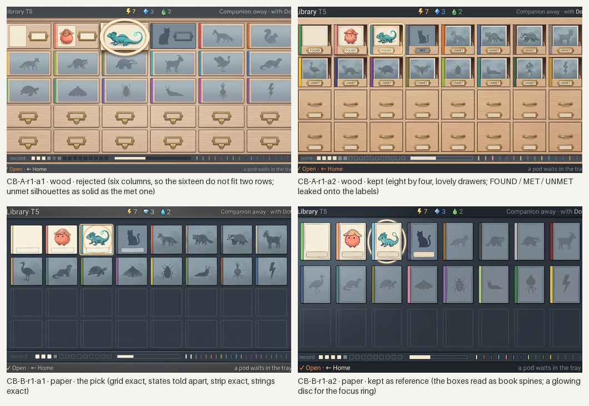
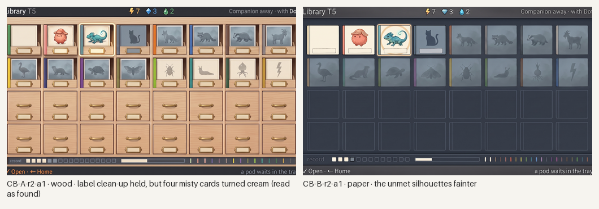
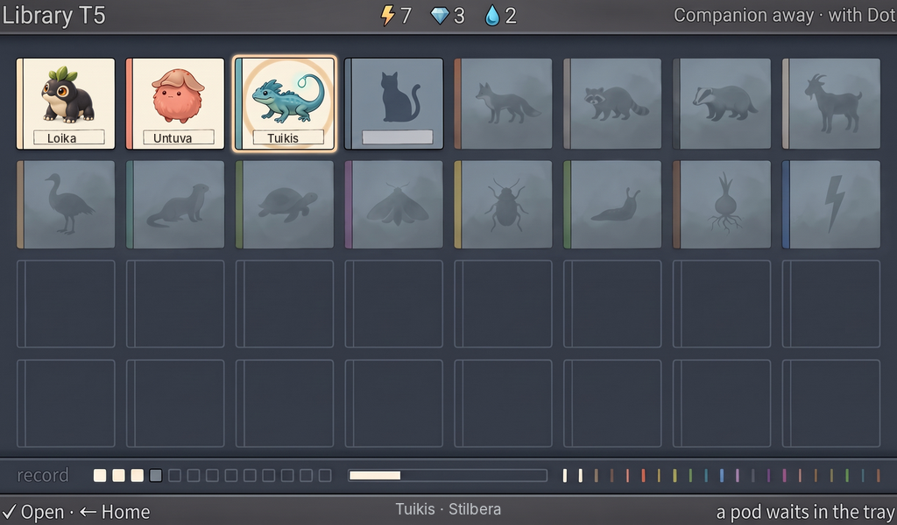

# Station Library, the Cabinet: generated concept candidates

Everything in this folder is **generated concept art** for the Library's first screen, the cabinet (the whole collection at a glance as a grid of boxes), made against [`brief-cabinet.md`](brief-cabinet.md) and the style guide's rewritten Library section after the owner rejected the shelf of the [first Library round](../library/README.md). Nothing is a build capture or an authored master; nothing is accepted until the owner says so.

**What is placed, not generated.** **Pip** is the accepted rich asset placed into the Loika box by [`tools/place-asset.py`](tools/place-asset.py) (the generator leaves that box's card empty; Loika is Pip wherever it appears, never regenerated). The **species names** under the three found boxes and the bottom line's subject are a text layer set in Inter by [`tools/place-text.py`](tools/place-text.py) from [`layout/text-cabinet.json`](layout/text-cabinet.json); the generator leaves every label empty, so no name is baked into a generated plate. The grid went to the generator as a flat template drawn to the brief's numbers ([`layout/`](layout/)): eight columns by four rows, sized so that thirty-two boxes fit at the same box size; today's sixteen fill the top two rows in clan order and the lower two rows are the cabinet's empty carcass.

**Scenario.** Three species found (Loika, Untuva, Tuikis as bright boxes with a portrait and a placed name), one met without a pod (Hiljan, a slate cat silhouette), twelve unmet as faint shapes in the mist (a fox, a raccoon, a badger, a goat, a big bird, an otter, a turtle, a moth, a beetle, a slug, a standing bulb on root legs, a vertical bolt); each box with its clan's spine colour; Tuikis focused. The synopsis strip reads the record as pictures: sixteen tiny boxes (three bright, one slate, twelve empty), a bar filled three sixteenths, and sixteen clan ticks with four solid.

*All candidates, both directions, 1024×600 each; the last two carry the placed Pip and names. Concept art, not accepted.*

## Round 1: two directions

*Round 1: A, the naturalist's cabinet in wood and brass (the one place the guide allows wood); B, the tome's boxes in cream card on slate. Concept art, generated.*

- **CB-B-r1-a1 (the pick).** The grid is exact: eight by two today over an empty carcass of two more rows, each box with its clan spine; the three found boxes bright with their cards (the first left empty for Pip), the met box a solid slate cat, the twelve unmet boxes misty with their kinds as shapes, Tuikis lifted in the cream ring; the synopsis strip exactly as briefed; every string in place. The Essence drop came out blue (live).
- **CB-B-r1-a2.** The same reading with the boxes drawn as book spines and a glowing disc for the focus ring; kept as reference.
- **CB-A-r1-a2.** The wood cabinet: open found drawers with their cards above brass label frames, closed blank drawers below, the strip exact. The words FOUND, MET and UNMET leaked onto the label frames and the edge strings are clipped. Kept as the owner's alternative.
- **CB-A-r1-a1.** Rejected: a six-column catalogue, so the sixteen do not fit two rows, and the unmet silhouettes are as solid as the met one.

## Round 2: one-change edits

*Round 2. Concept art, generated.*

- **CB-B-r2-a1 (the recommended base).** The twelve unmet silhouettes made fainter, barely darker than the mist; nothing else moved.
- **CB-A-r2-a1.** The label clean-up held, but four misty cards in the second row turned bright cream and now read as found; rejected. The wood direction stands on r1-a2 with its leaked labels noted.

## Recommended: CB-B-r2-a1, with Pip and the names placed

*CB-B-r2-a1 at 1024×600, 1×: the accepted Pip in the Loika box, the three names and the bottom line's subject set in Inter. Concept art, generated and placed; not a build capture, not accepted.*

Checklist from brief-cabinet.md (section 6), judged on the placed screen:

- [x] 1. Every released species' box is seen at once with no scrolling; the grid holds thirty-two at this box size (the lower two rows are drawn empty).
- [x] 2. Found, met and unmet are told apart by the boxes alone: bright with a portrait, slate silhouette, faint shape in the mist.
- [x] 3. Each box carries its clan's spine colour in clan order; a cousin would join beside its clan's box.
- [x] 4. Silhouettes reveal only a kind's shape, never a look.
- [x] 5. The synopsis strip reads filled boxes, progress and clans met as pictures; no digits.
- [x] 6. The cabinet is quiet: no warm light, no living window; one device with Home.
- [x] 7. Loika is the placed Pip; the names are a placed text layer; nothing generated carries a name.
- [x] 8. Reads first: three bright boxes among sixteen, within a second.
- [ ] 9. Strings: exact, but the Essence drop is drawn blue rather than green and the top bar's first word is clipped on the pick (live text and icons; a minor fail).
- [x] 10. It would read at twice the count: the lower rows are the same box size and already drawn empty.

What it still lacks: the Untuva and Tuikis portraits as the real species (the generator's small cards stand in); a clan plate when cousins arrive; the box-lift and book-open motion; a painted master.

## Limits

- Pip and the names are the only exact elements; the Untuva and Tuikis cards, the silhouettes and the strip are the generator's reading of the template and brief.
- Clan grouping is one box per clan today, carried by the spine colour; the brief's grid leaves the lower rows for the next drops, and a cousin's box would sit beside its clan's, which the template does not yet draw.
- The wood direction leaked state words onto its label frames in every attempt, and the one-change clean-up changed four cards' state; the wood alternative is therefore shown unplaced.
- Generated 16:9 canvases trimmed to 1024:600; the icons and strings are live and set by the build.

## Three questions for the owner

1. **Wood and brass, or paper and slate?** The guide allows either. B (recommended) shares the book's material so the Library's two screens are one object; A's wooden drawers are warmer and more furniture-like but read as a different room from the book.
2. **How faint is unmet?** The recommended candidate shows the unmet kinds as shapes a careful eye finds; the round-1 pick shows them a step clearer. Faint enough to keep the surprise, or clear enough that a child can name the kind?
3. **The empty carcass.** The lower two rows are drawn as empty box outlines so the cabinet visibly has room to grow. Keep them (the collection reads as a quarter full of a bigger world), or close them (the cabinet looks complete at every drop)?
