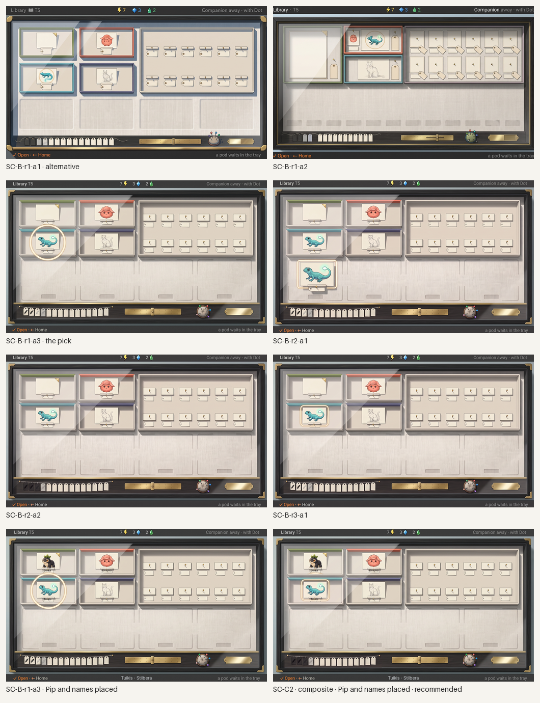
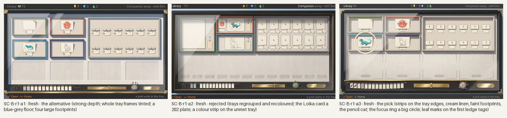
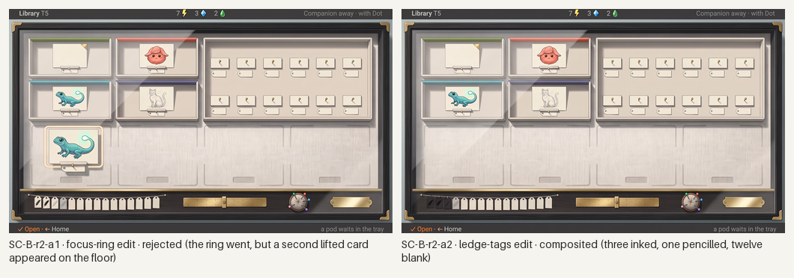
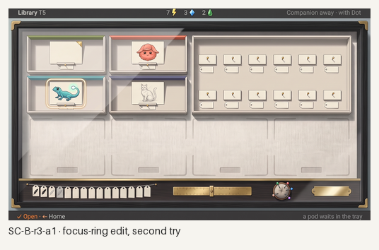
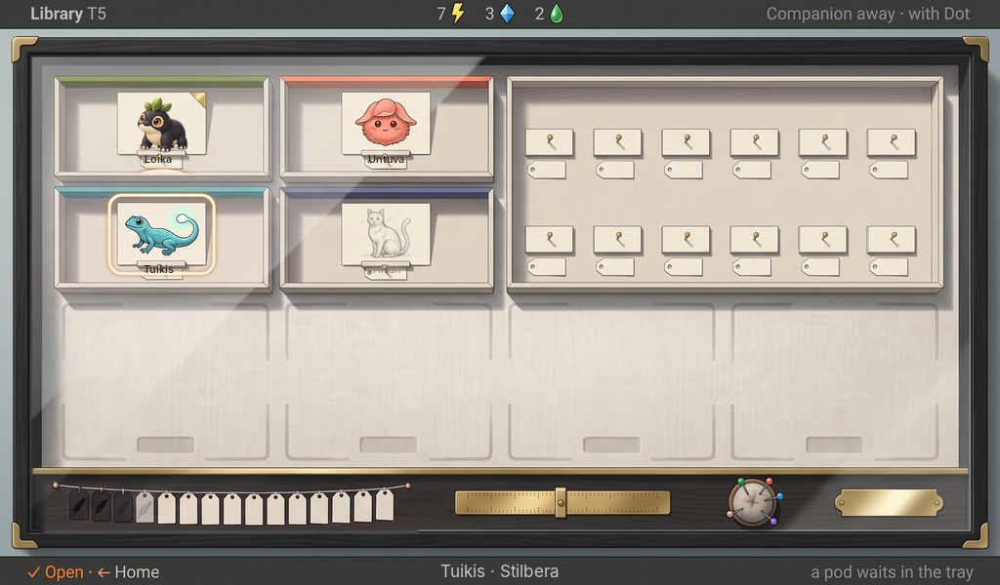

# Station Library, the Specimen Case: generated concept candidates

Everything in this folder is **generated concept art** for the Library's collection screen as the owner's chosen **specimen case** (direction B of the [collection display proposal](../../../design/proposals/collection-display.md), with the owner's changes of 2026-10-08), made against [`brief-case.md`](brief-case.md). It replaces the rejected [cabinet of boxes](../library-cabinet/README.md) and opens into the accepted [book](../library-book/README.md). Nothing is a build capture or an authored master; nothing is accepted until the owner says so.

**What is placed, not generated.** **Pip** is the accepted rich asset placed into the Loika card by [`tools/place-asset.py`](tools/place-asset.py) (the generator leaves that card empty with its gilt corner). The **names** are a text layer set in Inter by [`tools/place-text.py`](tools/place-text.py) from [`layout/text-case.json`](layout/text-case.json): the three found names inked on their tags, the met name (Hiljan) in a pencil grey, and the bottom line's subject; the generator leaves every tag blank. The recommended candidate is a **composite of one-change edits** pasted by rectangle with [`tools/composite-regions.py`](tools/composite-regions.py) (every paste recorded in [`prompts.json`](prompts.json)). The layout went to the generator as a flat template at the proposal's slot size for thirty-two ([`layout/`](layout/)).

**Scenario.** Sixteen species released. Found: Loika (portrayed, gilt corner), Untuva, Tuikis (focused), each a card with its face in a clan tray whose top edge carries the clan's colour. Met: Hiljan, a pencil field sketch of a cat on its card, its name pencilled on the tag. Unmet: twelve identical bare places in one plain tray, blank tags, no colour, nothing to read. The lower half of the linen floor is bare with faint footprints. On the brass-edged ledge the record as objects: sixteen tiny tags (three inked, one pencilled, twelve blank), a brass slider on an engraved rule, a pin cushion with four clan pins, a brass plate.

*All candidates, 1024×600 each; the last two carry the placed Pip and names. Concept art, not accepted.*

## Round 1: the case, fresh

Three generations on Pro from one prompt in the chosen direction, with Home as the device and the accepted book for the cards' drawing style only.

*Round 1. Concept art, generated.*

- **SC-B-r1-a3 (the pick).** An ebonised frame with brass corners, one glass lid with its reflection, a cream linen floor; four unit trays with the clan colour as a strip on the top edge; the cards standing on mounts with their blank tags on pins; the Loika card empty with its gilt corner; the coral fluff and the lagoon lizard; the pencil cat for Hiljan; the plain tray's twelve identical bare places; faint footprints on the bare floor; the ledge's objects without digits. Fails: the focus ring a large circle, leaf marks on the first ledge tags, the counters drawn digit-first.
- **SC-B-r1-a1 (the alternative).** Stronger depth and shadow, a clean ledge, but the whole tray frames are tinted in the clan colours rather than an edge strip, the floor is blue-grey rather than linen, and the footprints are four large pads.
- **SC-B-r1-a2.** Rejected: trays regrouped and recoloured (the Loika card a two-by-two plate; Untuva and Tuikis sharing a tray; Hiljan in lagoon) and a colour strip on the unmet tray.

## Rounds 2 and 3: one-change edits

*Rounds 2 and 3: one-change edits of the pick. Concept art, generated.*

- **SC-B-r2-a2** fixed the ledge's tag string (three inked, one pencilled, twelve blank) and held; composited.
- **SC-B-r2-a1** asked for the focus ring as a rounded rectangle and instead set a second, lifted lizard card on the bare floor; rejected. **SC-B-r3-a1** asked again, forbidding additions, and held: a thin cream rounded rectangle hugging the card; composited.

## Recommended: SC-C2, with Pip and the names placed

*SC-C2 at 1024×600, 1×: the round-1 pick with the ledge and focus-ring edits pasted in, the accepted Pip in the Loika card, the names set in Inter (Hiljan pencilled). Concept art, generated, composited and placed; not a build capture, not accepted.*

Checklist from brief-case.md (section 5), judged on the placed screen:

- [x] 1. Every released species has a place, seen at once; the slot is the proposal's thirty-two size.
- [x] 2. Three states by the object alone: cards with faces and inked names; a pencil sketch with a pencilled name; bare places with blank tags.
- [x] 3. Unmet gives no cue: no silhouette, shape or colour; the twelve places are identical.
- [x] 4. Clan colour only on the four trays whose member is met, as a strip on the tray's top edge.
- [x] 5. The portrayed Loika wears a gilt corner and is the placed Pip; pins hold tags only.
- [x] 6. The ledge reads the record as objects, without digits.
- [x] 7. The case is its own object: ebonised wood, glass, brass, linen; not paper, not flat tiles; cool light only.
- [x] 8. Room to grow reads as bare linen with faint footprints.
- [x] 9. Names are a placed text layer; nothing generated carries a name.
- [ ] 10. Strings: exact, but the counters are drawn digit-first (7 ⚡ instead of ⚡ 7) and the pencilled name sits over the tag's pin; live text and icons, a minor fail.

What it still lacks: the Untuva and Tuikis faces as the real species (the generator's cards stand in); the card-to-book opening motion; the brass plate's fill as a true completion gauge; a painted master.

## Limits

- Pip and the names are the only exact elements; the trays, cards, pencil sketch, footprints and ledge objects are the generator's reading of the template and brief.
- The unmet places came out as a blank card plus a blank tag each rather than a bare mount; identical and cue-less, which is the rule, but the mount is the master's to draw.
- Edits hold for one change in words; the first focus-ring edit added an object elsewhere, and only an explicit "add nothing anywhere else" held.
- The clan grouping is one species per tray today; a cousin would widen its clan's tray by one unit, which the template does not yet draw.
- Generated 16:9 canvases trimmed to 1024:600; icons and strings are live and set by the build.

## Owner decision (2026-10-08)

Relayed by the programme lead. **The Specimen Case is rejected.** The owner's reasons: it is too gimmicky; it does not communicate a collection; no dedicated space per species is visible; glass plus box plus frame plus paper to show a sketch is boring; and the ledge's tags, gold bars and pins do not say what they are. No new round starts until the owner picks a direction. The three questions above are moot.

## Three questions for the owner (moot)

1. **The pencilled name.** Hiljan's name is placed here in a light graphite grey in the device's type; a truly pencilled name would want a hand-lettered face. Is the grey Inter enough for the master, or should the met tag carry a pencil hand?
2. **Tray colour: strip or frame?** The recommended case carries the clan colour as a thin strip on the tray's top edge (the brief); the alternative tints the whole tray frame, which reads the clan faster but louder. Which should the master take?
3. **The unmet place.** Twelve identical blank cards with blank tags here; the brief said a bare mount. Keep the blank card (it reads "a card will go here") or an empty mount with no card at all?
