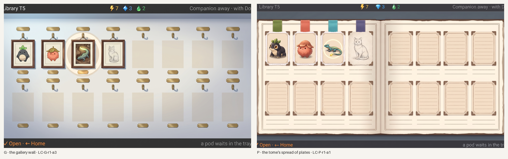
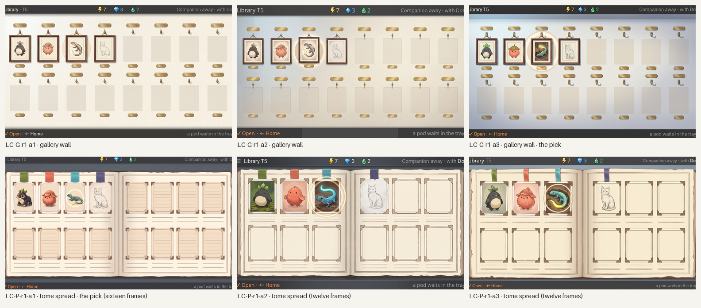

# Station Library, the collection screen: two directions to look at

A **quick visual exploration**, not a full concept round: the owner asked to see two collection-screen directions before choosing, after the cabinet of boxes and the specimen case were rejected ([cabinet](../library-cabinet/README.md), [case](../library-case/README.md)). Three generations each, 1024×600, the Library's botanical-tome vibe; no layout template, no placed strings, no Pip placed (the Loika frame is the generator's creature). Everything here is **generated concept art**; nothing is accepted. Six generations in all (prompts and hashes in [`round1/`](round1/) sidecars).

*Left, G: the gallery wall (LC-G-r1-a3). Right, P: the tome's spread of plates (LC-P-r1-a1). Concept art, generated.*

**G, the gallery wall.** A quiet plaster wall with sixteen hooks in two rows of eight, one per species: three framed portraits (the book's plate in miniature), the met cat as a pencil study in its frame, twelve empty hooks over faint pale rectangles with blank brass plaques. The wall is the synopsis: how many frames hang. No ledge, tags, pins or glass. **What holds:** one dedicated place per species, read at a glance; the empty hooks give no cue. **What fails:** the generator put a plaque above and below every hook (two per place) and no clan grouping shows (the brief asked for one small clan plaque per pair); the lizard frame's focus is a soft glow rather than the cream ring. All three attempts agree closely; a3 has the crispest frames and portraits.

**P, the tome's spread of plates.** The tome open to a double page, sixteen ruled frames (eight per page), tipped-in portraits with photo corners where found, a pencil study where met, empty ruled frames with blank caption rules where not; clan ribbons along the page top above the four met frames as the only grouping; no furniture. **What holds:** the collection as pages of the same book that opens from it, one frame per species, empty frames honest and cue-less. **What fails:** two of three attempts drew only twelve frames (six per page), so a1 is the only count-true one; the ribbons sit at the page's top edge rather than on each frame; the found "portraits" are flat cards rather than the book's framed plates.

*All six, 1024×600 each. Concept art, generated.*

**For the owner's choice.** G gives the stronger sense of a collection as objects on a wall and leaves the most room (a third row of hooks fits at thirty-two); P keeps the Library one object, the book, at the cost of a page turn past sixteen frames per spread. Neither is a round: whichever is chosen gets the usual brief, template, placements (Pip, names) and critique.
