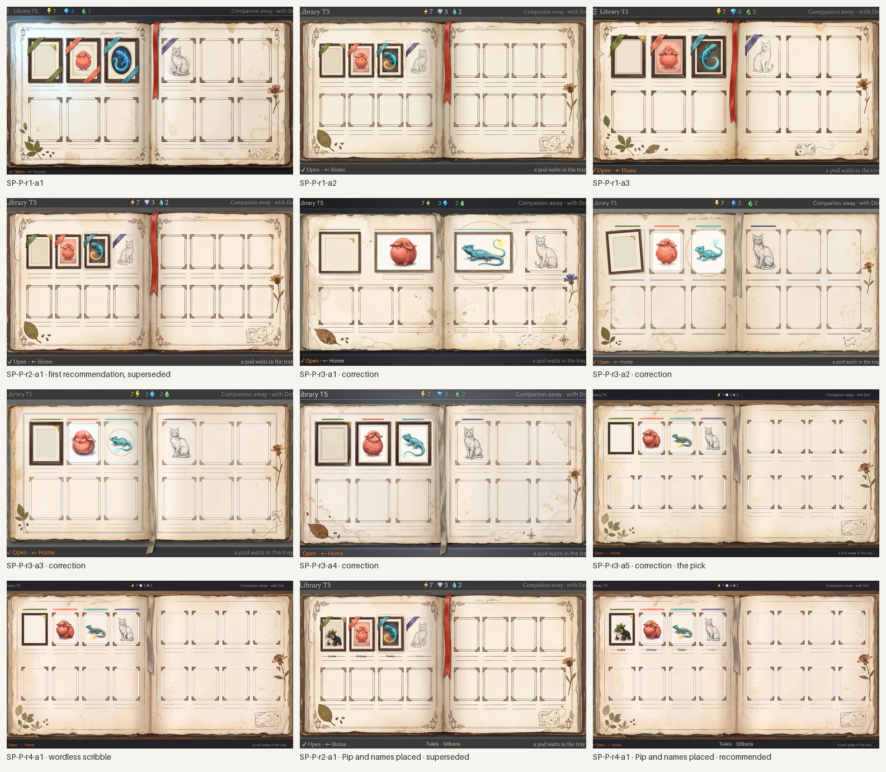
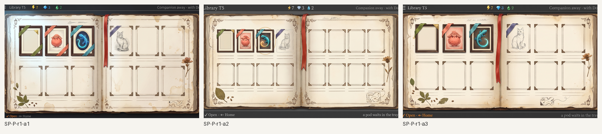
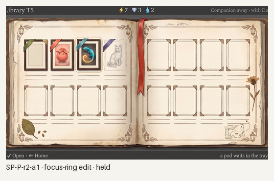
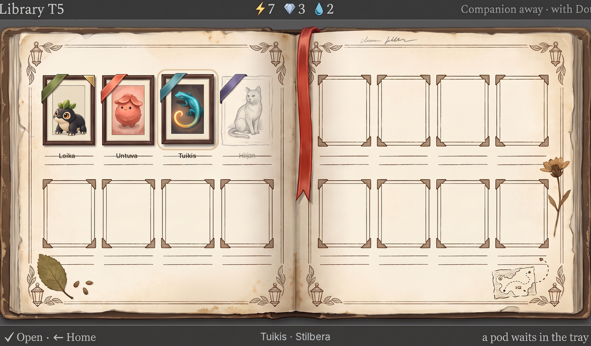
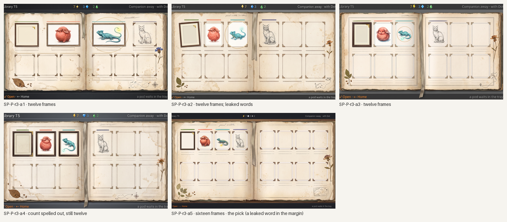
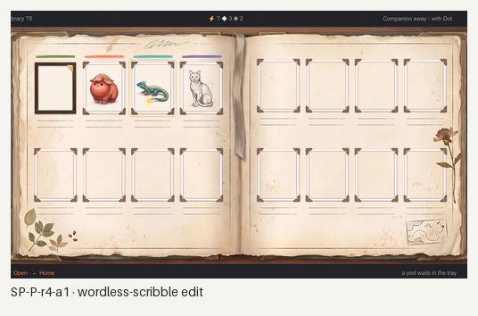

# Station Library, the tome's spread of plates: generated concept candidates

Everything in this folder is **generated concept art** for the Library's collection screen as the owner's chosen direction, the **tome's spread of plates** (after the [two-direction exploration](../library-collection/README.md); the gallery wall was disliked because hooks, plates, frames and lighting stole the spotlight from the specimens), made against [`brief-spread.md`](brief-spread.md). It follows the rejected [cabinet](../library-cabinet/README.md) and [specimen case](../library-case/README.md) and opens into the accepted [book](../library-book/README.md). Nothing is a build capture or an authored master; nothing is accepted until the owner says so.

> **Standing rule (owner, 2026-10-08): no drift to childish art; that was never the vibe anywhere.** The first recommendation of this round (SP-P-r2-a1) drew the warning: its lanterns, scrollwork and ribbons read storybook, its Untuva and Tuikis plates read as stickers, its cat was cute, and the device's type turned serif. Rounds 3 and 4 are the correction round under the rule: a real naturalist's expedition volume in ink and watercolour, restrained ornament, plates at Pip's level of craft, a real pencil study, aged natural colours, the device's own type on the chrome. The rule now stands in every brief ([`brief-spread.md`](brief-spread.md)) and in the studio's notes ([`../README.md`](../README.md)).

**What is placed, not generated.** **Pip** is the accepted rich asset placed into the first plate's empty mat by [`tools/place-asset.py`](tools/place-asset.py) (the generator leaves the mat empty with its gilt corner). The **names** are a text layer set in Inter by [`tools/place-text.py`](tools/place-text.py) from [`layout/text-spread.json`](layout/text-spread.json): the three found names inked on their caption rules, Hiljan in pencil grey, and the bottom line's subject; every caption rule is generated blank. The layout went to the generator as a flat template with the sixteen frames' exact positions ([`layout/`](layout/)).

**Scenario.** Sixteen species released: frames 1–3 Loika (portrayed, gilt corner, the placed Pip), Untuva and Tuikis (focused) as tipped-in framed plates in the book's own plate style; frame 4 Hiljan as a pencil study of a sitting cat; frames 5–16 empty ruled frames with blank caption rules, no cue. Clan ribbons laid over the corners of the four met frames only. The book's life in the margins: worn boards, foxing, a red ribbon marker, a pressed leaf and seeds, a dried flower, a pencil scribble, a tiny map vignette with a dotted route.

*All candidates, 1024×600 each; the last two carry the placed Pip and names. Concept art, not accepted.*

## Round 1: the spread, fresh

Three generations on Pro from one prompt, with Home as the device and the accepted book as the model for paper, ink and the plates.

*Round 1. Concept art, generated.*

- **SP-P-r1-a2 (the pick).** Exactly sixteen frames in the template's positions, eight a page; three small framed plates in the book's style (dark frame, cream mat; the first mat empty with its gilt corner), the pencil cat, the four ribbons on the met frames' corners, the ribbon marker, the pressed leaf and seeds, the dried flower, the pencil scribble, the map vignette, worn boards and foxing. Fail: the focus is a soft oval glow rather than the cream ring.
- **SP-P-r1-a1.** Rejected: twelve frames (the cat moved to the right page and each row lost one); ribbons wrapped across whole plates. Otherwise the richest page.
- **SP-P-r1-a3.** Rejected: fourteen frames, and a legible pencil note leaked into the top margin.

The exploration's lesson repeats: the generator drops frames unless the count is fixed by the template, and even then two of three attempts miscounted; the one that held is the base.

## Round 2: one-change edit

*Round 2. Concept art, generated.*

- **SP-P-r2-a1 (the recommended base).** The focus as a thin cream rounded rectangle around the lizard plate's frame; nothing else moved.

## The first recommendation, superseded: SP-P-r2-a1

*SP-P-r2-a1 at 1024×600, 1×, with Pip and the names placed. Superseded: the owner's warning on childish art named its ornaments, plates, cat and serif chrome. Kept for the record.*

## Rounds 3 and 4: the correction round, no childish art

*Rounds 3 and 4. Concept art, generated.*

Five fresh generations with the rule written into the prompt, the lanterns and ribbons removed (clan marks as inked rules), the plates asked for at the craft of the accepted Pip study (sent as a reference for craft only), the cat as an anatomical field study, and the device's type named as the device's.

- **SP-P-r3-a5 (the pick).** Sixteen frames, four a row on both pages; inked clan rules over the four met frames; the Loika frame dark with its empty mat and gilt corner; the coral creature under its cap and the lizard painted with real volume and a watercolour finish; an anatomical pencil cat with construction lines; the focus a cream rounded rectangle; a cloth marker, a leaf and seeds, a dried flower, a survey sketch; aged, foxed, restrained. Fails: the words "pencil scribble" leaked into the top margin; the top-left string clipped; the counters drawn small.
- **SP-P-r3-a1, a3, a4.** Rejected for twelve frames (three a row), a4 even with the count spelled out; a4 carries the round's finest plates. **SP-P-r3-a2.** Rejected: twelve frames and leaked words.
- **SP-P-r4-a1 (the recommended base).** The margin's words became a wordless scribble; nothing else moved.

## Recommended: SP-P-r4-a1, with Pip and the names placed

*SP-P-r4-a1 at 1024×600, 1×: the accepted Pip in the first plate's mat, the names set in Inter on the caption rules (Hiljan pencilled), the bottom line's subject placed. Concept art, generated and placed; not a build capture, not accepted.*

Checklist from brief-spread.md (section 5), judged on the placed screen:

- [x] 1. Exactly sixteen frames, eight a page, one place per species, seen at once.
- [x] 2. The specimens are the spotlight: framed plates in the book's style, not flat cards; the met cat a pencil study.
- [x] 3. Unmet frames give no cue: empty ruled frames, blank rules, no ribbon, no colour.
- [x] 4. Clan marks per frame (inked rules in the clan colours over the met frames), none at the page edge, none on unmet frames.
- [x] 5. The tome lives, restrained: worn boards, foxing, deckle, a leaf and seeds, a dried flower, a wordless pencil scribble, a cloth marker, a survey sketch, none covering a frame; no scrollwork, lanterns or ribbons.
- [x] 6. The focus is the cream ring on the frame.
- [x] 7. No digits, no ledge, no furniture; the Library stays one object, the book.
- [x] 8. Pip is the placed asset; the names are a placed layer.
- [x] 9. One device with Home; the bottom line's grammar.
- [ ] 10. Strings: exact; the top bar's type is the device's sans this time but drawn small, and the top-left word is clipped at the trim; live text, a minor fail.

What it still lacks: the Untuva and Tuikis plates as the real species' masters (the generator's studies stand in, now at the right level of craft); the page-turn past sixteen; the plate-lifts-into-the-book motion; a painted master.

## Limits

- Pip and the names are the only exact elements; the plates, pencil study, ribbons and the margins' life are the generator's reading of the template and brief.
- The frame count held in one attempt of three in round 1 and one of five in round 3, even with the template and the count spelled out; the master draws the frames from the layout, so this is a concept-round limit, not a build one.
- In round 1 the top bar's type turned serif on every attempt; naming the device's type explicitly in round 3 held it, drawn small. The build sets the chrome.
- Edits hold for one change described in words with "add nothing elsewhere".
- Generated 16:9 canvases trimmed to 1024:600; strings and icons are live and set by the build.

## Three questions for the owner (unchanged; no new questions from the correction round)

1. **Ribbons or ink rules for the clan?** Here each met frame carries a short silk ribbon over its corner in the clan colour; the alternative is an ink rule or a small inked clan mark on the caption rule, quieter and more of the book's hand. Which should the master take?
2. **How much life?** The pick carries a leaf, seeds, a flower, a scribble, a marker and a map, all in the margins. Is that the right amount for every spread, or should the life vary page by page (one or two things a spread) so the specimens stay the spotlight?
3. **The portrayed mark.** Loika's plate wears a small gilt corner on its mat. Keep it, or mark the portrayed species another way the book would (a gilt rule under the plate, a wax seal on the caption)?
