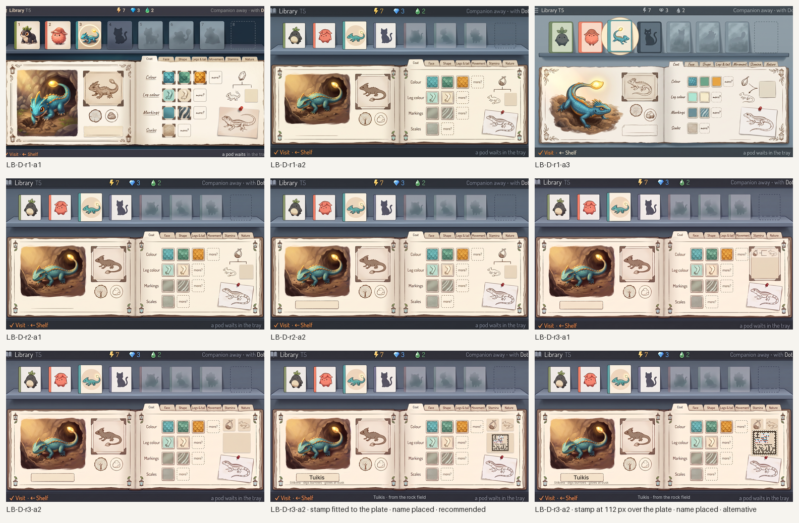
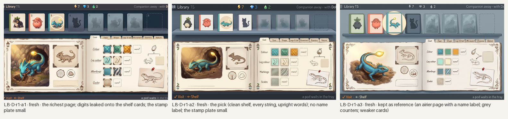
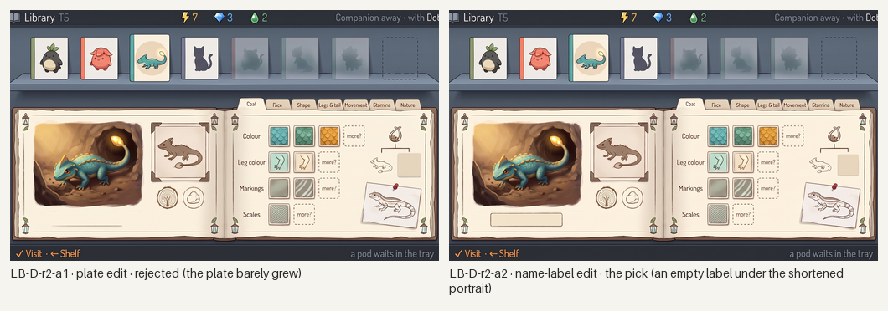
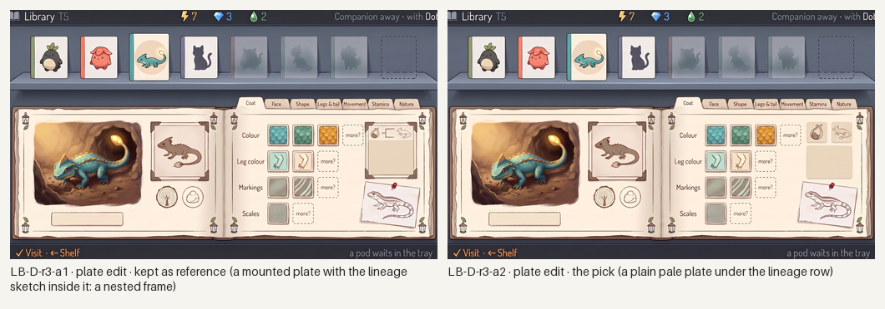
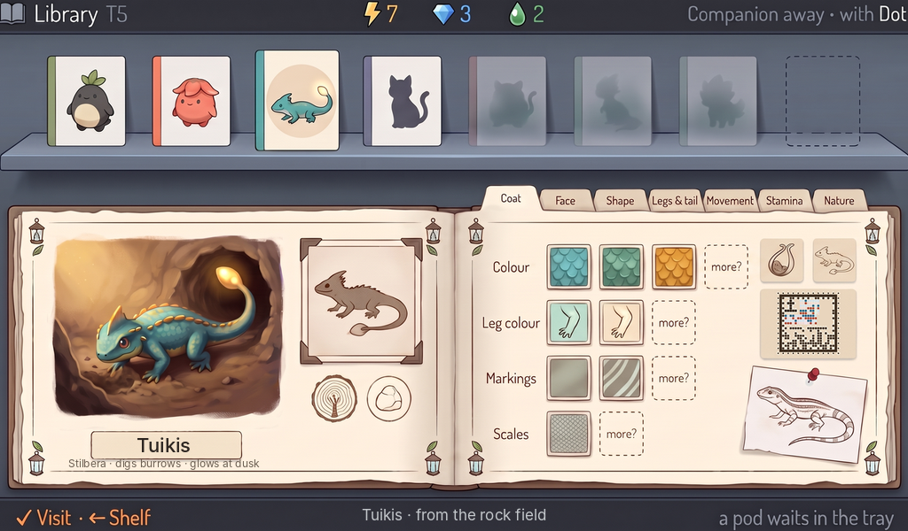
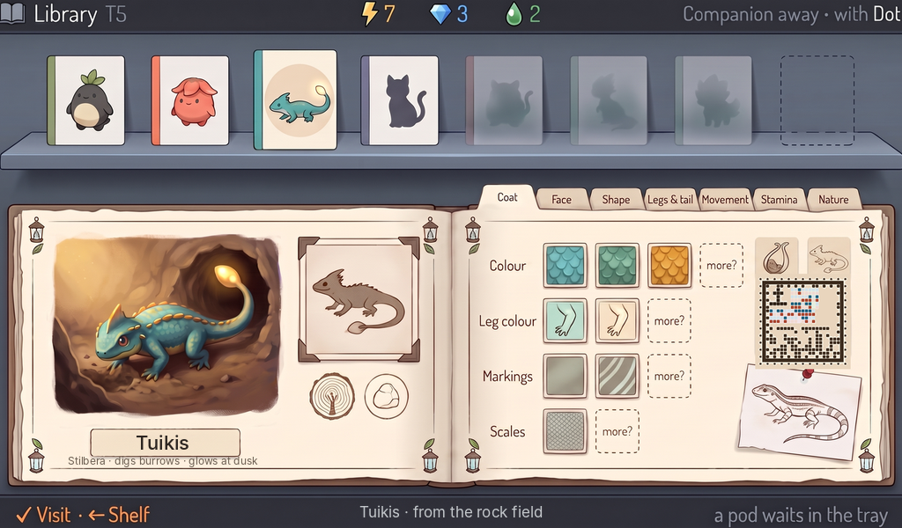

# Station Library: generated concept candidates

Everything in this folder is **generated concept art** for the Library screen (a species' field guide as a page of a botanical tome), made in rounds against [`brief-library.md`](brief-library.md), the research loop's §8 "Library" row, the style guide's "Library" section and the taxonomy's shelves-by-clan and hidden-silhouette rules. Nothing is a build capture or an authored master; nothing is accepted until the owner says so.

**What is placed, not generated.** Two things are placed after generation, as live assets are placed by the build. The **genome stamp** on the lineage's plate is the real styled tome face from [`../../concept-stamp/`](../../concept-stamp/README.md) (S03 Tuikis, every chapter read, C03 family, tome paper), composited onto the generator's empty plate by [`tools/place-stamp.py`](tools/place-stamp.py) and **decoded from the finished 1024×600 screen**. The **species name** and its lines ("Tuikis", "Stilbera · digs burrows · glows at dusk", and the bottom line's "Tuikis · from the rock field") are a text layer set in Inter by [`tools/place-text.py`](tools/place-text.py) from [`layout/text-tuikis.json`](layout/text-tuikis.json): the generator leaves the name plate and the bottom line's centre empty, so no name is baked into a generated plate (the names were approved on 2026-10-07, [species-names.md](../../../design/proposals/species-names.md)). The generator never draws a cell and never writes a name. The layout went to it as a flat template ([`layout/`](layout/)).

**Scenario.** Three species known (Loika, Untuva, Tuikis as bright cards), one met without a pod (a slate silhouette), the rest hidden in mist with a dashed slot at the shelf's edge; Tuikis focused, its seven chapters on the rail (Coat, Face, Shape, Legs & tail, Movement, Stamina, Nature), Coat open with the looks found so far and a dotted "more?" per row; one mibi in the lineage with its stamp; one wish pinned.

*All candidates, every round, 1024×600 each; the last two carry the real stamp and the placed name. Concept art, not accepted.*

## Round 1: the brief's layout, fresh

Three generations on Pro from one prompt, with the stamp round's C03 tome plate as the paper's quality bar, Home as the device and the known-forms concept for the portrait's treatment.

*Round 1. Concept art, generated.*

- **LB-D-r1-a2 (the pick).** A clean shelf (three bright cards with coloured spines, the focused card lifted in its cream ring, a slate cat silhouette, three misty hidden silhouettes, a dashed slot), every string in place including the whole bottom line, upright trait words; the open tome with lantern-and-leaf corners; the portrait digging at its burrow with the tail-lamp glowing, the one warm thing; the frame plate as a pressed sepia specimen; two round place stamps; seven tabs with their words; four rows of pressed-specimen plates each ending in "more?"; a pod-to-mibi branch with a small pale plate; the pinned wish sketch. Fails: no name label under the portrait; the stamp plate far too small for the stamp; a book glyph before the screen name.
- **LB-D-r1-a1 (the alternative).** The richest page, with a name label and the same parts, but the shelf's cards carry leaked digits (one to eight), the trait words are in an italic hand with underlines, and the right string is clipped. Kept for the owner's eye.
- **LB-D-r1-a3.** Kept as reference: an airier page with a name label and a larger plate, but grey counters, weaker cards and a glowing disc for the focus ring.

The Loika card on every shelf is a generic black-and-white creature with leaves, not Pip; names and species identity on the cards are the master's (live) job.

## Rounds 2 and 3: one-change edits

*Rounds 2 and 3: one-change edits of the pick. Concept art, generated.*

- **LB-D-r2-a2** shortened the portrait and added an empty paper label under it; nothing else moved. **LB-D-r2-a1** asked the stamp plate to double and it barely grew; rejected.
- On the labelled pick, **LB-D-r3-a2** made the plate a plain pale square of about 109×78 px under a compact pod-and-lizard row; **LB-D-r3-a1** instead drew a mounted plate with the lineage sketch inside it, a nested frame around the stamp's place, which the decoder's default search rejects (the stamp round's lesson), so it is reference only.

## Recommended: LB-D-r3-a2, with the stamp and the name placed

*LB-D-r3-a2 at 1024×600, 1×. The real Tuikis stamp (C03 family, tome paper) sits on the lineage plate at 76 px, and the name layer is set in Inter. The decoder reads the stamp from this very image: `S13v1-7F-82F9-08AA9F`, every chapter read. Concept art, generated and placed; not a build capture, not accepted.*

*The alternative: the same screen with the stamp at 112 px, its own paper standing in for the plate. Decodes the same; the 76 px fit is enough, so the smaller one is recommended.*

Checklist from brief-library.md (section 6), judged on the placed, named screen:

- [x] 1. Knowledge, never material: pictures of looks on plates, a sketch for the wish; nothing takes.
- [x] 2. Silhouettes reveal only what is known: the met species a slate shape, the unmet ones hidden in mist, the last slot dashed.
- [x] 3. Seven tabs for Tuikis with Nature among them; never a fixed four.
- [x] 4. Every look found is a picture on a plate; each row ends in "more?"; no counts.
- [x] 5. The stamp is the prototype's cells placed on its tome plate and decodes from the finished screen.
- [ ] 6. Two mibis told apart by stamp at 40 px: not tested here (one mibi in the lineage); at 76 px the stamp still decodes, so a 40 px lineage mark must be judged by eye, not by the reader.
- [x] 7. Never a text page: pictures lead, eleven words in ink plus "more?".
- [x] 8. The portrait is the only warm thing; the archive cool and even; a tome, not a cottage.
- [x] 9. No species name in the generated art; the names are a placed text layer; no digits but the counters.
- [ ] 10. Strings: exact, with the bottom line complete, but a small book glyph leaked before "Library" and the trait words are set in a rounded sans rather than Inter; live text, a minor fail.

What it still lacks: the Loika card as Pip and the Untuva card as the real species; the clan plate above a shelf group (here one species per clan, so the spine colour alone carries the clan); the other chapter pages; a painted master.

## Limits

- The stamp and the name are the only exact elements; the shelf cards, portrait, plates and sketches are the generator's reading of the template and brief.
- The plate the generator leaves for the stamp stays small whatever the prompt says (about 60 px fresh, 78 px after two edits); the 25×25-cell Tuikis face still decodes at 76 px here, but a 17×17 face would be safer at that size and the master should reserve 120 px.
- A placed stamp on cream paper needs a plain plate with no frame around it: the mounted-plate variant (r3-a1) is exactly the nested frame the reader rejects.
- Edits hold for one change described in words; none here carried a reference image.
- Generated 16:9 canvases trimmed to 1024:600; the names are live text and would be set by the build, as the layer does here.

## Three questions for the owner

1. **One species per clan, or clan groups?** With every clan holding one species in the first drop, the shelf shows a card per species with its clan's spine colour and no clan plate. Should the shelf already group by clan with a small clan plate (the genus) above each group, so the structure is visible before cousins arrive?
2. **The hidden silhouettes.** Here the unmet species are faint shapes barely darker than the mist, with the met one in solid slate. Is that the right difference, or should hidden ones be pure blank slots until met, with only the dashed slot saying more exist?
3. **The lineage plate's size.** The stamp decodes at 76 px here, but a 40 px lineage mark cannot be read by the decoder and must be told apart by eye. Should the Library carry the stamp at 120 px on a species page and smaller marks only in the branch, or keep one size everywhere?
