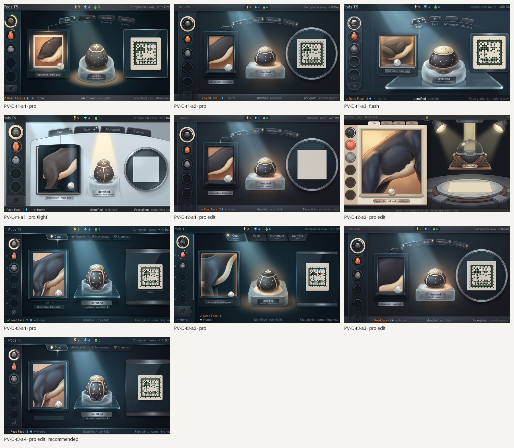
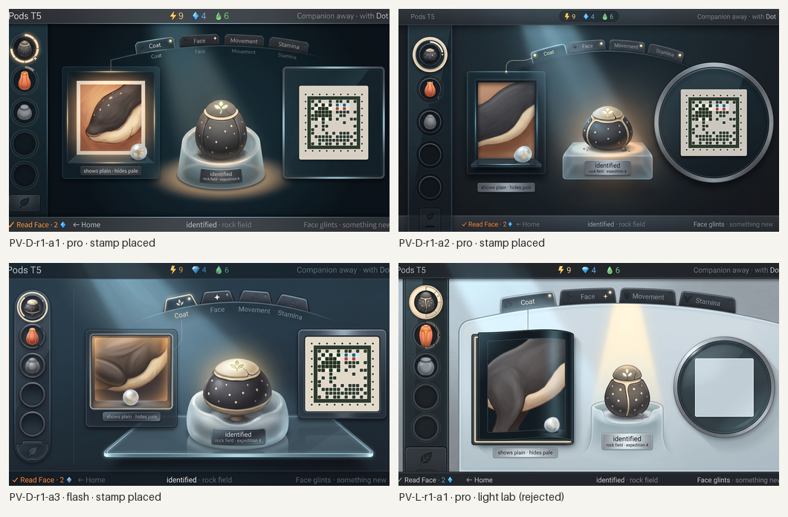
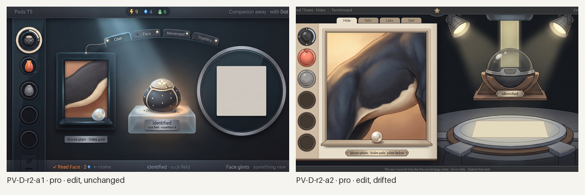
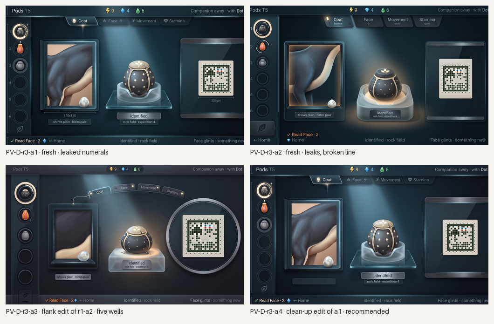
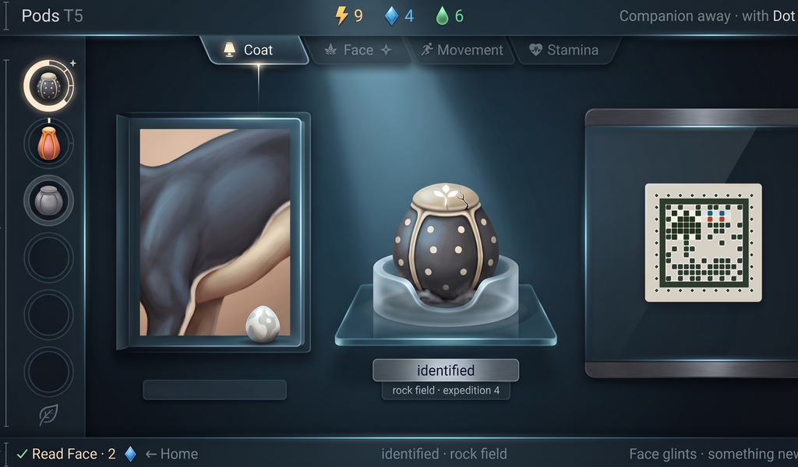

# Station Pods v2, Pod list and Read: generated concept candidates

Everything in this folder is **generated concept art** for the research bench's "Pod list and Read" screen, made in rounds against [`../pods/brief-pods-v2.md`](../pods/brief-pods-v2.md), the research loop's §8 rows and the style guide's Pods section. Nothing is a build capture or an authored master; nothing is accepted until the owner says so. The first Pods round ([`../pods/`](../pods/README.md)) was rejected before the research loop existed; this one is built on the loop.

**What is placed, not generated.** The genome stamp on the stage plate is the real styled stamp from [`../../concept-stamp/`](../../concept-stamp/README.md) (the hopper frame, C01 family (the hopper frame's clan), bench paper, 300 px), composited into the screen's empty stage-plate square by [`tools/place-stamp.py`](tools/place-stamp.py) after generation, and then **decoded from the finished 1024×600 screen** with the prototype's decoder. The generator never draws a cell. The pod list's progress rings, the tabs and the page were given to the generator as a flat layout template drawn to the brief's numbers ([`layout/`](layout/)); the generator's rings are judged against it.

**Where this departs from the brief.** The brief's strings include "Hopper pod" and "a hopper felt safe". The taxonomy has since withdrawn the frame names and the names are being revised, so no species name is baked into the art: the plate reads "identified" over "rock field · expedition 4" and the bottom line's subject is "identified · rock field". The species is carried by the glyph on the pod's cap and by the stamp. The brief's "misty seed" is drawn as the taxonomy's "sleeping bud": a pearl bud on the sill with the hidden look inside.

*All candidates, every round, 1024×600 each, with the real stamp placed. Concept art, not accepted.*
## Round 1: the brief's layout, dark and light

Four generations: the dark modern lab (the owner's bar) twice on Pro and once on Flash, and the light-lab variant once on Pro. Each was asked to leave the stage plate's square empty; the real stamp was then placed into it and the finished screen decoded.

*Round 1 with the stamp placed where the square came out clean. Concept art, generated; the stamp is real.*

**PV-D-r1-a2 (Pro), the pick.** The strongest lab: deep glass, lit edges, a round stage plate carrying a clean pale square, the beam from the upper left pooling on a pod that is the renderer's hopper pod (squat charcoal shell with cream dots, cream seam and cap, the three-leaf glyph lit with its crack, grey dust at the base) on a frosted cradle with its plate; four tabs on an arc with lamps, Coat focused with its hairline to the page, Face wearing the star; the pod list with the current pod lifted inside a cream ring and its progress ring starred, a tall coral pod with a notched hairline ring, a grey sealed pod with an empty ring, the gate with its leaf; every string in place and inside the trim. Fails: five wells, not six; the page's flank is a brown-and-cream hide, not the hopper's charcoal; the progress ring's arcs are not sized by trait count.

**PV-D-r1-a1 (Pro).** Kept as reference: the same layout with the right charcoal flank and bud, but the tab words are doubled (on the tab and under it), there are five wells, and both edge strings are clipped.

**PV-D-r1-a3 (Flash).** Rejected: five wells, a brown flank, the left string clipped; useful only as a layout check (its tabs carry emblems and lift the focused one well).

**PV-L-r1-a1 (Pro, light lab).** Rejected: the pale aluminium chrome is handsome, but the pods in the list and on the stage became beetles. The light variant stays an owner question, not a candidate.

**Choice.** D a2. Round 2 is one two-change edit of it, twice: six wells, and the charcoal flank.
## Round 2: two-change edits of the pick

*Round 2: the same two-change edit twice. Concept art, generated.*

- **PV-D-r2-a1**, rejected as a no-op: asked for six wells and a charcoal flank, the model returned the screen unchanged (five wells, brown hide).
- **PV-D-r2-a2**, rejected: the same edit drifted into a theatre stage with spotlights, a globe on a pedestal, invented tabs and garbled text.

The well count has now resisted every edit across three Station screens (Home, Pods, Pods v2): the model copies a five-well column and will neither add a well nor recolour a flank inside an edit. Round 3 therefore goes back to fresh generations with the count spelled out well by well, plus one single-change edit for the flank alone.
## Round 3: fresh with the count spelled out, and one-change edits

*Round 3 with the stamp placed. Concept art, generated; the stamp is real.*

- **PV-D-r3-a1 (fresh, Pro).** Six wells at last, three occupied and three empty under the gate; the flank is the hopper's charcoal with its cream belly edge and the bud on the sill; the tabs carry emblems and Coat is lifted, Face wears its star; the pod has its glyph and crack; the pale square is clean. Spoiled by leaks: the prompt's numbering came through as small digits beside the wells, and two measurement captions appeared under the page and the square. Kept as the near-pass and sent to a clean-up edit.
- **PV-D-r3-a2 (fresh, Pro).** Six wells and a charcoal flank too, but the numerals leaked again, the tabs grew subtitles, and the bottom line broke into two rows. Rejected.
- **PV-D-r3-a3 (one-change edit of the round-1 pick, Pro).** The flank-only edit held exactly: the page now shows the charcoal flank with its cream edge, and nothing else moved. Five wells remain. Kept as the clean fallback.
- **PV-D-r3-a4 (one-change clean-up edit of a1, Pro).** The stray numerals and captions are gone and everything else held: six wells, the charcoal flank with its bud, the tabs, the pod, the clean square. One loss: the trait line's small plate under the page came back empty, so "shows plain · hides pale" is missing (live text the build sets, a minor fail). Kept and recommended.

## Recommended: PV-D-r3-a4, with the stamp placed

*PV-D-r3-a4 at 1024×600, 1×, with the real hopper stamp (C01 family, bench paper) placed on the stage plate. The decoder reads the stamp from this very image: `S11v1-0F-8898-7EC96C`. Concept art, generated; not a build capture, not accepted.*

Checklist from brief-pods-v2.md (section 11), judged on the placed screen:

- [x] 1. The list shows every pod at a glance: the current pod lifted in its cream ring with a starred progress ring, a coral pod with a hairline ring and notch, a grey sealed pod with an empty ring, three empty wells, the gate with its leaf; six wells.
- [ ] 2. The progress ring reads at a glance with no digits: yes for digits, but its arcs are not sized by trait count (one solid arc and a star, the rest a thin ring).
- [x] 3. Chapters as tabs with emblems; the glinting chapter found in one glance (the star on Face); the price in the bottom line.
- [ ] 4. The result as pictures: the shows-and-hides state reads (the charcoal flank, the pearl bud on the sill), but its line is missing from the plate, and only this one state is shown.
- [x] 5. Unread shows nothing: the unread tabs are plain, the unread stamp chapters are empty blocks.
- [x] 6. Never digits of progress, locus counts, letters, ratios or "locked": none on the screen.
- [x] 7. The genome stamp is the prototype's cells placed, not redrawn, and it decodes from the finished screen.
- [x] 8. The pod is the warmest, brightest thing; the chrome stays cool.
- [x] 9. The pod is the renderer's hopper pod (medium, squat, smooth charcoal shell with cream dots, cream seam and cap, the three-leaf glyph with its crack, dust at the base); nothing on the shell says plain or pale.
- [x] 10. One device with Home (type, counters, bottom-line grammar, light) in a modern digital lab.
- [x] 11. Labels one quiet word each; captions on plates; no species name.
- [x] 12. Strings exact and inside the trim except the right edge's last word ("something new" clipped); flat screen, no bezel.

What it still lacks: the trait line on its plate; progress-ring arcs sized by trait count; the stamp at the brief's 300 px rather than the generator's 145 px square; the other read states (only, asleep, breed to change, sealed) in companion frames; a painted master.

## Limits

- The stamp is the only exact element: it is the real styled face placed after generation and decoded from the finished 1024×600 screen. The progress rings, tabs and page are the generator's reading of the template and are judged, not exact; the build draws them from the frame.
- No species name is in the art (the names are being revised), so the plate reads "identified" where the brief wrote "Hopper pod"; the species is carried by the glyph and the stamp.
- Edits of this family hold only for small changes on the dark-lab result and never for the well count; fresh generations with the count spelled out are the only route that moved it.
- The light-lab variant was tried once and the generator turned the pods into beetles; it is an owner question, not a candidate.
- Generated 16:9 canvases trimmed to 1024:600; live text is set by the build.

## Three questions for the owner

1. **Stamp on a round plate or a square label?** The generator keeps putting the stamp's pale square inside a round stage plate at about 180 px; the brief asked for 300 px on a glass plate. The small stamp still decodes. Keep the round plate and the smaller stamp, or enlarge the stamp to the brief's 300 px and lose the plate?
2. **Pod list: shells or rings?** On every candidate the progress ring reads as a frame around the shell; the owner's "the centre fills at Identify" is barely visible behind a pod. Should the ring sit beside the shell (a small ring and a small pod) rather than around it?
3. **Dark lab confirmed for the bench?** Every pass this round came from the dark glass treatment; the one light-lab attempt failed on the specimen, not the chrome. Is dark the bench, so the Create and Incubator screens follow it?

## Owner decisions (2026-10-07)

Recorded in the [style guide's Pods section](../../../design/style-guide/station-screens.md#pods); the reference is this round's PV-D-r3-a4.

1. **The stamp sits on a square label of about 220 px, no round plate.** Neither the brief's 300 px glass plate nor the generator's 145 px square inside a round plate: a flat square label at 220 px on the stage. The placed stamp decodes at both tested sizes, so 220 px is safe.
2. **The progress ring sits around the pod's shell and carries chapters only.** "Identified" is shown by the pod's seal (broken, glyph lit), not by a filled centre behind the shell, so the ring's arcs are all it has to say.
3. **The dark glass lab is the bench.** Create and Incubator follow this treatment; the light-lab variant is closed.

No new generation for Pods now. The painted master carries the two known gaps of the recommended candidate: progress-ring arcs sized by trait count, and the read result with its caption ("shows plain · hides pale") on its plate.
