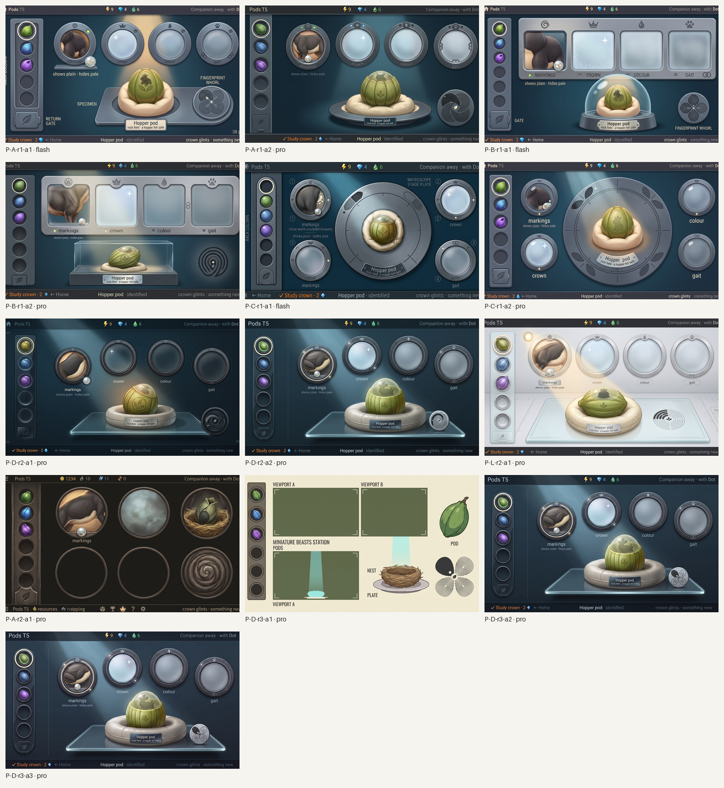
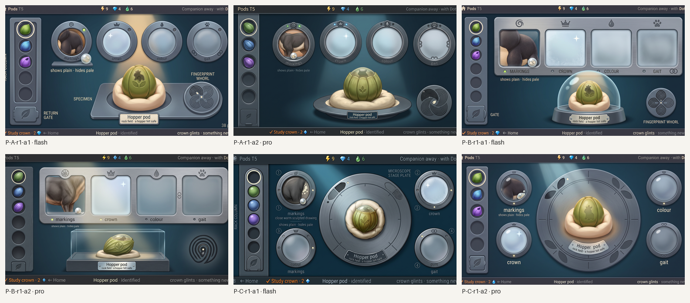
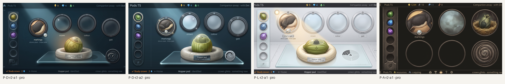
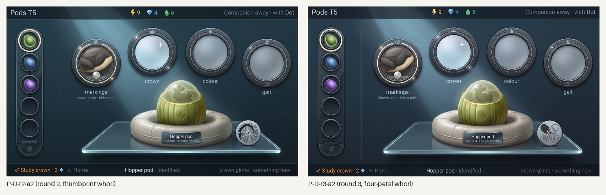
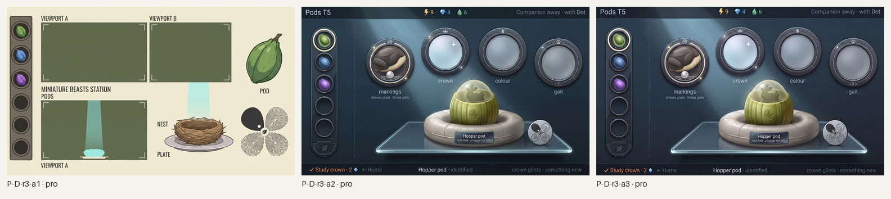
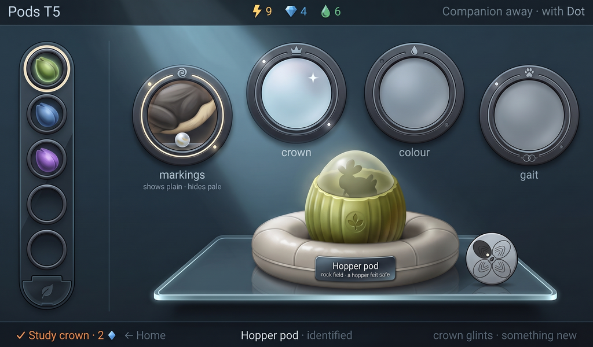

# Station Pods: generated concept candidates

Everything in this folder is **generated concept art** for the Station's Pods screen, made in rounds against [`brief-pods.md`](brief-pods.md) and the style guide's Pods section ([design/style-guide/station-screens.md](../../../design/style-guide/station-screens.md)). Nothing is a build capture or an authored master, and nothing is accepted until the owner says so. Caption every use as "Concept art, generated". The quality bar and sibling screen is the approved Home candidate [`A-r3-a1`](../round3/A-r3-a1-1024x600.png): Pods has to read as the same device.

*All Pods candidates, every round, 1024×600 each. Concept art, not accepted.*

**The brief in one breath.** Pods is where a pod is identified, studied, compared and returned. The pod on its padded nest under the instrument beam is the one warm, bright thing on the screen. Four trait windows rise in an arc above it as machined viewports: one studied (a close drawing of what shows, a misty seed on the sill for what hides), one frosted with a glint, two frosted. The fingerprint whorl sits on the stage plate with one petal lit. The rack column at the left holds six wells and the return gate. Carried in from the owner's decisions: Inter type, fine grain only on creatures and world, one small engraved word per object read second, names on plates, six wells, Pip placed not re-imagined.

[`prompts.json`](prompts.json) records every call in the homepage schema. Round folders keep `raw/{tag}.jpg` for kept candidates, `{tag}-canvas.png` (16:9 at 1536×864), `{tag}-1024x600.png` (the centred 1024:600 band) and a sidecar per call. [`layout/`](layout/) holds the generator's layout inputs: the proposal's wireframes rendered to PNG and a notes-free flat template. They are inputs, not candidates.
## Round 1: three directions, two models each

Judged against the brief's checklist, the guide's Pods "Pass when" list, and (from round 2 on) the owner's vibe note: the bench is a modern digital lab. Round 1 was generated before that note and matches Home's chrome.

*Round 1: A specimen stage (arc of viewports), B pane bank, C stage ring; Flash left, Pro right in each pair. Concept art, generated.*

**A specimen-stage.** The brief's layout: rack column, arc of four machined viewports, pod on its nest under the beam, whorl on the plate.
- Pass (a2, Pro): the viewports read as instrument lenses with emblems, lamps and one quiet word; frost shows nothing behind it; the crown's glint is one star; the gait ring wears the joined rings; the whorl is four petals of ridges with the first filled; the pod's top clears to a silhouette; the gate has its leaf; every string is present and spelled right.
- Fail (a2): five wells; the markings viewport draws a brown-and-white cow hide instead of the hopper's charcoal flank; the right-hand strings run into the trim.
- Fail (a1, Flash): the prompt's part names leaked as captions ("RACK COLUMN", "RETURN GATE", "SPECIMEN", "FINGERPRINT WHORL"); five wells; strings clipped.

**B pane-bank.** A straight bank of four glass panes in one brushed housing, the pod in a glass case below.
- Pass (a2, Pro): six wells; the quietest labels of the round (a lamp dot and one word); the bank reads as a precision instrument.
- Fail (a2): the whorl became a thumbprint icon; the hide is a horse; strings clipped on both sides. a1 leaked "GATE" and "FINGERPRINT WHORL" and used caps labels.
- Rejected as a direction; its label treatment and six-well rack are carried as a reference into round 2.

**C stage-ring.** A circular microscope stage with the viewports around it.
- Pass (a2, Pro): handsome and calm; the pod and nest are the best-modelled of the round.
- Fail: no whorl at all (the ring's engraved leaves are not the glyph); five wells; labels large; a drop icon where the bottom line needs a diamond. a1 leaked "MICROSCOPE STAGE PLATE" and a whole prompt sentence.
- Rejected as a direction.

**Choice.** Direction A's structure. Round 2 re-treats it as a modern digital lab (dark glass and light aluminium variants), fixes the wells, the flank and the margins, and keeps one small edit of a2 as the Home-chrome fallback.
## Round 2: the lab vibe, four on Pro

The owner's vibe note arrived after round 1: the research bench is a modern digital lab, not Home's plasticky module chrome, while staying one device (type, counters, bottom line, light). Round 2 re-treats direction A's structure two ways and keeps one small edit of the round-1 pick as a fallback.

*Round 2: D dark lab (two seeds), L light lab, and the fallback edit of A. Concept art, generated.*

**D dark-lab.** Deep dark glass and anodised graphite with lit edges, a floating glass stage plate.
- a2, kept, the near-pass: the viewports are pale frost with nothing behind them, the crown's glint is one star, the gait ring wears the joined rings on its lower edge, the markings viewport shows a charcoal flank with its cream belly edge and the pearl seed on the sill, the pod's top clears to the silhouette, the plate carries both strings, every string is inside the trim. Fails: five wells; the whorl is a thumbprint, not four petals.
- a1, kept as reference: the same vibe with the strongest glass and lit edges, but its unstudied panes read as dark unlit glass rather than frost, the whorl is a vortex, five wells, and two tiny fragments leaked at the edges.

**L light-lab.** Frosted white glass and brushed aluminium on a pale bench.
- a1, kept as the alternative for the owner: calm, exact, and the most "laboratory" of the set; the whorl is concentric arcs with a leaf, closer to the spec than the thumbprints. Fails: five wells; a small lamp disc drawn at the top left; strings clipped at both edges; a leaked fragment at the right.

**A fallback edit.** Rejected: the three-change edit of the round-1 pick drifted into a fantasy game interface with invented currencies and icons. Edits of this family are reliable only on the dark-lab result, which round 3 uses.

**Choice.** D a2. Round 3 is one two-change edit of it, twice: six wells, and the whorl as four petals with the first lit.
## Round 3: two changes, then one

*Left: P-D-r2-a2, round 2. Right: P-D-r3-a2, the round 3 edit. Concept art, generated.*

*Round 3: the two-change edit twice, then the one-change wells edit. Concept art, generated.*

- **P-D-r3-a1**, rejected: the two-change edit drifted into a labelled diagram on cream paper.
- **P-D-r3-a2**, kept and recommended: the same edit held; the whorl is now four petals of ridges with the first filled and a leaf at the centre, everything else of P-D-r2-a2 preserved. Five wells remain.
- **P-D-r3-a3**, rejected as a no-op: a one-change edit asking for six wells returned the screen unchanged. Three attempts across the screen's rounds failed to add a sixth well to a five-well rack; the generator counts badly. The master fixes it by hand.

## Recommended: P-D-r3-a2

*P-D-r3-a2 at 1024×600, 1×. Concept art, generated; not a build capture, not accepted.*

Checklist from the brief (section 10):

- [x] 1. Frosted windows show nothing behind the frost.
- [x] 2. The window states shown are told apart without colour: clear pane with a seed, frost with a star, plain frost, frost with joined rings. (Through-and-through and shutter are not in this frame.)
- [x] 3. The whorl is pretty when plain and its one lit petal reads as a study.
- [x] 4. No letters, ratios, loci or code.
- [x] 5. The pod is the warmest, brightest thing; the chrome stays cool.
- [x] 6. The windows read as machined instrument viewports.
- [x] 7. Same device as Home: type, counters, bottom line and light direction match; the chrome is the lab's dark glass, as the vibe note asks, not Home's modules.
- [ ] 8. Rack: five wells, not six (three shells in place colours, the focused well lifted, the gate with its leaf all pass).
- [x] 9. Labels are one small word each, read second; the name and origin sit on a plate.
- [x] 10. Pip's identity is placed: the flank is charcoal with its cream belly edge; the silhouette in the shell has the three-leaf crest.
- [x] 11. Strings as the brief, legible at 1×, spelled right, inside the trim.
- [x] 12. Flat screen, no bezel, fills the canvas; no wood, felt or shelves.
- [x] (vibe) Reads as a modern digital lab: dark glass, lit edges, exact readouts, the lamp on the pod.

What it still lacks: the sixth well; the engraved emblems on the rings are small and generic (a crown and a drop read, the swirl and the paw barely); the unidentified, compare, gate-focused and shutter states; a painted master.

## Limits

- Generated 16:9 canvases trimmed to 1024:600, not screens drawn at 1024×600; icon shapes and well counts drift between generations, and live text will be set by the build.
- Edits of this family hold only when they ask for one or two changes on the dark-lab result; three of the seven edits across the screen's rounds re-rendered the whole image.
- The light-lab variant (P-L-r2-a1) is kept as an alternative, not a runner-up: it fails the same well count and clips its strings, but its vibe is the question for the owner, not its finish.

## Three questions for the owner

1. **Dark lab or light lab?** P-D-r3-a2 is deep dark glass with lit edges; P-L-r2-a1 is frosted white glass and brushed aluminium. Both are "modern digital lab" and both sit next to Home's dark frame. Which is the bench?
2. **Five wells in the concept, or hold for six?** Three edits could not add the sixth well. The master will draw six; is the concept acceptable to sign off with five, with the count noted, or should another round be spent on it?
3. **Window emblems: on the ring or as the word only?** The engraved emblems come out tiny and generic at 1×; the word under each window carries the meaning. Keep both, or drop the emblem and let the word and the lamp do it?
