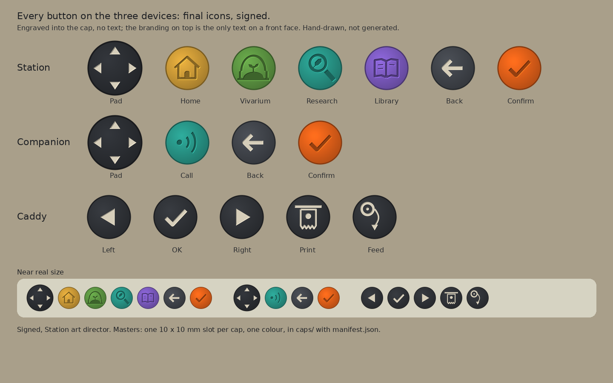

# Device buttons

Every button on the Station, the Companion and the Caddy carries an engraved icon and no text. The branding on top is the only text on a front face. One drawing per meaning: the pad, back and confirm are the same on every device, and the Caddy's OK is confirm.

*device-buttons-final.png: every button on the three devices, near real size in the bottom row. Hand-drawn master sheet, signed.*

| Device | Buttons |
| --- | --- |
| Station | pad, Home (a house), Vivarium (a terrarium arch over a mound with a sprout), Research (a lens over a leaf), Library (the field journal, open), back, confirm |
| Companion | pad, Call (a dot sending two arcs), back, confirm |
| Caddy | left, OK (confirm), right, Print (a card whose lower edge is torn in teeth), Feed (a thin strip of paper running from the roll) |

## Cap masters

`caps/`: one master per cap, the 10 × 10 mm icon slot centred on the 15 mm cap (the pad: a 20 × 20 mm slot centred on its 26 mm rocker face, an arrow on each axis where the thumb presses, the centre blank), at 100 px per mm, one colour (white is the cut). Every cap shares one scale, so icons keep their relative sizes. The Station and Companion keys are cut tone on tone into the coloured cap; on the dark caps (pad, back, the Caddy's keys) the cut is filled with bone paint. Cap colours: Home ochre `#dba53a`, Vivarium green `#63a046`, Research and Call teal `#2a9f90`, Library violet `#8460cd`, confirm orange `#f0661a`, back `#454950`, pad `#2e3136`, Caddy charcoal `#33363b`. `caps/manifest.json` lists each with its hash.

## Title marks

`marks/slices/frame-room-{home,vivarium,research,library}-24.png` (with `marks/slices/manifest.json`): the Station's on-screen title marks, 24 × 24, hand-placed pixel by pixel from the same four drawings, each in one Station palette colour that matches its key (`gold`, `grass`, `teal`, `lilac`). `frame-room-vivarium-24` replaces the habitat mark. Proofs at 1× and 8× on the bar's slate are beside them.

## Source

`source/drawings.py` holds the drawings, `source/masters.py` cuts the cap masters and the sheet from them, and `source/marks.py` holds the 24 px marks as pixel grids.

## Hashes (sha256)

- `device-buttons-final.png`: `7eb6fd1dee3a841146821e1f641338d729bc24b662a91519213c5392421c715b`
- `marks/slices/frame-room-home-24.png`: `cfa9ac14a811a04f098bf939c6a60a7e64490b81cad254f6e8896e5312399ec8`
- `marks/slices/frame-room-library-24.png`: `764d9ed80d21165b7e60abbe950188724301a95127ab1727d876651ced406ac4`
- `marks/slices/frame-room-research-24.png`: `1adadf0b760e3c447547c064837cf1b80b9974d9490ada361f5ff0ff8ee75be3`
- `marks/slices/frame-room-vivarium-24.png`: `50efba0be741c452e382595ccef33f30fcf4f883ee2c7794ed6b6566be2ee83b`

Cap master hashes are in `caps/manifest.json`.
