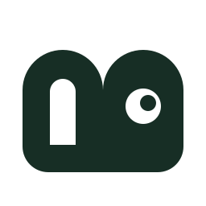
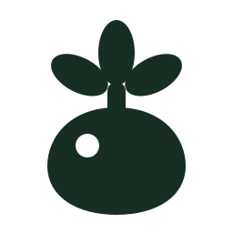
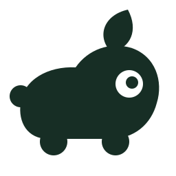
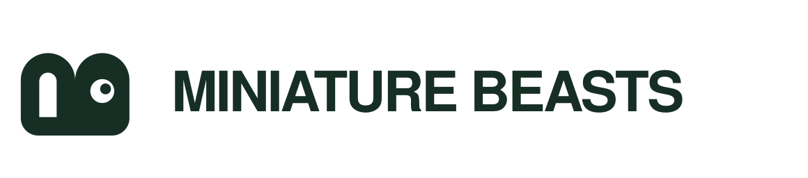
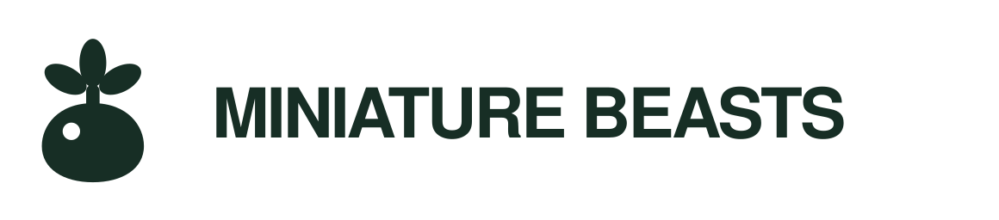

# Logo proposals

Miniature Beasts needs a logo or monogram (decision, 2026-10-06). Three directions
for the owner to choose from. All are one-colour forest `#172e25` marks on a 256×256
grid with plain filled paths; each has a lockup with "MINIATURE BEASTS" set as live
text (Arial Black / Helvetica, weight 900, tight tracking). See
[`contact-sheet.png`](contact-sheet.png): 256, 64 and 16 px, 1-bit threshold at 96 and
24 px, a simulated emboss on shell plastic, reversed on forest, and the lockups.
The sheet was rendered in headless Chromium without Arial Black installed, so the
lockup type there is a fallback heavy sans; the real face sets slightly wider.

*contact-sheet.png: the three proposals at 256, 64 and 16 px, 1-bit, embossed, reversed and as lockups. Proposals, none chosen yet.*

<table>
<tr>
<td align="center" valign="top"> <em>A, monogram (A-monogram.svg). Proposal; kept as a secondary badge idea.</em></td>
<td align="center" valign="top"> <em>B, seed-pod (B-seedpod.svg). Proposal; on-story but least distinctive.</em></td>
<td align="center" valign="top"> <em>C, mibi silhouette (C-silhouette.svg). Proposal; recommended as the primary mark.</em></td>
</tr>
</table>

## A. Monogram (`A-monogram.svg`)

*Lockup A (A-monogram-lockup.svg): mark with "MINIATURE BEASTS" as live text. Proposal.*

A "B" lying on its back: its stem is the base and its two bowls rise as the humps
of an "M". One counter stays a letter, the other becomes a round eye, so the
initials wake up as a small creature.
- **Says:** the name, compactly; a wink of life. Most "ownable" as a badge.
- **Fails:** the M and B take a moment to see, and once seen the joke is the whole
  idea. At 16 px it reads as a dark rounded block with an eye; at 24 px 1-bit the
  slot counter is fine. Squarer than the rest of the house style.

## B. Seed-pod (`B-seedpod.svg`)

*Lockup B (B-seedpod-lockup.svg): mark with "MINIATURE BEASTS" as live text. Proposal.*

A plump, sealed pod sprouting three rounded leaves; a round highlight gives volume.
- **Says:** the game's core promise: you bring home a pod and something grows
  out of it. Echoes the pod icon already used on the device screens.
- **Fails:** generic outside the game (plant shop, turnip, radish). The highlight
  can read as an eye, which helps or muddles. Three leaves at the top are close to
  Pip's tuft, which ties the mark to one creature if Pip is not the mascot. At
  16 px the leaves merge into a crown.

## C. Mibi silhouette (`C-silhouette.svg`)

*Lockup C (C-silhouette-lockup.svg): mark with "MINIATURE BEASTS" as live text. Proposal, recommended.*

An abstract creature in profile: soft loaf body, big round eye, stubby feet, a
tail nub and one sprout leaf. No ears, horns or species features.
- **Says:** "small creature you look after", instantly; rounded and tactile like
  Miniature Lives. Strongest silhouette at every size, including 16 px and 1-bit.
- **Fails:** some will see a piglet or a hippo; a creature mark also sets
  expectations before the roster exists. Must never be coloured or detailed into
  a "species".

## Recommendation
**C** as the primary mark: it is the only one that reads at favicon size and on
thermal paper without explanation, and it embosses as a clean, friendly shape.
Keep **A** as a secondary badge idea (stamp, seal on packaging). B is the most
on-story but the least distinctive.

## Using the mark
- **Colour:** forest `#172e25` on paper `#f5f2e9` or white. Reversed: paper on
  forest. Accent orange `#ee9b58` (on dark) or `#b45020` (on light) is optional
  for the mark only, never for the wordmark; no gradients, outlines or shadows.
- **1-bit / Caddy:** print solid black, no dithering; the knockouts (eye,
  highlight, counter) are paper. Minimum 24 px tall (about 3 mm at 203 dpi).
- **Emboss / deboss:** use the silhouette only, no fine knockouts under 1.5 mm.
- **Clear space:** at least one quarter of the mark's height on every side (the
  width of the eye in C); in the lockup, the gap between mark and text is fixed.
- **Minimum size:** mark 16 px (favicon) / 5 mm print; lockup 120 px / 25 mm wide.
  Below that, use the mark alone.
- **Don't:** redraw, stretch, rotate, add paws, outline, or set the wordmark in
  another face. The lockup text is live; convert to outlines only for production.
