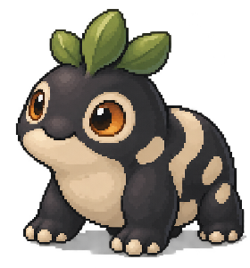
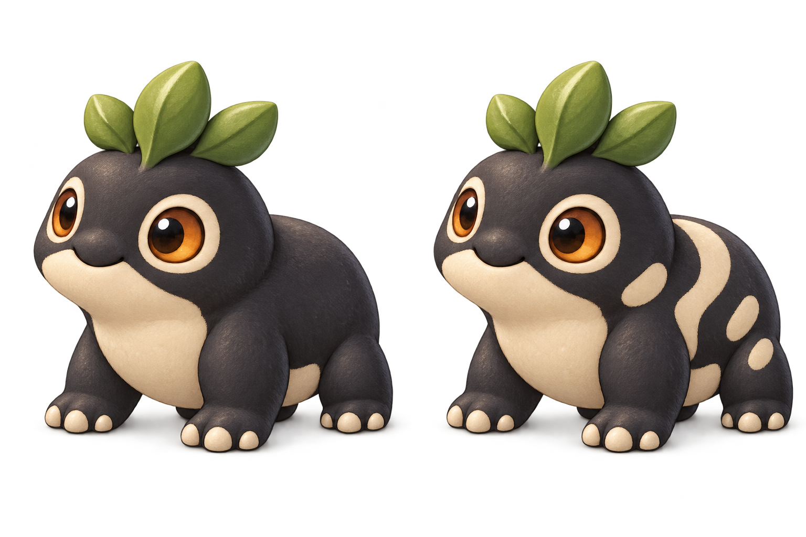

# Miniature Lives at device size

The creature should feel rounded, tactile and alive even when its image occupies only part of a small screen. This study is the accepted appearance reference for [Miniature Lives](../visual-directions/README.md#b-miniature-lives): a crisp HiBit treatment for Companion and a matched richer treatment for Station and larger image regions. Further artwork should preserve this relationship across display sizes.

Plain saved Pip and a separate hypothetical marked specimen share the same body plan, crown, pose and lighting. The comparison isolates the coat pattern; it does not change Pip's saved appearance or predict an offspring. Full portraits assume complete knowledge. Partial research still requires anatomy-free references.

## Companion

*exports/companion-resident.png: Companion resident proposal (450×600, 1×). Accepted appearance reference.*

The 450×600 composition reserves 280×300 pixels for the creature. Identity and inherited meaning remain readable outside the artwork. The focus is on the existing visit action; this still image shows neither an executed action nor a resulting behavior.

<table>
<tr>
<td align="center" valign="top"> <em>assets/hibit-plain-280x300.png: saved Pip, HiBit creature area (280×300, 1×). Accepted.</em></td>
<td align="center" valign="top"> <em>assets/hibit-marked-280x300.png: hypothetical marked specimen, HiBit (280×300, 1×). Accepted.</em></td>
</tr>
</table>

## Station

*exports/lab-known-comparison.png: Station known comparison proposal (1024×600). Accepted appearance reference.*

The 1024×600 composition uses equal 300×310 artwork areas for saved Pip and the hypothetical marked specimen. It is a free, fully-known comparison, not a breeding operation or a newly acquired resident. Richer shading must preserve the same trait boundaries.

<table>
<tr>
<td align="center" valign="top"> <em>assets/rich-plain-300x310.png: saved Pip, richer treatment (300×310, 1×). Accepted.</em></td>
<td align="center" valign="top"> <em>assets/rich-marked-300x310.png: hypothetical marked specimen, richer treatment (300×310, 1×). Accepted.</em></td>
</tr>
</table>

[Tall comparison](exports/device-comparison.png) places the device screens and both HiBit specimens at their exported pixel sizes. A browser may scale the overall board to fit; open the individual images at 100% to judge their actual raster size.

*exports/device-comparison.png: tall comparison of the device screens and both HiBit specimens, shown here at half size. Open it at 100% to judge the raster.*

The [richer source pair](assets/rich-pair-source.png) retains the material detail for larger image regions. The smaller treatment preserves rounded cheek and belly volumes, expressive eyes and the clear pale markings while simplifying texture. The two treatments remain visually related in this example; that does not establish consistency across a generated creature population.

*assets/rich-pair-source.png: the richer source pair (plain and marked) that the 300×310 crops come from. Source, accepted.*

## Sources and limits

The [art manifest](manifest.json) identifies original images, extracted derivatives and actual source-to-display transformations. [Exact prompts](prompts.json) retain the creative inputs. [Export manifest](exports/manifest.json) binds the screen images to those assets. Generated pixel-style concepts and their display derivatives are not hand-authored native pixel masters.

The rendered type uses an observed monospaced fallback; its exact resolved family is unverified. Typography and reusable pixel masters still need deliberate production work within the selected appearance.

[The disposable composer](compose.cjs) places retained artwork and separate text using the existing Node/Sharp environment. Run `node compose.cjs` with Sharp available through the environment; it does not execute gameplay. Acceptance covers the displayed appearance and the relationship between the two treatments. These static compositions do not establish a procedural renderer, animation or physical display performance. The [screen standard](../screen-design-standard.md) owns the adaptation requirements.
