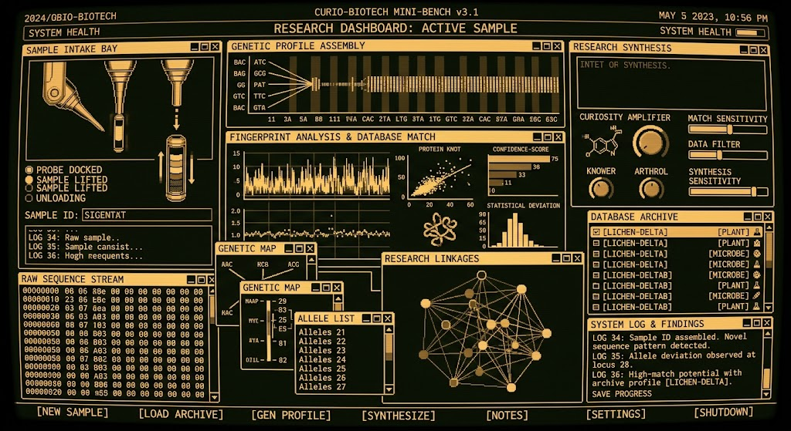
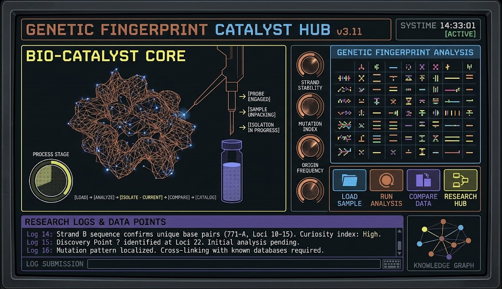
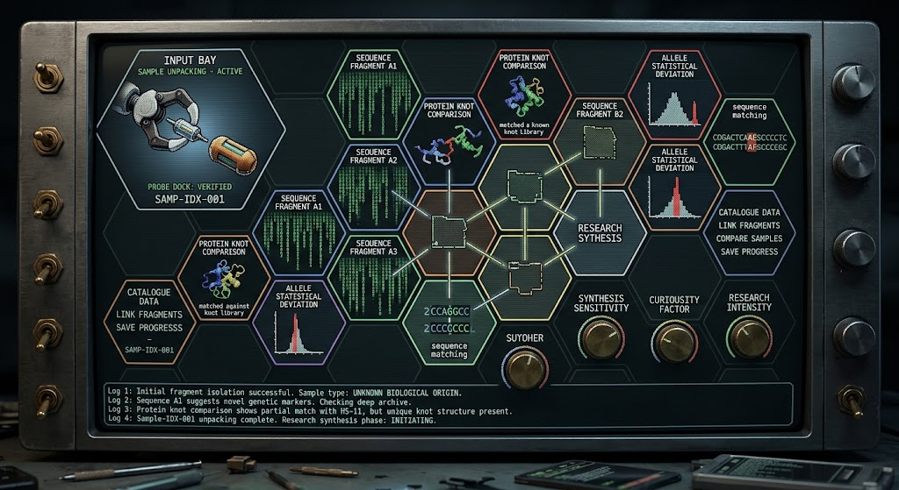
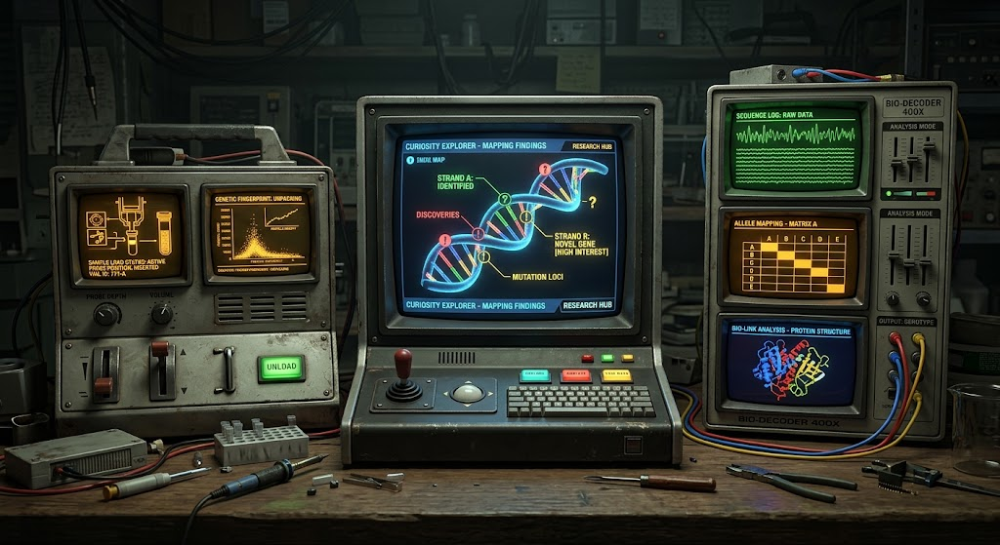
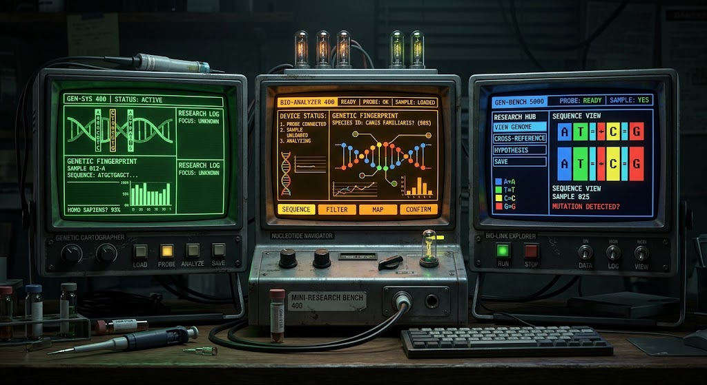
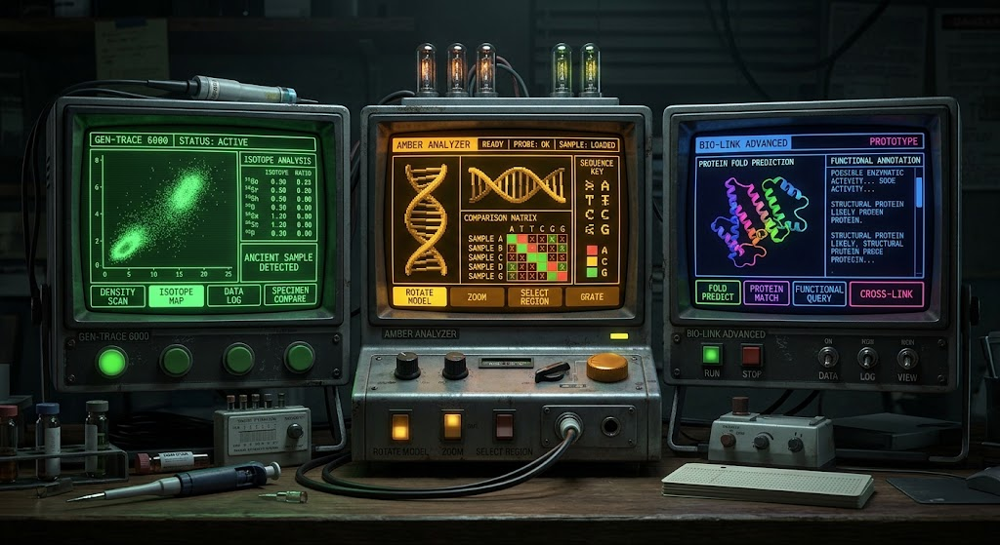
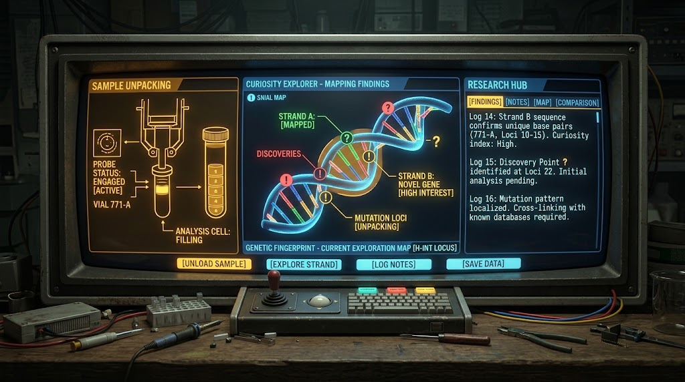

# Research-terminal references

These references explore instrument character, panel organization, typography and visual studies. Originals are preserved and hashed in the asset manifest. Their text, scientific claims, measurements, window controls and hardware are not game requirements.

The amber terminal and color terminal are the primary comparison references. The hexagonal composition explores a different spatial organization; it does not establish a navigation model. Exact duplicate input images are stored once.

The [screen design standard](../../screen-design-standard.md) connects those influences to game meaning. These images do not establish finished UI or working hardware.

## Images

<table>
<tr>
<td align="center" valign="top"> <em>amber-terminal.png: amber terminal. Primary comparison reference.</em></td>
<td align="center" valign="top"> <em>color-terminal.png: color terminal. Primary comparison reference.</em></td>
</tr>
</table>

<table>
<tr>
<td align="center" valign="top"> <em>hexagonal-terminal.png: hexagonal terminal. A different spatial organization, not a navigation model.</em></td>
<td align="center" valign="top"> <em>modular-bench.png: modular bench. Reference for panel organization.</em></td>
</tr>
</table>

<table>
<tr>
<td align="center" valign="top"> <em>instrument-family.png: instrument family. Reference for instrument character.</em></td>
<td align="center" valign="top"> <em>instrument-studies.png: instrument studies. Reference for visual studies.</em></td>
</tr>
</table>

<table>
<tr>
<td align="center" valign="top"> <em>research-workbench.png: research workbench. Reference.</em></td>
</tr>
</table>
