# Retro Diffusion trial

A small paid trial of the [Retro Diffusion](https://retrodiffusion.ai) pixel-art API, run on
2026-10-07 to learn whether it fits this project's art rules
([art-direction.md](../../design/art-direction.md), [ui-kit.md §2 and §4](../../design/proposals/ui-kit.md)).
Everything generated here is **generated, not hand-authored**, and nothing in this folder is
accepted art. Every PNG has a JSON sidecar with the exact request (image inputs replaced by file
name and SHA-256), task id, cost and time. No key material is stored anywhere in the repository.

**Spend: $2.88 of a $10.50 balance, 22 images in 12 successful requests, 3 failed requests
(refunded).** Balance after the trial: $7.62.

Contents: [API notes](#api-notes) · [A. Weather](#a-weather-for-the-reach-view) ·
[B. Station Home](#b-station-home-scene) · [C. Tile and sprite](#c-meadow-tile-and-hopper-sprite) ·
[Measurements](#measurements) · [Costs](#costs) · [Recommendation](#recommendation) · [Files](#files)

## API notes

Source: `https://www.retrodiffusion.ai/llms.txt`, the `Retro-Diffusion/api-examples` README and
`llms.txt`, and the live `GET /v2/styles/selector` catalogue (87 styles). The docs page at
`retrodiffusion.ai/app/guide/api` is a JavaScript app and returns an empty shell to curl; there
is no OpenAPI file at the obvious paths. The GitHub README is the usable reference.

- **Base URL** `https://api.retrodiffusion.ai/v2`, header `X-RD-Token`. `POST /v2/inferences`
  returns **202 accepted** with a `task_id`; poll `GET /v2/inferences/tasks/{id}` until
  `succeeded` or `failed`. Send an `Idempotency-Key` on paid POSTs. Images come back as raw
  base64 PNG (GIF for animations) in `base64_images`.
- **Models and styles.** RD Fast ($0.03/image), RD Plus ($0.06), RD Pro ($0.18, the only family
  that accepts `reference_images`, up to 9), RD Mini (aliases to low-res styles). Families used
  here: `rd_plus__low_res` (16–128 px), `rd_plus__environment` (64–512 px), `rd_pro__default`
  and `rd_pro__topdown` (12–256 px), `rd_tile__single_tile` (16–64 px), `rd_tile__tileset`
  (16–32 px tile, Wang set, $0.10), `rd_advanced_animation__idle` ($0.14).
- **Size limits.** 12–512 px overall; most styles stop at 256 or 384. RD Pro stops at 256, so a
  512-wide Station scene with references is not possible in one call.
- **Palette lock.** `input_palette` (a base64 PNG with the colours) is honoured by the image
  styles. Add `return_pre_palette: true` to also get the unquantised image. Output pixels are
  within 1/255 of the palette (see [Measurements](#measurements)), so a trivial snap finishes
  the job. The `rd_tile__tileset` style ignored the palette.
- **Seamless mode.** `tile_x` / `tile_y` exist. On `rd_tile__single_tile` they made every
  request fail (`inference_failed`, three times, with and without a palette). On
  `rd_plus__low_res` the request succeeded but the tiles were not seamless.
- **Animation.** Prompt-driven sprite animations at fixed sizes (32, 48, 64, 80, 128 px) and
  "advanced" animations that animate an uploaded start frame (`idle`, `walking`, `jump`,
  `attack`, `custom_action`, `subtle_motion`, `rotate` for 8 directions), 4–16 frames, GIF or
  PNG sprite sheet. Input must be 32–256 px with motion room around the subject.
- **References and img2img.** `reference_images` (RD Pro only) guide style and content; they
  are not redrawn, but they can be copied almost literally (A2 below). `input_image` plus
  `strength` is ordinary img2img on any style.
- **Edit tools** (`/v2/edit/tools/{tool}`): `palette_converter`, `color_reducer`,
  `k_centroid_downscale`, `pixel_correction`, `rotate` are free; `background_remover` and
  `color_style_transfer` $0.01; `inpainting`, `outpainting`, `image_edit`, `seam_tiling` $0.18.
  A free Pixel Fixer snaps "pixel-style" images to a true grid.
- **Credits.** `GET /v2/inferences/credits` returns `{"credits": 50, "balance": 10.5}`. The
  USD `balance` is what is spent; `credits` is a legacy counter that never moved during the
  trial. Each result carries `balance_cost` and `remaining_balance`. `check_cost: true` is a
  free dry run that returns the exact price and was accurate for every request here. Failed
  tasks are refunded automatically.

## A. Weather for the reach view

Target: the owner's reach concept, [`companion-map-hands.png`](../concept-homepage/companion-map-hands.png):
a lavender-grey cloud bank with volume and a lit rim around the explored island, cumulus
pieces with shaded undersides. All requests used the 48-colour Companion palette as
`input_palette`:

*`companion-palette-48.png` (48×1, shown 8×): the ramps from ui-kit.md §2, in order N W G T B V R O Y P X.*

**A1. `rd_plus__low_res`, 128×128, palette, with the pre-palette copies.** The model read
"cloud bank around a pocket of meadow" as a literal wreath. The pre-palette images (right pair)
are what the model drew; the service's palette pass (left pair) kept the shapes and lost the
pink-cream highlights. Not a cloud bank, but the lobes do have one highlight and a darker
underside each.

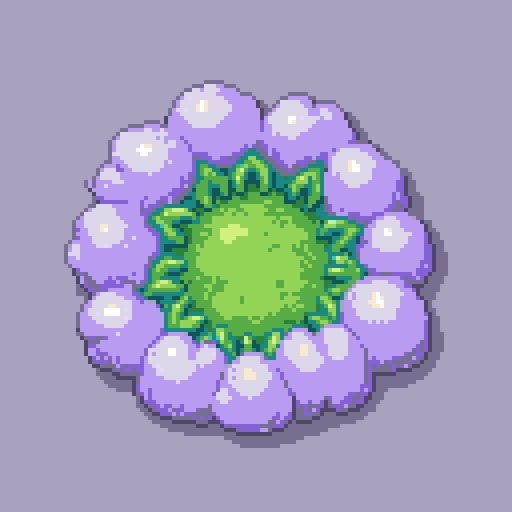 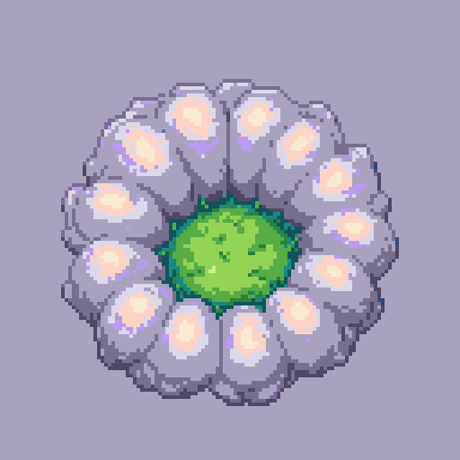 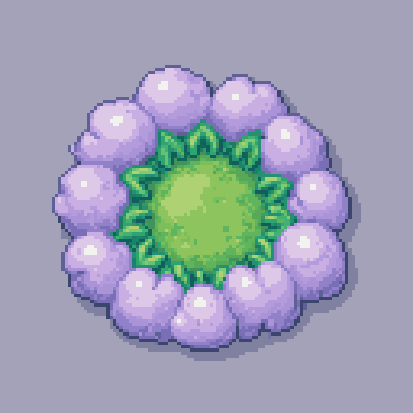 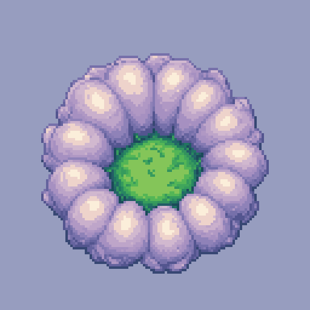

*A1 at 4×: two palette-locked results, then their pre-palette originals (`a1-plus-lowres-palette-1..4.png`). $0.12.*

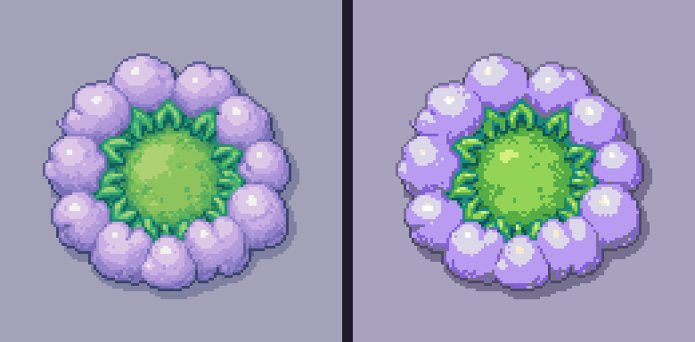

*The same image before and after the service's palette pass, 3×. Pillow's nearest-colour
quantisation of the pre-palette image gives 12 colours and a flatter result than the service's 18.*

**A2. `rd_pro__topdown`, 128×128, palette, with a crop of the concept screen as reference.**
The first result is a real cloud bank: lavender-grey cover, a dark storm shadow between the
lobes, and a bright teal-cream rim around the meadow pocket. The second shows the risk of
references: the model reproduced the reference map almost literally, tiles, grid, pawn and all.

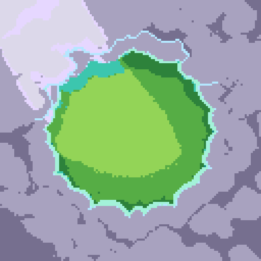 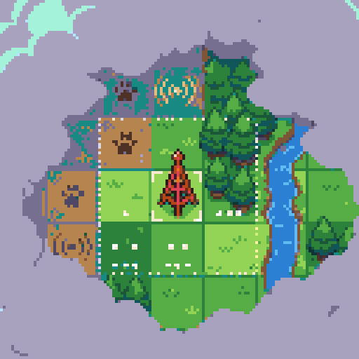

*A2 at 4× (`a2-pro-topdown-ref-palette-1.png`, `-2.png`). 11 and 32 colours. $0.36.*

**A3. Cumulus pieces, `rd_pro__topdown`, 64×64, palette, `remove_bg`.** Clean transparent
sprites, 6 and 9 colours, lit top-left with a shaded `N3` underside. These are the closest
to directly usable: they match the "two layers of cumulus with ground shadows" in the reach
mock-up and the kit's three-step shading rule.

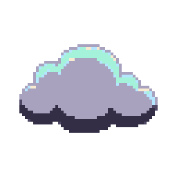 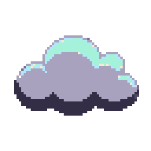

*A3 at 4× (`a3-pro-cumulus-nobg-1.png`, `-2.png`), transparent background. $0.36.*

**A4. Cloud bank with an opening, `rd_pro__topdown`, 128×96, palette, A2-1 as reference.**
The prompt described the bank filling the frame and opening in one corner, and both results
match the owner's concept well: volume in the cumulus, a dark `T0` storm shadow, a continuous
cream-and-teal lit rim around the meadow, the meadow itself in the G ramp with small props. The
diagonal rain band is missing; the model did not draw rain from the prompt, and that is a
separate overlay in the kit anyway.

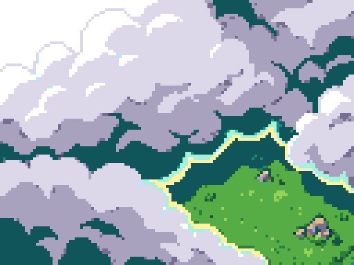

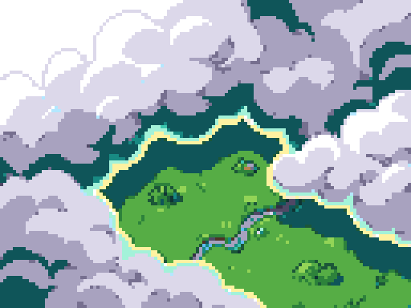

*A4 at 4× (`a4-pro-bank-opening-1.png`, `-2.png`), 20 and 21 colours, both on the 48-colour palette. $0.36.*

**Judgement.** With a palette, a top-down RD Pro style and a reference, the service produces a
weather bank that matches the concept in colour, volume and rim light. It is 128 px wide, so a
532-px-tall reach view needs several pieces or a 256 px call and composition by hand. Rain
bands and the Bayer mist should stay hand-drawn as the kit specifies.

## B. Station Home scene

Target: a lit glass vivarium with a hopper and a puffcap, warm lamp, moss, about 512×300, in
the Miniature Lives style. Reference creature: [`hibit-plain-280x300.png`](../miniature-lives/assets/hibit-plain-280x300.png).

**B1. `rd_plus__environment`, 512×304, no references (RD Plus does not take them).** The best
composition of the trial: a round glass tank with a brass rim, a lamp pool from above, moss,
a water dish, pot plants and a dark room. The hopper is a generic "cute bunny" with black
button eyes, not a Miniature Lives creature, and the puffcap is a plain mushroom without a face.
37 colours.

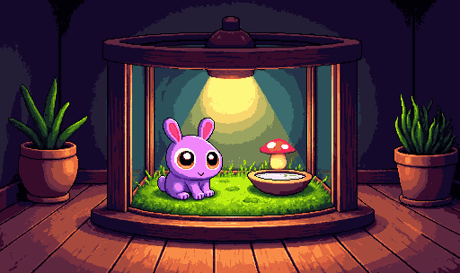

*B1 (`b1-plus-environment-512-1.png`, 512×304 at 1×). $0.06.*

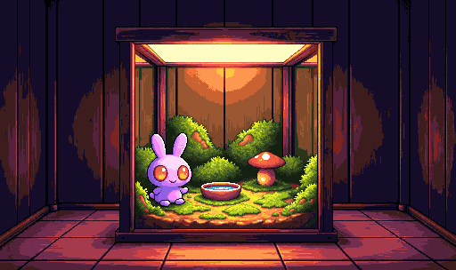

*B1 (`b1-plus-environment-512-2.png`). A square tank, lamp panel across the top, mounds of moss. $0.06.*

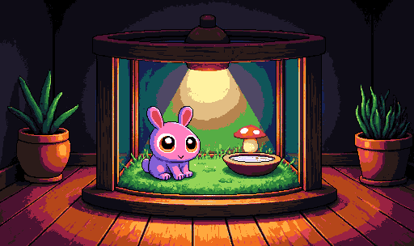

*B1-1 quantised to the 48 Companion colours with Pillow, no dither: 28 colours survive and the scene still reads. The Station palette has 96 colours, so this is a stress test, not the real target.*

**B2. `rd_pro__default`, 256×152, with three references (plain Pip at both treatments and the
UI-kit vivarium crop).** The creature now carries the Miniature Lives look: dark body shading,
large orange iris with a highlight, cream belly, rounded volume, and the puffcap has a face.
The scene is less composed than B1 and the size is capped at 256 by RD Pro.

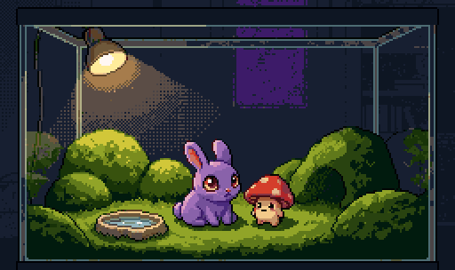

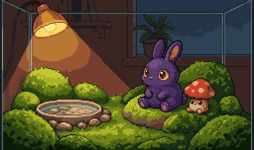

*B2 at 2× (`b2-pro-refs-256-1.png`, `-2.png`, 256×152 native). 43 and 42 colours. $0.36.*

**B3. img2img from the UI-kit Station Home mock-up, `rd_plus__environment`, 512×392,
strength 0.55.** The composition of [`station-home.png`](../../design/proposals/ui-kit/station-home.png)
survived (frame, mounds, water dish, dark room) but the residents were redrawn as generic
bunnies and the puffcap was lost. img2img keeps layout, not identity.

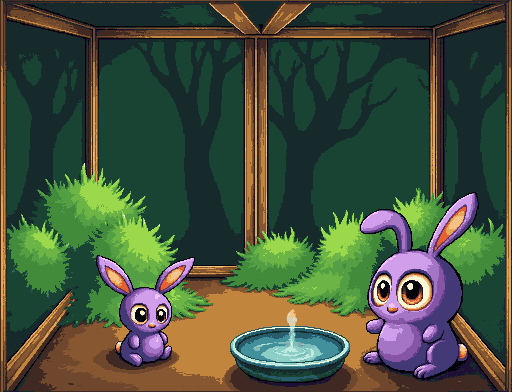

*B3 (`b3-plus-environment-img2img.png`, 512×392 at 1×). $0.06.*

**Judgement.** The service does rounded, tactile, top-left-lit scenes with saturated colour on
the first try. It does not keep a specific creature's identity unless RD Pro references are
used, and then the output is limited to 256 px. For Station art the workable split is: scene
and furniture from RD Plus at full size, creatures from RD Pro with references, composited by
hand. "Art never changes genes" means generated creatures stay concept material until the
creature pipeline exists.

## C. Meadow tile and hopper sprite

**C1. `rd_tile__single_tile`, 32×32, meadow.** With `tile_x`/`tile_y` the request failed
three times (`inference_failed`, refunded), with and without the palette. Without the flags it
worked. The texture is uniform enough that the 3×3 repeat shows no seam anyway. 6 colours,
all in the G, Y and R ramps.

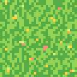 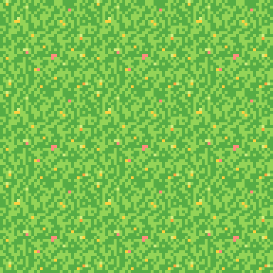

*C1 (`c1b-single-tile-palette-noseamless.png`) at 4× and repeated 3×3. $0.06. The three failed attempts are kept as `c1-*-failed.json` and `c1a-*.json`.*

**C3. Seamless flags on `rd_plus__low_res`, 32×32, palette.** The request succeeded, but the
tiles are not seamless: the first has a dark one-pixel border, the second a brown rim. The
flags do not produce usable repeating ground on this style.

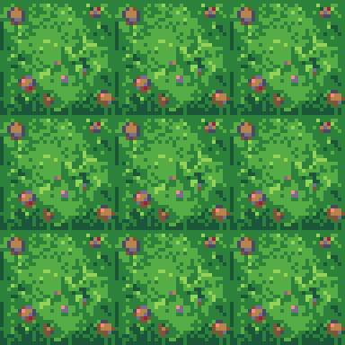 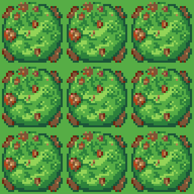

*C3 (`c3-plus-lowres-seamless-palette-1.png`, `-2.png`) repeated 3×3 at 4×. $0.12.*

**C4. `rd_tile__tileset`, 32 px, meadow meeting soil.** A Wang-style set of 32 px tiles in a
128×160 sheet (ten 32-px tiles plus two previews). Clean edges and a soft grass fringe over
soil. This style ignored `input_palette` (33 colours, all off-palette); quantising to the 48
colours collapses the soil to 5 colours and bands it.

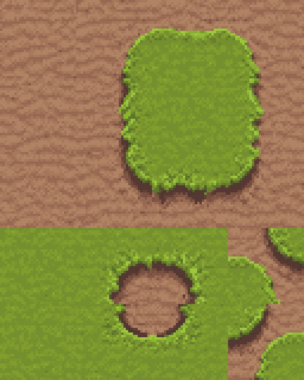

*C4 (`c4-wang-tileset-32.png`, 128×160 native, shown 4×). $0.10.*

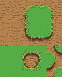

*C4 quantised to the 48 colours with Pillow, shown 2×: 5 colours, the soil texture is gone.*

**C2. Hopper idle frame, `rd_pro__default`, 32×32, palette, `remove_bg`, references: the
hopper from the Station Home mock-up and plain Pip.** Four takes, 22–25 colours each, all on
the palette within 1/255. Violet body in the V ramp, cream belly, orange iris with a white
highlight, pink inner ear. The volume and the eye read; the outline is not the kit's 1 px
"darkest step of the part's own ramp" rule, and the 32 px canvas is tight, so the ears touch
the top edge in two takes.

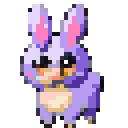 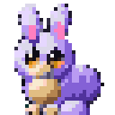 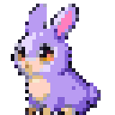 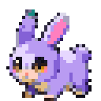

*C2 (`c2-pro-hopper-32-1..4.png`) at 4×, transparent. $0.72, the most expensive request of the trial.*

**C5. Idle animation of take 3, `rd_advanced_animation__idle`, 8 frames, sprite sheet.** Take
3 was padded onto a 48×48 transparent canvas (`c5-anim-input-hopper-48.png`) as the docs
require. The service returned a 192×96 PNG sheet of eight 48×48 frames. The hopper breathes
and the ears move, but every frame is a redraw: eye shape, belly outline and foot positions
boil from frame to frame. Not a two-frame kit idle; it would need hand cleanup frame by frame.

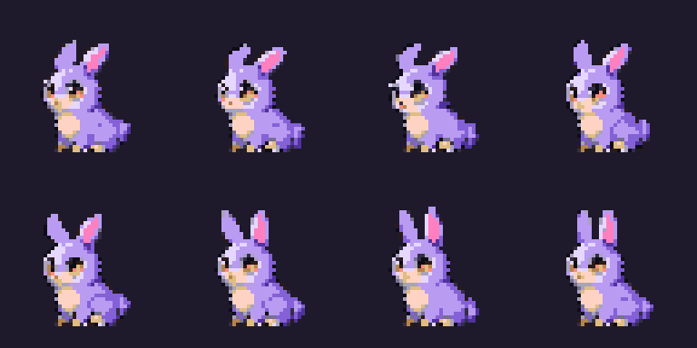

*C5 (`c5-idle-animation-hopper.png`, 192×96 native, shown 4× on a dark ground). $0.14.*

**Judgement.** Sprites: rounded, expressive, saturated, correctly lit, and palette-exact; the
outline rule and canvas discipline need a hand pass. Tiles: the Wang tileset is the useful
product; single tiles work; seamless flags do not. Animation: proof of motion, not production
frames.

## Measurements

Unique colours count opaque pixels only. "Off-palette" counts pixels not exactly in the 48
colours; "max distance" is the largest per-channel difference between any off-palette colour
and its nearest palette colour. A max distance of 1 means a rounding error in the service's
palette pass, not a palette miss. Pre-palette copies, RD Plus scenes and the tileset were never
palette-constrained and are listed for comparison; their Pillow-quantised copies are saved as
`*-quantised.png`. Produced by `scripts/measure.py`, raw data in `measurements.json`.

| File | Size | Unique colours | Off-palette px | Max distance | Unique after quantise | One-line judgement |
| --- | --- | --- | --- | --- | --- | --- |
| `a-weather/a1-plus-lowres-palette-1.png` | 128×128 | 18 | 741 / 16384 (4.5%) | 1 | 18 | Wreath, not a bank; lobes shaded, palette held |
| `a-weather/a1-plus-lowres-palette-2.png` | 128×128 | 14 | 328 / 16384 (2.0%) | 1 | 14 | Same, cooler grey; closest of A1 to lavender-grey |
| `a-weather/a1-plus-lowres-palette-3.png` | 128×128 | 28 | all | 48 | 12 | Pre-palette original of A1-1 |
| `a-weather/a1-plus-lowres-palette-4.png` | 128×128 | 24 | all | 36 | 12 | Pre-palette original of A1-2 |
| `a-weather/a2-pro-topdown-ref-palette-1.png` | 128×128 | 11 | 2244 / 16384 (13.7%) | 1 | 11 | Real cloud bank with lit rim; matches concept |
| `a-weather/a2-pro-topdown-ref-palette-2.png` | 128×128 | 32 | 2032 / 16384 (12.4%) | 1 | 32 | Reference copied literally; unusable |
| `a-weather/a3-pro-cumulus-nobg-1.png` | 64×64 | 6 | 0 | 0 | 6 | Clean cumulus piece, shaded underside; usable |
| `a-weather/a3-pro-cumulus-nobg-2.png` | 64×64 | 9 | 0 | 0 | 9 | Same, with a highlight step; usable |
| `a-weather/a4-pro-bank-opening-1.png` | 128×96 | 20 | 231 / 12288 (1.9%) | 1 | 20 | Best weather match: volume, rim, meadow pocket |
| `a-weather/a4-pro-bank-opening-2.png` | 128×96 | 21 | 315 / 12288 (2.6%) | 1 | 21 | Same quality, with a stream; no rain band |
| `b-station/b1-plus-environment-512-1.png` | 512×304 | 37 | all | 69 | 28 | Best scene composition; creature generic |
| `b-station/b1-plus-environment-512-2.png` | 512×304 | 36 | all | 54 | 26 | Good scene; creature generic |
| `b-station/b2-pro-refs-256-1.png` | 256×152 | 43 | all | 58 | 23 | Creature is Miniature Lives; scene weaker, 256 cap |
| `b-station/b2-pro-refs-256-2.png` | 256×152 | 42 | all | 61 | 20 | Same; puffcap has a face |
| `b-station/b3-plus-environment-img2img.png` | 512×392 | 33 | all | 44 | 25 | Layout kept, identity lost |
| `c-tiles/c1b-single-tile-palette-noseamless.png` | 32×32 | 6 | 494 / 1024 (48.2%) | 1 | 6 | Uniform meadow, repeats without a seam |
| `c-tiles/c2-pro-hopper-32-1.png` | 32×32 | 24 | 41 / 452 (9.1%) | 1 | 24 | Rounded, expressive, lit; ears clip the top |
| `c-tiles/c2-pro-hopper-32-2.png` | 32×32 | 25 | 73 / 520 (14.0%) | 1 | 25 | Side pose, good belly volume |
| `c-tiles/c2-pro-hopper-32-3.png` | 32×32 | 22 | 34 / 479 (7.1%) | 1 | 22 | Best take; used for the animation |
| `c-tiles/c2-pro-hopper-32-4.png` | 32×32 | 24 | 36 / 515 (7.0%) | 1 | 24 | Crouched pose, eye reads well |
| `c-tiles/c3-plus-lowres-seamless-palette-1.png` | 32×32 | 10 | 89 / 1024 (8.7%) | 1 | 10 | Dark border; not seamless |
| `c-tiles/c3-plus-lowres-seamless-palette-2.png` | 32×32 | 11 | 250 / 1024 (24.4%) | 1 | 11 | Brown rim; not seamless |
| `c-tiles/c4-wang-tileset-32.png` | 128×160 | 33 | all | 48 | 5 | Good Wang set; palette ignored |
| `c-tiles/c5-anim-input-hopper-48.png` | 48×48 | 22 | 34 / 479 (7.1%) | 1 | 22 | Padded start frame for C5 |
| `c-tiles/c5-idle-animation-hopper.png` | 192×96 | 14 | 260 / 3722 (7.0%) | 2 | 14 | Motion works; frames boil |

## Costs

| Request | Style | Images | Cost | Time |
| --- | --- | --- | --- | --- |
| A1 | `rd_plus__low_res` 128², palette, pre-palette copies | 2 (+2 pre) | $0.12 | 1 s |
| A2 | `rd_pro__topdown` 128², palette, 1 reference | 2 | $0.36 | 42 s |
| A3 | `rd_pro__topdown` 64², palette, bg removed | 2 | $0.36 | 20 s |
| A4 | `rd_pro__topdown` 128×96, palette, 1 reference | 2 | $0.36 | 105 s |
| B1 | `rd_plus__environment` 512×304 | 2 | $0.12 | 19 s |
| B2 | `rd_pro__default` 256×152, 3 references | 2 | $0.36 | 45 s |
| B3 | `rd_plus__environment` 512×392 img2img | 1 | $0.06 | 19 s |
| C1 | `rd_tile__single_tile` 32², seamless | 0 | $0 (3 failures refunded) | |
| C1b | `rd_tile__single_tile` 32², palette | 1 | $0.06 | 10 s |
| C2 | `rd_pro__default` 32², palette, bg removed, 2 references | 4 | $0.72 | 42 s |
| C3 | `rd_plus__low_res` 32², seamless, palette | 2 | $0.12 | 23 s |
| C4 | `rd_tile__tileset` 32 px | 1 sheet | $0.10 | 29 s |
| C5 | `rd_advanced_animation__idle` 48², 8 frames, sheet | 1 sheet | $0.14 | 99 s |
| **Total** | | **22** | **$2.88** | |

Price is flat per image within a family regardless of size, so a 32 px sprite costs the same as
a 256 px scene from the same model. RD Pro references are the expensive path: $0.18 per take.

## Recommendation

**Use it for:** concept and reference material, fast. Weather pieces and cloud banks from
`rd_pro__topdown` with the 48-colour `input_palette` and a reference (A3, A4). Scene
compositions and furniture from `rd_plus__environment` at full Station width (B1). Wang tile
sets for ground edges from `rd_tile__tileset` (C4), then palette-converted by hand with care.
Creature studies from `rd_pro__default` with Miniature Lives references (B2, C2) as drawing
references for the hand-authored pixel masters the art direction still requires.

**Working rules that fit the project:**
- Always send `input_palette`; snap the result to the exact palette afterwards (every
  deviation was 1/255). Keep the pre-palette copy only as a sidecar.
- Describe the subject, not the style; say "on a plain white background" and use `remove_bg`
  for sprites. Use `check_cost` before every new shape of request.
- Give references one at a time and expect them to be copied; a reference that contains a
  whole UI will come back as that UI (A2-2).
- Treat outputs as **generated concepts**: keep the sidecar, label them, do not promote them to
  masters. "Art never changes genes" rules out generated creature art as canonical.

**It cannot:** lock the palette on the tileset style; produce seamless tiles (the flags fail or
do nothing; `seam_tiling` at $0.18 per image is untested); keep a specific individual's
identity without RD Pro references, and RD Pro stops at 256 px; follow the kit's 1 px
sel-out outline rule or the "no anti-aliasing, Bayer only" rule by itself; produce the kit's
two-frame idles (the idle animation redraws every frame); draw rain bands or the Bayer mist
on request. Text, numbers and HUD stay out of generated art, as the rules already say.

**Next step if the owner wants to continue:** a $5 run of A4-style weather pieces at 256 px
for the reach view mist layer, and a `seam_tiling` test on C1b to settle whether seamless
ground is available at all. Both fit inside the remaining $7.62.

## Files

- `README.md`: this report.
- `companion-palette-48.png`, `-preview.png`, `.json`: the palette as sent, a human-readable
  strip, and the colour list with kit ids.
- `a-weather/`, `b-station/`, `c-tiles/`: outputs as PNG, one JSON sidecar per request (exact
  request with image inputs as file name + SHA-256, task id, cost, time, model), failed-attempt
  sidecars, and `*-quantised.png` Pillow copies for images that were not palette-constrained.
- `previews/`: nearest-neighbour upscales and 3×3 tile repeats used in this report. Derived,
  not sources.
- `refs/`: the crops sent as references and img2img inputs (from `companion-map-hands.png`,
  the UI-kit `station-home.png`, and the Miniature Lives assets, converted to RGB).
- `measurements.json`: the table above as data.
- `scripts/`: `rd.py` (client; reads the key only from `RETRO_DIFFUSION_API_KEY`), `prep.py`
  (palette and crops), `measure.py`, and `payloads/` with every request.
