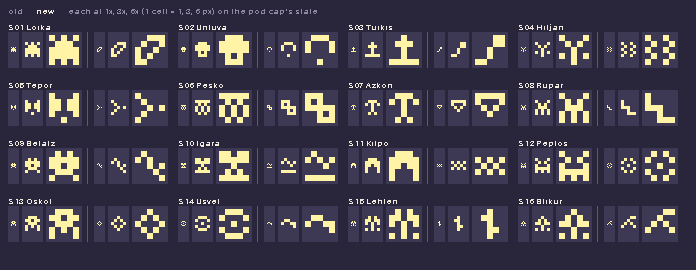

# Species marks

The sixteen species glyphs, redrawn as abstract marks. The glyph is the small 5×5 mark at the centre of the species' identity: on the pod's cap, on the Library's frames and in the genome stamp's corner.

**Status: candidate; art director to sign.** Nothing here has been shown onward.

> "looks like an alien, weird" (the owner, 2026-10-08, of the Loika glyph lit on a pod's cap; the Untuva's read as a skull or mushroom and the Tuikis's as a cross.) The owner decided the sixteen glyphs are redrawn as abstract marks.

| Image | Caption | Status |
| --- | --- | --- |
|  | contact-1x-3x-6x.png: per species, the retired glyph (left) beside the new mark (right), each at 1×, 3× and 6× cells (1 cell = 1, 3 and 6 px), cream on the pod cap's slate, nearest neighbour, on the Station's 62 colours (0 off-palette pixels). 1× is the well-size pod's cell and the stamp's smallest; 6× is the large pod's cap. | candidate; art director to sign |

## What was done

- **Grid kept: 5×5, lit or dark** (the frames' `glyph`, the stamp's corner, the pod's `source/glyphs.txt`). Nothing about the grid, the stamp codec or the pod's geometry changed.
- **One source.** The marks are `GLYPHS` in `prototypes/workbench/framework/roster.mjs`; the old per-clan tops and the seeded lower rows are gone. `prototypes/workbench/framework/build-frames.mjs` was re-run, so the sixteen `frames/species-S*.json` carry them (not edited by hand; `--check` passes). `prototypes/ui/assets/placeholders/pod/source/glyphs.txt` was refreshed from the frames, then `build.py` and `check.py` re-run: `pod-glyphs.png`, `contact-1x.png` and `contact-2x.png` regenerated, atlas unchanged, 0 off-palette pixels, 0 differences from the frames.
- **A test** in the workbench (`tests/framework.test.mjs`): sixteen 5×5 marks, each held by its frame, 6 to 16 lit cells, and every pair differing in at least 5 of the 25 cells in each of the eight orientations (the stamp reader tries them all). 17 of 17 workbench tests pass; the station's 30 pass.
- `old-glyphs.txt` keeps the retired glyphs as they were on main; `make-contact.py` rebuilds the sheet (`python3 -I make-contact.py`).

## The marks

Calm catalogue marks, one stroke weight (1 cell): strokes, dots, arcs, steps, rings. Each loosely echoes one true thing of its species (`taxonomy.md` §3) without drawing it.

| Species | Echoes | Mark (rows) |
| --- | --- | --- |
| S01 Loika | a leaf: the crest's leaf, on the diagonal | `..###/.#..#/#..#./#.#../##...` |
| S02 Untuva | a cap, open beneath, and what it sheds | `.###./#...#/#...#/...../..#..` |
| S03 Tuikis | a lit tail that curls away | `...##/...##/..#../..#../##...` |
| S04 Hiljan | tabby bands | `#..#./.#..#/#..#./.#..#/#..#.` |
| S05 Tepor | a long muzzle's line and the tail's tip | `#..../.#.../..#.#/.#.../#....` |
| S06 Pesko | two linked rings: the ringed tail | `###../#.#../#####/..#.#/..###` |
| S07 Azkon | a pit dug down from the ground line | `#####/#...#/.#.#./..#../.....` |
| S08 Rupar | the steps of a climb | `#..../#..../###../..#../..###` |
| S09 Belatz | a long soar on one line | `.#.../#.#../..#.#/...#./....#` |
| S10 Igara | a ripple over the pond floor | `.#.../#.#.#/...#./...../#####` |
| S11 Kilpo | the plates of a shell | `...../#.#.#/.#.#./#.#.#/.....` |
| S12 Peplos | four flaps about a centre | `.#.#./#...#/..#../#...#/.#.#.` |
| S13 Oskol | an armour plate | `..#../.#.#./#...#/.#.#./..#..` |
| S14 Usvel | the slow line of a trail | `...../.##../#..##/....#/.....` |
| S15 Lehten | a stem with alternate leaves | `..#../.##../..#../..##./..#..` |
| S16 Blikur | a branching charge | `...##/..#../.#.#./#...#/.....` |

## Checked

- **Distinct:** the closest pairs differ in 5 cells of 25 in their worst orientation (S03 and S09, S11 and S16, S14 and S15), and none is another turned or mirrored. At 1 px cells that is five lit-or-dark pixels, so all sixteen are distinct, but S05 and S14 (6 lit cells, one thin line each) are the faintest, and S03 and S09 are the two diagonals; at 1 px they are told apart by the S03's 2×2 head against S09's single dotted line.
- **Not a face, creature, letter, religious or franchise symbol:** read at 1×, 3× and 6× on the sheet. Dropped on the way: a ring with a centre dot (an eye), a blob with holes (the old alien and skull), a cap on a stem (a mushroom), a plus (a cross), a trident, a bolt (the Materials' bolt is a different mark), a peak over a bar (the Libra sign), an hourglass, a viewfinder frame and dice. Kept with a doubt: S02 (an arch and a dot: a handle or a keyhole), S05 (a chevron and a dot: an arrow), S07 (a hollow triangle: a funnel), S08 (a step fret).
- **Density:** 6 to 15 lit cells (the old ones ran from 10 to 20, and the old S01 and S02 were filled blobs). Lighter marks sit better on the cap's slate and read as marks, not as figures.
- **Orientation:** S06, S12 and S13 are symmetric under rotation; the stamp's border names the orientation, not the glyph, so this costs nothing, but the glyph can no longer break a tie for them.

## For the genome engineer (not changed here)

The stamp's frame registry is append-only: a frame is identified by species and frame version, and an old print decodes only while its frame is carried. The frame's glyph is part of what a v2 stamp was drawn with, so replacing the glyph inside frame version 2 breaks the rule: `src/frames-data.mjs` was **not** regenerated, and `tools/extract-frames.mjs` would overwrite the v2 glyphs if run now. The rule requires a **new frame version (3)** for the sixteen species, with the v2 frames kept beside it so printed stamps still decode, and the reader's orientation score (`orientations()` in `src/decode.mjs`, which tries every frame's glyph) will then match both marks. The workbench's `FRAME_VERSION` (`framework/species.mjs`) is still 2 and the frames carry the new marks under it; that constant and the extract tool are the engineer's to move together.

## Departures, listed

- The marks are one-bit (lit or dark), so the Companion's 48 colours do not apply; the sheet shows them in the pod cap's cream on slate, on the Station's 62.
- The Station's chapter emblems (`station/src/art.mjs`) are a different set and were not touched.
