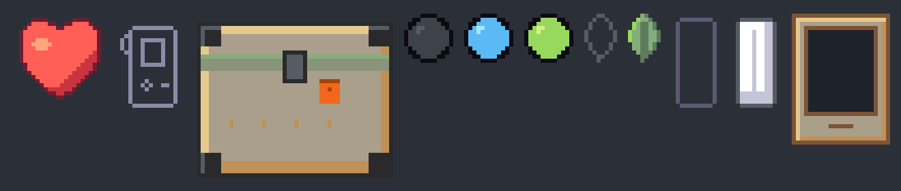
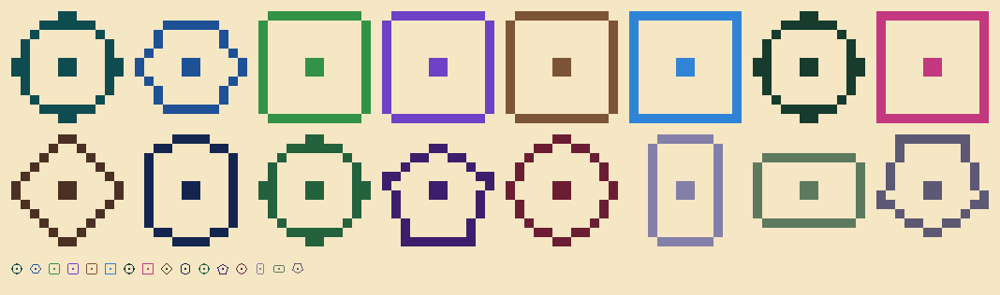

# Home, the Vivarium card and the Library spread: hand-pixelled masters

The art-layer pieces of Home, the Vivarium card and the Library spread, hand-placed pixel by pixel at size in the Station palette (no scaling, no anti-aliasing). `source/home_marks.py`, `source/more_marks.py` and `source/roundels.py` draw them; `slices/manifest.json` gives each size and hash. Painted pieces (the glass, the bay, the well, the chamber, the cradle, the journal, the bed) come from their own paintings.

*proof-6x.png: the set at 6× on `panel`. Hand-drawn masters.*

*clan-roundels-proof.png: the sixteen clan roundels at 10× and 1× on `paper`. Hand-drawn masters.*

## Home masters (signed)

| Id | Size | What |
| --- | --- | --- |
| `home-lamp-amber-12x12` | 12×12 | the lamp that needs you: an amber disc, void rim, a cream light at the upper left |
| `home-lamp-sprout-12x12` | 12×12 | the well-ready lamp: a sprout disc, void rim, lit upper left |
| `home-lamp-sky-12x12` | 12×12 | the waiting lamp: a sky disc, void rim, lit upper left |
| `home-lamp-hairline-12x12` | 12×12 | the lamp off: a hairline disc, void rim, lit upper left |
| `home-leaf-full-8x12` | 8×12 | a full Incubator leaf: sage, sageD vein and shade, a sprout lit edge |
| `home-leaf-empty-8x12` | 8×12 | an empty Incubator leaf: a bevel outline |
| `home-shield-whole-12x24` | 12×24 | a whole Shield plate: white, fog shade, bevel edge, a centre seam |
| `home-shield-lost-12x24` | 12×24 | a lost Shield plate: a stone outline |
| `home-bed-mark-16x24` | 16×24 | the bed's Companion mark: the handheld's silhouette with its strap loop, a 1 px mist outline |
| `home-sitting-24x32` | 24×32 | the held sitting: a matte card frame in the sand housing, the portrait window dark |
| `home-crate-48x40` | 48×40 | a walk crate: a rugged field case, sand body, rubber corners, a sage lid band, an orange seal tag |
| `heart-full-24` | 24×24 | the bonded heart on the Vivarium card: an enamel heart in the house light, no face, no sparkle |
| `notch-skill-16x24` | 16×24 | one skill notch cut into the Vivarium card's plate: sand fill, a shadowed upper-left wall, a lit lower-right wall |
| `mark-out-with-companion-64x96` | 64×96 | the mibi's place, kept: the Companion's outline (screen, pad, keys, strap) in mist, standing on a stone ground line |
| `spread-progress-full-8x8` | 8×8 | a Library spread progress step, read: a pressed seed inked in soil, a bark edge, lit upper left |
| `spread-progress-empty-8x8` | 8×8 | a Library spread progress step, unread: the same seed as a clay outline |
| `clan-roundel-C01-12x12` | 12×12 | clan C01's roundel on the Library spread: its clan mark's shape family, a 1 px outline and a 2×2 dot in `tealD` |
| `clan-roundel-C02-12x12` | 12×12 | clan C02's roundel on the Library spread: its clan mark's shape family, a 1 px outline and a 2×2 dot in `sea` |
| `clan-roundel-C03-12x12` | 12×12 | clan C03's roundel on the Library spread: its clan mark's shape family, a 1 px outline and a 2×2 dot in `leaf` |
| `clan-roundel-C04-12x12` | 12×12 | clan C04's roundel on the Library spread: its clan mark's shape family, a 1 px outline and a 2×2 dot in `plum` |
| `clan-roundel-C05-12x12` | 12×12 | clan C05's roundel on the Library spread: its clan mark's shape family, a 1 px outline and a 2×2 dot in `bark` |
| `clan-roundel-C06-12x12` | 12×12 | clan C06's roundel on the Library spread: its clan mark's shape family, a 1 px outline and a 2×2 dot in `river` |
| `clan-roundel-C07-12x12` | 12×12 | clan C07's roundel on the Library spread: its clan mark's shape family, a 1 px outline and a 2×2 dot in `pine` |
| `clan-roundel-C08-12x12` | 12×12 | clan C08's roundel on the Library spread: its clan mark's shape family, a 1 px outline and a 2×2 dot in `magenta` |
| `clan-roundel-C09-12x12` | 12×12 | clan C09's roundel on the Library spread: its clan mark's shape family, a 1 px outline and a 2×2 dot in `soil` |
| `clan-roundel-C10-12x12` | 12×12 | clan C10's roundel on the Library spread: its clan mark's shape family, a 1 px outline and a 2×2 dot in `deep` |
| `clan-roundel-C11-12x12` | 12×12 | clan C11's roundel on the Library spread: its clan mark's shape family, a 1 px outline and a 2×2 dot in `forest` |
| `clan-roundel-C12-12x12` | 12×12 | clan C12's roundel on the Library spread: its clan mark's shape family, a 1 px outline and a 2×2 dot in `plumD` |
| `clan-roundel-C13-12x12` | 12×12 | clan C13's roundel on the Library spread: its clan mark's shape family, a 1 px outline and a 2×2 dot in `wine` |
| `clan-roundel-C14-12x12` | 12×12 | clan C14's roundel on the Library spread: its clan mark's shape family, a 1 px outline and a 2×2 dot in `rock` |
| `clan-roundel-C15-12x12` | 12×12 | clan C15's roundel on the Library spread: its clan mark's shape family, a 1 px outline and a 2×2 dot in `sageD` |
| `clan-roundel-C16-12x12` | 12×12 | clan C16's roundel on the Library spread: its clan mark's shape family, a 1 px outline and a 2×2 dot in `stone` |
