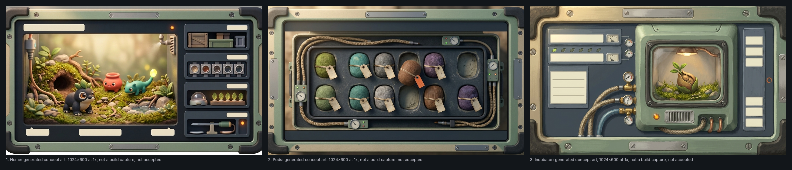
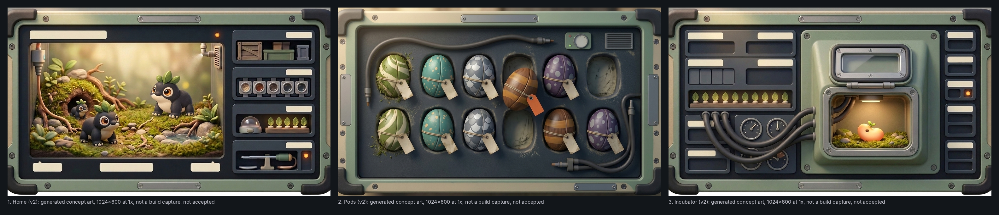

# Station concept board (generated)

One board, three frames, each a 1024x600 screen at 1x, from the Station art director's studio brief (boards/station-concept-board-brief.md, 2f535ae) and the owner-approved world brief (64964b9). **All pictures are generated concept art: not build captures, not accepted.** Delivered to the Station art director for judging and signing.

| Frame | Picture | Made from |
| --- | --- | --- |
| 1. Home | `frame-1-home-1024x600.png` | `source/raw/board-home-pro-notext.jpg`: a Pro edit of `board-home-pro.jpg` that replaced its lettering by blank plates |
| 2. Pods | `frame-2-pods-1024x600.png` | `source/raw/board-pods-pro-r2.jpg` (Pro, second try: the first, `board-pods-pro.jpg`, came out in perspective) |
| 3. Incubator | `frame-3-incubator-1024x600.png` | `source/raw/board-incubator-pro.jpg` (Pro) |

Each frame is the 1376x768 original centre-cropped to 1024:600 and reduced with Lanczos; nothing else is changed.

## Call log (every request, tools/gen.py through tools/spendcap.py; full prompts, references with hashes and usageMetadata are in `log/calls.jsonl`)

| # | Call | Model | Cost (MXN) | Running total for this job (MXN) | Tokens in / out / thinking |
| --- | --- | --- | --- | --- | --- |
| 1 | `board-home-draft` | gemini-3.1-flash-image | 4.3321 | 4.33 | 2102 / 1770 / None |
| 2 | `board-pods-draft` | gemini-3.1-flash-image | 3.8805 | 8.21 | 1133 / 1598 / None |
| 3 | `board-incubator-draft` | gemini-3.1-flash-image | 4.078 | 12.29 | 1149 / 1680 / None |
| 4 | `board-home-pro` | gemini-3-pro-image | 4.4935 | 16.78 | 2178 / 1518 / 318 |
| 5 | `board-pods-pro` | gemini-3-pro-image | 4.4044 | 21.19 | 1209 / 1503 / 312 |
| 6 | `board-incubator-pro` | gemini-3-pro-image | 4.4314 | 25.62 | 1225 / 1510 / 316 |
| 7 | `board-pods-pro-r2` | gemini-3-pro-image | 4.2565 | 29.88 | 1292 / 1471 / 281 |
| 8 | `board-home-pro-notext` | gemini-3-pro-image | 3.9404 | 33.82 | 409 / 1443 / 192 |

**Job total: 33.82 MXN** (the brief's cap is 73, the stop-and-report 50; the owner's own cap is 120). Today's total with this job: 210.53 of 250. The three Nano Banana 2 drafts (`gemini-3.1-flash-image`) are booked at Pro's rates in `log/spend.json` because the guard has no Flash rates yet, so their real cost is lower than shown.

## Originals and hashes (sha256)

- `source/raw/board-home-draft.jpg`: `98bdb23b78834a3a5b8e6cee0acfa28696913ae8d0b39cc485d251b542526037`
- `source/raw/board-pods-draft.jpg`: `fac6f6531d4f305214021286da8221e2f9be1f7901fc87ada972801b9c76a81e`
- `source/raw/board-incubator-draft.jpg`: `998a93c1b0d3abd5a5a03f179bf175d2a3e646f1ff543d48efcf5288c371baea`
- `source/raw/board-home-pro.jpg`: `9fa632e85b0189469fef5656c91453fd4bca5c7d7bdaadfb2e5d00a7a8b7ea25`
- `source/raw/board-pods-pro.jpg`: `91acb469ebc3e78ff0c5c24b6f02c80ae60781bc57670e976172f6dfc2954c51`
- `source/raw/board-incubator-pro.jpg`: `03a2e4820456d1efea372a898b187c896aef4a1ba21e22bd7c2668264852222f`
- `source/raw/board-pods-pro-r2.jpg`: `05e883331bb38e71d092289104cfbc426f5c179598aee21d3528381e1a5a2a0f`
- `source/raw/board-home-pro-notext.jpg`: `335eeaa046c0fd990e6f089e624abfce82428193bf2a901f40814f910678363a`

Prompts: `source/work/station-board-drafts.json`, `station-board-pro.json`, `station-board-r2.json`. References (all in the public repo): art/companion-concept/field-partner-concept.png, art/concept-homepage/hero-kit.png (housing only), art/visual-directions/02-miniature-lives.png, art/miniature-lives/assets/rich-plain-300x310.png (Pip), design/style-guide/station-layouts/01-home.png (Home's layout only; copied to `refs/`).

## Honest notes

- The drafts (Nano Banana 2) drew a flat illustration and lettered the housing; the Pro frames carry the sculpted Miniature Lives finish. Draft pictures are kept in `source/raw/` but are not on the board.
- Frame 1's creatures are Pip as placed from the reference plus two other kinds; Pip is redrawn by the model from the reference, not pasted in, so its face and leaves differ a little from the accepted art.
- Frame 2's case is nearly flat on but still a case set into the screen with a slight blur at its rim; frame 3's chamber reads close to a small framed monitor.
- Frame 1's lower left and bottom edge show a pale strip outside the housing's rounded corner (the edit left the original's backdrop there); it is not part of the screen.
- No text, letters or digits in frames 1 to 3 (checked by eye).

---

# Version 2 (the fix round after the art director's verdict on 9bfc0fb8)

Pro only, three requests (the art director allowed five and a day total under 235 of 250 MXN): frame 1 `frame-1-home-v2-1024x600.png` (`source/raw/board-home-pro-r3.jpg`, a Pro edit of the no-text Home: the red pot and the teal lizard replaced by Loikas, an adult, a second adult and a juvenile, the pale edge strip removed), frame 2 `frame-2-pods-v2-1024x600.png` (`board-pods-pro-r3.jpg`: smooth patterned seed-shells with moss and dust on some, fewer lines in dark rubber hose, a small mister and vent, frame 1 as the style reference) and frame 3 `frame-3-incubator-v2-1024x600.png` (`board-incubator-pro-r3.jpg`: matte gauges set flush, dark rubber hoses, a sheltered recess with a hooded window, a plain warm bean on moss with no creature, frame 1 as the style reference). Each is the 1376x768 original centre-cropped to 1024:600 and reduced with Lanczos. The v1 board and frames above stay for the record.

| # | Call | Model | Cost (MXN) | Running total for the job (MXN) |
| --- | --- | --- | --- | --- |
| 1 | `board-home-draft` | gemini-3.1-flash-image | 4.3321 | 4.33 |
| 2 | `board-pods-draft` | gemini-3.1-flash-image | 3.8805 | 8.21 |
| 3 | `board-incubator-draft` | gemini-3.1-flash-image | 4.078 | 12.29 |
| 4 | `board-home-pro` | gemini-3-pro-image | 4.4935 | 16.78 |
| 5 | `board-pods-pro` | gemini-3-pro-image | 4.4044 | 21.19 |
| 6 | `board-incubator-pro` | gemini-3-pro-image | 4.4314 | 25.62 |
| 7 | `board-pods-pro-r2` | gemini-3-pro-image | 4.2565 | 29.88 |
| 8 | `board-home-pro-notext` | gemini-3-pro-image | 3.9404 | 33.82 |
| 9 | `board-home-pro-r3` | gemini-3-pro-image | 3.791 | 37.61 |
| 10 | `board-pods-pro-r3` | gemini-3-pro-image | 4.2087 | 41.82 |
| 11 | `board-incubator-pro-r3` | gemini-3-pro-image | 4.1322 | 45.95 |

**Job total after the fix round: 45.95 MXN** (the cap is 120, the stop-and-report 80). Today's total: 222.66 of 250 MXN, under the art director's 235 line. Originals (sha256): `source/raw/board-home-pro-r3.jpg` `0082b764771f6cdd7785f9e174cfedd40e2b6d0e6116f97d5b8c02484df8ee0d`; `source/raw/board-pods-pro-r3.jpg` `34d3f3343c7a0c9911855f7dae922b13875888770ae63787da305ca0615d5184`; `source/raw/board-incubator-pro-r3.jpg` `5925378627839760536a038998c83fa1a253adb1cc8a8b4bc0d148775afccdfc`; prompts in `source/work/station-board-r3a.json` and `station-board-r3b.json`.

Honest notes on v2: the seed-shells still read a little like eggs (the patterned ovals); frame 3's hoses pass in front of the two lower gauges; frame 1's Loikas are redrawn by the model from the reference, as before; no text, letters or digits in the three frames (checked by eye).
