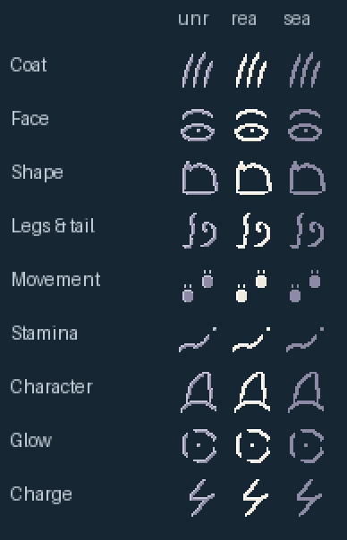
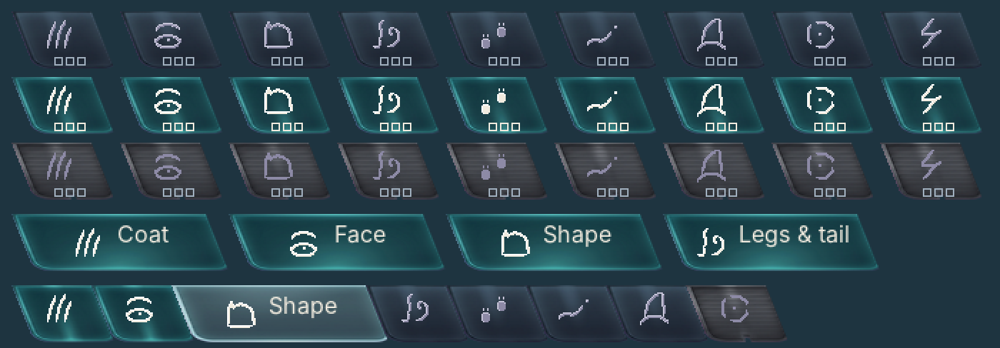
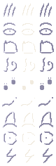
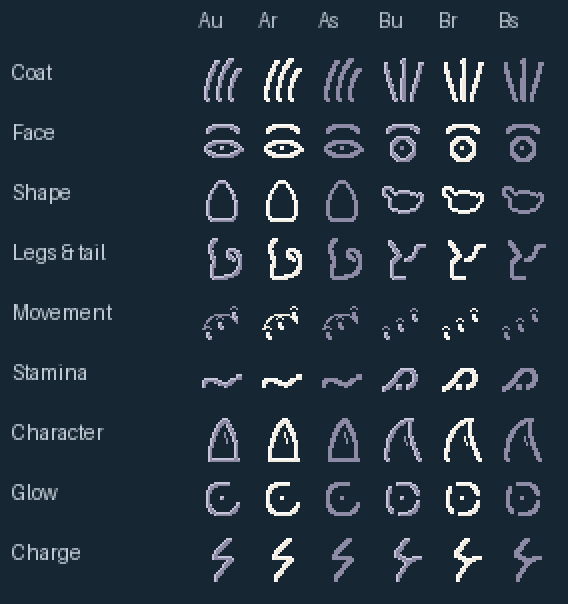
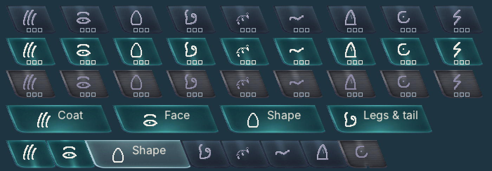
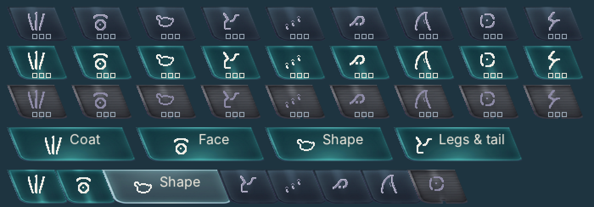
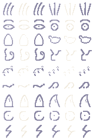

# Chapter emblems

> **Round 2 (2026-10-08): the picked motifs hand-pixelled at 24×24, three states each, for the art director's sign-off.** Round 1 (two options per chapter, brush-drawn) is kept below and in `round1/` for the record.

**What round 2 is.** Each emblem is explicit pixel data in `source/<chapter>.txt` (24 rows of 24: `#` base colour, `+` lit edge on the top and the left, one palette step lighter, `.` empty), read by `build.py`. The strokes are tapered at their ends (1 px tips, 2 px bodies) like an engraving. The text files were first traced by `trace.py` from anchor curves (a guide only, kept for the record) and then edited by hand, pixel by pixel (`source_gen.py` and `edits.py` record the first writing and the edits); the traced output is not the final. A state changes colour only, never the drawing: unread is mist with a fog edge, read is bone with a white edge, sealed is mist flat with no lit edge.

**Picks and redos, as directed.**

| Chapter | Round 2 drawing |
| --- | --- |
| Coat | A, the combed lock: three leaning strokes of three lengths, tips tapered |
| Face | A, the almond eye under a brow arc, the pupil a 2×2 cut |
| Shape | redone as a resting body from the side: the face line up to a pointed ear tip, a dip at the neck, one long back arc to the rump, a flat base |
| Legs & tail | B as the base: the hind leg ends in a 2 px foot turned forward; the tail is a separate curl behind, not joined to the leg |
| Movement | redone from B's level walk: two larger prints on a diagonal step, each a 6×7 pad with two toe nicks |
| Stamina | A, redone: the wave runs the full 22 px, rising gently, ending in a separate 2×2 dot |
| Character | B, the single-curve ear, with an arc of the head at its base |
| Glow | B, the ring broken three times, a dot at its centre |
| Charge | B, the angular spark with a branch |

## The sheets

*round2/contact-labelled-2x.png: the nine emblems in unread, read and sealed at 2×, nearest neighbour, on the bench ground; `round2/contact-labelled-1x.png` is the same at 1×. Status: round 2, for sign-off.*

*round2/proof-2x.png: the emblems at 2× on the signed `rail-tab-*` plates: all nine on the unread, read and sealed compact plates (emblem at (x + 34 − 12, 44)), four full read tabs with their words (emblem at the centred block, y 48), and an eight-chapter compact rail with Shape open. Pips and words are stand-ins; the 1× file is `round2/proof-1x.png`. Status: proof.*

*round2/emblems-sheet.png: the packed sheet, 80×236, nine rows by unread, read and sealed (indexed: PLTE the 62 colours of `station.json` in file order, index 62 transparent, so a pixel can only be a palette colour or empty); `round2/emblems-atlas.json` has the rects, the sha256 of every sprite and the manifest entries (policy `stationChrome`). Each emblem is also a slice in `../slices/`, named `rail-emblem-<chapter>-<state>-24x24`. Status: round 2.*

## Checks

- 27 slices, each 24×24, indexed on the 62 colours: 0 off-palette pixels by construction, no anti-aliasing, no dither, nothing scaled (the build draws nothing small and enlarges nothing).
- The three states are one drawing in three colourings: the only differences are the base and the lit colour (sealed has no lit colour).
- No focus cream, amber or orange; the bone emblem is dimmer than the pod's lit shell.

## Known weaknesses, for the art director

- **Character** still reads close to a fin: the ear leans and the head's arc is shallow at 1×; the cup line was left out so the ear stays one curve.
- **Shape** reads as a small bell or a sitting cat at 1× more than a resting body; the neck dip is two pixels.
- **Movement**'s two prints are solid pads (a hollow pad read as a jar); they are the only solid shapes in the set.
- **Stamina** is still close to a tilde at 24 px; the separate dot is what keeps it apart.

## Round 1 (kept for the record)

> Two options per chapter for the art director's picks. **Status: round 1, nothing picked, nothing placed.** Round 2 is the three states of the picked options and the packed sheet, named `rail-emblem-<chapter>-<state>-24x24` in `../slices/`.

Brief: the programme lead's emblem brief of 2026-10-08. One emblem per chapter (nine: Coat, Face, Shape, Legs & tail, Movement, Stamina, Character, Glow, Charge) so the rail reads at 1× without the words; the compact tabs and the page heading show the emblem alone. Drawn at 24×24, never reduced from a larger drawing and never enlarged from the build's 16.

**Manner.** The candidate's engraved line, like the leaf etched in the signed `ring-hatch`: one 2 px cut, at most three strokes, a 1 px inner detail only where it reads at 1×; the lit edge on the top and the left one palette step lighter (`lighter` in `station.json`); no fill, no outline, no glow. Unread is mist with a fog edge; read is bone with a white edge (on the deep-teal read tab); sealed is mist, flat, no lit edge. A state changes colour only, never the drawing. Never the focus cream, amber or orange. Art layer only: the 62 colours of `station.json`, crisp, no dither, 0 off-palette (the PNG is indexed, PLTE the 62 in file order, index 62 transparent, so a pixel can only be a palette colour or empty).

**Motifs, from the mibi's own body.**

| Chapter | Option A | Option B |
| --- | --- | --- |
| Coat | a lock of three combed fur strokes, leaning together, three lengths | three strands splaying from a low root |
| Face | an almond eye under a brow arc, its pupil a 2 px cut | a round eye under a brow arc |
| Shape | the pod's egg, wider below, as one closed curve | a body with its head and rump, as one closed curve |
| Legs & tail | a hind leg (thigh, hock, foot) and a tail curl | an angular hind leg and a long S tail |
| Movement | three paw prints stepping up a stride arc | three larger prints, level apart |
| Stamina | one long breath wave ending in a dot | a breath that rises, falls and settles into its dot |
| Character | a pricked ear: pointed outline with concave sides and its cup | an ear in one curve with its cup line |
| Glow | a dot in a ring broken at the upper right | a dot in a ring broken three times |
| Charge | one angular spark, a thin zig of three cuts | an angular spark with one short branch |

## The sheets

*round1/contact-labelled-2x.png: every emblem, option A (columns Au, Ar, As: unread, read, sealed) and option B (Bu, Br, Bs), at 2×, nearest neighbour, on the bench ground. The 1× file is `round1/contact-labelled-1x.png`. Status: for the art director's picks.*

*round1/proof-option-a-2x.png: option A at 2× on the signed `rail-tab-*` plates: the nine chapters on the unread, read and sealed compact plates (emblem at (x + 34 − 12, 44)), four full read tabs with their words (emblem at the centred block, y 48), and one eight-chapter compact rail with the open chapter (Shape) full. The pips and words are stand-ins; the 1× file is `proof-option-a-1x.png`. Status: proof.*

*round1/proof-option-b-2x.png: the same for option B. Status: proof.*

*round1/emblems-sheet.png: the indexed sheet (158×236, nine rows by option A and B in unread, read and sealed), the source of the others; rects and hashes in [`round1/emblems-atlas.json`](round1/emblems-atlas.json). Status: round 1.*

## Method and files

| File | What it is |
| --- | --- |
| `build.py` | `python3 -I build.py`: draws every emblem on a 24×24 grid with a 2×2 brush along polylines and curves (standard library only), lights the top and left edge, writes the indexed sheet, the atlas (rects and sha256 of every sprite) and the unlabelled contact sheets. The drawings are in the file, readable and hand-editable. |
| `proof.py` | `python3 -I proof.py`: the labelled contact sheets and the proofs on the signed tab plates (needs Pillow; a proof, not a deliverable). |
| `round1/` | The outputs. |

## Checks by eye at 1× (round 1)

- Face and Character differ: an eye under a brow against a pointed ear; Glow (a ring and a dot) is not a star, so it cannot be mistaken for the build's 12×12 glint.
- Weak in round 1: Shape option B reads as a small pot as much as a body; Legs & tail option A is the least legible; Movement's prints are small. They are offered so the pick has something to choose against, and are the first to redraw.

## Not yet

The three states as the named `slices/rail-emblem-*` files, the packed `stationChrome` sheet and atlas with manifest entries, and the 1× and 2× sheets of the picked set, which come in round 2 after the picks.
