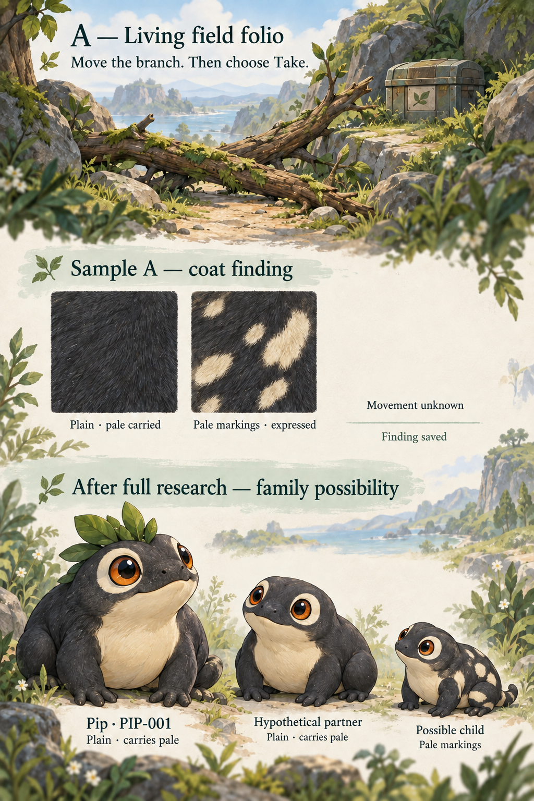
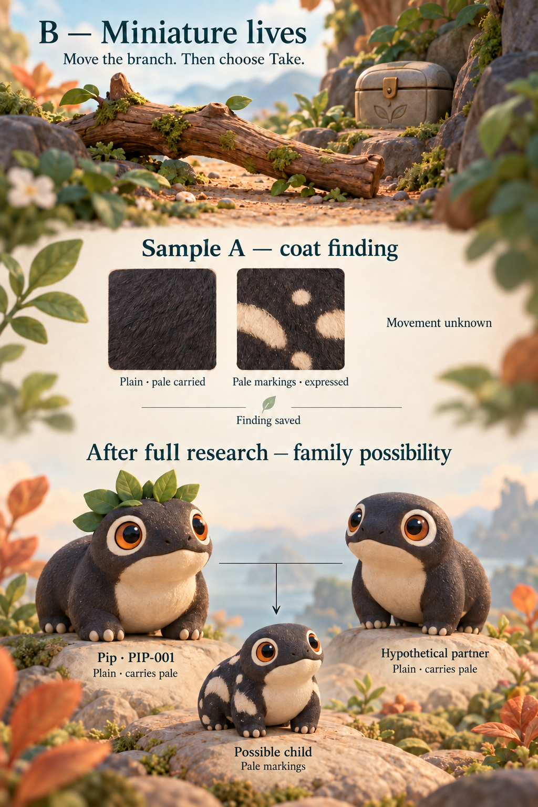
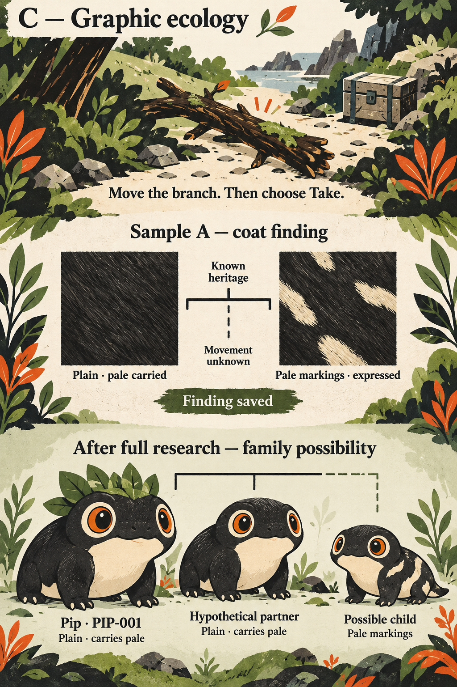

# Three visual directions for the same game

Miniature Beasts combines curiosity about living things with the pleasure of keeping a distinctive pet. These concepts explore how that experience might look beyond the initial C18 draft. They vary illustration, materials, composition and mood while keeping the same discovery, finding and family situation.

Each portrait board follows a field cache behind a movable branch, two known coat possibilities with movement still unknown, then a saved founder and a hypothetical family after complete research. The coat references reveal no unknown anatomy. A possible child is distinct from an accepted birth. These are art concepts, not complete device screens or executable interactions.

**Miniature Lives is the selected visual direction.** The [device-size study](../miniature-lives-proof/README.md) establishes the accepted appearance reference: HiBit for Companion and a matched richer treatment for Station and larger presentations. The [screen standard](../screen-design-standard.md#visual-direction-and-device-adaptation) explains the requirements. The other boards remain source alternatives rather than competing directions.

## A. Living field folio

Ink contours, gouache and open paper space make investigation feel like collecting observations about living things. The drawing can move naturally between field, individual and printed record. Its challenge is retaining clarity when fine lines and texture meet a small screen.

## B. Miniature lives

Sculpted forms, soft material and directional light give mibis physical presence. The emphasis is on affection and individuality. Its challenge is making inherited markings distinct from lighting and material effects, with a coherent treatment at smaller sizes. This appearance does not require or select a real-time 3D renderer.

## C. Graphic ecology

Cut-paper silhouettes, strong masses and branching relationships make the game visually direct. Its challenge is keeping mibis expressive and distinguishing inherited detail from decorative print texture. Monochrome adaptation is a hypothesis to explore, not measured display performance.

## What this comparison establishes

The accepted device-size treatment guides further artwork. Production typography, reusable native pixel masters, animation, rendering budgets and physical display behavior still need appropriate implementation and evidence. It does not define a complete set of creature body plans or select hardware and controls.

[Exact prompts](prompts.json) and [source manifest](manifest.json) identify the generated originals and references. Original C18 and Pip references remain preserved. The [screen standard](../screen-design-standard.md) owns shared information and interaction requirements; the [connected study](../probe-bench-review.md) explains the full journey and open game/system alternatives.
