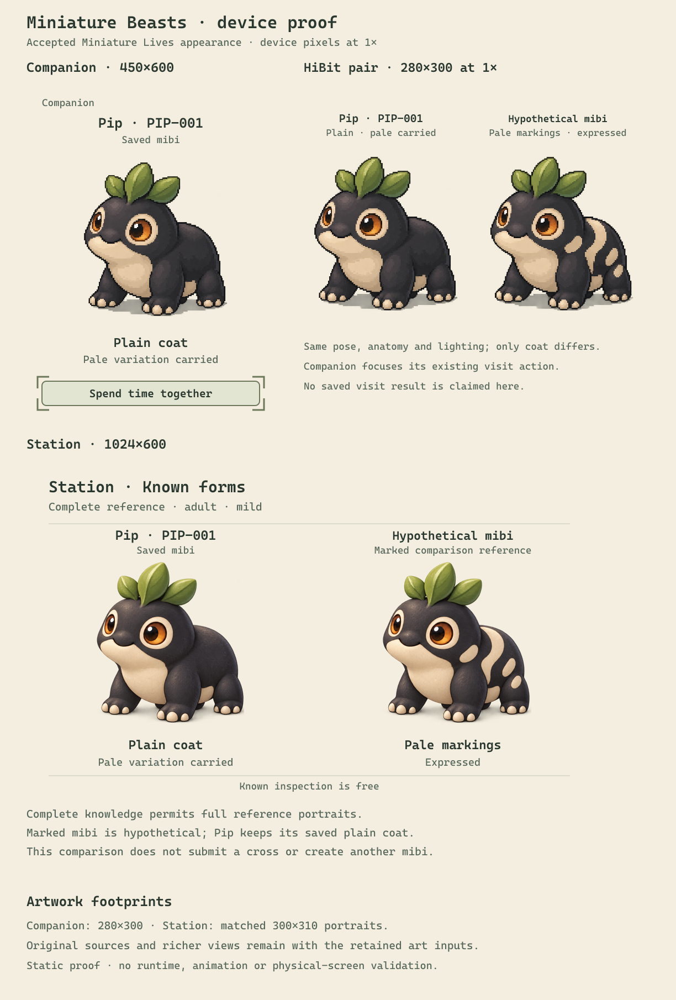

# Creatures and genomics

Every mibi follows from its genome. Its body, markings and abilities come from
inherited information, so players can learn how heredity works by watching
creatures, comparing them and breeding them. The genetics has to stay invisible
enough to play with, and real enough that its results surprise and make sense.

## A worked example

Pip is the one creature built so far. One of its traits is pale markings, which
are recessive:

- `PP`: plain coat.
- `Pp`: plain coat that *carries* pale. It doesn't show, but can be passed on.
- `pp`: pale markings are *expressed*.

A player brings home a Pip sample. After identifying its species, they can create
a founder from it straight away, unedited. Or they research the coat first and
learn this sample is `Pp`. Then they may choose `PP`, `Pp` or `pp` for the founder.
Every other trait stays exactly as the sample had it, even ones the player knows
nothing about. A `PP` sample could never give `pp`: knowing about pale from
another sample does not put it into this one.

Later, two `Pp` parents of the same species can have plain, carrier or
pale-marked children, about 25/50/25 under simple equal inheritance. A child is a
new individual with real parents, not an upgraded copy.

## Species

**Decided:**

- Every mibi belongs to an established species. Species give the collection its
  structure and keep variation within recognizable, viable, appealing pets.
- Breeding happens only within a species. Sharing a species is necessary but not
  enough: individuals also need to be eligible.
- What defines a species is protected and does not vary. Some regions are
  inherited-only, so breeding remains the way to change them.

**Working rules:** a species sets the shared constraints and an individual genome
fills in its own copies within them. A species is not a cosmetic preset or a label
added after free generation. Discovering a species does not decode samples of it
or grant ownership of anything.

**Open:** how many species there are, what each one is, and what each one fixes
versus lets vary. An earlier suggestion of 32 classes is not a roster.

## The creature record

**Working rules** from the first prototype's genetics framework:

- **Trait, locus, allele, genotype.** A trait is something describable. A locus is
  a hereditary position. An allele is a variant at a locus. A genotype is the
  actual pair of copies. Several loci can shape one trait, and one locus can shape
  several.
- **Kept separate:** the species foundation, the individual genome, how it is
  expressed and develops, the resulting body and abilities, and what happens over
  its lifetime. Training, fatigue and familiarity change behavior, never genes.
- **Eleven trait domains** organize the record: structure, appearance, movement,
  sensing and signaling, cognition and tendencies, energy and nutrition,
  maintenance and protection, affinities and exposure, development and longevity,
  reproduction, and fantastic physiology. Domains are a filing system, not organs
  every species must have.
- **Values have units, not universal scores.** A true zero, an absent trait,
  something unknown and something not modeled are different states.
- **Abilities have layers.** Inherited potential, expressed availability, learned
  skill and current readiness are distinct. Behavior can never use a body part the
  creature doesn't have.

## Identity

**Decided:** a mibi's identity, heredity, source and version history and finished
appearance persist across devices and on paper.

**Working rules:** each individual keeps:
- its species and rule versions;
- its complete birth genome;
- its founder origin or actual parents, and where each inherited copy came from;
- its original art.

Two mibis with identical genomes are still two individuals. Loading old data never
adds genes, and rule changes never rewrite existing creatures. If art fails, the
creature remains and the failure is shown; art can never change a gene.

## Research

**Decided:**

- A sample holds one complete genome. The player's knowledge of it is partial, and
  that's fine.
- Research is optional. It reveals what a particular sample carries, and builds
  understanding the player keeps.
- It never changes the sample, and knowing a variant from one sample never adds it
  to another.
- Research must help players see and pursue useful possibilities visually. It must
  not become a checklist of hundreds of loci, and must not drown players in
  near-identical samples and repeated studies.

**Working rules:**

- Findings survive using up the sample and running out of supplies.
- Overlapping evidence is never charged twice. If one study already established
  something, a second study of it is unnecessary.
- One known copy never reveals the hidden other copy.

**Proposal:** an irregular "genome field" picture where known regions open up
within their neighborhood (see `art/references/genome-field/`).

**Open:**
- how identification works and what it costs;
- which studies exist and what they cost;
- what a repeat sample of a known species is worth.

## Creating a mibi

**Decided:**

- Identifying the species and having enough material allows an unedited founder.
  Full decoding is not required.
- Changes are allowed only at researched, permitted traits, using variants the
  sample itself carries, and only in combinations that make a valid whole genome.
  Everything else keeps the sample's values.
- Creation commits one individual. Incubation and opening introduce that same
  individual, never a reroll.
- In the bounded trial, pale is configurable after research, while movement and
  effort stay inherited-only. This is a trial for one species and must not be
  generalized.

**Working rules:** one sample makes one founder. A founder has no parents: the
sample is its origin, not a parent. Before committing, the player reviews the
source, changes, known consequences, what remains unknown, and the cost.

**Open:** which traits are configurable for each species.

## Breeding

**Decided:** same species only. Every delivered offspring is viable and appealing,
with real parents and real inherited copies.

**Working rules:**

- Each parent passes one actual copy per paired locus, and the child's genome is
  validated as a whole. No silent substitutions.
- An ineligible pair is refused before anything happens; that is different from an
  attempt that fails.
- Forecasts are per trait, and say nothing about fertility or eligibility.

**Open:**
- what makes two individuals eligible;
- fertility, cost and how often attempts fail, and how that's shown;
- mutation, lifespan and death.

## What is built

All **Built in v1**, none of it accepted as design:

- **Pip genetics proof** (`v1/prototype/genetics/`). One species with three fixed
  traits and five variable two-copy loci: crown, eye rings, pale markings, movement
  drive and movement efficiency. It covers expression, inheritance with recorded
  donors, per-trait forecasts and partial research disclosure.
- **Native fixtures** (`v1/native/shared/pip_genetics.c`). Four predefined sample
  candidates with study costs. Creation there requires full decoding. That gate
  contradicts the decided unedited-founder rule and should not carry forward.
- **Genome workbench** (`v1/prototype/generator-workbench/`). A much larger
  authoring genome, with 114 paired loci across the domains and static body
  construction. It has no movement, physiology or reproduction. Three domains
  (maintenance, affinities, fantastic physiology) have no loci yet. Its random
  founder sampler is an authoring tool, not the game's sample model. Its generated
  art is on hold.

## Open questions, in order of impact

1. What a species is, and the starting roster.
2. Which traits players can steer at creation, versus only through breeding.
3. Breeding eligibility and viability, and how a refusal or failure is shown.
4. How identification works and what it costs.
5. What makes a repeat sample worth having.
6. How the research picture works without becoming a labelled diagram.
7. Which inherited abilities matter for exploring with a partner.
8. Mutation, lifespan and death.
