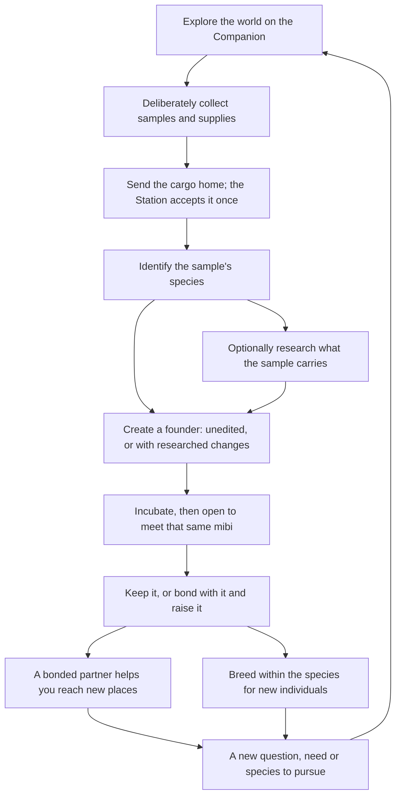

# The game

Miniature Beasts is a game about bringing something mysterious home, finding out
what it could become, and living with the creature that results. Players explore
on a portable Companion, carry samples back to a home Station, learn what those
samples' inherited traits can do, create a mibi, and, if they choose, raise it and
breed families within its species. Each part gives the others a reason: a trip
feeds the research bench, research leads to a new pet, and that pet and its family
give the next trip a purpose.

It is also a genetics toy. Appearance and abilities follow inherited traits, and
the player learns how through pictures, comparison and consequences rather than
lessons or notation.

## Who it is for

The game works for two audiences at once. Children explore, uncover and pursue
possibilities visually, without any genetics vocabulary. Curious
parents and STEM enthusiasts can dig into the real genetics, one press away and
never required. It is never a text-heavy school lesson, and never childish, in
tone or in reward. It is a sandbox: a pretty mibi, a rare one and a capable one
are all valid goals. Player words sound like a game, not a lab report. What the
Station shows of the genetics is in
[research and breeding](research-and-breeding.md#what-the-player-sees-of-the-genetics).

## The loop

Research and tinkering are the core of the game. Every mibi starts as a pod to
be researched and incubated. The player reads what its genome carries, a chapter
at a time, then acts on it: shaping a founder, and later crossing mibis toward a
wish. The rules are in [research and breeding](research-and-breeding.md).

Exploration is open-map, research is optional, each creation makes one fixed
founder, bonding is optional, partners help, and breeding stays within a
species. The table below gives each mechanic in short and links the document
that holds its rules.

## What a session feels like

A short session might be checking on a familiar mibi, looking again at a finding,
choosing what to research next or collecting a needed supply. It ends at a natural
stopping point with nothing lost. A long session might follow a promising place,
compare two samples competing for the same supplies, or investigate how a family's
traits split across a generation.

There is no minimum session, no care schedule for unbonded mibis, and no need to
research every pod straight away.

## Design principles

These hold across every mechanic.

- **Curiosity must be actionable.** Show enough of a place, creature or clue to
  support a choice. Variety must change what you can do or what happens, not just
  the scenery or the wait.
- **Discoveries accumulate.** Findings, origins and learned possibilities are kept.
  Running out of supplies changes what you can afford, never what you know.
  Looking again is always free.
- **Explain by showing.** Players compare, see the result of an action and
  recognize individuals. Short text covers uncertainty and cost. No chemistry
  lessons, quizzes or hidden-answer puzzles.
- **Variety must still make good pets.** Every result must be coherent, viable and
  appealing. Rare, complex, powerful and personally loved are different kinds of
  value, all valid goals.
- **Commitments are deliberate.** Browsing, previewing and docking spend nothing.
  Before anything is spent or created, the player sees what, with what, and what
  follows.
- **Reward attention without demanding attendance.** A glance should show what
  matters. No punishment for being away, and no reflex challenges.
- **Players choose their goals.** An attractive pet, an unusual ability, a complete
  collection and a beloved lineage are equally valid. Performance is not the only
  measure.
- **Any wait has a purpose.** A minigame must add a decision or a discovery, not
  an input ritual. Waiting never happens in exploration, the most interactive part;
  if the game has waits, they belong to research or incubation running in the
  background.

## Mechanics

| Mechanic | How it works |
| --- | --- |
| **Exploration** | A fogged world map of living places that turns once per expedition. The player starts on any cell they can see; the Probe's tier sets the reach; walking and Call survey a place; storms, fog banks, outposts and beacons shape the trip ([world and exploration](world-and-exploration.md)) |
| **Gathering** | Collecting is deliberate, in whole items. A full hold offers a swap, and nothing is lost. The Probe carries 2 pods at tier 1 and 3 at tier 2, and up to 20 of each material |
| **Return** | Head home works only on the start cell or a lit outpost, and it ends the expedition. It seals the hold into a crate that rides in the Companion's bay until it docks; the player may keep exploring with crates aboard. The Station opens each crate exactly once. A break sends nothing home: the pods drop where the Probe broke |
| **Identification** | Shows the species, not the pod's hidden traits; an identified pod can be grown unedited ([research and breeding](research-and-breeding.md#identify)) |
| **Research** | Optional, and the core of play. A chapter at a time, as pictures; glints say where something new is; findings are kept; sealed chapters open with finds ([research and breeding](research-and-breeding.md#reading-a-chapter)) |
| **Creation** | One pod makes one fixed founder, unedited or shaped among the copies that pod carries ([research and breeding](research-and-breeding.md#creating-a-founder)) |
| **Incubation** | Reveals the same individual, never a reroll; Grow now shortens the wait for Essence; opening is a press ([research and breeding](research-and-breeding.md#the-bud)) |
| **Life and bonding** | A mibi grows from an embryo in the bud into a juvenile, an adult and an elder. Bonding is optional, and only bonded mibis need care to mature; wild and unbonded mibis need nothing. Bonding is not needed to breed. A bonded mibi cannot be returned to the wild |
| **Partners** | One mibi at a time is "with you" on the Companion. An adult or elder with you is a partner on expeditions; a juvenile is not. Partners use their species' abilities to open events, places and finds. They gate the higher tiers of exploring and never block exploring alone ([world and exploration](world-and-exploration.md#partners-and-gates)) |
| **Breeding** | Two adults or elders of one species make one child with real parents; the forecast shows pictures of what is read; a wish guides it ([research and breeding](research-and-breeding.md#the-cross), [genomics](creatures-and-genomics.md)) |
| **Supplies** | Three supplies in whole units, each spent for its function: Energy runs the machines, Data reads genomes, Essence grows bodies. Energy comes from struck and warm stones and stays scarce; Data from creature moments the player causes; Essence from dew, pressed fruit and tufts ([world and exploration](world-and-exploration.md#materials), [research and breeding](research-and-breeding.md#data-and-the-other-supplies)) |
| **The vivarium** | The player keeps as many mibis as the vivarium holds: six bays. Returning a grown, unbonded mibi to the wild frees its bay and gives 2 Essence; its place remembers it and later sheds one pod of its line. More room comes from more vivariums |
| **Crafting** | Discovery with clues. Recipes are personal once learned; a failure wastes the ingredients or returns a fraction. It runs deep over the long term and stays simple at first |
| **Wild capture** | Not in the game |
| **Upgrades** | Tiered upgrades for the Station, the Probe and the Companion. The tier 2 Probe reaches further and carries 3 pods. The Station takes virtual research chips, which are found, crafted, traded or dropped by rare mibis |
| **Sharing and paper** | One household kit serves several players, each with their own progress. Sampling someone else's mibi needs its owner's consent. There is no global ranking of who found something first. A mibi's stamp code can be shared; a scanned stamp only shows a mibi, and never creates or moves one. Only portrayed mibis can be traded |
| **Online play** | The kit plays standalone, with no account or internet. The cloud is an optional, paid layer on top, never needed to play |

## What the first prototype proves

The [v1 simulator](../v1/README.md) plays one narrow version of the loop on
simulated devices: move on a small grid map, take finite supplies and one sample,
send them home, accept once, research, choose a supported form, incubate, open and
visit the resident. It proves the bookkeeping underneath: nothing duplicates,
nothing is lost on interruption, findings survive shortages, an opened mibi is the
one that was created.

It does not prove that exploring is interesting, that research creates curiosity,
that the creatures are appealing, or that the devices work physically. Those are
the questions the [roadmap](../ROADMAP.md) is built around.

## Not designed yet

- What bonding involves, what care looks like, what missing it means, and how
  long a mibi lives.
- Which ability each species brings as a partner, and how traits shape it.
- Fertility, and how a cross that fails is shown.
- What crafting makes: its recipes, feed and habitat items.
- Probe tiers beyond 2, mods, chip slots and Station upgrades.
- The cloud layer's contents: sync, an exchange, mini-games, lineage and
  printer play.
- The real transfer of crates between devices.
- Research and breeding's open questions, prices among them, are in
  [research and breeding](research-and-breeding.md#not-designed-yet).
