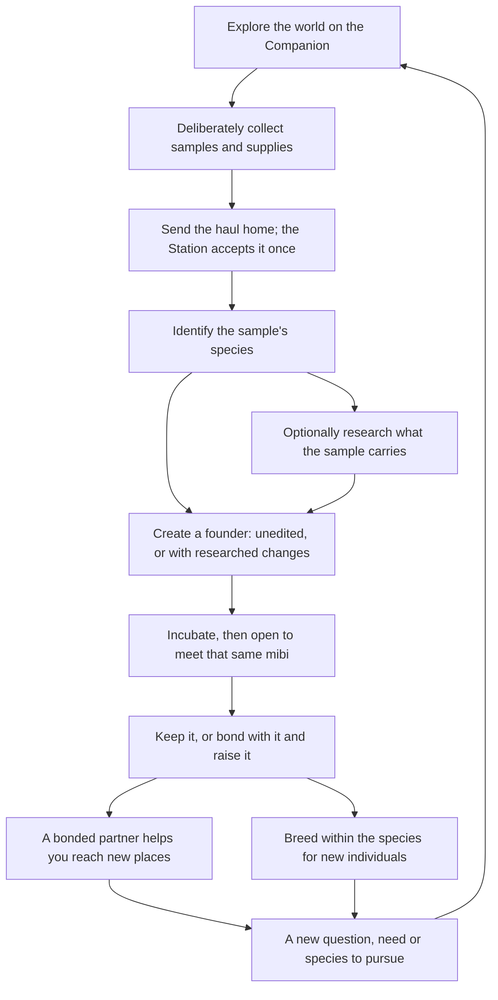

# The game

Miniature Beasts is a game about bringing something mysterious home, finding out
what it could become, and living with the creature that results. Players explore
on a portable Companion, carry samples back to a home Station, learn what those
samples' inherited traits can do, create a mibi, and, if they choose, raise it and
breed families within its species. Each part gives the others a reason: a trip
feeds the research bench, research leads to a new pet, and that pet and its family
give the next trip a purpose.

It is also a genetics toy. Appearance and abilities follow inherited traits, and
the player learns how through pictures, comparison and consequences rather than
lessons or notation.

## The loop

This is the intended shape. Its main steps come from decisions: open-map
exploration, optional research, one fixed founder per creation, optional bonding,
partners who help, same-species breeding. How each step works, and its status,
is in the table below. How exploration works is the largest open question; see
[world and exploration](world-and-exploration.md).

## What a session feels like

A short session might be checking on a familiar mibi, looking again at a finding,
choosing what to research next or collecting a needed supply. It ends at a natural
stopping point with nothing lost. A long session might follow a promising place,
compare two samples competing for the same supplies, or investigate how a family's
traits split across a generation.

There is no minimum session, no care schedule for unbonded mibis, and no need to
research every sample immediately. **Decided** for unbonded mibis; bonded care
timing is **Open**.

## Design principles

These are **Working rules**: they come from the first prototype's design work and
fit every decision so far.

- **Curiosity must be actionable.** Show enough of a place, creature or clue to
  support a choice. Variety must change what you can do or what happens, not just
  the scenery or the wait.
- **Discoveries accumulate.** Findings, origins and learned possibilities are kept.
  Running out of supplies changes what you can afford, never what you know.
  Looking again is always free.
- **Explain by showing.** Players compare, see the result of an action and
  recognize individuals. Short text covers uncertainty and cost. No chemistry
  lessons, quizzes or hidden-answer puzzles.
- **Variety must still make good pets.** Every result must be coherent, viable and
  appealing. Rare, complex, powerful and personally loved are different kinds of
  value, all valid goals.
- **Commitments are deliberate.** Browsing, previewing and docking spend nothing.
  Before anything is spent or created, the player sees what, with what, and what
  follows.
- **Reward attention without demanding attendance.** A glance should show what
  matters. No punishment for being away, and no reflex challenges.
- **Players choose their goals.** An attractive pet, an unusual ability, a complete
  collection and a beloved lineage are equally valid. Performance is not the only
  measure.
- **Any wait has a purpose.** A minigame must add a decision or a discovery, not
  an input ritual.

## Mechanics and their status

| Mechanic | What holds now | Still open |
| --- | --- | --- |
| **Exploration** | Open map, interaction-driven, on the Companion in Probe mode (**Decided**). Arriving, looking and waiting award nothing; finite finds do not refill or reroll (**Working rule**) | What the world is, what lives in it, what the player can do there, and why they return. See [world and exploration](world-and-exploration.md) |
| **Gathering** | Collection is deliberate; whole items; a full hold rejects without loss (**Working rule**, **Built in v1**) | Capacity, sample handling, what kinds of finds exist |
| **Return** | Send seals the haul; the Station accepts it exactly once; a lost confirmation never duplicates or loses it (**Working rule**, **Built in v1**) | Cross-outing persistence of unfinished leads |
| **Identification** | Establishes species and enough material, not hidden traits; then an unedited founder is allowed (**Decided**) | Method and cost |
| **Research** | Optional. Reveals a sample's evidence and reusable understanding; never changes the sample; no locus checklist; no drowning in near-identical samples (**Decided**) | Study variety, costs, value of repeat samples |
| **Creation** | One sample makes one fixed individual; changes only at researched, permitted traits, using variants that sample carries (**Decided**) | Which traits are configurable per species |
| **Incubation** | Reveals the same individual; never a reroll; opening is deliberate (**Decided**). v1 uses a 20-second timer (**Built in v1**) | Duration, purpose of the wait, what the player does meanwhile |
| **Bonding and care** | Optional; only bonded mibis need care to mature; wild and unbonded need nothing; not required for breeding (**Decided**). Learning changes behavior, never genes (**Working rule**). Forgiving care (**Proposal**) | How bonding happens, what care looks like, what missing it means, lifespan |
| **Cooperative gathering** | Bonded partners use their real abilities to help the player discover and progress (**Decided**) | Which abilities, which obstacles, how progress is gated |
| **Breeding** | Same species only; shared species is necessary, not sufficient; every offspring is a viable new individual with real parents (**Decided**) | Eligibility, fertility, cost, forecasts, failure presentation |
| **Supplies** | Data (understanding), Energy (running operations), Essence (making a hard relationship readable); whole items, not genes, not battery (**Working rule**) | Recipes, quantities, whether three is the right set |
| **Crafting** | Recipes are learned through useful clues, not blind mixing; knowledge survives a failed attempt (**Working rule**) | Scope; failure costs; feed and habitat items |
| **Habitats** | Places with populations, resources and conditions that can make an ability useful (**Working rule**) | Space, cohabitation, competition, freezing while away |
| **Wild capture** | Direction only: a temporary capture may escape before reaching home; established companions never run away (**Proposal**) | Whether it is in the game at all |
| **Station upgrades** | Limited removable research-chip slots for capacity, speed and methods (**Working rule**) | Tiers, effects, how they are earned |
| **Sharing and paper** | One household kit can hold several players' profiles. Scanning or printing never grants ownership or breeding rights. Shared research clues carry no genes (**Working rule**) | Rewards for scanning, trades, loans, printer gameplay |
| **Online play** | Optional; core play never needs a phone, account or internet (**Working rule**) | Whether to build any of it before the core game proves itself |

## What the first prototype proves

The [v1 simulator](../v1/README.md) plays one narrow version of the loop on
simulated devices: move on a small grid map, take finite supplies and one sample,
send them home, accept once, research, choose a supported form, incubate, open and
visit the resident. It proves the bookkeeping underneath: nothing duplicates,
nothing is lost on interruption, findings survive shortages, an opened mibi is the
one that was created.

It does not prove that exploring is interesting, that research creates curiosity,
that the creatures are appealing, or that the devices work physically. Those are
the questions the [roadmap](../ROADMAP.md) is built around.
