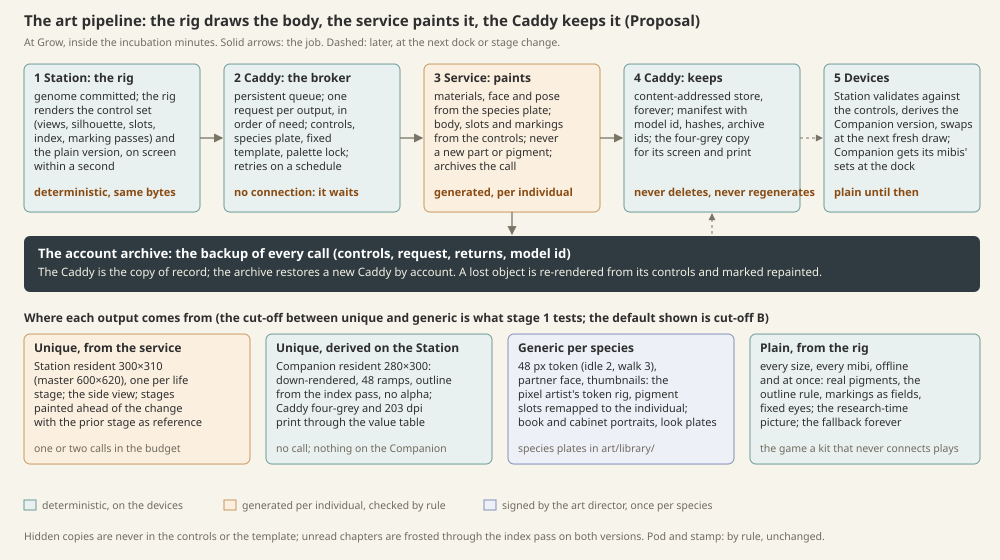

# Art pipeline: the rig draws the body, the service paints it, the Caddy keeps it

**Proposal**, version 2 of 2026-10-08, from the pipeline designer with the art director and the genome engineer, for the owner. It replaces the version of 2026-10-07 after the owner's decisions of 10-08 (§1) and the close of stage 0 ([the workbench](../../prototypes/workbench/README.md)). **Decided** marks owner decisions restated here; **Superseded** marks what the earlier version proposed and no longer stands; everything else is **Proposal**. It builds on the [art direction](../art-direction.md), the [style guide](../style-guide/README.md), the [taxonomy](taxonomy.md), the [species frames](species-frames.md), the [research loop](research-loop.md) §4–6 and the [devices](../devices.md).

*Top: what happens at Grow, inside the incubation minutes. Bottom: where each output comes from.*

## 1. Principles

**Decided 2026-10-08.**

1. **No device rendering of finished art, and no fixed set of looks.** Expression is continuous. A mibi's art is generated **per individual**, as a batch background job while it incubates, brokered by the Caddy through a cloud generation service. The rig's renders (the workbench's structural sketch: views, slot map, index and marking passes) are the **control images**; the service paints, it does not invent the body.
2. **Hidden copies never show.** Only research reveals them.
3. **Species have colour pools:** common colours and markings, with slight per-individual variation.
4. **The 48 px token is a generalisation** of a species' most representative traits. Full detail is for the Station and the Companion resident view.
5. **Offline, a plain version** rendered from the rig; **connected, the unique generated version.**
6. **Smaller sizes may be generic per species** rather than per individual, which cuts the spend. Tests find the satisfactory cut-off size.
7. **The Caddy stores the renders forever;** the service call backs them up, for archival, re-render and restore.

**Still standing.** The kit plays standalone and the core game never depends on a remote call (Project 10-07; Architecture): the plain version is the game offline. No hand-made art per individual (10-01). Sketch before art (10-02): the control images are the sketch. Art never changes genes; draw only what is known; same individual everywhere. The art director signs every piece *the owner sees* (10-07): the species plates, the contract and the test sets; no person sees a player's render before the player, so the checks of §5 stand in. Engineers do not draw. Clean room (10-07): a fixed template, project-owned references only. Pods from one renderer and the stamp from the genome bits: unchanged.

**Superseded.** "Generate at archetype levels; render individuals on device from a parts library" (the earlier principle 1, stages 2–5, §4 and §5), the hour budget per rig, limb set and covering, the first-drop weeks, and the earlier decisions 1, 2 and 5. Decision 3 (the first drop is one of each kind: Loika, Kilpo, Belatz, Peplos, Lehten) and 4 (species artefacts in `art/library/`) stand; individual renders never enter the repository.

## 2. The flow at Grow

The player presses Grow. From that press to Open are the **incubation minutes** (station-loop §1, **Decided**: small 2, medium 3, large 4, +1 per chapter beyond three, +1 per trait changed; the first mibi ever 1). That is the latency budget.

1. **Station, at once.** The genome is committed and validated as a whole. The Station runs the rig (the workbench's `rig.mjs` and `raster.mjs`) and writes the **control set** (§4) and the **plain version** (§3) for the juvenile, on screen within a second. The job manifest names the genome digest, the frame, rig, species plate and template versions, and the outputs wanted in order of need.
2. **Station → Caddy** over the home Wi-Fi (both are on it; the dock is not needed). The Caddy keeps the queue on its own storage; a job survives a power cut.
3. **Caddy → service.** Per output: the control images, the species plate (the signed type-specimen render, the treatment reference), the fixed template filled from frame facts, the palette lock. One request per output with an idempotency key; no silent retry: a failure is recorded and retried at one minute, five, thirty, then at every dock.
4. **Service → Caddy.** Returns are stored content-addressed with the request, the model id and the hashes; the call archives them under the kit's account (§7).
5. **Caddy → devices.** The Station fetches the set, **validates** it against the controls (§5), derives the Companion and Caddy versions (§6) and **swaps** it in (§3). The Companion gets the sets of the mibis it carries at the next dock; the Caddy keeps the four-grey copy for its screen and the printer.

**Order of need.** The juvenile Station render first (what steps out at Open), then the side view. Adult and elder sets are painted **ahead of the stage change**, which the Station can schedule, so the budget holds one or two calls. The Retro Diffusion trial measured 20–105 s a request with references; two calls in parallel fit two minutes. The first mibi ever (1 minute) will usually open plain and swap soon after.

**When the budget runs out,** the mibi opens plain, with no wait, no spinner and no apology; the unique version swaps in later. Nothing in the game waits for art. **With no connection,** the same, for as long as it takes: the job waits on the Caddy, and a kit that never connects plays the whole game plain.

## 3. The plain version and the swap

**The plain version** is what the rig renders by itself, finished to the style guide rather than left as the sketch: the shaded pass with the individual's real pigments in its slots, markings as fields, the 1 px outline from the index pass in the darkest step of the part's ramp, fixed eye inks with a catch light, lit from the top left, quantised to the device ramps, at every size. It is deterministic, it carries the exact silhouette, slots and markings the unique version must keep, and it is the picture research shows before Grow: each trait on *this pod's mibi* on Pods and Create (research-loop §4) is the plain render of the expressed look; the misty seed for a hidden look is the species' field-guide plate, never this individual.

**The swap** is a one-way promotion at the next fresh draw of that mibi (a screen change, waking, coming home), never while it is on screen. Silhouette, slots and markings are the same by contract, so the swap changes craft, not identity. The plain version is kept forever and drawn again only when the unique set is missing or fails validation. The player is never told which version they see.

**Frosting.** A bred child is known only where its parents' copies matched (research-loop §4). Generation runs at Grow for the whole expressed body; the display frosts the parts of unread chapters through the **index pass**, on both versions, and reading clears it. The hidden copy of any locus is never in the manifest, the template or the controls, so it cannot be painted (Decided 2).

## 4. The control-image contract

Per output, from the workbench's sketch (`sketch.mjs`, the cache manifest of `mb-species-frame/2`).

| Control | From the rig | The service must |
| --- | --- | --- |
| **Views** | three-quarter lit from the top left as the main view; side, front, top as support; one camera rig, the body centred in its fixed frame | paint the main view; use the others for form only; never a new angle |
| **`silhouette`** | black on white at the target size | keep the painted silhouette within the tolerance of §5 |
| **`slots`** | one flat colour per pigment slot, both halves of a split slot, with the legend (slot → exact colour from the individual's pool value) | paint each slot in its ramp, within the palette lock; never move a pigment |
| **`index`** | one flat colour per part | keep every part, add none; the Station frosts and counts by it |
| **`markings-<field>`** | one mask per marking field (coat, flaps, cap, mask, rings, shell, belly) | paint the pattern only inside its field |
| **`shaded`** | the sketch's one-light form | the light and the volumes; no second light, no scene |
| **Species plate** | the signed type-specimen render of the species, same view | the material (fur, scales, skin, leaf, sheen), the face treatment, the pose language |
| **Template** | fixed per plan, filled with frame facts (kind, covering, state, stage); no free text | nothing in it may add a part, a colour or a prop; a subject on a plain ground |
| **Palette lock** | the individual's slot colours with the device ramps | stay on it; the Station snaps the rest |

The three things the rig cannot say (stage 0 report: materials, the face, the pose) are the species plate's to say. Stage 1 chooses the service and call shape that honour this: the Retro Diffusion trial shows palette locks and references hold but identity and outline do not without them, and its Pro family stops at 256 px, so the Station master is a painted-model call and the Companion version is derived (§6).

## 5. Consistency rules

- **Generate once, cache forever.** The key is genome digest + frame, rig, species plate and template versions + service model id. The same key is never requested twice.
- **Versioned by service model.** A render records the model that painted it. A retired model's renders stay as they are; a rule, plate or model change never rewrites a living mibi (**Working rule**, kept).
- **Never silently regenerate.** A re-render happens only on a restore whose archive copy is lost, or on an explicit action the owner may add later, and is a new version with its reason, the old one kept.
- **Stages inherit.** The adult is painted with the juvenile's unique render as a second reference, the elder with the adult's.
- **Validation before the swap**, on the Station: silhouette IoU against the control (threshold set by stage 1; the census separates species at 0.22 shape distance, an individual against its own control should sit above 0.9); every index part present, nothing painted outside the silhouette beyond the tolerance; each slot's mean colour within its ramp; markings inside their fields. A failure is kept with its reason and retried once with the fault named in the template's correction slot; a second failure leaves the mibi plain and puts the key on the owner's review sheet.
- **The manifest** is the workbench's, with `controls`, `references`, `prompt`, `model`, `outputs`, `validation`, `archive` and `supersedes` filled.

## 6. Per individual or per species, by output and size

Decided 4 and 6 draw the line; the cut-off is what §9 tests. The default below is the position to test.

| Output | Size | Unique or generic | Comes from |
| --- | --- | --- | --- |
| Station resident (vivarium, Habitat, Visit) | 300×310, master 600×620 | **unique** | the service, main view, one per life stage |
| Station side view (walking, routines) | 300×310 | unique, a second call; or the plain side view if the eye accepts it | the service or the rig |
| Companion resident | 280×300 | **unique, derived**: the master down-rendered on the Station (k-centroid reduction, the 48 ramps, the outline from the index pass, no alpha) | the Station |
| Caddy four-grey and print | the Caddy's sizes, 203 dpi | unique, derived through the signed value table and Bayer | the Station |
| Field token (world, partner) | 48 px, idle 2 frames, walk 3 | **generic per species**, pigment slots remapped to the individual's pool values | the pixel artist's token rig |
| Partner face on the HUD ring, list and tree thumbnails | 16–40 px | generic, remapped | the token rig |
| Cabinet and book portraits, field-guide look plates, the misty seed | 120–310 px | generic per species and per look | the species plates |
| Life stages | as the resident | unique per stage, painted ahead of the change | the service |
| Motion | Companion stepped frames; Station eased | derived by rule from the still (breathing, bob, blink; the walk on the token); never painted frame by frame (the trial's frames boil) | device code on signed rules |
| Pod, stamp face, frosting | as before | by rule | unchanged |

Two Loikas with the same pool values share a token in the field and differ in the resident view: that is what Decided 4 accepts.

## 7. Storage, backup and restore

- **Caddy.** An SD card beside the e-paper module (an addition to the reference hardware): content-addressed objects and one manifest per mibi per stage, forever. A full set is 1–3 MB; 500 mibis under 2 GB; a 32 GB card holds a kit's lifetime. The Caddy never deletes a render.
- **Account archive.** Every call runs under the kit's account and archives controls, request and returns (Decided 7). The archive is the backup; the Caddy is the copy of record. A new or wiped Caddy restores by account; until then the Station draws plain and swaps as sets arrive. A lost archive object is re-rendered from its controls, by the same model if it exists, else marked repainted. Cancelling the account never deletes local renders (**Working rule**, kept).
- **Sync.** Station and Caddy over Wi-Fi; the Companion at the dock, only the sets of the mibis it carries (8-bit indexed 280×300, about 85 KB a stage) plus the species token rigs; the Companion calls nothing.
- **Species artefacts** (plates, token rigs, templates, value tables) stay in `art/library/` and ship in content packs.

## 8. The cost model

**Assumptions.** The private spend notes are not in the public repository, so the figures use the earlier version's assumption for the painted model (about $0.10 a Pro-class call, $0.04 flash-class) and the Retro Diffusion prices the trial measured ($0.03, $0.06, $0.18 an image). Stage 1 replaces them with measured cost per manifest. Retries at 20 percent. A derived Companion version costs no call.

**Per mibi, three life stages**, by where the unique set stops:

| Cut-off (smallest unique size) | Unique | Generic or derived | Calls a stage | Calls a mibi | At $0.10 | With retries |
| --- | --- | --- | ---: | ---: | ---: | ---: |
| A. Everything at size | Station main and side; Companion painted at size; token painted at size (pixel-art service, $0.18) | nothing | 4 | 12 | $1.44 | $1.73 |
| B. Down to the Companion | Station main and side; Companion derived | token | 2 | 6 | $0.60 | $0.72 |
| C. Station main only | Station main; Companion derived; side from the rig | token, side | 1 | 3 | $0.30 | $0.36 |
| D. Adult only | adult main; juvenile and elder plain | the rest | — | 1 | $0.10 | $0.12 |

**Per kit a year**, at 40 mibis grown: A about $69, B $29, C $14, D $5. Ten kits at B: about $290 a year, before the archive's storage. **Per species, once:** the plate set (type specimen, three stages, two views, two or three candidates each for the art director's pick) about 20 calls, $2–3, plus the token rig (about 6 art hours) and the look plates. Sixteen species: about $45 in calls and 100–130 art hours, against the superseded 1,400.

## 9. The cut-off test (stage 1)

1. **Individuals.** Loika (S01, skin), Belatz (S09, fur, one pair), Peplos (S12, insect-like, flaps): three rigs, three coverings. Five random individuals each from the workbench's pools plus the type specimen; controls from `sketch/cli.mjs --set`.
2. **Full unique sets (cut-off A)** for all eighteen; three stages for six of them. Every call in the manifest with its cost and time.
3. **The small sizes both ways.** Per individual, the Companion resident and the token (a) down-rendered from the unique Station set by the Station's rule and (b) generic per species, the type specimen's small sizes remapped to the individual's pool values, beside (c) painted at size.
4. **Side by side at device size** on true-size screens at 1×: the Companion at 450×600 with each version in the resident view and as a token in a reach view among the species' others; the Station at 1024×600 with the resident in the vivarium beside its plain version. Each sheet carries that version's cost per mibi and per kit-year.
5. **Two blind checks** with the owner and two testers: *match* (find this mibi's Companion version among its species' five from its Station version) and *tell apart* (which two tokens are different individuals). A size where generic is matched as often as unique is below the cut-off.
6. **Latency and validation.** Time per call and batch against the budget per size class; the validator's scores and rejections, so the threshold rests on evidence.
7. **The plain version beside everything,** so the owner sees what an offline kit plays.

**Owner review A:** the sheets, the tallies, the costs; the owner names the cut-off and says whether the plain version is good enough to be the offline game.

## 10. The stages, revised

| Stage | What | Signs | Status |
| --- | --- | --- | --- |
| **0. Workbench** | frames, the rig, the sketch, the census | owner (frames) | closed 10-08 |
| **1. Contract and service trial** | the contract (§4), templates per plan, validator thresholds, the service and call shape, the cut-off test (§9), measured cost and latency | art director; owner review A | next, 2–3 weeks |
| **2. Species plates** | per species: the type specimen's signed set (the plate the service receives), stages, the generic small sizes, the token rig, the look plates; the first five species first | art director, every plate; owner review B at device size | after A |
| **3. The pipeline on the devices** | Station rig, plain treatment, controls, validator, swap, frosting; Caddy queue, broker, store, archive, restore; Companion sync and swap | owner review C: a mibi grown, opened plain, swapped, carried, printed | with stage 2 |
| **4. All sixteen and the pack** | plates and token rigs for the roster; the content pack; the cost report from real manifests | owner review D: the pack on the devices | |
| **5. Text** | names, tome line, field-guide sentences | unchanged | |

Superseded: plates per level, the parts library per plan, the runtime compositor.

## 11. What each device needs built

- **Station (Pi).** The rig and rasterizer on the device (native port, or the workbench's modules as a local service; **Open**); the plain treatment; the control export and manifest; the hand-off and fetch over Wi-Fi; the validator; the down-render for the Companion and the value-table pass for the Caddy; the swap and frosting on every screen that draws a mibi; stage-change scheduling.
- **Caddy (ESP32-S3).** SD storage and the object store; the persistent queue with its retry schedule; the account, credentials and calls with idempotency keys; archive upload and restore; a monthly call cap per kit with a quiet stop; sync to the Station and, at the dock, the Companion; its own four-grey view and print.
- **Companion (ESP32-S3).** Keep the resident sets of the mibis it carries; the swap on the resident view; the species token rigs with pigment remap for the field, the partner ring and Cargo; nothing that calls out.
- **Shared.** The manifest and cache format (the workbench's, per §5); the content pack with plates, token rigs, templates and value tables.

## 12. Risks

| Risk | Where it bites | What limits it |
| --- | --- | --- |
| The service moves or adds a part despite the controls (v1's constant failure) | identity | the index and silhouette checks, one named retry, then plain; thresholds from stage 1 evidence |
| Identity drifts between views and stages | same individual everywhere | the prior render as reference; the side view may stay plain (cut-off C) |
| The derived Companion version is not HiBit | the Companion's rules | stage 1 judges it at 1×; the fallback is a painted call at size, or plain |
| The plain version reads as a placeholder | offline kits, Decided 5 | finished to the style guide and signed as a treatment; review A judges it |
| Incubation shorter than the calls | the first mibi, small species | one call in the budget, the rest ahead of need; the swap makes a late set harmless |
| Spend grows with play | per-kit cost | the cut-off; a monthly cap per kit; the archive serves restores |
| A model is retired or changes under its name | consistency | the model id in the key; never regenerate; the archive keeps the bytes |
| The reference Caddy has no storage, and is the hub | Devices | an SD card; or the Station as hub (decision 1) |
| Clean room with no person per individual | intellectual property | a fixed template, project-owned references only; a periodic owner sheet of random renders |
| Genomes and renders leave the kit | privacy, terms | digests, not genomes, in the request; the archive under the kit's account; the service's data terms checked in stage 1 |

## 13. Decisions for the owner

1. **The hub's work split.** The Caddy brokers, stores and archives (Decided); the Station, being the Pi, renders the controls and the plain version, validates and derives. *Recommended.* The Station as broker too would spare the Caddy its card but leave the renders on the device replaced first.
2. **Test cut-off B first** (unique down to the Companion resident, token generic), with A as the control and C as the saving. *Recommended.*
3. **Is the unique art part of the kit or of the paid cloud layer?** Architecture decides the cloud is a gated, paid layer never needed for core play. *Recommended:* the plain version is the kit; the unique version is the first feature of the paid layer, which also funds the archive.
