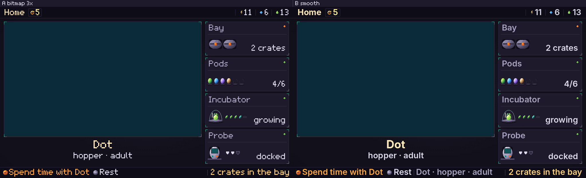
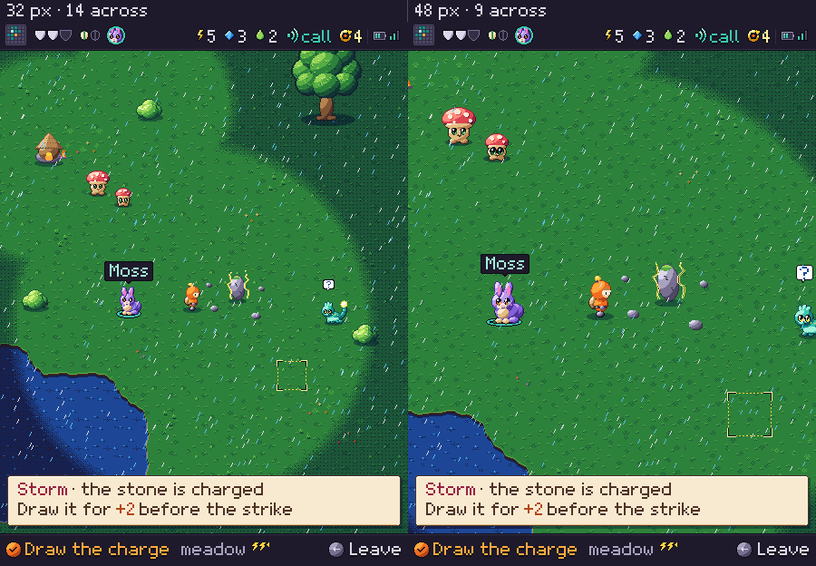

# Decisions to compare

**Proposal.** These are two open style-guide decisions, each shown side by side at 1×. The
pictures exist only to make the choice; neither option is a finished screen.

## A. Station type: bitmap or smooth

*Both sides show the same Station Home chrome at 1024×600, with the living window left empty.
The left uses Mibi 7×9 at 3× body and 4× name. The right uses Inter SemiBold/Bold at the same
cap heights (21 and 28 px). The website's Helvetica Neue stack is not freely downloadable, so
Inter stands in. Files: [bitmap](type-station-bitmap.png), [smooth](type-station-smooth.png).*

- **A, bitmap 3×:** one voice with the Companion, crisp at about 170 ppi, and nothing new to
  license or render. At 3× the bottom line is at its limit: here it just misses and drops its
  middle part ("Dot · hopper · adult"), so readouts must stay at three words or fewer.
- **B, smooth:** about the same width, a few percent narrower, so here all three parts of the
  bottom line just fit; it reads more like a finished instrument. It is a second typeface beside the
  Companion's, and it needs anti-aliased text rendering on the Pi (alpha text, outside the
  palette rule).

## B. Companion tile size: 32 or 48 px

*The same place in a storm, at 450×600, with the same HUD and bottom line. Left: the accepted
32 px mock-up. Right: tiles, pawn, tokens and signs redrawn at 48 px, not scaled, in the 48
colours (0 off-palette), with the pawn at the same spot. The partner is still the retired
lilac token in both. Files: [32 px](tile-size-32.png), [48 px](tile-size-48.png).*

- **32 px:** 14 tiles across, so you see a lot of the place: the outpost, the tree and three
  creatures fit with the pawn. At 311 ppi a tile is about 2.6 mm and a token's eyes are 1 mm,
  readable only up close. It is the cheaper sheet to author.
- **48 px:** 9 tiles across, so tokens and signs are about 3.9 mm and eyes and markings read
  at arm's length. You see less than half the area, so the outpost and tree leave the screen
  and more walking and scrolling is needed. Every sheet costs about 2.25 times the pixels to
  author; the place grid, view and veil code change; and the Station and Companion sprites
  come closer in size.
