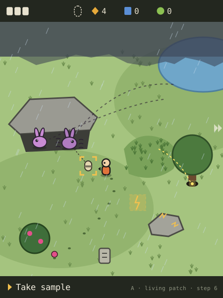
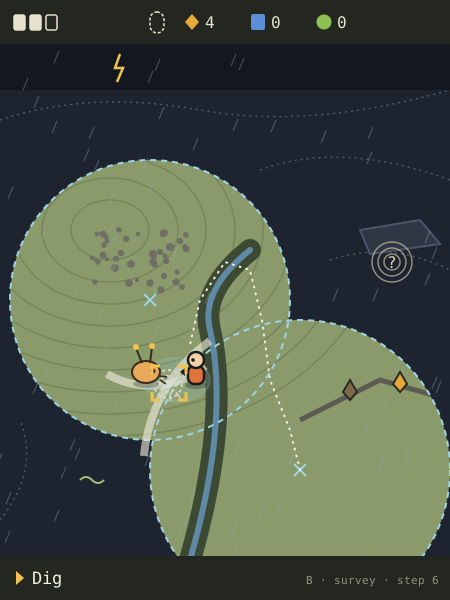
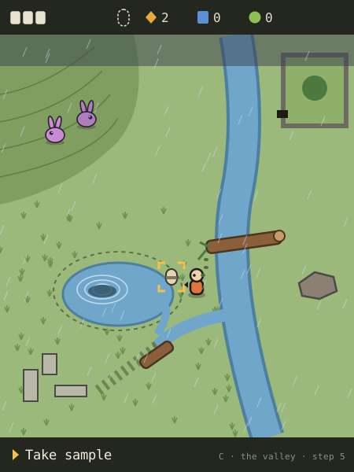

# Exploration options

**Proposal.** Three different ways the open map could work, each shown as the
same expedition. Nothing here is decided. The project lead picks one, a mix, or
none; then a rough playable version of the chosen model is built.

The three models differ in what the world is and what the player mainly does:

- **A. Living patch.** Small generated habitats full of wild mibis. You change
  what creatures do.
- **B. Survey.** A large generated landscape under fog. You pulse, read echoes
  and dig up what's hidden.
- **C. The valley.** One hand-built valley that stays yours all game. Weather
  reshapes it; you change it for good.

## What all three share

- **Moving.** Hold a direction to walk freely. No roads: anything not solid
  (rock, deep water, a trunk) can be walked on. You face the way you last moved.
  A focus ring marks what Confirm would act on, and one short line at the bottom
  says what will happen ("Shake the bush"). Back opens the mode list (Probe,
  Cargo, Companions); the world pauses while you're there.
- **The field clock counts actions, not seconds.** Creatures decide, storms move
  and water rises when you step or act. Idle animation keeps the scene alive, but
  standing still changes nothing. No reflexes needed, "waiting earns nothing"
  becomes automatic, and it's cheap for the Companion.
- **Supplies come from doing something to the world.** Energy from things
  holding charge (storm-struck stones, sun-hot crystals). Essence from living
  material (dew, sap, fallen fruit). Data from things that answer when acted on
  (a humming stone rings a pattern when tapped). Basic supplies turn up at steady
  rates; the expedition type shifts the mix.
- **A sample is a seed-pod.** Some mibis shed small dormant pods that only
  become a mibi in an incubator. Every pod looks alike; its shell color comes
  from the ground it was found on, not its genome. A pod holds one complete
  genome, never that of a mibi you watched. You may guess who shed it, but pods
  drift, roll and get hoarded, so the guess can be wrong. The Station confirms
  the species.
- **Expedition types and events.** For V1: Weather, Waterside, Deep ground and
  Night. About ten events: electric storm, fog bank, rising water, frost, gusts,
  dust storm, migration, bloom, rockfall, dark spell. The type weights which
  events, creatures and supplies appear. Events are visible before they arrive
  (clouds on the horizon, water creeping) and offer a trade: stay for more, at a
  risk you can see.
- **Damage.** The Probe has three hull marks. A strike or rockfall takes one. At
  zero the expedition ends and the cargo goes home as it is: nothing lost,
  nothing more gathered.
- **What the Station gets.** Send seals the cargo, and the Station accepts it
  exactly once. Supplies arrive as whole units. The pod arrives neutral, with
  where it was found: expedition type, weather, creatures seen nearby.
  Field-guide notes travel along without using cargo space. Every find is taken
  once and never refills.

## The shared expedition

The player's third expedition. At home: one identified species (Pip), no bonded
partner. They choose a Weather expedition and an electric storm arrives. They come
home with one pod of an unknown species, some Energy, a little Data and Essence,
and something they saw but couldn't reach.

---

## A. Living patch

**The idea.** Each expedition drops you into a small generated habitat crowded
with wild mibis going about their lives. You can't see their genes, but you can
see behavior: who's wary, who's curious, who hides from rain, what makes one shed
a pod. You change what they do by what you do: how you approach, what you carry
and set down, what you shake loose, where you make shelter. Curiosity comes from
the creatures: "What is that, and what will it do if I…?"

**World structure.** Generated per expedition as a chain of patches, each about
two screens by two (roughly 28×32 tiles of 32 px). Walking off an open edge leads
to the next patch; the Probe's range tier sets how many (three at first). The
camera follows you and looks ahead the way you face. You can mark one place to
revisit; the game saves its seed and what you took.

**What's in it.** Features with uses: tall grass that hides, trees and overhangs
that shelter, burrows, ponds, fruit bushes, humming stones, dew-filled leaf cups.
Two to four wild species per patch, four to eight individuals, chosen by
expedition type, Probe tier and conditions. Each runs its species' behavior
machine (the decided direction for every genome), weighted by its own traits, so
two hoppers don't act alike. Beetles and moths give mibis something to chase and
the player clues. Events change behavior: storms send everything to shelter, fog
makes shy creatures bold, a bloom draws grazers.

**Verbs.**
- **Directions:** hold to walk; tap to creep one step. Creatures notice walking
  from farther away than creeping.
- **Confirm** acts on what you face: shake a bush, tap a stone, pick up or put
  down one carried object (fruit, twig, pebble), push a slab, take a supply or
  pod. Facing a creature, it offers what you carry; empty-handed, you crouch and
  hold still so curious ones come closer.
- **Back:** mode list.

No extra control is needed.

**Samples and supplies.** Each species sheds pods when something specific and
visible happens to it: shaking off rain, finishing a meal, flaring when startled.
Finding out what makes a species shed is the field discovery, and the field guide
keeps it ("sheds when it shakes dry"). In the field you learn behavior, likes,
habitat and timing, never color or other inherited detail. An individual sheds at
most once per expedition.

**The same expedition.**

1. **Hilltop meadow.** A dark cloud bank on the top edge. Two long-eared hoppers
   graze by a pond, something glows in tall grass, a lone tree has a burrow at its
   roots. The player holds Right toward the hoppers; at four tiles they lift their
   ears and edge away. *They're wary.*
2. Confirm on a fruit bush shakes it; two fruits drop. Confirm on one picks it
   up, carried overhead.
3. The player creeps closer, Confirm sets the fruit down, then taps Down twice
   to back off. The bolder hopper comes to eat; the other hangs back.
   *Individuals differ, and food works.*
4. **The storm arrives.** A tile about to be struck glows one action ahead. A
   strike hits the outcrop and the stone crackles; Confirm on it: +2 Energy.
   Another tile glows next to the player. They stay for one more: +2.
5. The hoppers bolt for the rock overhang, and the player follows. Under it, one
   shakes off the rain and a pod rolls loose.
6. **Sketch.** Focus ring on the pod, "Take sample". Confirm: the pod fills the
   sample slot. It looks like every other pod.
7. Thunder startles the glow: a small mibi with a lit tail flares and dives into
   the burrow. Confirm at the burrow: the Probe bumps the edge, too narrow.
   Something pulses deep inside. The field guide adds a silhouette: "dives into
   burrows in storms."
8. The storm passes. A humming stone (+1 Data), two leaf cups (+2 Essence), mark
   the meadow, then Back, Cargo, Send.

Home: a pod, 4 Energy, 1 Data, 2 Essence. Open: what's in the burrow, and is the
pod a hopper's?

**Why go back.** Patches are new each time, but species and their habits carry
over. Once the Station identifies a species, wild ones show their name in the
field. The marked meadow can be revisited: the burrow is still there, the pod
stays taken. A bonded partner opens things: a small digger follows into burrows,
a calm one lets wary creatures come close, a climber reaches tree nests. The
world shows these openings by shape (narrow hole, high nest, deep water), and the
partner sniffs or looks up at the ones it can handle before you try. Abilities
come from traits, so two partners of one species can open different things.

**Feeding the Station.** The pod's "seen nearby" note gives the player a guess to
test at the Station. Arriving earns nothing: creatures only shed when something
happens to them. Finds don't come back.

**Variety.** Terrain is generated from biome rules per expedition type (meadow,
shore, cave, night wood). Every patch has at least one shelter, food source and
supply cluster, but not every kind of encounter. Residents come from the species
pool, behavior from species machines and individual traits, and events reweight
it all. Same patch, different residents: a different expedition.

**Costs and risks.**
- **Art:** heaviest is creatures in the world. Each species needs small sprites
  (48–64 px) with idle, walk, alert, flee, eat and shed poses, generated from the
  genome, and that pipeline doesn't exist yet. Plus four biome tilesets and about
  twelve objects.
- **Engineering:** wild behavior machines (needed for pets anyway), step-timed
  simulation, a constrained patch generator.
- **ESP32:** four to eight simple machines per action costs little; sprites live
  in PSRAM. Moving sprites over a scrolling map needs a measured frame budget.
- **Boring if:** shed triggers become recipes ("fruit, then rain"), the roster is
  too small to keep surprising, or patches feel like pens.

---

## B. Survey

**The idea.** The Probe lives up to its name. Each expedition is a large unknown
landscape under fog. You send out a pulse and the world answers with echoes of
different shapes: stone that rings, living things that flicker, dormant pods that
beat slowly. Land you've pulsed stays drawn. You read the echoes, choose what to
chase, and move to pin it down. Creatures answer pulses too: some freeze, some
flee, some come to see what's pinging. Curiosity comes from partial knowledge:
something is there, roughly where, roughly what kind.

**World structure.** Generated per expedition, one region about five screens by
five (roughly 70×80 tiles). Fog covers everything not pulsed or walked; revealed
ground stays revealed for the expedition. The fog's edge is your frontier. Probe
tiers widen the pulse, sharpen echoes, enlarge the region and add capacity.

**What's in it.** Readable land (ridges, gullies, ponds, scree, groves) with
finds hidden or buried: pods in damp hollows, crystals on ridges, humming stones
in ruins. Wild mibis are visible within sight, echoes beyond. Events change what
you can read: storms make echoes jitter, fog shrinks sight, lightning briefly
lights up the land.

**Verbs.**
- **Directions:** hold to walk.
- **Confirm:** with no find in front, sends a pulse (one action on the field
  clock). Facing a find, digs, takes or taps.
- **Back:** mode list.

**Cost:** Confirm does two jobs depending on what you face. A dedicated pulse key
would be clearer, but it's an extra control.

**Samples and supplies.** Pods lie dormant underground. Their echo gives only a
distance, so one pulse leaves a band. A second pulse from elsewhere crosses it,
and digging where the bands cross brings the pod up. Curious creatures sometimes
paw at the right spot. In the field you learn a find's kind, depth and size, and
how creatures react to pulses, never what's inside a pod.

**The same expedition.**

1. **Fogged upland.** Only a circle around the player shows. A dark band rolls
   across the fog to the north: the storm. Confirm pulses: contours appear, plus
   echoes: crystals to the east, a slow double beat past a gully (a pod), a
   moving flicker (a creature).
2. The player heads for the pod. The gully blocks the way, so they walk around
   its head.
3. They pulse again. The new echo band crosses the first under a scree slope.
4. **The storm arrives.** Echoes jitter and the pulse reaches half as far.
   Lightning shows the whole region as outlines for an instant; faint ridge lines
   stay in the fog. The flash reveals land, never finds. Struck crystals glow on
   the ridge: two Confirms, +4 Energy, and one hull mark lost to a strike.
5. The flicker has come closer with each pulse. A mibi with antenna ears walks
   out of the fog, circles the crossing and paws at one spot.
6. **Sketch.** The player stands there, "Dig". Confirm brings up the pod.
7. A last pulse finds a deep triple beat under a rock shelf to the east. This
   Probe can't resolve it; the map marks a question mark.
8. A humming stone (+1 Data), then Back, Cargo, Send.

Home: a pod, 4 Energy, 1 Data. Essence is scarce on a Weather survey. Open: the
deep triple beat.

**Why go back.** Every region is new. Better tiers pulse deeper, and deep echoes
hold rarer pods that open more complex genomes. Partners extend senses or reach:
a big-eared one hears deep echoes, a glowing one lights a ring of fog, a digger
reaches deep finds, a calm one keeps creatures from fleeing. The deep echoes are
already on the map, so you see what a partner could open before trying.

**Feeding the Station.** A pod arrives with its depth and ground. Pulsing only
reveals; digging is the act that collects. Finds don't come back.

**Variety.** Land is a generated height field with rules for water and rock;
finds follow the same rules, creatures follow habitat, events change sensing. The
land varies a lot; the loop (pulse, narrow down, dig) does not.

**Costs and risks.**
- **Art:** lowest: terrain tileset, fog, echo marks, and creatures only up close
  with few poses (freeze, flee, approach, dig).
- **Engineering:** medium: terrain generator, fog mask, echo bands.
- **ESP32:** cheap. About 6,000 cells and a fog mask fit easily.
- **Boring if:** it becomes a metal detector (pulse, walk, dig, repeat),
  creatures shrink to blips, fog walking feels empty, or narrowing down is a
  chore by the tenth expedition.

---

## C. The valley

**The idea.** One hand-built valley that is yours all game. It never resets:
what you open stays open. Each expedition brings a condition that reshapes it for
that trip: streams rise, ice bridges form, wind brings trees down. You change it
with your hands, by pushing logs, rolling stones, opening sluices, diverting
water, and those changes stay. Creatures live in particular corners and move as
the valley changes. Curiosity comes from knowing a place and seeing it different
("the stream is up; what washed in?"), and from places you can see but not reach
yet.

**World structure.** Hybrid. Persistent, hand-built geography about five screens
by five, in eight areas; each expedition fills authored slots with generated
contents (finds, which creatures are out, events). Unreached areas are visible
across water or cliffs; that's the hook. The camera follows you, and the map
fills in as you go. **This only partly answers the direction for generated
maps:** contents and conditions change, the land doesn't.

**What's in it.** Water, cliffs, ruins, a dry millpond, a walled garden behind a
culvert, things to push or open, and resident creatures per area. Conditions
(storm, flood, frost, gusts, night) change water levels, open and close
crossings, and bring different creatures out.

**Verbs.**
- **Directions:** walk. Walking into something movable pushes it one tile.
- **Confirm:** open or close a sluice or gate, lift or drop small things, take.
- **Back:** mode list.

**Cost:** pulling needs "hold Confirm and step away", a chord. Without pulling, a
persistent world can trap itself, so it needs a rule against that (a stuck log
floats back after the next flood).

**Samples and supplies.** Pods wash, blow or roll into places under certain
conditions, lie in areas your changes open up, and are shed by resident
creatures. In the field you learn what each condition does to each area and which
creatures it brings.

**The same expedition.**

1. **The south meadow, known from two earlier expeditions.** The sky is dark,
   the stream higher than last time. A storm-felled tree now spans the ravine to
   the east bank, which used to be out of reach. *Something changed.*
2. The player holds Right across the trunk. On the east bank graze the
   long-eared hoppers they'd only seen from across the water.
3. **The storm arrives.** Lightning charges an iron-rich stone: Confirm, +2
   Energy. The stream spills over its bank into an old dry channel heading for
   the hoppers' grazing ground.
4. The player walks into a log, pushing it across the channel. The water turns
   into the dry millpond basin, which starts filling. This change is permanent.
5. **Sketch.** The rising water lifts a pod out of the silt to the rim. "Take
   sample"; Confirm takes it.
6. A ripple spreads in the new pond. A large shape surfaces, looks at the player
   and sinks. It came because the pond is full. Following it needs a swimmer.
7. A humming stone in the ruin (+1 Data), dew from the reeds (+2 Essence), then
   Back, Cargo, Send.

Home: a pod, 2 Energy, 1 Data, 2 Essence. Next time the pond is still full and
the swimmer lives there; the trunk bridge may have washed away.

**Why go back.** The valley remembers. Each condition shows a known place in a
new state, and every change you make opens something. Partners open lasting ways
forward: a swimmer dives in the pond, a strong one rolls boulders, a small one
fits through the culvert into the walled garden. You see these places long before
you can use them.

**Feeding the Station.** A pod arrives with its area and condition. An emptied
slot stays empty until a new condition fills it with something different. A
change you make never awards anything by itself; it only opens access.

**Variety.** Conditions × areas × which creatures are out, plus the player's
lasting changes. The geography never varies.

**Costs and risks.**
- **Art:** highest world-art load: about 25 screens of hand-placed art, each
  needing variants per condition (flooded, frozen, windblown, night). Creatures in
  the world too, with fewer behaviors than A.
- **Engineering:** a record of the player's changes, condition overlays, push
  rules that can't trap the player, authored slots. Low CPU load.
- **ESP32:** the valley sits in flash; each change is one saved write. Cheap.
- **Boring if:** one valley gets familiar and small, partner gates become a
  checklist of keys, or new contents can't hide how fixed the land is. It also
  pulls against the stated wish for generated maps.

---

## Comparison

| | A. Living patch | B. Survey | C. The valley |
| --- | --- | --- | --- |
| Curiosity driver | What a creature will do if I act | What's under the fog | A known place changed; what I see but can't reach |
| Control fit | Good: Confirm depends on what you face; creep vs walk | Fair: Confirm both pulses and digs; a pulse key would help | Fair: push by walking fits; pulling needs a chord |
| Art cost | High: creatures with many poses; four biomes | Low: terrain, fog, echoes | Highest world art: hand-built valley per condition |
| Engineering cost | Medium-high: behavior machines, patch generator | Medium: terrain generator, fog | Medium: persistence, push rules, slots |
| Partner fit | Best: the partner is a creature in the same world | Good: extends senses and digging | Strong, but works like keys in locks |
| Main risk | Creature pipeline doesn't exist; reactions harden into recipes | Same loop every time; creatures shrink to blips | One place gets stale; conflicts with generated maps |

## Designer's recommendation

**The designer's recommendation, not a decision: Model A, the living patch,
borrowing two small pieces from the others.**

- **Creatures at the center.** Exploring is mainly about wild mibis reacting to
  the player, which fixes the core failure of the last design: a creature game
  with no creatures in its world.
- **One system everywhere.** Wild behavior runs on the species behavior machine
  already decided for every genome. The field, the bonded partner and life at
  home share it, so a partner's ability is simply its behavior in the same world.
- **It fits the screen.** Small, dense patches suit 450×600 without long empty
  walks or a minimap.
- **Every interaction means something.** You act on what creatures care about
  (food, shelter, noise), so the map is interaction-driven without menus.

Borrowed: from C, marking one place to revisit, a cheap answer to "what does the
world remember"; from B, detection tiers that show faint glints of hidden pods,
without B's pulse loop.

**How to test it.** A's biggest risk is that it depends on creature art and
behavior that don't exist yet. The rough playable should use three placeholder
species made of simple shapes, each with a five- or six-state behavior machine
and one shed trigger, across two biomes and the storm event. Watch whether a
player tries things on creatures unprompted and can say why the pod appeared. If
shed triggers turn into recipes within three expeditions, make species and
individuals vary more, or fall back to B's sensing as the main loop.

## Decisions for the project lead

1. Which model to build as the rough playable: A, B or C.
2. Whether places are fresh each expedition, can be marked and revisited, or
   belong to one persistent valley.
3. Whether the field clock counts the player's actions rather than seconds.
4. Whether a sample is a shed seed-pod whose species the player can guess in the
   field but only the Station confirms.
