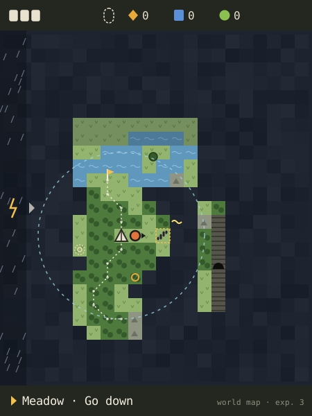

# Exploration: combined design

**Proposal, partly decided.** Since this was written, the project lead decided:
world turns (§2); any visible cell can be a starting point, and placing the pawn
reveals its neighbours, so a new game starts with nine cells (this replaces the
single landing); and the rough playable is a browser mockup.

This turns the exploration decisions into one design: models A and
B combined, a permanent world, the action clock, optional partners, seed-pods and
no capture. Lines marked **Decided** restate those decisions. Everything else is
a proposal until approved.

## 1. The experience

You carry a map of a wild region you only partly know. Most of it is fog. You
pick a spot that looks promising: tracks of something you've never seen, a slow
beat under a hill, the place a storm is heading. You walk there across the map,
then go down into it, and the place comes alive. It's a small patch full of wild
mibis, things to shake, push and carry, and weather that changes what the
creatures do. You act and they react, and sometimes a pod rolls loose. When you
come back up, the map remembers what you did. Over many expeditions the fog pulls
back: you learned something at the Station, brought a partner whose body or
senses reach further, or improved the Probe. The same region keeps offering new
things, because its creatures and weather keep moving.

### Structure: one world, two scales

**World map (B).** One cell is one place, drawn small (20 px) to show its kind of
land.

- **Moving.** Each press moves one cell, and holding keeps going. Every step is
  one action on the field clock. Wide water, cliffs and similar obstacles block
  you unless a partner can cross them. There are no roads.
- **What it shows.** Fog, revealed land, your trail and the landing (where every
  expedition starts). It also shows the Probe's range edge, moving weather and
  signs of what's there: tracks, a slow beat (likely a pod), rings (supplies), a
  deep "?". Obstacles show up in areas you can see but not reach yet. Pins mark
  things you met but couldn't do (§7).
- **Controls.** Confirm takes you down into the cell you're on. Back opens the
  mode list. The bottom line names your cell in a few words ("Hilltop · tracks").

**Living patch (A).** Going down into a cell builds that place at about two
screens by two. It comes from the world seed, the cell, the current world turn
and everything you've changed there before.

- **Moving and acting.** Controls work as in Model A: hold to walk, tap to creep,
  and Confirm acts on what you face (shake, tap, pick up or put down, push, take,
  offer).
- **Leaving.** Walk off any edge, or press Back, to return to the same cell on
  the map. The patch keeps its state.
- **Back steps out one level:** from patch to map, then from map to the mode
  list.

The field clock runs at both scales. A storm band moving across the map shows up
as lightning in the sky of the patch it's over.

**Starting and ending.** You choose an expedition type and start at the landing.
You can go anywhere within the Probe's range that fog and obstacles allow.
Sending from Cargo ends the expedition from wherever you are.

## 2. Permanence and finite finds

**The tension:** a world that never resets, and finds that never refill, would
eventually run dry. **The rule this proposes: nothing refills, but new things
arrive.**

**What persists:**

| Persists | How |
| --- | --- |
| Land, landmarks, obstacles | Generated once; changed only by events and the player |
| Revealed fog | Never closes |
| Player changes | A pushed slab stays pushed; a shaken bush stays bare |
| Taken finds | Every find has its own identity; once taken, it's gone for good |
| Pins and the field guide | Kept |
| Wild creatures | Individual mibis with a home cell; they move between turns |
| Signs on the map | Shown as last seen; they fade as turns pass |

**Strongest option: world turns.** The world advances one turn when an
expedition ends. Each turn, deterministic rules decide what changes:

- **Creatures move and families grow.** Individuals roam within their species'
  habitat and follow conditions; new young appear in nests. Pods come from
  creatures doing things, so new pods turn up where creatures are now, not where
  old pods were.
- **Weather leaves marks.** A storm charges stones where lightning struck. A
  flood leaves silt with washed-in pods. A rockfall opens or closes a passage.
- **Supplies come from conditions, and conditions come back.** Dew forms after
  rain and fruit sets in a bloom. An emptied bush bears again only when a bloom
  passes through. That's a new event, not a refill.
- **Guards against farming.** There's one turn per expedition. Only a few new
  things arrive each turn, mostly away from where the player just was. Nothing
  arrives just because you showed up. Richer arrivals land in deeper and harder
  areas, so finds stay in step with progress.

**Alternative: frontier only.** Known places never renew, apart from weather
during an expedition. New finds come only from lifting fog and from areas that
partners open. It's simpler and pushes progress hard. The cost: the landing
region runs dry early, and a favourite place has no reason to be revisited.
**Recommended: world turns.**

## 3. Generated, then permanent

**Recommended: each player's world is generated once from a seed when their save
starts, then it persists.** Two kinds of piece are hand-authored:

- **The landing area,** the first 5×5 cells. It guarantees starter species, all
  three supplies, and a gate visible from afar. Its layout teaches, with no text.
- **Landmark templates,** such as a ruined tower, a crater lake or a waterfall.
  The generator places them by rule.

Generator rules:
- land types from height and moisture noise;
- rivers that run downhill;
- species habitats by land type;
- gates placed only after a check that a player with no partner can reach
  enough starter content.

**Storage:** the seed plus changes: what the player altered, which finds are
taken, revealed cells, pins, and where creatures are. Patches are never stored
whole; they're rebuilt from the seed and the changes. A world of 48×64 cells needs
roughly 10–20 KB, which is fine for the ESP32. Each player in a household has
their own world; sharing a seed between players could come later.

Rejected alternatives: a fresh world every expedition breaks permanence, and one
hand-built world for everyone loses variety.

## 4. Fog-lifting

Fog has two layers:
- **Land:** what the ground is. Once revealed, it stays revealed.
- **Signs:** what's there now. They show what was last detected and fade as
  turns pass, because creatures move.

Lifting fog only shows things. It never awards supplies or pods.

**A mod** is an installable upgrade chip for the Probe or Companion that changes
what it senses or can do. Slots are limited, and a mod can be removed and reused.

| Source | Reveals | Examples |
| --- | --- | --- |
| Walking (baseline) | Land in your cell and its neighbours; signs within the Probe's sweep | Crossing a ridge reveals the valley beside it |
| Research | Signs tied to what you've learned | Identifying a species makes its tracks show wherever land is revealed. Learning what makes it shed shows where its pods are likely. Studying a cave crystal shows cave mouths across known land and opens Deep ground |
| Partner | Its senses, while it's with you; what it reveals stays | Big ears hear deep beats underground. A glowing partner lifts fog around you at Night. A keen nose picks up tracks in neighbouring fog |
| Items | Found in patches; used once or kept | Tapping a survey cairn reveals the land for several cells around. A lantern seed, once planted, lights a cell's fog for good. A storm glass shows where the next strikes will land |
| Probe tier | How far the sweep reaches, how far you can range, how deep you can detect | Tier 1: sweep 1 cell, range 6 cells from the landing. Tier 2: sweep 2, range 10, deep beats appear as "?". Tier 3: deep beats are resolved |
| Mod | A chosen specialty | A water lens shows underwater cells and finds. Heat sense shows creature signs in fog. An echo filter makes pod beats stand out |

## 5. Partner gates

**Decided:** a partner is optional and gates higher tiers. Without one, the player
still explores.

**Proposed rule:** a gate is an obstacle you can see. Each gate matches an
inherited ability and is checked against the partner's actual traits.

| Gate | Ability needed | Opens |
| --- | --- | --- |
| Narrow burrows | Small body, digging | Burrow networks; the **Deep ground** expedition type |
| Deep or fast water | Swimming | Islands, river crossings, underwater finds; staying put in a **rising water** event |
| Cliffs, tree canopy | Climbing | High plateaus, canopy nests |
| Darkness | Night sight or glow | The **Night** expedition type, deep caves, the **dark spell** event |
| Wary herds | Calm temperament | The **migration** event: walk with a herd to where it's heading |

**Expedition types:** Weather and Waterside are open to everyone. Deep ground
and Night need a partner with a fitting ability.

**Seeing a gate before trying:**
- The obstacle is drawn as what it is (wide water, a narrow hole, a black cave
  mouth), both on the map and in the patch.
- Without a partner you bump into it, and a pin appears.
- A partner brought along looks at or sniffs the gates it can handle before you
  press anything, and ignores the ones it can't.
- In the expedition choice, types you can't do yet show their sign greyed out.
- In Companions, choosing a partner lights up the types it opens.

Abilities come from traits, so two partners of the same species can open
different gates.

**A first-time player with no partner** gets the landing region, all land on foot
within Tier 1 range, Weather and Waterside expeditions, at least three starter
species with reachable pods, and all three supplies. Nothing essential is gated.

## 6. Does the pulse survive?

**The reading:** "B is the overall map, A is the activated survey" means
surveying happens at map scale. Choosing a place and going down into it is the
activation: that place becomes a living patch.

- **On the map there is no pulse button.** The Probe sweeps as you move, within
  its detection radius, so moving is the survey. Confirm on the map already means
  "go down"; a pulse there would need an extra control.
- **Inside a patch, the pulse survives as a detection tool.** Confirm with nothing
  in front sends a short pulse, which costs one action. Hidden things in the
  patch glint (buried pods, charged stones), and creatures react: curious ones
  come closer, shy ones hide.
- **Dropped:** B's two-pulse narrowing-down. It's slow at map scale, and inside a
  patch the glint is enough.

## 7. Worked example: two expeditions to the hilltop meadow

**Pins.** The game places a pin automatically when you meet something you can't
do yet: you bump a gate, or you find a deep "?". The player never has to place
markers, so no extra control is needed.

### (a) Expedition 3: Weather, storm, no partner

1. **Map.** The landing sits inside a ring of revealed land, with fog beyond. A
   storm band lies on the west edge. The hilltop cell, three cells east, shows
   two signs: unfamiliar tracks and a flicker. To the north, a wide river with an
   island visible across it. The player holds Right; three steps later the storm
   band has moved three cells.
2. **Confirm: down into the meadow.** Hoppers graze. There's a fruit bush, an
   outcrop, a lone tree with a burrow, and a glow in the grass.
3. The player shakes the bush and carries a fruit over to the wary hoppers. The
   bolder one eats.
4. **The storm arrives overhead.** A struck stone crackles: +2 Energy. The player
   stays for one more strike: +2.
5. The hoppers bolt for the overhang. One shakes off the rain and a pod rolls
   loose. Its tag reads **"unknown species"**. Confirm takes it.
6. The glowing creature dives into the burrow, and the Probe bumps: too narrow. A
   pin appears. Confirm with nothing in front sends a pulse, and the burrow
   glints deep down.
7. The player taps a humming stone (+1 Data), collects dew (+2 Essence) and
   presses Back to return to the map. The meadow cell carries the pin. Cargo,
   Send. The world turns.

At the Station, the pod turns out to be a hopper. The player researches it.

### (b) Expedition 7: Deep ground, with a partner

In between, the player created a mibi of a small burrowing species from an
earlier pod, bonded with it and raised it.

1. **Expedition choice.** Deep ground is now lit up, because this partner digs
   and fits narrow gaps.
2. **Map.** More land is revealed from earlier expeditions. Hopper tracks now
   show on the map because the species has been researched. The hoppers have
   moved two cells north-east over the turns since. The meadow's pin is still
   there.
3. **Down into the meadow.** It's the same place:

| Unchanged | Changed |
| --- | --- |
| Burrow, overhang, outcrop, lone tree | The hoppers are gone, and a slab pushed on an earlier visit stays pushed |
| The bush is still bare (no bloom since) | The outcrop's charge has gone; there's been no storm this time |
| The pod taken in expedition 3 is gone | Silt from a flood two turns ago covers the pond edge |

4. **The gate opens.** The partner trots to the burrow and sniffs it before the
   player does anything. Confirm facing the burrow asks the partner to dig: it
   widens the hole, and the player follows it down into a cave patch, a Deep
   ground place under the meadow.
5. **The cave.** The glowing creatures nest here and stay calm with the partner
   nearby. A hopper that sheltered here during the flood has shed a pod tagged
   **"Hopper"**: the species is known, but what's inside is not. A glowing
   creature's pod still reads **"unknown species"**.
6. A pulse finds a deep "?" under the cave floor, which needs Tier 2. A new pin
   appears. Cargo, Send.

## 8. Prototype scope

The smallest build that tests this, with tokens instead of creature art
(**Decided**).

**What it includes:**
- **World map:** 16×20 cells generated from a seed, with a hand-made 3×3 landing.
  Four land types, one river with an island, one cliff, and fog with a sweep of
  one cell.
- **Patches:** built by rule from four templates (meadow, pond edge, rock field,
  wood), plus one cave patch under a burrow.
- **Creatures:** three wild species as tokens. Each has a behavior machine of
  five or six states and one shed trigger.
- **Partner:** one partner token (a small burrower), present from the second
  expedition on.
- **Expeditions and events:** two expedition types (Weather, and Deep ground
  gated by the partner) and two events (storm and fog bank).
- **Gates:** one partner gate (the narrow burrow down to the cave) and one deep
  "?" that can't be resolved.
- **Persistence:** at least two expeditions, with world turns (creatures move,
  storm marks), taken finds, pins, revealed fog, and one slab that stays pushed.
- **Station stand-in:** it accepts cargo once and identifies species instantly,
  so known names show up on the second expedition.

**What to watch:**
- Do players pick map destinations because of signs, and can they say why?
- Do they act on creatures without being prompted, and can they explain why a
  pod appeared?
- Do they notice what changed when they come back?
- Do they understand a gate before they have the partner?
- Does walking on the map feel like choosing or like commuting? Count the steps.
- Does the action clock feel fair?

**Excluded:** creature art, mods, items, Probe tiers, real research,
care and bonding, breeding, crafting, the real Station transfer, and ESP32 builds.

**Controls:** nothing beyond directions, Confirm and Back. Confirm in a patch
does several jobs, chosen by what you face. If players misfire, a dedicated pulse
key is the first candidate for an extra control.

*Sketch: the world map at the start of expedition 3, one step east of the landing
(the tent). The storm band comes in from the west. The hilltop cell (dashed)
shows tracks and a flicker. The island in the river and the cave mouth in the
cliff are seen but out of reach, and a pin from expedition 2 marks the river
bank. Faded tracks are an old sign. The dotted circle is the Tier 1 range edge.*

## 9. Open questions

1. Should the world advance one turn per expedition, or should only the frontier
   renew?
2. Are automatic pins enough, or do players need to place their own marks, which
   would cost a control?
3. Should Probe range limit how far an expedition goes from the landing, or only
   fog and gates?
4. How far must a bonded mibi be raised before it can come along as a partner?
