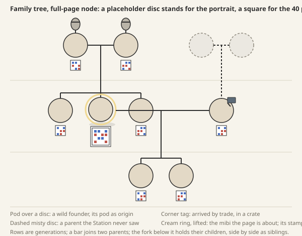

# The family tree in the Library book

**Parked (owner, 2026-10-08).** Research and generation come first; the family tree is developed once there is enough bred data to experiment with. Nothing here is decided, and the decisions below are not open for answer yet.

**Proposal** from game design and graphic design, 2026-10-08, answering the owner's direction that the book must show a mibi's lineage (`design/style-guide/station-screens.md`, Library). It covers what lineage data exists, how the tree is drawn in the book's right panel and on a full page, how it stays readable without text, what the Companion shows, and three decisions. Numbers are illustrations unless marked.

## 1. What lineage data exists

- **Design says it should exist.** Every individual keeps "its founder origin or actual parents, and where each inherited copy came from" (**Working rule**, `creatures-and-genomics.md`, Identity). A founder has no parents: its pod is its origin. A crossed child has two real parents and takes one copy of every heritable part from each (**Decided**).
- **The save does not record it yet.** The Station prototype's mibi record carries only its pod of origin (`from: {podId, place, how}`), and its lineage is "a list per species, pod → mibi" with families out of scope (`prototypes/station/README.md`). There is no parent field.
- **The stamp does not carry it, and should not.** The stamp encodes the genome and a 47-bit header; the optional 64-bit postmark is reserved for a signature the cloud writes and checks (`genome-stamp/README.md`). Two parent codes would need about 90 bits, so the postmark cannot hold them, and spending it on parents would leave nothing to sign. The stamp proves lineage another way: at every locus the child's copy 1 is one of the mother's two and its copy 2 one of the father's, verified from prints at 100% (`genome-stamp` results). The stamp is the evidence; the save is the record.

**Minimal addition, to the save only.** Each mibi gains `parents`: nothing for a founder, or two entries, each holding the parent's id, its short code and a snapshot of its stamp bytes (its genome, about 70 bytes for a Tuikis). The snapshot lets a parent still be drawn after it is returned to the wild, dies, or leaves by trade. Copy order is fixed: copy 1 from the first parent, copy 2 from the second, so "where each copy came from" needs no extra field. A mibi that arrives by trade (trades are **Open**, `architecture.md`) brings its stamp and code; its parents arrive only if a lineage record comes with it, so `parents` may be unknown. Nothing else changes; the stamp format is untouched.

## 2. The tree's shape

**The panel** (book, right side, about 300×440 under the stamp plate). It is centred on one mibi and shows three rows: parents above, the mibi and its siblings beside it, its children below. Nodes are 48 px portrait discs, the Companion's token size, so a Loika and a Tuikis face read at a glance; the focused mibi alone wears its 40 px stamp mark beside it. Three siblings and four children fit across; beyond that the row folds into a stack with a dotted "more" slot, the field guide's own mark. Every node is a thing the focus ring walks to.

**The full page** opens from the panel with one press and takes the whole book: five rows, grandparents to grandchildren, 64 px portraits and 40 px stamps under each, so two mibis are told apart by stamp alone. Rows are generations, ruled like the tome's page. A bar joins two parents; the fork below holds their children in a row, siblings side by side. Half-siblings appear under the shared parent's other bar.

**Growing past the page.** The tree never scrolls or zooms. Pressing any node re-centres on it, and the rows redraw around it in 300 ms, like turning a page. A lineage of twenty generations is walked two rows at a time, and the player is never lost because the focused mibi is always in the middle row. Rows fold as in the panel.

**The four node kinds**, told apart by shape, never colour alone:

| Node | Drawn as |
| --- | --- |
| **Wild founder** | A small pod, in the place's dust or moss, on a short stem above the disc, where parents would be. Its pod is its origin, not a parent |
| **Crossed child** | The standard node, hanging from its parents' bar |
| **Traded mibi** | The disc wears a slate crate tag at its corner: it arrived in a crate. Its off-kit parents, when a record came with it, draw as slate silhouettes with their stamps, since the Station never saw them alive |
| **Unknown parent** | A dashed, misty disc, the cabinet's mark for what is not known. No question mark |

A mibi gone from the vivarium (returned, died, traded away) keeps its place, drawn from its snapshot in slate.

## 3. Readable without text

*Full-page nodes at placeholder size: discs for portraits, squares for stamp marks. Two founders from pods; their three children, the middle one focused; its mate, traded in, with unknown parents; and their two children.*

- **Shapes carry the meaning.** Bars join, forks descend, pods sit above founders, dashes mean unknown, a tag means traded. Rows are generations.
- **Portraits carry the family.** A pale child between two charcoal parents is the lesson, with no lesson. The stamps under them let the curious player see the copies line up, column by column.
- **Names are live text in the bottom line only:** `✓ Visit Fig · ← Book` | `Fig · Tuikis · adult · of Moss and Bean`. The tree itself holds no words, digits or letters.
- **Checked at 1×:** a 48 px disc, a 40 px stamp (its 25×25 cells read at 64 px and tell apart at 40), 2 px ink lines, hairline rules.

## 4. The Companion

Nothing in the first build. The tree is a Library thing, and the Companion has no Library. Later, the with-you mibi's card may show its two parents as 48 px tokens, nothing more: a tree needs the Station's width.

## 5. Decisions for the owner

1. **Where lineage lives.** *Recommended:* in the save, as two parent entries with stamp snapshots; the stamp stays as it is and the postmark stays a signature. *Alternative:* parents in the stamp, which costs a size step per mibi and gives up the signed postmark.
2. **The node.** *Recommended:* portraits in the panel with the stamp on the focused mibi only; portraits and stamps together on the full page. *Alternative:* stamps everywhere, which is honest and dull at 300 px.
3. **Growth.** *Recommended:* walk the tree by re-centring on a pressed node, five rows a page, rows folding past three siblings or four children. *Alternative:* one zoomable canvas, which breaks the focus ring and the page metaphor.
