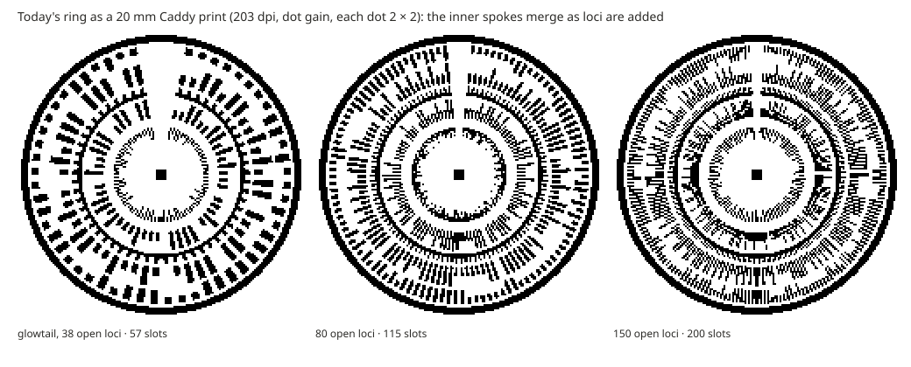
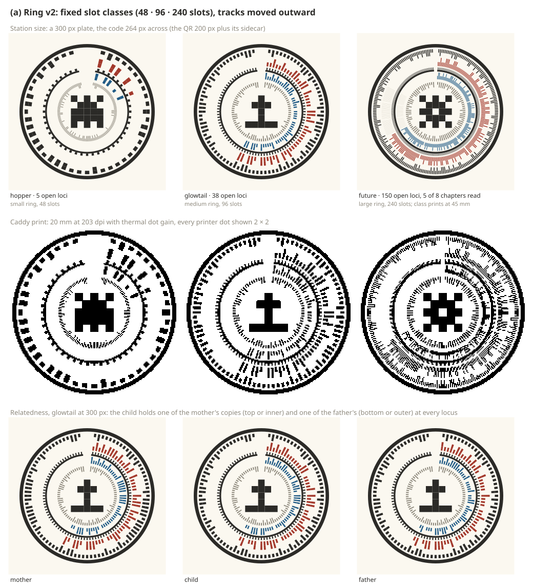
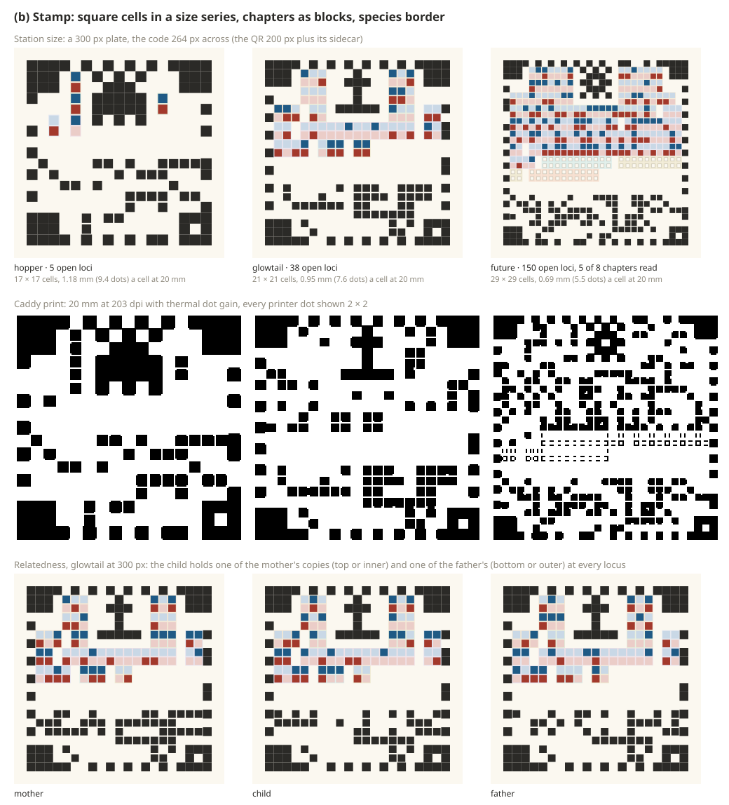
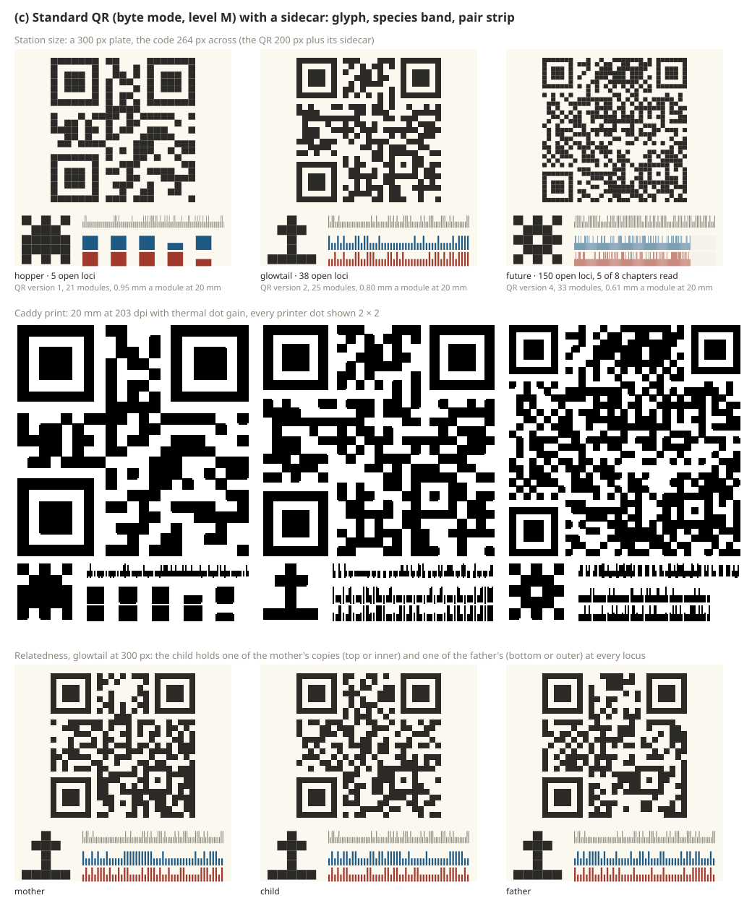
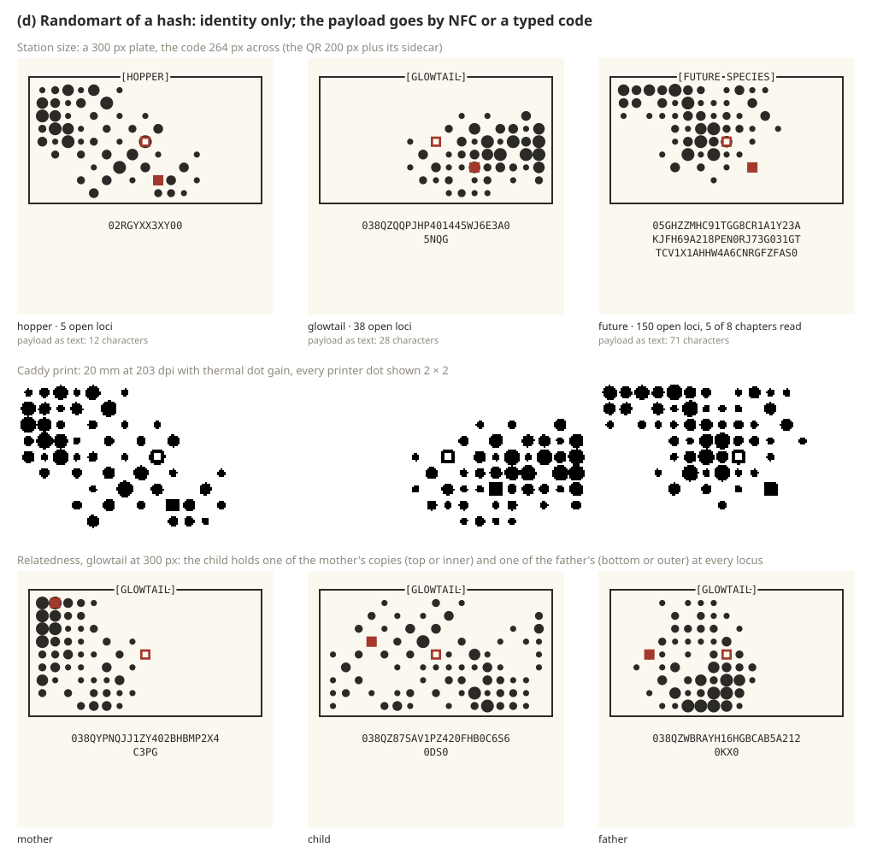

# Genome code: options for the fingerprint's form

**Options memo** from the genome engineer and the game designer, 2026-10-07, for a joint discussion with the owner. The owner reopened the genome ring's form (`decisions.md`, 10-07): is it future-proof as loci, layers and species grow, and does a pixelated circle limit us against a stamp, QR or randomart form? The approval stands for the concept, a scannable code of the real genome, not for the circle. Nothing here is decided. Drawings and numbers come from scripts in [genome-code/](genome-code/), which run the [genome-ring prototype](../../prototypes/genome-ring/)'s codec, renderer, decoder and distortion harness unchanged on the real [species frames](species-frames.md) and on synthetic future species.

## 1. Requirements

| # | Requirement | Source |
| --- | --- | --- |
| R1 | Encodes the real copies, both of every shown heritable locus, not a hash or an ID | owner 10-07 ("must codify the actual genome"); Identity, **Decided** |
| R2 | Visible relatedness: one species looks alike; a child visibly holds one of each parent's two copies at every locus | research-loop §5, §7; homepage genealogy tree (10-06) |
| R3 | Partial reveal: unread chapters show as "not read yet", distinct from a value; the code fills as research does | research-loop §4, §7; "off ≠ absent ≠ zero" (working rule) |
| R4 | Readable at Station size (300 px) and printable on the Caddy at about 20 mm (58 mm paper, 203 dpi assumed, 48 mm printable) | research-loop §7; `devices.md` (printer **Open**) |
| R5 | Scannable by a phone camera, under real light, from a real print | owner 10-07 ("be scannable"), 09-24 ("scan a qr in the machine from other machines") |
| R6 | Grows with the genome (new loci, new chapters and domains, changed layers) without breaking old prints | "genomes grow" (**Decided** as direction); "rule changes never rewrite creatures"; species-frames §7 |
| R7 | One scheme from 5 open loci (Loika) to 38 (Tuikis) to 100+ | species-frames §5; research-loop §2 |
| R8 | Forgery shows but never grants | research-loop §7 (working rule); owner's spoofing worry (09-24) |
| R9 | Fits the art: the Station's botanical-tome Library, the Caddy's paper, the website | `decisions.md` 10-07 (four vibes); Playdate-style site (09-29) |
| R10 | Monochrome-safe: a thermal printer and an e-paper Caddy | `devices.md` |
| R11 | Decodes offline: the kit works with no account or internet; frames ship with every reader | `decisions.md` Project, 10-07 |
| R12 | A locus need not have two copies: the codec takes copy counts from the foundation | `codec-contract.md` |
| R13 | A code, not a species art motif; the owner would rather have "something different to a QR" | owner 10-07; 09-24 |
| R14 | The format is public: the project is open source, so obscurity protects nothing | website, open source visible (09-29) |

The short code (`G7F · CD0 · 3H2`) stays the mibi's name and a lookup, not the genome (**Decided**), whatever the form.

## 2. The ring's limits, in numbers

`node genome-code/ring-limits.mjs --n 60` runs the prototype's own decoder on 60 random individuals per cell, every chapter read (the worst case). "All" is the prototype's harshest screen condition (rotation, 15° tilt, blur σ 1.5 px, uneven light, monochrome, noise, JPEG 60); the prints go through its Caddy pipeline (203 dpi, dot gain, a phone photo at 9 px/mm, about 15 cm, or 6 px/mm, about 23 cm). Spoke width is 55% of the slot pitch on the inner track (the narrowest) and on the outer one.

| Species | Open loci | Bits per copy | Slots | Spoke at 300 px | Spoke at 20 mm, dots | 300 px, all | 20 mm, 9 px/mm | 20 mm, 6 px/mm | Bigger prints, 6 px/mm |
| --- | --- | --- | --- | --- | --- | --- | --- | --- | --- |
| Loika | 5 | 5 | 44 | 4.8 / 7.8 px | 2.6 / 4.2 | 100% | 100% | 100% | |
| Untuva | 20 | 24 | 44 | 4.8 / 7.8 px | 2.6 / 4.2 | 100% | 100% | 100% | |
| Tuikis | 38 | 48 | 57 | 3.7 / 6.0 px | 2.0 / 3.2 | 100% | 100% | 100% | |
| Synthetic | 60 | 78 | 88 | 2.4 / 3.9 px | 1.3 / 2.1 | 100% | 100% | 100% | |
| Synthetic | 80 | 105 | 115 | 1.8 / 3.0 px | 1.0 / 1.6 | 100% | 47% | **13%** | |
| Synthetic | 100 | 130 | 140 | 1.5 / 2.4 px | 0.8 / 1.3 | 100% | 92% | **0%** | 25 mm 22%, 30 mm 100% |
| Synthetic | 150 | 190 | 200 | 1.1 / 1.7 px | 0.6 / 0.9 | 90% | **0%** | **0%** | 30 mm 5%, 40 mm 85% |

*Synthetic species use the Tuikis's chapter shares and allele mix plus an eighth chapter (Glow); bits are packed against the catalogue's alleles, as the codec contract and the frames' `ringBitsPerTrack` do. 0 false accepts in 2,040 decodes.*

- **Breaking point.** The ring has one track per copy, so its capacity grows with its circumference, linearly with diameter, while a grid grows with area. At 20 mm it holds **about 60 open loci** and fails between 60 and 80. At 150 open loci it needs about 40 mm and still reads only 85%. The Station screen holds to about 150 (90% under all distortions).
- **What fails.** Up to about 100 slots, the inner spokes fail first ("check failed"). Beyond that the timing ticks can no longer be counted, so the slot count and then the header are wrong ("unknown species"). Erratic cells (47% at 80 loci but 92% at 100, at 9 px/mm) are aliasing between the slot pitch and the printer's dot grid.
- **The first real scan failed.** The owner printed the sheet at 100% on an office printer and scanned the largest, easiest ring (40 mm, colour, species 7) through `tests/scan.html`. The species flickered between 7 and 23, one bit of the 12-bit species field. Whether the page showed reads that had not passed the check is being diagnosed. Either way, the simulation said 100% here. Thin radial bars read by a phone under real light (glare, autofocus, sharpening halos, printer banding) are fragile in ways the harness does not model, and the simplest case failed first.
- **Versions.** The header gives a species 4 bits of frame version, which is 16 versions. Any new catalogue pin is a new frame version for every species (species-frames §7), so 16 catalogue updates use up the field. The slot count, the locked band and the chapter sectors all come from the frame. An old print decodes only if the reader still carries its exact frame. If it does, the print decodes for ever. If not, it reads as "unknown species". The 8-bit read mask caps a species at 8 chapters, and the Tuikis with Glow already has 8. Two tracks hard-wire two copies, against R12.

## 3. Options

Every sheet draws the same individuals from the same payload bits: Loika, Tuikis and a 150-open-loci species with 3 of 8 chapters unread, at 300 px and as a 20 mm print (real 203-dpi dots after dot gain, enlarged), then a Tuikis mother, child and father. `node genome-code/draw.mjs` redraws them.

### (a) Ring v2: fixed slot classes

- **Form.** Three classes: small (48 slots), medium (96) and large (240). The class fixes the slot count, so adding a locus within a class moves nothing. Spare slots sit at the end. The tracks move outward (the inner track from radius 0.41 to 0.48), and the band and glyph shrink. The header becomes format 2, species 12, frame version 8, class 2 and CRC-16. The read state comes from the tracks themselves (a base mark or a hairline), which removes the 8-chapter cap.
- **Capacity and growth.** Small fits the Loika and Untuva, medium up to about 68 open loci (Tuikis), large up to about 180. A large ring must print at **about 45 mm**, the whole printable width, because of the circumference limit above. It is still two copies.
- **Relatedness and reveal.** These are the ring's strength: the track-by-track match and the hairline sectors are unchanged.
- **Robustness.** In simulation, medium at 20 mm sits where the 88-slot ring passed (inner spoke 1.4 dots). It has the same geometry and the same reader as the ring that failed the owner's scan. **On that test it would most likely have failed the same way.**
- **Forgery.** CRC only. The format is public (R14), so anyone can draw a valid ring: it shows a mibi and grants nothing.
- **Art and cost.** It keeps the round, botanical medallion and the screens already drawn around it. The cost is low: a codec change and reader parameters. The real cost is the unknown real-world reliability.

### (b) Stamp: a square grid code of our own

- **Form.** A postage stamp of square cells in a size series (13, 17, 21 … 41 cells, like QR versions). From the outside in:
  - the **border** spells the species and frame version in Manchester pairs, so the same pattern marks every member; each pair is one dark cell and one light cell, so the border is also the timing track and reads as perforation;
  - three solid corner **finders** and one hollow corner give the orientation;
  - the **species glyph** sits at the top;
  - the **chapters are blocks of dominoes**, one per heritable bit, with copy 1 above copy 2 (blue over red on screen, pale for 0); unread chapters are empty outlines;
  - a **foot strip** holds the header, the CRC-16 and Reed–Solomon parity (~25%), so parity never mixes into the genome cells.
- **Capacity and growth.** The Loika fits 17 cells (1.18 mm a cell at 20 mm), the Tuikis 21 (0.95 mm) and 150 open loci 29 (0.69 mm). Size 41 holds about 450 open loci at 0.49 mm a cell. Growth moves a species to the next size, never to a thinner mark. Cells could carry 3 or 4 copies per locus as taller blocks (R12).
- **Relatedness and reveal.** Species: the same border and glyph. Family: compare the dominoes column by column. On the 20 mm print this still works at 150 loci, because a cell is 5.5 dots. Unread chapters stay visibly empty on paper.
- **Robustness.** `node genome-code/print-test.mjs` sends stamps through the same print and photo pipeline and reads the cells **with the true geometry**: no stamp decoder exists, so finding the stamp is not tested. Plain ink-or-blank cells: **0 raw cell errors** in 90 stamps at 20 mm (both distances) and at 16 mm (6 px/mm), all three species, before any parity; at 12 mm the 150-loci stamp (0.41 mm cells) reaches 2.7%, within its parity. Our first idea, a small dot for 0 as the ring's long/short self-reference, was much worse (12% of cells wrong at 20 mm for 150 loci, 6 px/mm): sub-cell detail is what the camera loses. Square cells with finder corners and standard error correction have the physics of QR behind them. The reader would still be ours, with no real phone evidence yet. **On the owner's test** each cell is 2.3 mm at 40 mm and a misread bit is corrected by Reed–Solomon, not voted, so the cells would very likely have read. Whether our own finder locks under that light is unknown until it is built and tried.
- **Forgery.** As (a). Spare capacity can hold a **postmark**: a 64–128-bit tag the cloud signs and checks (certified lineage, **Open**). Offline, a stamp without a valid postmark shows as unverified.
- **Art and cost.** A stamp suits the botanical tome (pressed specimens, place stamps, the "New species" stamp, the shell the ring "stamps" at Grow). It frees the circle for the pod list's progress ring, where two rings now compete. On thermal paper it looks like a QR's cousin, which the owner may dislike (R13). Cost: a new encoder (small, reusing the codec), a new reader (finders, grid sampling, RS decoding: weeks, not days), and a real phone test campaign.

### (c) Standard QR, plus a human-facing sidecar

- **Form.** A standard QR code (byte mode, error-correction level M) carries the same payload: the header with its CRC-16, then both copies. A **sidecar** shows the glyph, the species band (the locked frame as a bar code) and a pair strip, copy 1 over copy 2 with unread chapters as hairlines.
- **Capacity and growth.** Loika 7 bytes (version 1, 21 modules), Tuikis 17 (v2, 25), 150 open loci 53 (v4, 33 modules, 0.61 mm at 20 mm). Version 10 holds 213 bytes, about 650 open loci. Growth uses the standard's own versions, and every reader already handles them. Wrapping the payload in a web link so a phone's own camera opens the mibi's page costs about 30 characters, one or two versions.
- **Relatedness and reveal.** None in the QR: masking scrambles it on purpose, and reading a chapter redraws the whole symbol. Everything human lives in the sidecar. At 20 mm the pair strip of a 150-loci species is about 0.1 mm a bar, so on paper it is texture, not information.
- **Robustness: tested with a real decoder.** The simulated photos from `print-test.mjs`, decoded by zxing-cpp (`qr-check.py`), the engine behind many phone scanners:
  - **30 of 30** for every species at 20 mm (both distances) and at 16 mm;
  - 29 and 28 of 30 for the Loika and Tuikis at 12 mm;
  - 2 of 30 for 150 loci at 12 mm;
  - 0 wrong reads.

  The QR also has a decade of phone-camera evidence behind it. **On the owner's test**, a 40 mm version-1 QR on office paper is the easiest case any phone camera meets. It would have decoded, its error correction would have repaired the bit, and a standard library never returns an unchecked read.
- **Forgery.** As (a). Plus: anyone's QR app can read the payload, and anyone can generate one.
- **Art and cost.** It is the look the owner said he would rather not have (09-24). The sidecar carries the charm. The cost is lowest: an encoder of about 150 lines (written for this memo and checked against zxing-cpp), and on the reading side the browser's BarcodeDetector or a bundled library, with zbar or quirc on the Station.

### (d) Randomart or a hash picture: identity only

- **Form.** OpenSSH's "drunken bishop" over a SHA-256 of the payload, drawn as seeds sized by visits. The payload goes elsewhere: an NFC tag (the reader is **Open** in `devices.md`) or a typed code of 12 characters (Loika) to 85 (150 loci) in Crockford base32.
- **Capacity and growth.** The picture never grows, and the code string grows without limit.
- **Relatedness and reveal.** None: a hash is built so that a one-bit change looks unrelated. Mother, child and father look like strangers, as do two members of a species.
- **Robustness.** There is nothing to scan; the owner's test does not apply. NFC is exact but needs hardware in the Caddy or Station, and phones read it unevenly. Typing 85 characters is not play.
- **Forgery.** The picture can't be forged without the genome, but it proves nothing.
- **Art and cost.** It fits the art well (a pressed sprig per mibi), and it is cheap. It fails R1 and R5 as the fingerprint itself. It could be a pretty identity mark beside a real code.

## 4. Scoring and recommendation

| Requirement | (a) Ring v2 | (b) Stamp | (c) QR + sidecar | (d) Randomart |
| --- | --- | --- | --- | --- |
| R1 real copies | yes | yes | yes | no (hash) |
| R2 relatedness | yes, best on screen | yes, also on paper | sidecar only; not on paper past ~40 loci | no |
| R3 partial reveal | yes | yes | sidecar only | no |
| R4 300 px / 20 mm | to ~68 loci; 45 mm beyond | to ~150 at 20 mm; ~450 at 0.49 mm cells | to ~150 at 20 mm (tested), ~650 at v10 | picture yes; payload no |
| R5 phone scan | **failed first real scan** (same geometry) | likely (cells pass the print test); reader unproven | **proven** (zxing 30/30 at 20 mm; decade of evidence) | no |
| R6 growth, old prints | classes help; frame registry needed | sizes plus registry | standard versions plus registry | n/a |
| R7 simple to complex | three classes, one jump to 45 mm | one series | one series | yes |
| R8 forgery | CRC only | CRC plus room for a postmark | CRC; anyone can generate one | proves nothing |
| R9 art fit | medallion, tome | stamp, tome, paper | weakest: a QR | good as ornament |
| R12 copy counts | two tracks | blocks of any height | any | n/a |
| R13 not a QR | yes | yes, a QR cousin on paper | **no** | yes |
| Engineering cost | low, but unknown risk | medium: a new reader plus phone tests | lowest | low (plus NFC hardware) |

**Joint recommendation: a stamp whose postmark is a standard QR.** One printed object in two parts.

- The **face** is (b)'s stamp without its machine duties: the border pattern, the glyph and the chapter blocks of paired cells. It is drawn from the same bits, so people see species, family and progress. It is a picture, never the authority.
- The **postmark** is a standard QR carrying the payload. This is what phones, the Station and the website read.
- On the Caddy it prints as about **44 × 22 mm** (face 20 mm, postmark 20 mm), within the 48 mm width. At 300 px they sit side by side.

**The trade-off, plainly.** We give up a single code in which every mark is both what you see and what the machine reads. We accept a visible QR the owner said he would rather avoid. In return we get scanning that is proven, not hoped for: this is the one form that would have passed the owner's test. Phones can open the mibi's page with their own camera. Growth to hundreds of loci comes with standard versions, and the face keeps relatedness on paper even at 150 loci.

**If the owner rules out any QR**, (b) alone is the fallback, on four conditions: plain cells, standard Reed–Solomon, QR-style finder geometry, and a real phone campaign before it is adopted. (a) is not recommended: it fixes capacity but not the fragility the first real scan exposed.

**What carries over from the ring work, whatever the form:**
- **Codec:** frame-pinned, catalogue-indexed packing. Pools can narrow without moving bits.
- **CRC-16:** kept as an end-to-end check over header and payload, inside the QR's own error correction. It catches a payload decoded against the wrong frame.
- **Header:** widened to format 2, species 12 and frame version 10, with a read mask whose length comes from the frame (no 8-chapter cap).
- **Frame registry:** append-only, shipped with every reader, so an old print decodes for ever (R6, R11).
- **Tests:** the distortion harness and print pipeline (already reused here) and the print sheet.
- **Scan page:** it keeps its shell, its offline promise and its per-chapter table. It swaps the ring decoder for BarcodeDetector or a bundled QR library, and shows nothing that has not passed the check (the owner's flicker).
- **Retired:** the reader marks (rim, timing circle, notch). The long/short self-reference does not carry over: in the stamp test the same idea as dots was the weak point.

## 5. Decisions for the owner

1. **A visible QR, or not.** *Recommended:* the stamp with a QR postmark. *Alternatives:* the stamp alone with our own reader (weeks of work plus a phone campaign, with risk), or ring v2.
2. **Label size on the Caddy.** May a mibi's code print as a 44 × 22 mm label (face plus postmark)? Or must everything fit in one 20 mm square? Then the face shrinks to glyph and border only, or the QR stands alone.
3. **Open with the phone's own camera.** *Recommended: yes.* The QR holds a link to the site with the genome after `#`, which the browser never sends to a server. Any phone camera opens the mibi's page, at the cost of one or two QR versions. The alternative is raw bytes, read only by the Station and our scan page.
4. **A signed postmark.** Reserve room now for a tag the cloud signs (certified lineage, **Open**), shown as "unverified" offline. *Recommended: reserve 64 bits now, sign later.* The alternative is to stay unsigned: forgery then shows a mibi, grants nothing, and looks exactly like the real thing.
