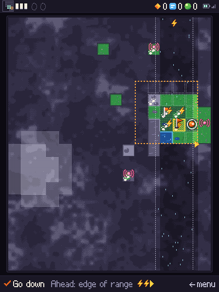
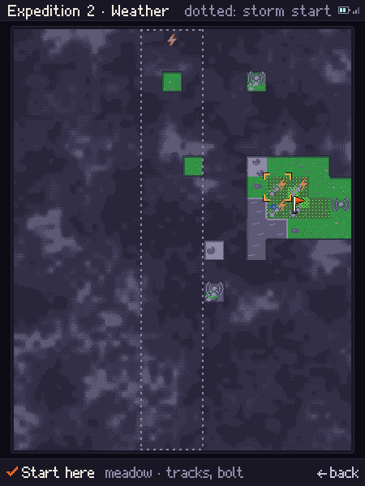
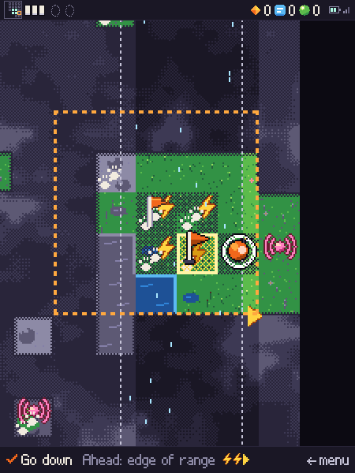
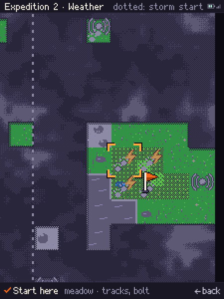
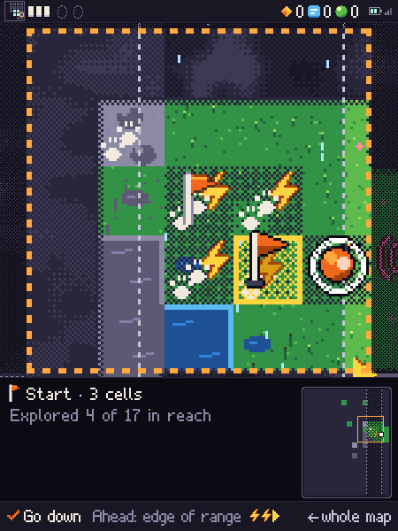
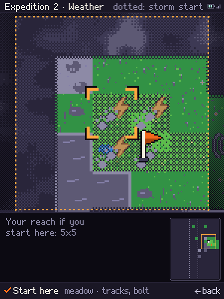
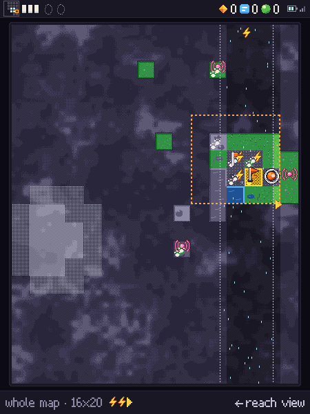

# Overview map scale: bigger cells

**Proposal**, answering the owner: the overview's cells (16×20 at 26 px in the
450×540 view) are too small. Two mock-ups drawn by the prototype's own `drawMap`
(the 26 px map offscreen, blitted at an integer scale), palette-clean by
`offPalette`. Seed 7: expedition 1 after 32 actions (quarters, a pin, the storm)
and expedition 2's start map (signs). Today: `map0-mid.png`, `map0-start.png`.

<table>
<tr>
<td align="center" valign="top"> <em>Today (26 px cells), mid-expedition, seed 7 after 32 actions. Baseline.</em></td>
<td align="center" valign="top"> <em>Today (26 px cells), expedition 2 start map. Baseline.</em></td>
</tr>
</table>

## A. 2× scrolling map (52 px cells)

`mapA-mid.png`, `mapA-start.png`. 8×10 whole cells plus a sliver each side. The
camera follows the pawn (the cursor on the start map), clamped so the reach stays
fully in view, by whole cells with a 140 ms slide; past the world's edge a 1-cell
void margin shows (`mapA-mid.png`, right).

<table>
<tr>
<td align="center" valign="top"> <em>A, 2× scrolling map, mid-expedition (<code>mapA-mid.png</code>). Alternative, not the recommendation.</em></td>
<td align="center" valign="top"> <em>A, 2× scrolling map, start map (<code>mapA-start.png</code>). Alternative, not the recommendation.</em></td>
</tr>
</table>

- **Whole map:** never on screen in an expedition (the camera is tied to the
  reach). On the start map the cursor scrolls it: up to 15 presses across.
- **Controls:** none change.
- **Code:** about 25 lines (camera, slide, margin); today's art at 2×.
- **Tier 2:** the 9×9 reach is 468 px, wider than 450, so the "reach always
  fully visible" rule breaks by one column; the camera slides instead.

## B. Reach view (78 px cells) with an inset

`mapB-mid.png`, `mapB-start.png`, `mapB-full.png`. The 5×5 reach fills the view at
3× (78 px, not 84: 84/26 is no integer scale), the land around it dimmed (Bayer
void). Below, a strip: the start flag with "Start · 3 cells", "Explored 4 of 17
in reach", and a 96×120 inset at 6 px a cell (terrain colour, FADE table for
seen cells, night for fog, reach in amber, the pawn blinking, pins, depots and
skulls as dots, the storm's mist edges). On the start map the view previews the 5×5 you would get around the
cursor. ← opens the whole map at 26 px as its own screen (today's drawing
unchanged, "← reach view" to return).

<table>
<tr>
<td align="center" valign="top"> <em>B, reach view at 3×, mid-expedition (<code>mapB-mid.png</code>). Recommended.</em></td>
<td align="center" valign="top"> <em>B, reach view at 3×, start map (<code>mapB-start.png</code>). Recommended.</em></td>
</tr>
</table>

<table>
<tr>
<td align="center" valign="top"> <em>B, the whole map at 26 px, opened with ← (<code>mapB-full.png</code>). Recommended.</em></td>
</tr>
</table>

- **Whole map:** 1 press, 1 back. The view never scrolls; only the pawn moves.
- **Controls:** ← no longer opens the menu on the map. Send home goes from 2
  presses (← ✓) to 3 (← ← ✓), or ← stays the menu and "Whole map" becomes its
  top entry (2 presses to the map). See decision 2.
- **Code:** about 60 lines (reach view, strip, inset) plus a screen phase.
- **Tier 2:** 9×9 does not fit at 3×; it drops to 2× (468 px, 9 px cropped off
  each outer column), inset over a corner: nearly A's picture.

## How things read

| | Now (26 px) | A (52 px) | B (78 px) |
| --- | --- | --- | --- |
| Quarters (13 px dither) | faint, near-invisible on wood | 26 px, the "almost" tint tells | 39 px, plain; 3 px dither dots look coarse |
| Signs (tracks, bolt, beat) | overlap, tracks and bolt merge | each sign separable | readable at arm's length |
| Pending outline (1 px fog dots) | barely visible | 2 px dots, visible | 3 px dots, clear |
| Pin vs start flag | two orange flags, 3 px apart | told apart by the pin's rust lower half | clearly two signs |

Gate, skull and depot icons (14–16 px) keep their place in the cell at 2× and
3×. No depot or skull came up in these 32 actions on seed 7.

**Start flag, depots, the hint.** The start is the reach's centre, so its flag
is always on screen in both: "Start · N cells" confirms rather than points. A
keeps the hint in the bottom line; B also puts it beside the flag in the strip.
A lit depot sends home only inside the reach, so it is always in view; B's inset
also shows depots beyond it (amber lit, bark unlit).

**Storm.** A shows the band only within about 3 cells (its arrow can be off
screen); B shows it in the reach view and its edges on the inset.

## Frame budget

`drawMap`, mean ms per call over 300 calls, three runs, headless Chromium:

| | Now | A | B |
| --- | --- | --- | --- |
| Mid-expedition | 2.36–2.67 | 3.34–3.47 | 3.76–4.07 |
| Start map | 1.69–1.82 | 2.62–2.84 | 3.27–3.44 |

The mocks draw the whole 26 px map plus a scaled blit (+1 ms A, +1.5 ms B with
inset). On the ESP32 scrolling matters more: A's slide redraws all 450×540 for
~8 frames per move; B's view is fixed, only the pawn's cells change.

## Recommendation

**B, the reach view.** In an expedition the player acts only inside the 5×5; B
gives it the screen at 3×, keeps the storm and start in sight on the inset, and
puts the whole map one press away. Nothing scrolls, and at tier 2 it becomes
A's 2× picture anyway. A spends half the view on land out of reach and still
hides the far map.

## Decisions for the owner

1. **Scale:** B (reach view at 3×, 2× at tier 2, whole map one press away), or
   A (2× map that follows the pawn, no control change)?
2. **Opening the whole map in B:** ← on the map opens it (Send home becomes
   ← ← ✓), or ← stays the menu and "Whole map" is its top entry (← ✓)?
