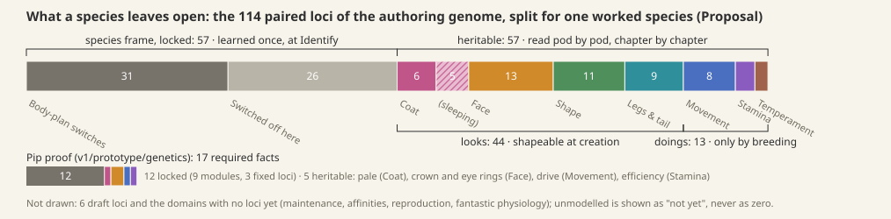
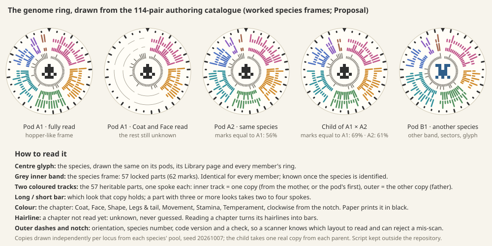

# The research loop

The [Station loop](station-loop.md), the [Station layouts](../style-guide/station-layouts.md), the [Station style guide](../style-guide/station-screens.md), [creatures and genomics](../creatures-and-genomics.md) and [the game](../game.md) carry this design. The genome ring's printability and scanability are still to be tested, and its art may be refined.

**Proposal** from game design, 2026-10-07, for discussion before any more Station screens. It replaces the "trait window" unit of the [Station loop](station-loop.md) with one that scales to the real genome, and sets what each step of the loop must let the player see and do. **Decided** marks owner decisions restated here; everything unmarked is **Proposal**. Numbers are illustrations unless marked. Sources are cited by path so the lineage of each idea can be checked.

**The owner's five points, answered:**
- *"Many loci, expressions and alleles":* research is read in **chapters** (Coat, Face, Shape, Legs & tail, Movement, Stamina, Temperament…), each a page of several traits, each trait a group of loci. The 114 loci of the authoring genome become 57 locked parts learned once per species and 57 heritable parts in 7 chapters and 24 traits (§3–4). More loci make the chapters fuller; there are never more buttons.
- *The pod list:* kept. Each pod gets a ring that fills as its chapters are read (§4).
- *Distinct pod looks:* pods come from one renderer with four parameters taken from the species, so every species gets a distinct pod and nobody draws one by hand (§6).
- *The fingerprint:* it becomes a **genome ring**, a round code that stores the real copies. Members of a species share its centre band, and a child shares one of each parent's two marks at every spoke. Unread parts show as hairlines. A device can scan it (§7).
- *Design the loop first:* §8 is the brief that every screen is judged against.

## 1. It starts with a pod: the life of one pod

1. **Bay.** The Companion docks and the crate is opened (**Decided:** cargo moves only on docking; the bay holds three crates). The pod rolls into the **pod list**, the column the owner kept, showing its place stamp and an empty ring.
2. **Identify** (1 Energy, the first pod ever free, **Decided**). The seal on the cap breaks and the species glyph shows. For a new species, its frame (every part the species fixes) is learned once, and its Library page opens. For a known species the frame is filled in at once. The pod's genome ring draws its grey centre band. Each heritable chapter shows as a sector of hairlines: there is something here, and it has not been read yet.
3. **Read a chapter** (Data). The chapter's sector turns into marks, and its page shows each trait as a picture of this pod's mibi: what it *shows*, and a misty seed for what it *hides* (the seed is from [station-loop.md](station-loop.md), **Decided** as an idea).
4. **Shape** (optional). For each read trait that can be shaped, the player picks from three pictures drawn from the pod's own two copies. The founder redraws with every change. Untouched and unread traits stay as the pod has them (**Decided**).
5. **Grow.** One pod becomes one fixed individual (**Decided**). The ring is stamped on the shell and the pod goes into the incubator.
6. **Incubate** (real minutes, **Decided**). Unread chapters clear one by one as the embryo grows. This was the best moment in the r7 playtest (`miniaturebeasts-internal/history/playtest-station-r7.md`). By the end, the mibi's ring is whole.
7. **Meet.** Open is a press (**Decided**). The juvenile steps into the vivarium carrying its ring, its name-code and its pod's story.

From here, research gets deeper across many **pods** (glints, comparing, reading the chapters with something new), across **individuals** (crossing two of them, reading the child), and across **species** (the Library's field guide, sealed chapters, new species with more chapters).

## 2. What research is

Research is the heart of the game, not a chore between expeditions (owner, 2026-10-07). Between trips the player reads what their pods carry, a page at a time. They learn what each species fixes and what it leaves open, and then they **tinker**: they shape founders from the copies a pod really has, and cross their mibis to bring hidden looks out. At the start this is one pod and one page. Later it is a collection of species with 100+ loci each. Because the unit is a chapter of pictures, more genome means fuller pages, more looks to find and more to breed toward, never a longer list. The glints and the field guide tell the player which page is worth their Data. Children see pictures and pairs. Curious parents can open a free detail view of any trait (copies, rule, context), so the deep framework stays one press away (**Decided:** "for players who want to dig in", `design/creatures-and-genomics.md`).

## 3. The genome a player meets: locked, heritable, sleeping, sealed

A genome is not one field to research. It has five kinds of part:

| Kind | What it is | Who knows it, and when | Worked frame on the 114-pair authoring genome | Pip proof |
| --- | --- | --- | --- | --- |
| **Locked** (species frame) | What makes a Loika a Loika: the body plan's switches, plus every copy a switched-off part still carries (wings off, so the wing copies are fixed too) | Learned **once per species** at the first Identify and kept in the Library. It shows as the ring's grey centre band | 57: 31 body-plan switches and 26 parts the frame switches off | 12: 9 fixed modules and 3 fixed loci (charcoal, cream, amber) |
| **Heritable · looks** | Visible traits that differ between individuals and pass to children | Read **per pod**, chapter by chapter. Shapeable at creation once read | 44 in Coat, Face, Shape, and Legs & tail | 3: pale, crown, eye rings |
| **Heritable · doings** | Movement, stamina and temperament | Read per pod. **Change only by breeding** | 13 in Movement, Stamina and Temperament | 2: drive, efficiency |
| **Sleeping** | Heritable copies whose switch is off in *this individual* (the five marking parts of a plain coat) | Read with their chapter and drawn as "asleep". They can wake in a child | 5, inside Coat | none |
| **Sealed** | A heritable chapter that the species marks as needing a find to read (**Decided** as direction: "a vybronic ethereal crystal", owner 09-27) | Shown shut with a picture of what opens it | none in this frame | none |

*The 114 authoring loci for one worked species frame (a Loika-like body plan: head, crown, eyes, ears, tail, fur, jointed legs, no wings or fins). The split was computed from the catalogue's real guards. The Pip proof is shown below for scale.*

- **Locked stays locked** (**Decided:** species-defining organization is protected). Locked parts are never researched pod by pod, never shaped and never crossed. They are **species knowledge**, so the field guide shows them once.
- **What species do differently is how much they leave open.** A starter species leaves a handful of traits open, like Pip's five. A late species leaves dozens, behind more chapters, and some of those chapters are sealed. That is how "genomes grow with the player" (**Decided** as direction) on a single 114-pair catalogue.
- **Looks are shapeable, doings come only from breeding.** This is the **default rule** the decided bounded trial points to (pale configurable; movement and effort inherited-only). Each species may override it. The owner said not to generalize the trial, so this goes to the owner (decision 2).
- "Switched off here" is not "absent" or "zero", and the four domains with no loci yet are shown as "not yet", never as nothing (**Working rule**, `v1/design/anatomical-source-prototype/compositional-contract.md`).

## 4. The unit of research: chapters and traits

**Three levels, and the player names only the top two.** A **chapter** is a page (Coat). A **trait** is one picture on it (markings). **Loci** stay under the hood: markings is one switch plus five sleeping parts. In the worked frame: Coat has 11 loci in 5 traits (colour, belly colour, markings, texture, fur), Face 13 in 5 (head, snout, eyes, crown, ears), Shape 11 in 4, Legs & tail 9 in 3, Movement 8 in 3, Stamina 3 in 2, Temperament 2 in 2. That is **24 traits for 57 heritable loci**. Chapters are navigation, not chromosomes (salvage `design/genome-starter-content.md`: "grouping is navigation, not chromosome position").

**A read** (one press, about two seconds, never a wait) reads **one chapter of one pod**. It gives **both copies of every locus in that chapter**, drawn per trait as *shows X*, *shows X · hides Y* or *only X*. It replaces "through and through", which the r7 tester read as "pure". Sleeping parts are drawn asleep, as in "markings asleep: bands, if they wake". One read can settle several facts, as the 2026-09-30 proposal asked (`history/salvage-2026-10-05/notes/.tmp/research-game-proposal.md`). Things already known are never charged again (**Working rule**).

**Fully researched**, at three levels:
- **Pod:** every chapter that is not sealed has been read. A sealed chapter keeps a notch in the ring until it is opened.
- **Individual:** a founder inherits its pod's reads, and a shaped trait is known by definition. Incubation clears the rest, so every mibi you grow is fully known. A **bred child** is known only where the Station can be sure, which is where both parents' copies were the same. Everywhere else it shows "one of these" until that chapter is read. That makes reading children a real job, and it teaches heredity without a lesson. **Decided 2026-10-08:** "known where the parents match" holds for **switch loci only**; a blended (continuous) trait is known only when read, because of the spread ([the cross](the-cross.md) §1–2).
- **Species:** the Library's **field guide** is complete when every look the species can carry has been seen in a read pod or a mibi. The worked frame has 133 looks across its 57 parts, counted from the catalogue's alleles (the earlier 124 was an estimate), and the field guide shows them as pictures per trait with a dotted "more?". Seeing every look of a species is a long-term goal. Spotting wonders, the combined traits the owner wants (**Open:** their rules), comes later.
  *Game design, 2026-10-09 (for the build):* the looks a field guide counts are the **frame's own player words** for each trait, the same words a read gives. A blend's looks are its bins, and its in-between bin is **one** look ("between"), part of "more?" until seen; the catalogue's pair labels ("between short and stub", "off/on", every two-colour pair) are never looks. Where the read falls back to them (the Tuikis's eyes, snout, build, legs and feet; both markings; the two-colour coats), the frame or `describe.lookOf` is fixed in the workbench, and a check holds every trait's enumeration to its frame's looks. The guide is complete only with the sealed chapter's looks seen ([the portrait](the-portrait.md) §8).

**The progress ring on the pod list.** Around each pod in the list, the centre fills when the pod is identified (the frame is known), then one arc per chapter, sized by its trait count, fills when that chapter is read. A star on an arc is the glint, one per chapter: this pod holds a look the species has not shown yet in that chapter. A notch marks a sealed arc. Progress = traits read ÷ traits in chapters that are not sealed. It is shown only as the ring, with no digits (`design/style-guide/station-layouts.md`, the frame: numbers only beside an icon).

**Costs and pacing.**
- **Data reads** (**Decided** meaning). A chapter costs **1 Data per trait in it**, and **half (rounded up) once that chapter has been read on any earlier pod of the species** ("the Station knows where to look"). This answers the owner's question about the blue-eyed specimen (owner 10-04): what was learned makes later pods cheaper, and the glint says which pods are worth reading. The very first read ever is free.
- **Energy runs the machine** (Identify 1, **Decided**). **Essence grows bodies** (founder 2 Energy + 4 Essence, **Decided**; the first founder 2 Energy only, **Built**). Shaping costs **+1 Data per trait changed**, down from 2 per window.
- **Worked numbers.** A first Pip pod costs 4 Data to read fully (5 traits, the first read free). A first pod of the worked 24-trait frame costs 24 Data, and a later one 14. Players read where the glints are, not every page.
- **Pacing.** This assumes about **3 Data per expedition**. The r7 tester earned 1, and Data starvation was its top problem. The field needs more creature moments, or the walk needs to pay more (**Open**, for the exploration tuning).

**The first three pods** (Pip as the starter Loika, with its real five open traits; the Untuva's chapters are illustrative):

| Expedition brings | At the Station | Store after |
| --- | --- | --- |
| 1: one unknown pod, +3⚡ +3◆ +5❀ | Identify free: **Loika**, new species. The frame is learned and the grey band fills. Read **Coat** free: "shows plain · hides pale". Read **Face** (2◆): "frill crown · hides bare head", "pale eye rings". Shape *only pale* (+1◆). Grow (first founder, 2⚡). The pod's ring was 3/5 read; Movement and Stamina clear during incubation | 1⚡ 0◆ 5❀ |
| 2: one Loika pod, +4⚡ +3◆ +3❀ | Log it (1⚡): its Face arc glints. Read **Face** at half price (1◆): "only plain eyes", a new look for the field guide. Read **Movement**, the first time on any Loika (1◆): "bursts · hides steady". Grow it unedited (2⚡ 4❀). Two Loikas now live in the vivarium, and a cross becomes possible once both are adults (§5) | 2⚡ 1◆ 4❀ |
| 3: one unknown pod, +3⚡ +4◆ +2❀ | Identify (1⚡): **Untuva**, new species, 3 chapters. A real choice: grow the Untuva now (2⚡ 4❀), or read Stamina on a Loika (1◆) and keep the 4❀ to cross the two Loikas when they are adults and see what their hidden looks do in a child | 4⚡ 5◆ 6❀ before choosing |

## 5. Tinkering: acting on the genome

The owner says this is the core: "research the genome, tinker with it." Reading tells the player what is there, and tinkering is what they do with it. There are four verbs, and all of them follow the same rules.

- **Shape a founder** (Create). For each read look-trait, roll among three pictures drawn from the pod's own two copies: *as the pod is*, *only the first*, *only the second*. These are the decided pale choices generalized from one locus to a whole trait. Doing it per trait, not per locus, keeps it at three choices however many loci the trait holds. Cost: +1 Data per trait changed, and +1 incubation minute per change (**Decided** rule).
- **Cross two mibis** (Proposal: bring a minimal version into the first Station build; breeding is "deliberately out" in station-loop §6). Choose two adults of one species. Each trait shows a **forecast** as four seed pictures: one in four spotted, two in four hiding spots. These are quarters, not percentages (forecasts per trait, **Working rule**). Cost is the same as a founder, 2⚡ 4❀. The child is a new individual with real parents (**Decided**). Its ring is literally built from one copy of each parent (§7). **Decided 2026-10-08:** the rules of the cross (blending, Mendelian switches, kinship, the inbreeding penalty, the forecast's range pictures) are in [the cross](the-cross.md); "one copy of each parent" holds for switches only.
- **Wish** (free). On a species' Library page, the player pins a dream mibi made from looks in the field guide. The Station then glints the pods and mibis that carry pieces of the wish, and the cross forecast shows how close a pairing gets. It is knowledge, never material, so a wish puts nothing into a pod (**Decided:** knowing a variant never injects it). This is the long pull: the owner's slow critter bred toward speed (owner 09-24, "selective breeding…").
  *Game design, 2026-10-09 (for the build):* a pod or mibi **carries a piece** of the wish when either copy of a pinned trait gives the pinned look, shown or hidden. The wish glint is its own mark beside the new-look star, on the chapter arc that holds the piece. In the cross forecast the pinned traits are marked: for a switch, the seeds that show the pinned look are lit among the four; for a blend, the range picture marks the pinned bin when the range reaches it. **How close** a pairing gets is the count of pinned traits a child can reach, shown as lit pinned traits, never a number or a percentage. Whether the wish glint may mark a chapter **not yet read** is **for the owner**, since it tells the player where to spend Data before they have spent it: *recommended* yes, as the new-look star already does, saying where and never what. Until the owner decides, it marks read chapters and known mibi traits only, which is what the build does.
- **Edit with a rare item** (**Open**, later). A found tool that swaps one copy before incubation, only at a known part and only with a look evidenced there. The idea is in the salvage `design/genome-starter-content.md` ("engineering tools").

**Rules, all of them already decided or working rules:** locked stays locked; doings change only by breeding; shaping uses only the copies this pod carries; every result is validated as a whole genome before anything is spent; one pod makes one founder; creation and opening never reroll; art never changes a gene (`v1/prototype/generator-workbench/art-template.md`); scanning or knowing never grants a gene.

**What can go wrong**, always shown before anything is paid, never after:
- **A shape won't grow.** Some combinations can't be built, for example eyes too big for a short head (`genomic-contract.md`: such a candidate is rejected, never repaired). Create marks the clashing traits and gives no Grow button.
- **"Only spots" means the mibi can pass on only spots.** The forecast for a cross shows the cost of that choice.
- **A cross is the gamble.** The child might wake a sleeping look, or might not. Ineligible pairs are refused before anything is spent (**Working rule**), and a child that cannot be built never exists (**Decided:** every offspring is viable).

**How a child finds it without the words.** Every trait is a **pair**: one look shows and one may hide. The pair is drawn as the two halves of the trait's picture and as the two tracks of the ring. A parent passes **one half of each pair**. The child learns this from three things: the founder redraws on every roll; a plain mother and a plain father have a spotted baby; and two rings line up at the Station. Detailed genetics stays a free page for anyone who wants it (**Decided**).

## 6. Pods as a system, not bespoke art

Every pod comes from **one renderer**, the way every creature comes from its genome (**Decided:** no hand-made art per individual).
- **Fixed:** the seed-pod form (body, seam, cap, short stem), the material and light of the accepted art direction, the outline rule, the cap with the species glyph, and the states: sealed, identified, being read, fully read, glinting, hatched (two empty halves).
- **Varies by species**, from the locked frame, so pods of a species match and never reveal an individual's genes:
  - **size class**, from the frame's body size (three scales);
  - **proportion**, squat or tall, from body length to height;
  - **shell pattern family**, from covering and symmetry: fur gives soft ribs, scales give overlapping plates, skin gives smooth dots, radial plans give segments;
  - **colour pair**, two signature pigments from the species' pool;
  - **glyph**, the 5×5 mirrored mark at the ring's centre.
- **Varies by pod:** only the dust or moss of its place of origin, kept from the decided "place colours".
- An unidentified pod shows its shell but its cap is sealed. Identify breaks the seal and shows the glyph. A pod that has no species yet is still a valid pod, just a quiet grey one.

This is a brief for the art director: the art director draws the renderer's masters and the engineers only wire the parameters (**Decided:** engineers do not do art).

## 7. The genome fingerprint as a code: the genome ring

| Need | SSH randomart | Barcode | Spotify code | QR | Bespoke grid | **Ring** |
| --- | --- | --- | --- | --- | --- | --- |
| Encodes the real genotype | no (a hash) | ID only | ID only | yes | yes | **yes** |
| Same species looks alike | no | no | no | no (masked) | partly | **yes** (band, glyph, sectors) |
| Parent and child share most of it | no | no | no | no | yes | **yes**, track by track |
| Readable at Station size, prints on paper | yes | yes | yes | yes | yes | **yes**, monochrome-safe |
| Revealed as research proceeds | no | no | no | breaks decoding | yes | **yes**, hairline sectors |
| A device can scan it | no | yes | needs a server | yes | yes | **yes**: notch, timing marks, check |

**Recommendation: the ring.** It keeps the decided round fingerprint, makes it true, and answers the owner's wish for "something different to a QR" and the owner's worry about spoofed codes (owner 09-24).
- **Centre:** the species glyph.
- **Grey band:** the locked frame, 62 marks, the same for every member.
- **Two coloured tracks:** one spoke per heritable part. The inner track holds one copy (from the mother, or the pod's first copy) and the outer track holds the other. A long or short bar marks which look; a part with 3 or more looks takes 2 to 4 spokes.
- **Sectors:** one per chapter, clockwise from the notch.
- **Outer dashes:** species number, version and a check.
- **Payload:** the worked frame needs 69 marks per track. That is 138 heritable bits and 40 header bits: the codec's own packing (one bit per two-look copy) against the species' pinned definition (`v1/prototype/generator-workbench/codec-contract.md`).
- **Reader marks** (tested in `prototypes/genome-ring/`):
  - a solid **rim** around the dashes, which finds the ring and sets its outer radius;
  - a solid **timing circle** between the tracks, with **one tick per slot**, which corrects perspective and finds every spoke;
  - a **notch** of 3 empty slots at 12 o'clock, which sets where the ring starts and its direction;
  - a **40-bit header** (species 12, version 4, read mask 8, **CRC-16**), repeated around the outer dashes and read by vote. The CRC covers the header and every spoke shown.
- **Size:** a 300 px Station ring gives about 8 px a spoke, and the Caddy can print the same ring if its paper allows about 300 dots (printer **Open**).
- **The short code stays** (`G7F · CD0 · 3H2`, **Decided**) as the mibi's name, a lookup and not the genome (`art-template.md`).

*Five rings drawn from the 114-pair catalogue. Two pods of a species share 56% of marks. Their child shares 69% and 61% with them, and at every spoke one of its two marks is one of each parent's. The other species differs in band, sectors and glyph.*

**Decided 2026-10-08:** the lineage reading of the ring ("at every spoke one of its two marks is one of each parent's"; Verify lineage below) holds for **switch spokes only**. At a blended spoke the child's two marks are equal and sit between its parents', so the lineage check there is a range check ([the cross](the-cross.md) §8).

**What the scan is for in play.** Scanning **shows and never grants** (**Working rule**): a forged ring can show a mibi but never makes one.
- **Compare:** overlay two rings, and the spokes that differ pulse.
- **Trade:** see exactly what you would get before agreeing (consent rules **Decided**).
- **Verify lineage:** the Station checks the child's tracks against both parents' rings.
- **Website and cloud:** a scanned ring opens the mibi's public page. Certified lineage would need the cloud's signature (**Open**). **Decided 2026-10-08** ([the portrait](the-portrait.md) §1, §3): the signature is the **postmark**, signed by the cloud when a mibi sits for its **portrait** (the unique cloud-painted render, earned with a sitting); a plain mibi's stamp carries an unsigned postmark and its scan shows and grants nothing; only portrayed mibis trade.

## 8. The loop, step by step: the brief screens are judged against

| Step | The player must see and be able to do | Information it needs | It must never show |
| --- | --- | --- | --- |
| Dock, bay | Crates in the bay. Open the bay with one press, and watch the arrival play | Consignments, contents, mend | Anything about a pod's genes |
| Pod list | Every pod at a glance: place stamp, species glyph or seal, progress ring, glint, what it waits for. The current pod is marked | Pods, reads, glints, prices | Digits of progress, locus counts |
| Identify | The seal breaks and the species shows. A new species opens its Library page with the frame | Species, frame | Individual traits before a read |
| Read | The chapters as arcs and as pages. Which chapters glint, what each read costs, and the result as pictures: shows, hides, only, asleep | Copies of the read chapter, species gallery | Letters (Pp), ratios, guesses for unread parts, "locked" used for "unknown" |
| Compare | Two pods or mibis of a species side by side. The rings and pages line up and the differences pulse. Free | Both genomes as read | Unread parts of either |
| Shape | The founder large. Roll each shapeable trait among three pictures, and see the total price and what stays a surprise | Pod copies, permissions, validity | A look the pod lacks, any locked part as choosable |
| Incubate | The embryo grows, unread chapters clear, and the leaves count the time | Minutes, remaining reads | A different individual |
| Meet | The mibi steps out: its name, its ring, its story | The individual | Nothing hidden: it is fully known |
| Cross, Wish | Pick two adults, see the forecast seeds per trait, pin a wish | Both parents, eligibility, field guide | Odds as numbers on the child-facing view, any promise |
| Library | The field guide per species: frame, looks found, "more?", lineage, wishes | Species knowledge | Ownership implied by knowledge |

**Return paths.** A pod that is short waits in its cup and says what it needs (**Decided**). Unread chapters wait, and findings survive spending and using the pod (**Decided**). A known chapter is free to look at again. A pod can go back to the wild for +1❀ (**Decided**). A sealed chapter sends the player out for its find, and a wish sends them out for pods that glint.

## 9. Where this comes from

Paths marked "salvage" are under `miniaturebeasts-internal/history/salvage-2026-10-05/`: `notes/.tmp/` for notes, and `checkouts/publication--critter-lab-core-v1/files/` for `design/` and `docs/` files (the older `docs/screens.md` and `docs/genetics.md` are in the `worktree-*` checkouts). Owner dates are from `history/owner-direction-2026-10-05.md`.

**Carried forward:**
- The Pip proof's three kinds (class invariant, fixed, variable) and its 17-fact manifest, as *locked*, *heritable* and *fully researched*. Sources: `v1/prototype/genetics/report.md`, `v1/native/selected-lab/V1.md`.
- Copies stay when their owner is off, as *switched off* and *sleeping*. Sources: `v1/design/anatomical-source-prototype/compositional-contract.md`, `v1/prototype/generator-workbench/evidence/diversity-diagnosis/locus-coverage.md`.
- Domains as a filing system, as chapters (`creatures-and-genomics.md`).
- The genome field: regions that unfold in place (`art/references/genome-field/`).
- The sample's "unique genetic bitmap", revealed at opening (salvage `docs/screens.md`, owner 09-25), as the ring at Identify.
- One study settling several facts, and the question-to-finding idea (salvage `research-game-proposal.md`).
- "Unknown, not locked" (owner 09-27, `research-game-model.md`): here "locked" means species-fixed only.
- Crystal-gated loci, as sealed chapters (owner 09-27).
- Selective breeding, as crosses and wishes (owner 09-24).
- ceil(log2) bit packing and shared-catalogue mode (`codec-contract.md`), as the ring's payload.
- The `#G` code as a lookup, not a genome (`art-template.md`).
- No QR, and the spoofing worry (owner 09-24).
- The editing item (`genome-starter-content.md`).
- From the r7 playtest: Data starvation, nothing to shape, misread words, the petals felt like progress, and the incubator reveal was the best moment.

**Dropped:**
- Trait windows, which don't scale (owner).
- Whorl petals with hash ridges, which don't encode the genome (owner).
- Full decoding before creation, the old v1 gate, which contradicts the decided unedited founder.
- Research that steers synthesis (model B, salvage `docs/genetics.md`), superseded by the decided fixed genome.
- Per-topic purchases, a checklist.
- Separate signal and point ledgers (`research-game-model.md`): too many currencies.
- One unresolved-pod slot (`sample-loop-alternatives.md`), which conflicts with the decided six cups.
- Essence as a reading medium (`visual-genome-game-brief.md`), which conflicts with the decided meanings.
- Incubation as preparing a first home (`probe-bench-review.md`), superseded by the decided real minutes.

## 10. What this changes

- **station-loop.md §1:** "trait windows" become chapters and traits; "a study is one window, 2 Data" becomes one chapter at 1 Data per trait, half on later pods; the glint becomes per chapter; the whorl becomes the genome ring; incubation's "+1 minute per window beyond three" becomes per chapter beyond three.
- **station-loop.md §4:** the study price changes, "+2 Data per window changed" becomes +1 per trait, and the Data-income dependency is added.
- **station-loop.md §6 and §9:** a minimal cross and wishes move into scope; the placeholder genomes ("4 windows") become species frames on the authoring catalogue, starting with Pip's five traits; the fingerprint spec becomes the ring.
- **station-screens.md:** the pod list column stays and gains the progress ring; the "arc of four windows" and "The trait window" become chapter arcs and pages; "The fingerprint" becomes the ring; the Library's per-window sticker slots become one page per chapter; Create rolls traits; the words change to *only X* and *breed to change*.
- **Also:** `design/style-guide/station-screens.md` (Pods, Library), `design/creatures-and-genomics.md` (research and fingerprint lines, once decided), and `design/play-manual.md` when it is built.
- **Stays decided:** a Station the player drives; Identify for 1 Energy, the first free; the founder price; one pod, one founder; shaping only researched, permitted traits with the pod's own copies; incubation in real minutes by species; the sealed bay and no forced return; glint, free compare, never paid twice, findings survive; six cups; the separate 1024×600 page; a fingerprint and a code exist.

## 11. Decisions for the owner

1. **Chapters are the research unit.** One read covers one chapter of one pod and gives both copies of every trait in it, at 1 Data per trait, half on later pods of the species, with the field raised to about 3 Data per expedition. *Recommended.*
2. **The genome split.** Locked frame learned once per species, heritable parts read per individual. Default rule: looks shapeable at creation, doings only by breeding, with each species allowed to override. This generalizes the bounded trial, which was explicitly not to be generalized, so it is the owner's call. *Recommended as the default.*
3. **The genome ring replaces the whorl** as the fingerprint: centre band, two tracks, hairlines for unread parts. Scanning shows and never grants. The short code stays as the name. *Recommended.*
4. **Pods from one renderer** with species parameters (size, proportion, pattern family, colour pair, glyph). An individual's genes never show on the shell. *Recommended.*
5. **Tinkering in the first Station build:** a minimal same-species cross with forecast seeds, and wishes, pulled forward from "deliberately out". *Recommended*, because tinkering is the core.
