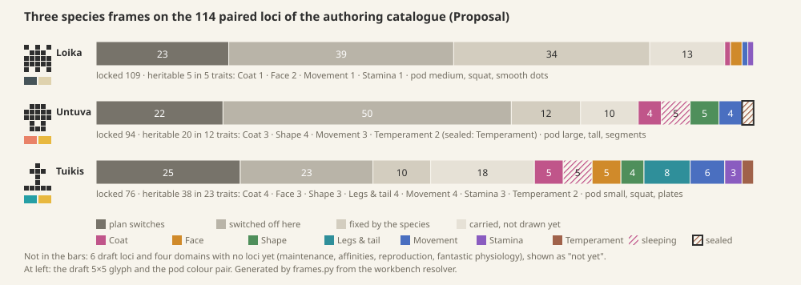

# Species frames: the first three species on the real catalogue

**Proposal** from game design with the genome engineer, 2026-10-07. It turns the approved [research loop](research-loop.md) (§3 the five kinds of part, §4 chapters and traits, §6 pods) into three concrete species frames on the real 114-pair authoring catalogue, so the Station can be built against real data. **Decided** marks owner decisions restated here; everything else is **Proposal**. The frames are data: [species-frames/](species-frames/) holds one JSON file per species in the [frame schema](species-frames/frames-schema.md), written by [frames.py](species-frames/frames.py). The script reads the catalogue (catalogue6, `v1/prototype/generator-workbench/innate-profile-package.mjs`) and builds every genome through the workbench's own resolver, so the ids, alleles and on/off states are real. Run `python3 design/proposals/species-frames/frames.py --check` to verify them.



*Each bar is the 114 loci of one species. Grey: the locked frame, learned once at Identify. Colour: heritable parts by chapter. Hatched: sleeping. Outlined: sealed.*

## 1. The frame method

**What a frame is.** Every species carries all 114 pairs (**Decided:** copies stay when their owner is off, `compositional-contract.md`). A frame says, for each locus, whether the species fixes it or leaves it open, and puts each open locus in one trait of one chapter. The six draft loci and the four domains with no locus (maintenance, affinities, reproduction, fantastic physiology) are listed as "not yet", never as zero or absent.

**Switches lock the plan.** The catalogue has two kinds of switch:
- **Plan switches** (23) decide which owners exist: the older development switches (axial repeat, symmetry, attachments, jointed chains, membranes, fins, body wave), the eight organization switches (region depth, layout, symmetry, join, head, appendage role, groups, free links), posterior, wings or flaps, leg pairs, fur, skin or scales (both records), eye pair (the older record) and the temperament profile. They are **always locked**: species-defining organization is protected (**Decided**).
- **Part switches** (6) turn one small part on or off: muzzle, crown, eyes, ears, tail and markings. A species may open one; Pip's crown is the case in point.

**Switched off means locked.** When a switch is off, every part it owns keeps its copies but is not built (wings off, so span, chord and sweep are off too). The frame reads this from the resolver's own guard (`consumerGuard`, `compositional-vocabulary-adapter.mjs`), and for the older records that nothing draws yet, from the catalogue's `applicability`. A switched-off part is locked: the frame stores two equal copies for it.

**Every locked part has two equal copies.** That is what makes it locked in play: every member carries the same pair, so no cross can change it, and a pod or child that differs is not this species. A locked part is one of four things: a **switch**; **switched off** here; **fixed** (its owner is on and the species fixes it, like the hopper's charcoal coat); or **carried, not drawn yet** (an older record with no consumer in the current construction, like `structure.body-length`). The last kind can't be opened, because it would show nothing.

**Heritable parts are named by the species.** A frame lists its open traits. Each trait groups one or more loci and has player words for its looks. Rules checked by the script: a look must be drawn by the current construction when its switches are on; a doing must be movement, energy or temperament; a plan switch is never open; a species may narrow a locus to an **allele pool** (a puffcap is only ever coral, raspberry, marigold or plum).

**Sleeping parts are computed.** The script builds the frame twice, with every open part switch on and with every one off. An open part that is drawn only when a switch is on is **sleeping**: read with its chapter, drawn asleep in an individual whose switch is off, and able to wake in a child. Markings are the only case in these three frames: one switch and five sleeping parts.

**Chapters by what the part is.** Coat: colours, markings, scales, fur. Face: head, muzzle, eyes, crown, ears. Shape: body proportions, regions, flaps. Legs & tail: legs, feet, tail. Movement, Stamina and Temperament: the movement, energy and cognition records. The ring order is fixed (Coat, Face, Shape, Legs & tail, Movement, Stamina, Temperament) and a species shows only the chapters it opens. A species may add one chapter of its own after them (the glowtail's Glow, §4).

**Sealed chapters are declared.** A species marks a chapter sealed and names the find that opens it (**Decided** as direction: a crystal, owner 09-27). Its parts are inherited and act from birth, but they can't be read or shaped until the find. The ring keeps a notch there.

**Shaping.** Looks are shapeable at Create and doings change only by breeding (**Decided** default, 10-07). A trait can override this, with a reason stored in the frame.

**Pod parameters come from the frame.** Size class from body size (`growth.core-half-length`). Proportion from the built type specimen's height to length (tall at 0.75 or more). Shell pattern: segments for a radial plan, otherwise soft ribs for fur, plates for scales and smooth dots for skin. Colour pair: two pigments from the species' pool. The glyph is drawn per species, 5×5 and mirrored.

**Checks.** The script stops unless each species adds up to 114, every locked pair is equal, every open look is drawn, and 200 random individuals per species (copies drawn from its pools) all build. They all do.

## 2. Hopper: the starter (Pip)

Pip as in the approved art (**Decided:** charcoal, cream, orange eyes, leaf crest): one barrel body, a large fused head with a muzzle, two eyes and a crest, four short legs with pads, smooth skin, no ears, tail or wings. It leaves open **exactly the five traits of the Pip proof** (`v1/prototype/genetics/report.md`).

| Chapter | Trait | Looks | Locus | Create |
| --- | --- | --- | --- | --- |
| Coat | Markings | plain · pale patches | `appearance.marking-switch` (recessive, as Pip's `p`) | shapeable |
| Face | Crown | bare head · leaf crest | `anatomy.crown-presence` (dominant, as `C`) | shapeable |
| Face | Eye rings | thin rings · between · wide pale rings | `growth.exterior-eye-size-ratio` (stand-in, decision 3) | shapeable |
| Movement | Drive | steady · between · bursts | `movement.cycle-rate` (stand-in, decision 3) | breeding only |
| Stamina | Efficiency | thrifty · between · ordinary | `energy.action-efficiency` | breeding only |

- **Locked 109**: 23 switches, 39 switched off (wings, ears, tail, fur, scales, posterior, membranes, fins, body wave, the free-chain, radial and second-region parts), 34 fixed (charcoal body, cream legs, the crest's form and height, head, muzzle and leg proportions, the pale patch pattern, and the other movement, stamina and temperament parts), 13 carried, not drawn yet.
- **Heritable 5**: 3 looks and 2 doings, in four chapters (Coat 1, Face 2, Movement 1, Stamina 1). No sleeping parts: the marking pattern is fixed, so pale always shows as the same patches. No sealed chapter. A first pod costs 4 Data to read in full, the first read being free, as in research-loop §4.
- **Pod:** medium, squat, smooth dots, charcoal and cream. **Glyph:** a three-leaf crest over a round body on feet.

```
# . # . #
. # # # .
# # # # #
# # # # #
# . # . #
```

**Not yet:** the cream belly (the catalogue's colour fields are local, never an underside), the orange eyes (fixed inks), a third crest leaf (the crown is a pair). Pip's art keeps them; the frame can't vary them.

## 3. Puffcap: a radial, capped plan with a sealed chapter

A large round furred body in radial symmetry, with a small face (a bilateral head frame on a radial body, as the contract allows), no legs, and three thin flaps round the top that read as its cap. It waddles: the body-wave switch is on and its legs are off.

**Switches that make it:** `organization.body-symmetry` and `development.symmetry` radial; `organization.appendage-role` none; `anatomy.wing-presence` on (a radial plan builds the flaps as a triple); `appearance.fur-presence` on; `development.axial-deformation` on; head on, eyes on, muzzle, crown, ears and tail off. Radial switches off a lot on its own: bilateral width and depth, the cross-section, the leg colour and every leg part.

| Chapter | Trait | Looks | Loci | Create |
| --- | --- | --- | --- | --- |
| Coat | Colour | coral · raspberry · marigold · plum · two side by side | body palette (pool of 4) | shapeable |
| Coat | Spots | bare · bands · spots · bands and spots | marking switch + 5 **sleeping** | shapeable |
| Coat | Fluff | short and straight · between · long and swept | fur length, fur flow | shapeable |
| Shape | Roundness · Body · Cap size · Cap sweep | slim to plump · egg, barrel, pear · small to wide cap · straight to swept back | radial cross-radius · longitudinal form · flap span + chord · flap sweep | shapeable |
| Movement | Pace · Turning · Waddle | steady to brisk · wide to tight turns · slight sway to big waddle | cycle rate · turn control · body-wave amplitude + phase | breeding only |
| Temperament **(sealed)** | Curiosity · Nerve | reserved to seeking · jumpy to unflappable | exploration tendency · arousal threshold | breeding only |

- **Locked 94**: 22 switches, 50 switched off, 12 fixed (size, face, cap flutter, stamina), 10 carried, not drawn yet.
- **Heritable 20** in 12 traits: Coat 9 loci (4 looks, 5 sleeping), Shape 5, Movement 4 doings, Temperament 2 **sealed**. Three chapters can be read: a first pod costs 10 Data.
- **The sealed chapter: Temperament**, opened by a **vybronic crystal** dug up where a puffcap partner sniffs out a buried pod (its field ability, `prototypes/exploration`). Until then every puffcap still has its curiosity and nerve, and the player can see them differ in the vivarium without reading why. Growing a puffcap and walking it is what opens its own last page.
- **Pod:** large, tall, segments, coral and marigold. **Glyph:** a wide cap over a round body.

```
. # # # .
# # # # #
# # # # #
. # . # .
. # # # .
```

**Not yet:** a cap that sits only on top (the radial triple puts one flap underneath; a single dorsal sheet is not in the catalogue), and spots or a colour on the cap itself (markings are body-only, and a radial plan uses one pigment).

## 4. Glowtail: a tailed, luminous plan

A small, low, scaled burrower: two linked tapered body regions, a head with a snout, eyes and a pointed crest, four short legs, and a long tail that carries the glow. It leaves the most open of the three, in all seven chapters.

**Switches that make it:** `organization.region-depth` two, serial, narrow join, bilateral; head on; contact legs, two pairs; `anatomy.axial-tail-presence` on; scales (`appearance.anatomical-covering`, `appearance.covering-kind`); fur off; body wave on; muzzle, eyes and crest on, ears and wings off.

| Chapter | Traits (looks) | Create |
| --- | --- | --- |
| Coat | Colour (lagoon, jade, marigold, periwinkle, or two) · Leg colour (milk-mint, cream, ice, slate, or two) · Markings (plain, stripes, spots, both; 1 switch + 5 sleeping) · Scales (a few fine to many coarse) | shapeable |
| Face | Crest (low to tall) · Eyes (small and close to big and wide) · Snout (short to long) | shapeable |
| Shape | Build (slim to stout) · Hind body (small to full) · Back line (dipping, level, arched) | shapeable |
| Legs & tail | Legs (short and fine to long and stout) · **Claws** (round feet, pads, digging wedges) · Tail (short and thin to long and thick) · Tail curl (hangs to curls up) | shapeable, except **Claws: breeding only** (override: the claws are how a glowtail digs, a field ability, so they change like a doing) |
| Movement | Pace · Stride · Weave (straight scurry to weaving glide) · Turning | breeding only |
| Stamina | Strength · Reserve · Thrift | breeding only |
| Temperament | Curiosity · Nerve | breeding only |

- **Locked 76**: 25 switches, 23 switched off, 10 fixed, 18 carried, not drawn yet.
- **Heritable 38** in 23 traits: Coat 10 loci (5 sleeping), Face 5, Shape 4, Legs & tail 8, Movement 6, Stamina 3, Temperament 2. 22 looks, 11 doings, no sealed chapter. A first pod costs 23 Data to read in full and a later one 13, so the glints matter here.
- **The glow** has no locus: the catalogue models no emission (the firefly case in `genomic-contract.md` stops at the same gap). Until the genome engineer adds one, every glowtail glows gold at dusk as part of its frame, and the Library says so. Decision 1 says what it becomes.
- **Pod:** small, squat, plates, lagoon and marigold. **Glyph:** a glowing bulb raised on a tail over a low body.

```
. . # . .
. # # # .
. . # . .
. . # . .
# # # # #
```

**Not yet:** the glow, and a bulb at the tail tip (the tail tapers to a point).

## 5. The numbers against the catalogue

| | Hopper | Puffcap | Glowtail |
| --- | --- | --- | --- |
| Plan and part switches, locked | 23 | 22 | 25 |
| Switched off here | 39 | 50 | 23 |
| Fixed by the species | 34 | 12 | 10 |
| Carried, not drawn yet | 13 | 10 | 18 |
| **Locked** | **109** | **94** | **76** |
| Heritable looks | 3 | 9 | 22 |
| Heritable doings | 2 | 4 | 11 |
| Sleeping | 0 | 5 | 5 |
| Sealed | 0 | 2 | 0 |
| **Total** | **114** | **114** | **114** |
| Traits · chapters (sealed) | 5 · 4 | 12 · 4 (1) | 23 · 7 |
| Looks for the field guide | 13 | 66 | 139 |
| Ring payload, bits per track | 5 | 24 | 48 |
| Built from random copies | 200 of 200 | 200 of 200 | 200 of 200 |
| Not yet (all three) | 6 draft loci; maintenance, affinities, reproduction, fantastic physiology | | |

The research loop's worked frame (57 locked, 57 heritable) was an illustration on a hopper-like plan with everything open; these frames replace it. The starter leaves 5 parts open and a later species 38, which is how genomes grow with the player (**Decided** as direction) on one catalogue.

## 6. Decisions for the owner

1. **The glowtail's glow is a doing.** It is how brightly and how long it glows at dusk, inherited only, on a Glow chapter of its own after Temperament once the emission locus exists. Until then it is fixed (gold, every glowtail). The alternatives are a look shapeable at Create, where a child picks the brightest glow in one press and the pull is gone, or a look changed only by breeding, which works the same as a doing but breaks the default rule. *Recommended: a doing.* Breeding a brighter glowtail is the first real reason to use the cross that is coming into the first build.
2. **The puffcap's sealed Temperament chapter is the game's first find.** Its crystal is dug up by a puffcap partner sniffing out a buried pod. This teaches sealing on the third species the player meets, with a find they can work out. The alternative is to leave the puffcap fully open and seal something on a later species. *Recommended: yes, the first find.*
3. **Pip on the catalogue, with two stand-ins.** Eye rings are carried by eye size: the pale rim grows with the eye, and the trait blends to three looks where Pip's `R` dominated. Drive is carried by pace, because `movement.burst-recruitment` is still a draft. The hopper has four legs as in the approved art, not the proof's six. *Recommended: accept these for the first build.* The genome engineer then adds a ring-pigment locus and validates burst recruitment, and the frame swaps the ids without the player seeing a change.
4. **Chapter names as the player sees them.** The seven words stay fixed across species, in the same ring order, with at most one species chapter for a signature (Glow). *Recommended:* Coat, Face, Shape, Legs & tail, Movement, Stamina and **Nature** in place of Temperament. Nature is shorter on the ring, a child can read it, and it says "born that way", which is true: training changes behaviour, never genes (**Working rule**).

## 7. For the genome engineer

The frames need these from the catalogue, in this order: an emission locus (the glow); a ring pigment for the eyes; burst recruitment validated; a dorsal sheet for a cap on top; a belly field (Pip's cream belly); cap colour and markings on flaps. Each is listed under `notYet.pending` in the frame that needs it. A new catalogue pin means a new frame version, and saved mibis keep theirs (**Working rule:** rule changes never rewrite creatures).
