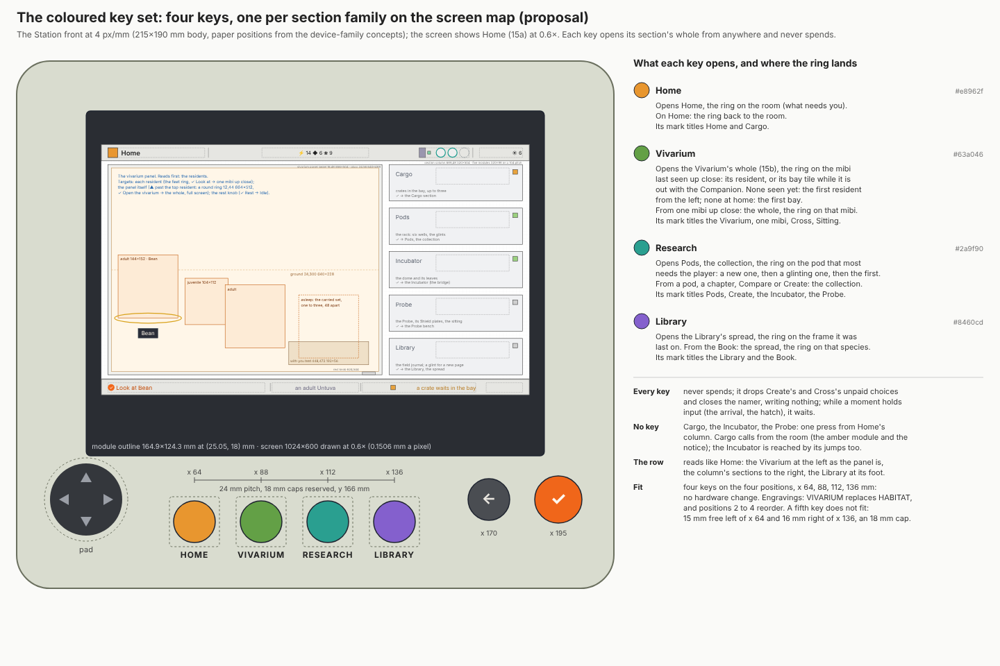

# The Station's coloured key set

This proposes the Station's coloured keys: four keys, Home, Vivarium, Research and Library, one for each family of sections on the [screen map](../style-guide/station-layouts.md#the-screen-map), on the four workspace positions the device already reserves. It is for the owner, and for the builders of the Station's screens and the kit's hardware labels once it is decided.

*16. The key set on the Station's front at 4 px/mm, Home (15a) on the screen at 0.6×, and what each key opens. Paper positions from the [device-family concepts](../../hardware/concepts/device-family/concepts.md) ([SVG](station-keys/16-key-set.svg)).*

## The set

A coloured key opens one section's whole from anywhere, even from inside that section, and never spends. Every key drops Create's and Cross's unpaid choices and closes the namer, writing nothing; while a moment holds input (the arrival, the hatch), the key waits.

| Position | Key (engraving) | Colour | Opens | The ring lands | Its mark titles |
| --- | --- | --- | --- | --- | --- |
| x 64 mm | Home (HOME) | amber `#e8962f` | Home | on the room, where ✓ does what needs you; on Home, back to the room | Home, Cargo |
| x 88 mm | Vivarium (VIVARIUM) | green `#63a046` | the Vivarium's whole (15b) | on the mibi last seen up close: its resident, or its bay tile while it is out with the Companion; none seen yet, the first resident from the left; none at home, the first bay. From one mibi up close: the whole, the ring on that mibi | the Vivarium, one mibi up close, Cross, the Sitting |
| x 112 mm | Research (RESEARCH) | teal `#2a9f90` | Pods, the collection | on the pod that most needs the player: a new one, then a glinting one, then the first. From a pod, a chapter, Compare or Create: the collection | Pods, Create, the Incubator, the Probe |
| x 136 mm | Library (LIBRARY) | violet `#8460cd` | the Library, the spread | on the frame it was last on. From the Book: the spread, the ring on that species | the Library, the Book |

Cargo, the Incubator and the Probe have no key: each is one press from Home's column. Cargo calls the player from the room (its amber module and the notice), and the Incubator is also reached by its jumps (Grow it, Cross them, Choose a pod).

## Why these four

- **The map has four families.** Home with Cargo; the living (the Vivarium, one mibi, Cross, the Sitting); the research (Pods, Create, the Incubator, the Probe); the reference (the Library, the Book). One key a family keeps each title's mark the colour of a key on the device.
- **A key earns its place on a crossing the player makes mid-task.** The map's jumps run between research, the Vivarium and the Library (Grow it, the hatch, Visit, Open the guide). Without the Library key, reaching the Library from a chapter page costs ← ←, four ▼ and ✓.
- **The row reads like Home.** The Vivarium sits at the left as the panel does, the column's sections to its right, the Library at the column's foot.
- **The colours carry over.** Each colour stays with its family; amber for Home matches Cargo's amber lamp, which carries Home's mark. Home's amber is the nearest colour to ✓'s orange (`#f0661a`); the art director checks the two apart on the shell.

## Weighed and set aside

- **Three keys, the Library left to the column.** It frees a cap, but costs the Library crossing above.
- **A key for each column section** (Cargo, the Incubator, the Probe). None is a mid-task crossing: Cargo is announced on Home, the Incubator is reached by its jumps, and the Probe is occasional upkeep. Five to seven keys do not fit the row.

## Fit on the hardware

The four keys take the four workspace positions at x 64, 88, 112 and 136 mm (y 166, 24 mm pitch, 18 mm caps reserved): no change to the shell. The engravings change: VIVARIUM replaces HABITAT, and positions 2 to 4 read Vivarium, Research, Library. A fifth key does not fit the row: 15 mm is free left of x 64 (to the pad's 30 mm reservation) and 16 mm right of x 136 (to ←'s), against an 18 mm cap.
