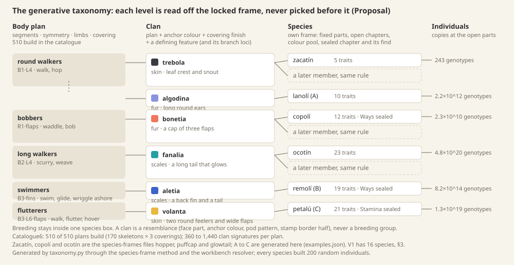

# Taxonomy: plans, clans, species, individuals

**Proposal** from game design with the genome engineer, 2026-10-07, for a discussion with the owner before genes, traits, names and art are designed per species (**Decided** 10-07: species design starts with taxonomy). **Decided** marks owner decisions restated here; everything else is **Proposal**. It builds on the [species frames](species-frames.md) and the approved [research loop](research-loop.md). The examples are generated, not drawn: [taxonomy.py](taxonomy/taxonomy.py) makes them by the rules in §3 and builds each one through the species-frame method and the workbench's own resolver, 200 random individuals per species. Run `python3 design/proposals/taxonomy/taxonomy.py --check`; its output is [examples.json](taxonomy/examples.json) and the [plan census](taxonomy/plans.json).

**Decided by the owner on 10-07, folded in:** a roster with cat-, fox- and raccoon-like mammals, at most two insect-like kinds and more big animals across size classes; names left to the copywriter (§5); before that, the growing genome, the four levels, one roster for every kit, and the first 16 with one change: one plant, and a spectral or energy creature in place of the second; before that, 16 species in V1, shown as a grid of 16 on the Station, with seasonal drops about every three months; the first 16 as different from each other as possible (fliers, swimmers, mammal-like, insect-like, slugs, sentient plants); hidden silhouettes for clans and species not yet met; Compare on any living mibi; the clean-room naming stands (the "combination of words" was for the product name).

**One word first.** The website and the breeding design already use *family* for a mibi's kin: "One species. Endless families", the genealogy tree (**Decided** 10-06, homepage). The owner asked that individuals and families never be confused (09-24). So the level between plan and species is called a **clan** here and on screen; *family* keeps meaning parents and children. And the frames' working file names *hopper*, *puffcap* and *glowtail* belong to other franchises' creatures, so the species carry codes as ids (S01–S16, C01–C16) and the owner-approved names ([species-names](species-names.md)) stand beside them: the three frames are **S01** Loika, **S02** Untuva and **S03** Tuikis (§3, §5).

## 1. What a species is, in this game

A species is one **frame** (today on the one 114-pair catalogue; under §2's proposal, on the shared trunk plus its clan's branch): its locked **plan switches** (segments, symmetry, limbs, covering) and every part they fix or switch off, two equal copies in every member, learned once at Identify; a **colour pool** (the pigments a wild pod can carry); its **open chapters**, each a page of traits with their looks; its **sealed chapters** and the **finds** that open them; its **looks/doings rule** (looks shapeable at Create, doings changed only by breeding, with stated overrides, **Decided** default); a **diet** and a **habitat** (frame facts for now: the energy-uptake loci are drafts and the affinities domain has no loci); and a **state machine**: the plan gives the states (walk, hop, waddle, swim, flutter), the species the transitions, and each individual's doings and Character weight them (**Decided** direction, owner 09-25). Two members share everything locked: silhouette, face parts, finish, size class, pod, glyph, stamp border, diet, habitat, field ability and behaviour states. They differ only at the open parts, copy by copy, which is where research, shaping, wishes and crosses happen. Breeding is same-species only (**Decided**) because only two members of one frame carry the same locked pair at every locus: a child is validated as a whole genome against its frame, and a cross of two frames has no frame to be valid against. It would be a new species, and only the generator makes those.

## 2. The central question: one fixed genome, or a genome that grows

The owner: *"What if, rather than a fixed allocation for the data structure, you make it dynamic, so the growth in complexity is very visible. Otherwise we would be forcing all species to have the exact same genome, just with different expressions."*

**Today it is the same genome, differently expressed.** Every frame is drawn from the one 114-pair catalogue: S01, S02 and S03 each carry all 114 pairs, and what makes them different species is which loci are locked, switched off or open (species-frames §1). A S01 carries wing span, fin and tail copies that nothing will ever draw. The Library, the stamp's locked band and the player's sense of "how much is in there" are the same size for the starter and for the most complex species; only the open part differs.

**The alternative the frame method already permits: a pan-genome, a shared trunk plus clan branches.** The **trunk** holds the loci any body can use: eyes, head, legs, feet, coat, markings, movement, stamina, Character. A **branch** holds loci that exist only in one clan: the glow's emission locus for C03, a top-only cap sheet with its own colour and spots for C02, a belly field and a crest leaf count for C01 (the gaps the three frames list). A species carries the trunk loci for the parts its plan has, plus its clan's branch. Everything else is **absent, not switched off**: the compositional contract already keeps these apart ("switched off" keeps copies that can wake; "unmodeled is not absence", `compositional-contract.md`). Within a species, a part that varies keeps its copies and can sleep (a plain S01's markings); across species, a part the plan never has has no locus at all. Absent parts are never drawn, researched, stamped or shown as "not yet". So a simple species is simpler in its genome, its Library page and its stamp, and a late one visibly has more chapters, bigger blocks and a bigger stamp.

**The three species under it** (counted by taxonomy.py from the frames; absent = owner switched off, presence switch off, or an older record nothing draws):

| | Today: pairs carried · open | Absent under the pan-genome | Trunk: locked · open | Clan branch: loci · open | **Genome · open** | Chapters |
| --- | --- | --- | --- | --- | --- | --- |
| S01 | 114 · 5 | 59 (wings, tail, ears, fur, fins, radial and second-region parts…) | 50 · 5 | 2 · 0 (cream belly, three leaves: both locked, Pip as approved) | **57 · 5** | 4 |
| S02 | 114 · 20 | 67 (legs, snout, crown, ears, tail…) | 27 · 20 | 3 · 2 (cap on top, its colour, its spots) | **50 · 22** | 4 + sealed |
| S03 | 114 · 38 | 46 (wings, ears, fur, fins…) | 30 · 38 | 3 · 2 (glow brightness, glow length, the tail-tip bulb) | **71 · 40** | 7 + Glow |
| Example A (S07's plan) | 114 · 21 | 57 | 36 · 21 | none yet | **57 · 21** | 4 |
| Example B (a cut fish plan) | 114 · 30 | 50 | 34 · 30 | none yet | **64 · 30** | 6 + sealed |
| Example C (S12's plan) | 114 · 35 | 51 | 28 · 35 | none yet | **63 · 35** | 6 + sealed |

The frame's size is how many parts a body has, so it doesn't grow in a straight line (a legless S02 has fewer parts than S01). What grows with the player is the **open genome**: 5, 22, 40 pairs, and the stamp, the chapter arcs and the field guide follow it. The Library's frame plate shows only parts the species has, so a S02's page has no legs section at all.

**What it costs.**
- **The catalogue grows by clan.** A new clan may bring branch loci, written by the genome engineer as catalogue records with their consumers (never by the LLM); each is a catalogue version, and saved mibis keep theirs (**Working rule**). A branch that later suits another clan is promoted to the trunk, a versioned move.
- **The frame registry carries per-clan loci:** each frame lists the trunk loci present and its branch; the codec already packs against a species' pinned definition (`codec-contract.md`), so the payload simply has no slots for absent loci.
- **Art:** the parts library is trunk parts per plan plus branch parts per clan (§7). The glow, the top cap and the belly are each drawn once, for their clan.
- **Breeding stays same-species**; nothing changes there, because a species already shares one frame. The field guide compares species only on trunk traits.
- **The stamp, an engineering note:** the stamp's 25-cell floor comes from the 64 signature bits reserved for the postmark (**Decided** 10-07). If the postmark takes space only when present, the S01's stamp can be 17×17 cells, so complexity reads at the low end too.

**Decided** (owner 10-07): **the trunk-and-branch pan-genome**. It is the same frame method with absent loci dropped instead of locked, it answers "the same genome for every species", and it makes the clan a genetic fact, not only a likeness. The three frames convert without changing a single open trait.

## 3. The generative taxonomy

Every level is **read off the locked frame**; none of them picks anatomy first. That keeps the owner's correction that classes emerge from the genome and are never construction templates (10-01), inside the decided established species (10-03).

| Level | What fixes it | In the catalogue (catalogue6) | V1 | Over time |
| --- | --- | --- | --- | --- |
| **Body plan** | The top switches: **segments** (1, 2 or 3 in a row, or a fan), **symmetry** (bilateral, radial), **limbs** (none; feelers in 1–3 groups of 1–2 links; 4 or 6 legs; with or without flaps), **covering** (skin, scales, fur). Always a head with eyes: a pet has a face | **510 plans**: 170 skeletons × 3 coverings. All 510 build at the default proportions ([census](taxonomy/plans.json)), so viability is a species matter (rule 6) | **13 plans**, 10 skeletons, 6 body rigs, 3 coverings | One new plan at most per drop; each needs its rig or limb set (§7) |
| **Clan** | A plan plus a **signature**: an **anchor colour** (1 of 10 body pigments, plus a second pigment on bilateral plans), a **covering finish** (fur length and sweep, scale size), a **defining feature** (snout, crown round or pointed, ears round or pointed, tail: 36 sets) | 10 anchors × 36 features × 1–4 finishes: **360 to 1,440 per plan**, six times that on bilateral plans with the second pigment | **16**, one per species | One or two per drop |
| **Species** | A clan member with its own frame: every other part fixed by its seed, its open traits by tier, its pool (the anchor and 1–3 neighbours on the colour wheel), a sealed chapter and its find | Each of about 50 drawn parts is fixed at one of 2–3 values or opened: **beyond 10^20 per clan**, so never the limit | **16** (**Decided**: a grid of 16) | 4 per seasonal drop |
| **Individual** | Its two copies at every open part | S01 243 genotypes; S02 2.3×10^10; S03 4.8×10^20 | | |

**How a new species is generated, by rule.**
1. **Choose** a clan from the approved list, a tier and a seed. That is the only choice; the rest is rule.
2. **Fix.** Every part the clan's signature doesn't set is fixed by the seed, two equal copies: size class, proportions, feet, the other face parts.
3. **Open.** The tier sets how many traits: starter 5–6, early 7–10, mid 12–18, late 24–34 ("genomes grow with the player", **Decided** direction). Traits come from the shared vocabulary (§6), only those the plan can show (a look must be drawn, a doing's owner must be on), about two thirds looks. Colour is open from the early tier, with its pool.
4. **Seal.** A mid or late species may seal one doings chapter behind a find (**Decided** direction, owner 09-27: "rare findings gate access to more complex genomes").
5. **Derive** the pod (size, proportion, shell, colours), the glyph (the clan's two top rows and three seeded rows), the species number (clan · member), diet (by size: medium and large eat fruit), habitat (by covering and limbs), field ability (by the defining feature: wedge feet dig, fins swim) and the state machine (by plan).
6. **Check.** 200 random individuals must build, as in the frame checks. If one doesn't, the trait whose parts failed (big eyes on a small head) is locked for that species, or the seed moves on; a gene is never repaired (`genomic-contract.md`).
7. **Name and describe.** The LLM receives the **name brief**, locked facts only, and returns five name candidates by §5's pattern (each then goes through clearance), the tome's line and the field guide sentences. Each sentence must map to a frame fact, as the workbench's art brief maps every clause to a witness (`compositional-contract.md`), or it is dropped. It never adds a locus, a look or a power. This is the owner's "LLM and algorithmic generation" (09-27) with the genome as the authority.
8. **Sign off.** The art director accepts the type specimen assembled from the plan's parts library (**Decided**: engineers do not do art). Then the species ships as data, the same in every kit (**Decided**).

**How the player meets them.**
- **Biome.** Each species lives in 1–2 land templates by rule: skin at the pond edge and meadow, fur in meadow and wood, scales on rock field and wood, swimmers in ponds and fast water, diggers also in the cave. The prototype already agrees: S01 meadow and pond, S03 wood and rock, S02 wood, meadow and pond (`prototypes/exploration`).
- **Rarity is the tier.** Starters are common where a new player starts, with no partner needed (**Decided**: a first-time player reaches all starter content). Mid species turn up in fewer cells. Late species sit behind the gates the map already has: the narrow hole (a digger), fast water (a swimmer, which V1 finally gives it), the deep "?" (a tier 2 Probe), Night (a glowing partner). So one species opens the way to the next.
- **Finds.** A sealed chapter is read only with its find, brought back from an expedition (S02's crystal, species-frames §3).

**The first 16** (**Decided** 10-07: 16, as different as possible; then, from the owner, cat-, fox- and raccoon-like mammals, at most two insect-like kinds, more big animals; the slug, the plant and the lightning kind stay as the strange ones). The codes stay as ids; the names beside them are the owner-approved ones from [species-names](species-names.md) (§5). Every plan is one of the 510 that build ([examples.json](taxonomy/examples.json) `roster`, checked by the script). Size is the frame's body size, the catalogue's three classes.

| Code | Name | Clan | Kind (resembles) | Size | Plan · covering | Moves | Habitat, when met | Gate · tier |
| --- | --- | --- | --- | --- | --- | --- | --- | --- |
| S01 | Loika | C01 Lophessa | a round frog-hare, Pip (frame file *hopper*) | medium | B1·L4 · skin | hops | meadow, pond edge | starter |
| S02 | Untuva | C02 Kausida | a puffball under a cap (frame file *puffcap*) | large | R1·flaps · fur | waddles | wood, meadow, pond | early · Character sealed (a crystal) |
| S03 | Tuikis | C03 Stilbera | a lizard with a lantern tail (frame file *glowtail*) | small | B2·L4 · scales | scurries, digs | wood, rock field | mid · opens narrow holes and Night |
| S04 | Hiljan | C04 Lathreta | a cat | medium | B2·L4 · fur | prowls, pounces | wood, meadow | starter |
| S05 | Tepor | C05 Dasyla | a fox | medium | B2·L4 · fur | trots | meadow, wood edge | early |
| S06 | Pesko | C06 Prosopa | a raccoon | medium | B2·L4 · fur | ambles, climbs | pond edge, wood | early |
| S07 | Azkon | C07 Skapana | a badger or small bear | large | B1·L4 · fur | lumbers, digs | rock field, cave | mid · Deep ground |
| S08 | Rupar | C08 Kremnion | a goat or deer | large | B2·L4 · fur | bounds, climbs | rock field, meadow | mid |
| S09 | Belatz | C09 Aithria | a big bird | large | B2·L4·flaps · fur (feathers to come) | strides, soars | meadow, rock field | late · Weather expeditions |
| S10 | Igara | C10 Kolymba | an otter | medium | B3·L4 · fur | swims, slides | pond, fast water | mid · opens fast water |
| S11 | Kilpo | C11 Thyreka | a turtle | large | B1·L4 · scales | plods, swims slowly | pond edge | late · beyond fast water |
| S12 | Peplos | C12 Graptoma | a moth or butterfly | small | B3·L6·flaps · skin | flutters | meadow | early |
| S13 | Oskol | C13 Lepidos | a beetle | small | B3·L6 · scales | crawls | rock field, cave | mid |
| S14 | Usvel | C14 Kapnis | a slug | small | B3, legless · skin | slides | pond edge, wood; out in fog banks | early |
| S15 | Lehten | C15 Phyllaxa | a walking plant | medium | Rfan2·rays · skin | walks on its roots | wood | late · sealed chapter |
| S16 | Blikur | C16 Brontelas | a wisp of lightning (spectral, energy) | medium | Bfan3, legless · translucent skin | floats, ripples | meadow, rock field, only in a storm | late · Charge sealed (storm-glass shard) |

**For the copywriter**, one row per species; each species founds its own clan in the first drop, and cousins come in drops (abilities beyond S01–S03's built ones are proposals):

| Code | Name | Diet | Signature look | Habit or ability | Clan: what members share; feel | Character, in a line |
| --- | --- | --- | --- | --- | --- | --- |
| S01 | Loika | fruit | charcoal, cream belly, orange eyes, three-leaf crest | calms wary creatures | C01 Lophessa: a leaf crest and a snout, charcoal; the friendly garden-pond hoppers | gentle and curious, a little shy |
| S02 | Untuva | fruit | a round fluff under a cap of three flaps | sniffs out buried pods; sheds after a full meal | C02 Kausida: a cap of flaps, coral, radial bodies; soft, round, sleepy | a sleepy glutton nothing startles |
| S03 | Tuikis | dew | a gold glow at the tail at dusk, a pointed crest | digs narrow burrows; lights fog and Night | C03 Stilbera: a glowing tail and a crest, lagoon; small lights of wood and rock | a brave little torchbearer |
| S04 | Hiljan | fruit | upright pointed ears, short muzzle, long tail, striped coat | creeps up without startling anything | C04 Lathreta: upright pointed ears, striped fur; quiet hunters of the grass | aloof at first, then devoted |
| S05 | Tepor | fruit, seeds | tall ears, long muzzle, bushy tail with a pale tip | senses warm stones (Energy) | C05 Dasyla: tall ears, a long muzzle, a bushy tail; clever wanderers | quick and clever |
| S06 | Pesko | fruit, washed first | black eye mask, ringed tail, rounded ears, nimble paws | lifts slabs to find what is under them | C06 Prosopa: a face mask and a ringed tail; masked tinkerers | nosy, a cheerful mischief-maker |
| S07 | Azkon | fruit, roots | stout body, striped face, broad claws, small round ears | digs through to Deep ground | C07 Skapana: broad claws, a striped face, stout bodies; the diggers | slow, stubborn, protective |
| S08 | Rupar | leaves, fruit | horns, hooves, long legs | climbs cliff steps that block other partners | C08 Kremnion: horns and hooves; climbers of the high rocks | sure-footed and proud |
| S09 | Belatz | fruit, seeds | broad wings, a beak, a crest | scouts from above: reveals the cells around | C09 Aithria: wings and a beak; big birds of open sky | watchful, lordly |
| S10 | Igara | fruit | sleek long body, webbed paws, thick tail | swims fast water | C10 Kolymba: long sleek bodies and webbed paws; the water players | playful, never still |
| S11 | Kilpo | moss, fruit | a domed shell, a scaled head | carries one more pod | C11 Thyreka: a shell; slow keepers of the pond | an old soul, patient |
| S12 | Peplos | dew | broad patterned flaps, six fine legs | finds dew (Essence) | C12 Graptoma: patterned flaps; fliers of the flowers | flighty and bright |
| S13 | Oskol | moss | a plated shell and wing cases | burrows under stones for buried finds | C13 Lepidos: plates and wing cases; armoured crawlers | a sturdy little tank |
| S14 | Usvel | moss | eye stalks, a sheen | leaves a sheen trail back to the start | C14 Kapnis: eye stalks and a sheen; the fog-lovers | unhurried and sweet |
| S15 | Lehten | light and dew | leafy arms, root feet | roots for a turn; a bush grows where it stood | C15 Phyllaxa: leaves and roots; the walking green | patient, faintly wise |
| S16 | Blikur | Energy from struck stones | a translucent ribbon of light, two streamers | draws a stray strike to itself | C16 Brontelas: a body of charge; storm-born | wild and electric, rarely still |

**Cut from the last revision, and why:** the radial wobbler and the jelly drifter (two bobbers and drifters that added the least), the manta glider, the bat and the fish (replaced by the big bird, the otter and the turtle), and the many-legged crawler (a third insect-like kind). The woolly grazer becomes the goat or deer, and the cat-like prowler becomes S04. The feeler limb set is no longer needed.

**The lightning kind, S16.** A bilateral fan of three (a head-root and two trailing streamers), legless, body wave on: it ripples like a ribbon of light. In the framework it is a translucent skin (the transparency draft, validated), the glow's emission locus (moved to the trunk, since C03 needs it too) and the first loci of the empty **fantastic physiology** domain: **charge** (storm Energy held), **phase** (how see-through, fading by day) and **pull** (how strongly it draws a strike). It eats Energy from struck stones, so it competes with the player, and is met only while a storm crosses.

**Art cost.** The 16 need **13 plans** on **10 skeletons**, from **6 body rigs** (one, two and three regions in a row; radial; a bilateral fan; a radial fan), **2 limb sets** (legs, flaps) and the **3 coverings**, plus feathers and a shell to come. Four mammals share one rig and covering and differ by size and clan parts (ears, muzzles, tails, horns, masks): variety at the cost of parts, not rigs. Sizes: 4 small, 7 medium, 5 large, so the grid has presence. **Build order:** first **S01, S02, S03, S04, S05** (three rigs, three coverings; S01–S03 are frames that build, S04 and S05 need nothing new to start), so the Station has a living collection early, with the first find, a digger, a Night partner and two mammals; then S06, S07, S08, S10 (masks, rings, tail fur, horns, hooves); then S09, S11, S12, S13 (feathers, beak, shell, insect parts); last S14, S15, S16, the strange ones.

**What the catalogue needs** (new switches · new loci, plus alleles; what two clans need goes to the trunk, the rest are clan branches, §2). Muzzle length, ear shape and length, tail length and curl, paws and claws (the pad and wedge feet), stripes (bands) and size are trunk loci already present.

| Kind | Species | Missing | New |
| --- | --- | --- | --- |
| Mammal look | S04–S08, S10 | fur on the tail and ears (bushiness), a face mask field, tail rings, ear tilt (upright or drooping) | 2 · 4 |
| Horns, hooves | S08 | horns or antlers (curl, branching; the crown stands in until then), a hoof foot | 1 · 2 + 1 allele |
| Big bird | S09 | one pair of legs, a beak, feathers (length, crest) | 2 · 3 + 1 allele |
| Shell | S11 | a shell (dome, plates) | 1 · 2 |
| Otter | S10 | a webbed foot; swimming as a behaviour | 0 · 0 + 1 allele |
| Insect-like | S12, S13 | antennae (the crown stands in), wing cases (scales stand in), flap markings, translucent flaps (a draft) | 2 · 6 |
| Slug | S14 | a foot skirt, sheen (surface texture has no consumer) | 1 · 2 |
| Plant | S15 | leaves on branches, a leaf covering and a root foot (2 alleles), feeding on light (a draft) | 1 · 3 + 2 alleles |
| Lightning | S16 | a charged body, charge, phase, pull; translucency (the draft); emission (to the trunk) | 1 · 3 |
| Size | S07, S08, S09, S11 | a fourth size class above large, if bear- and deer-size must read bigger than the puffball | 0 · 0 + 1 allele |
| **Total** | | plus consumers for 4 carried records and 2 drafts; every kind of movement still needs its behaviour layer | **11 · 25 + 6 alleles** |

**Seasonal drops** (**Decided**: about every three months). A drop is **4 species**: two cousins in existing clans (they reuse rigs and make clans readable), one new clan on an existing plan, and at most one new plan. It ships as one signed content pack, the same for every kit: frames, names with their clearance rows, pools, habitats, pod and stamp parameters, and the art parts the art director signed off. The Station takes it over its Wi-Fi; a kit kept offline keeps its roster and catches up later. New species arrive at the next world turn, in their habitats, away from where the player just was (**Decided** arrival guard); saved mibis never change. The grid shows 16 a page, a new page about a year.

**Generated by rule:** Examples A, B and C are frames generated from clan, tier and seed only: A on S07's plan, C on S12's, B on a fish plan that was cut (10, 19 and 21 open traits; B's and C's first seeds failed the check and Eyes, then Head, were locked); all built 200 of 200.

*Each box is read off the frame below it. Dashed: later members of a clan, made by the same rule. Numbers from taxonomy.py and the species frames.*

## 4. Relatedness the player can see

| Level | What members share, visibly | Where the player sees it |
| --- | --- | --- |
| **Species** | Everything locked: silhouette, face parts, finish, size; the whole pod (size, proportion, shell, colour pair, glyph); the whole stamp border and glyph; one page | Pod list, the vivarium, the stamp, the Library page |
| **Clan** | The defining feature, drawn with the **same part** (one crest, one pair of ears), and the anchor colour; pods share the **shell pattern** and the anchor tint; stamps share the **clan half of the border** and the glyph's two top rows | The Library shelves species **by clan**, a clan plate above its pages (the botanical tome, **Decided** vibe); pods side by side in the list |
| **Plan** | How the body is built and how it moves | A section of the tome; the animation set |
| **Trait vocabulary** | "Big, wide eyes" is the same picture in every species that opens Eyes | Field guide pages, Create, the forecast |

**What crosses and what doesn't.** Within a species, every heritable copy crosses, looks and doings alike, and sleeping looks can wake in a child. Across species, nothing does, even within a clan: a clan is a resemblance, never a breeding group. Locked parts never cross, and knowing a look never puts it into a pod (**Decided**). The Cross screen lists only adults of the same species, and the Library never draws a lineage line between two species, so the clan's likeness can't read as a promise. The species border on the stamp is the rule made visible: same border, may cross; same clan half only, cousins.

**Not yet met** (**Decided**, owner 10-07): the Library shows clans and species the player hasn't met as hidden silhouettes in their places on the shelf, so the size of the world shows without giving it away.

**Compare, on any living mibi** (owner 10-07: cousins differ by their expressions, and a living mibi can be compared with siblings, relatives and other species). A brief, not a screen: from a mibi, pick **siblings** (same two parents), **relatives** (along its lineage), **any member of its species**, or **any other species**. Chapters and traits line up through the shared vocabulary (§6): the same trait shows both pictures side by side and the differences pulse; a trait the other species doesn't have reads **not in this species** (absent under §2), an unread one **not read yet**, a sealed one **sealed**. Doings such as pace and curiosity compare once read. It is free and changes nothing. It extends research-loop §8's Compare row from pods to living mibis and across species, and the Library's species pages compare on trunk traits. Two of the owner's examples have no locus yet: eye colour (§6) and intelligence (Character holds only curiosity and nerve).

## 5. Naming

Names are the **copywriter's** job, not game design's (programme lead, 10-07). The owner has approved the species and clan names in [species-names](species-names.md); the codes (S01–S16, C01–C16) stay as ids in the frames and files, and the roster in §3 shows each name beside its code. These were the rules the names had to meet:

- **A clean room** (owner, 10-07). Taxonomy, names, descriptions and art come from our own rules and vocabulary (§3, §6), never from or in the style of another franchise's bestiary. The frames' file ids *hopper*, *puffcap* and *glowtail* are other franchises' creatures (Metroid, Drawn to Life and Elder Scrolls; a Legends of Runeterra card; an ARK creature, [name screen](name-screen.md)) and are never used as names.
- **The experience is in English.** Roots are **invented, Latin, Greek, or from less-heard languages** (Nahuatl, Basque, Finnish, Old Norse, Quechua and the like, for sound and sense, never a living trademark). No diminutives and no suffix that sounds childish (owner: "the -ín and -ito make it sound childish").
- **Two or three syllables**, easy to say in English, **distinct by eye and by ear**: no two species, or two clans, share a first syllable or an ending. Clans share a pattern that reads as a group without a childish ending.
- **Each name states its root, source language, meaning and why it fits** the species' look, habit or habitat, and names only what every member has (no open trait's look, no colour unless it is locked).
- **Nothing reads wrong in English or Spanish**: a native speaker from Mexico reads every name for meaning and slang (the owner's lesson from the Spanish round: a root must point at the species, never at something else).
- **Clearance, a Working rule:** every candidate is searched on the web before anyone picks it (as a creature, monster, game, character, Pokémon, species, toy and brand), is rejected if it is or sounds like an existing creature, character, item, card or brand, and is checked against common nouns that would confuse a search. The search, result and verdict are recorded per name; about one candidate in four fails, so the copywriter proposes spares.
- A shipped name never changes. Individuals: the owner names a pet; a new mibi starts with a short name drawn from its creation, never its genome; the short code (`G7F · CD0 · 3H2`, **Decided**) is the lookup.

**The temperament chapter's name.** *Nature* is Pokémon's per-individual stat modifier, and the owner was not sure about *Ways*. Of three words searched as Pokémon terms, *recommended:* **Character** (short, every child knows it; Pokémon's "Characteristic" is a different word); the others were *Temperament* (exact, but long on a tab, and Spanish Pokémon has an ability *Temperamental*) and *Humor* (a child reads "funny"). This document uses Character. The research docs' *misty seed* (an exact Pokémon item) becomes the **sleeping bud** (searched: no item).

## 6. Traits as a vocabulary

One list of traits for every species, so the Library's field guide and the generated sprites use **one parts library**: a look's picture in the field guide is that part drawn at that value. A species shows a **subset**: the traits its plan can draw, minus what its frame fixes (S01 5, S02 12, S03 23). Counts are from catalogue6: looks per trait are the pictures the field guide can show (both copies, as species-frames §5 counts them).

| Chapter | Traits (looks each) | Traits · loci · looks | Catalogue gaps it needs |
| --- | --- | --- | --- |
| **Coat** | Colour (55: 10 pigments and their pairs), Second colour (21), Markings (17: plain, bands, spots, both, with size, angle, contrast), Fluff (6), Scales (6) | 5 · 12 · 105 | a **belly field** (Pip's cream belly); colour and markings on flaps (S02's cap); fur on head, ears and tail; feathers; ridged skin (carried, not drawn); transparency (draft) |
| **Face** | Eyes (6: size, spacing), Snout (8), Crown (7: round or pointed, height), Ears (7), Head (15) | 5 · 15 · 43 | **eye colour** (Pip's orange eyes; eye rings ride on eye size); a crown count (Pip's third leaf); mouth and expressions; whiskers and antennae on the head |
| **Shape** | Size (6), Build (6), Roundness (6), Body (3: egg, barrel, pear), Hind body (3), Back line (3), Waist and spread (6), Flaps (9) | 8 · 13 · 42 | a **single sheet on top** (S02's cap sits only on top); the posterior region (carried, not drawn); shells |
| **Legs & tail** | Legs (15), Feet (15: round, pads, digging wedges), Feelers (9), Tail (8), Tail curl (3) | 5 · 13 · 50 | **a bulb at the tail tip** (S03's lamp); toes and paws; a tuft |
| **Movement** | Pace, Turning (3 each), Stride, Weave, Flap (6 each) | 5 · 8 · 24 | burst recruitment (draft; Pip's drive rides on pace); fin steering (carried, no consumer) |
| **Stamina** | Strength, Reserve, Thrift (3 each) | 3 · 3 · 9 | recovery, uptake, rest (drafts): diet as a trait |
| **Character** | Curiosity, Nerve (3 each) | 2 · 2 · 6 | more tendencies to weight a state machine (play, company, appetite) |
| **Signature** | one per species, after Character | | **Glow** needs an **emission locus**, the first gap to close |
| **Total** | | **33 · 66 · 279** | domains with no loci: maintenance, affinities (habitat as a gene), reproduction, fantastic physiology |

The other 24 loci are older records no construction draws yet (body length, joint range, fin span…); they are locked today and absent under §2 until a consumer exists. Every gap above is listed in the frames' `notYet.pending`, so the genome engineer's order is the art's order: emission, eye pigment, burst, dorsal sheet, belly field, flap colour (species-frames §7).

## 7. What art needs from taxonomy

A brief, not art. Every item is mastered by the art director once and assembled by rule; a species is an assembly, never a drawing (**Decided**: no per-creature art, engineers do not do art).

- **Creature renderer** (Miniature Lives, **Decided**: HiBit at 280×300 on the Companion, the matched richer treatment at 300×310 on the Station, plus the 48 px creature in the world). For the first 16: **6 body rigs**, **2 limb sets** and **3 coverings**, then feathers and a shell (§3), and **per clan** its branch parts (the cap on top, the belly field, the plant's leaves, the lightning kind's translucent body, horns, a beak, a shell): the body regions in three forms (egg, barrel, pear) and two sections (round, rounded square; radial round); heads in three sizes; the face set (eyes by size and spacing, snout, crown round or pointed by height, ears round or pointed by length); limbs (legs by drop and girth, three feet, feelers of one or two links, flaps by span, chord and sweep); the tail by length, width and curl. **Shared by all plans:** the three coverings as materials (fur by length and sweep, scales by size and extent, skin), the marking masks, the 16 pigments ramped per the UI kit. **Per plan, an animation set** from its state machine: idle, move (hop, waddle, scurry, swim, flutter), the four bubbles (! ? fruit …), eat, settle, flee, sleep, shed; and four life stages that keep identity, with a calm, dignified elder (**Decided** 10-07).
- **Pod renderer, per clan** (**Decided**: one renderer, species parameters): the shell pattern comes from the plan (segments for radial, soft ribs for fur, plates for scales, smooth dots for skin) and the **anchor tint from the clan**; the second tint, size, proportion and glyph from the species; the dust of its place per pod.
- **Stamp border families** (**Decided**: the stamp, its species border and glyph): the border spells the species number, so its first half (the clan) repeats across a clan like a stamp series, and its second half (the member) completes the species. The glyph's two top rows are the clan's feature. The stamp's builders own the encoding; this is the brief.
- **Tome page template, per clan** (the Library as a botanical tome, **Decided** vibe): a clan plate (the feature part drawn large, the anchor colour, the plan's silhouette, the genus); then a page per species: the pressed type specimen, the name and binomial, its places as stamps, the chapter pages with the vocabulary's pictures and a dotted "more?", lineage as a branch, wishes. Shelf spines in the clan's anchor colour.

## 8. What this changes

- **The catalogue and the frame registry** (**Decided**): loci split into trunk and clan branches; a frame lists the trunk loci it has and its branch, and drops absent ones instead of locking them; the codec packs only those. Emission goes to the trunk (two clans need it); the first branch loci are the top cap sheet and the belly field.
- **`creatures-and-genomics.md`:** "Open: how many species there are" becomes the four levels and their rules, with V1's 16 (**Decided**); naming rules join Identity, with the clean room and the name clearance as **Working rules**. Its Identity section still describes the retired ring; it should say the stamp (**Decided** 10-07).
- **`species-frames.md` and the frame schema:** a `taxonomy` header (plan code, clan, species number as clan · member, name, binomial, clearance record, diet, habitat, ability, state machine); the glyph rule (clan rows over species rows); the pod colour pair as the clan anchor plus one pool neighbour (the three frames already fit: charcoal, coral, lagoon). The files keep the working names *hopper*, *puffcap* and *glowtail*; each frame carries the approved `name` and `clan` fields (§5). Temperament shows as **Character**, not Nature (§5).
- **`research-loop.md`:** §6, pods share a shell pattern and anchor tint per clan; §8's Compare row covers living mibis and other species (§4); the *misty seed* becomes the *sleeping bud* (§5).
- **Station screens:** the 16-species grid (**Decided**) and the Library's hidden silhouettes (**Decided**) in `station-screens.md` and the style guide; drops add a page.
- **The genome stamp:** the 12-bit species field read as clan (7 bits, 128 clans) and member (5 bits, 32 species); the prototype's species 11, 12, 13 become 1·1, 2·1, 3·1. Proposed to the stamp's builders; nothing under `prototypes/` changes here.
- **`world-and-exploration.md`:** habitats and diets per species by rule; the swimmer gate gets S10; Night has S03; Deep ground gets S07; storm passes get S16; S08 climbs cliff steps and S09 scouts, two new partner abilities to design.
- **`design/style-guide/station-screens.md`, Library:** the shelf groups by clan, a clan plate over its species.
- **The website** keeps "families" for kin; "clan" never appears there until the game uses it.

## 9. Decisions for the owner

**Decided** by the owner on 10-07, one line each: the growing genome (§2); the four levels (§3); one roster for every kit; **16 species in V1** as a Station grid with **seasonal drops** about every three months; the first 16 **very different**, with cat-, fox- and raccoon-like mammals, **at most two insect-like** kinds, **more big animals**, and the slug, plant and lightning kind as the strange ones; **hidden silhouettes**; **Compare** on living mibis; the **clean room**; names by the **copywriter**.

1. **The 16 of §3**, with their sizes (4 small, 7 medium, 5 large), clans and gates, and the cuts listed there. *Recommended.*
2. **The new partner abilities** they imply (S05 senses Energy, S06 lifts slabs, S08 climbs cliff steps, S09 scouts from above, S11 carries one more pod, S16 draws a strike): to design with the exploration tuning. *Recommended as direction.*
3. **The temperament chapter is called Character** (§5), over Temperament and Humor. *Recommended.*
4. **The build order and the drop shape** (§3): S01, S02, S03, S04, S05 first; drops of 4 (two cousins, one new clan, at most one new plan). *Recommended.*

**Three questions to open the discussion.**
- Should the bear-, deer- and bird-sized kinds read bigger than the puffball? That needs a fourth size class.
- Do drops need the Station's Wi-Fi, or should a kit kept offline also get them some other way (a card, the Caddy)?
- Is intelligence a trait you want players to breed for in V1? It needs a cognition locus the catalogue doesn't have (Character holds curiosity and nerve).
