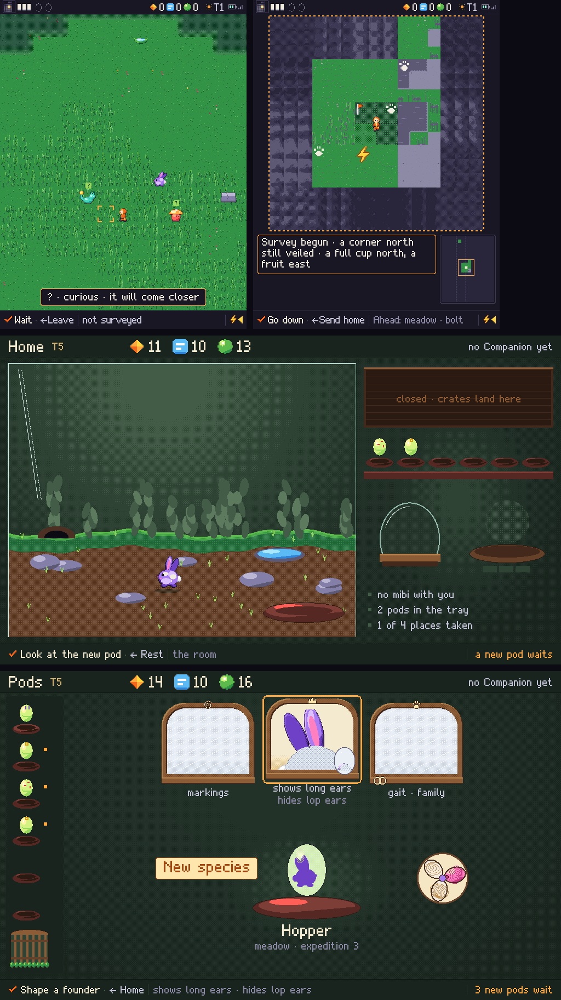
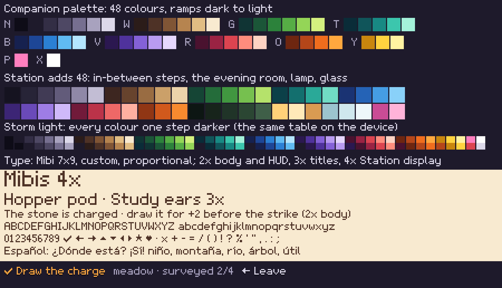
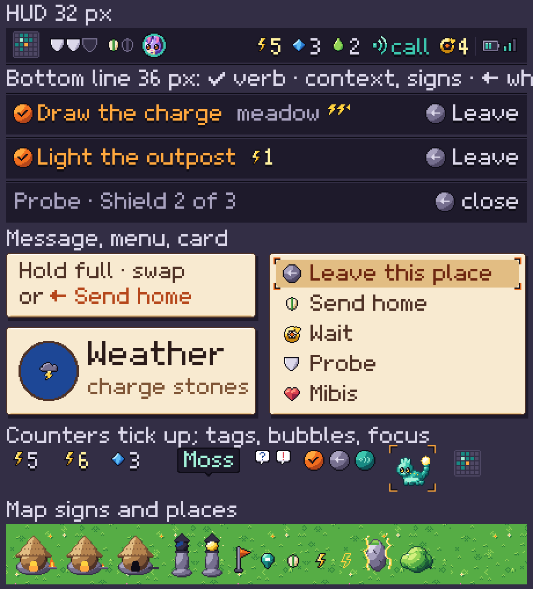
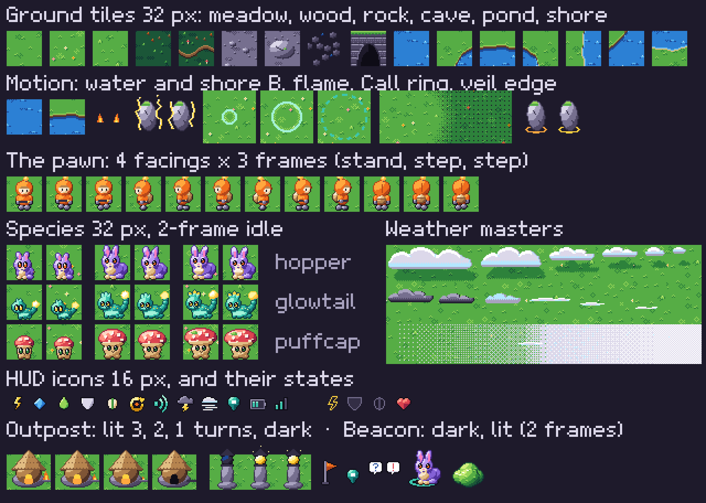
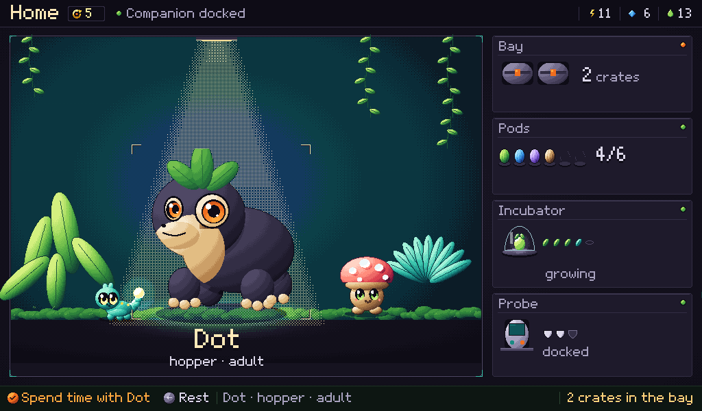
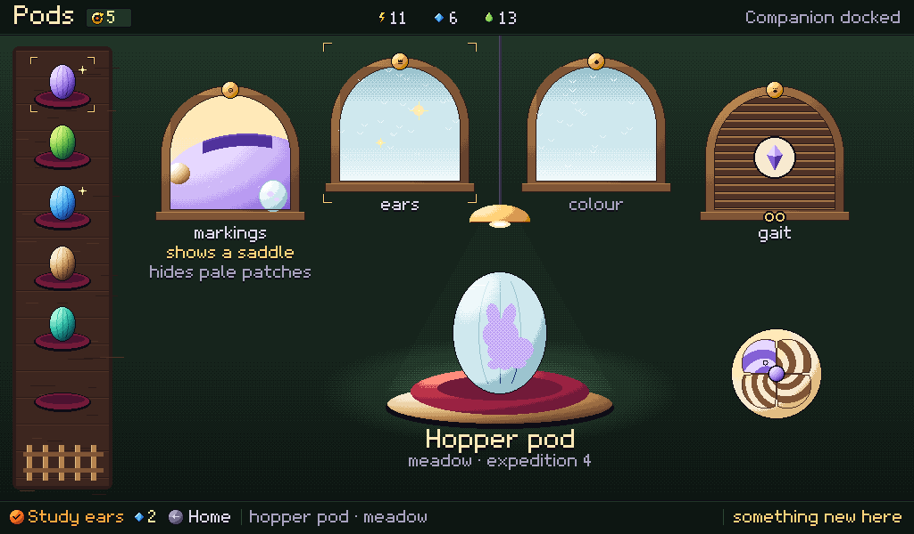

# UI kit: art direction for the rebuild

**Proposal** for the owner's approval before engineering rebuilds the screens. It answers the
2026-10-07 decision that the prototypes' UI art is not acceptable even for a first playthrough.
It applies [art direction](../art-direction.md) (Miniature Lives: rounded, tactile, directional
light, expressive eyes, saturated playful colour) to every screen, and takes the layouts of
[companion-controls](companion-controls.md) and [station-screens](station-screens.md) as given.
Every sample and mock-up here is drawn pixel by pixel by script inside the palettes below:
nothing is scaled, filtered or generated.

Every picture below is in [ui-kit/](ui-kit/); the 1× files are pixel-exact, the 2× ones are for reading on a desktop.

## 1. Audit: why the current screens read as rudimentary

Judged at 1× against the approved concept art (companion-storm, companion-map-hands,
station-research-hands, companion-resident-home). Common cause: everything is drawn at run
time as flat fills, with no light model, no outline rule, no colour ramps, a stand-in font
and no layout grid; the Station upscales Companion art instead of having its own.

*What ships today, at 1×: place, reach map, Station Home, Station Pods.*

**Companion place.**
- *Tiles:* one mid green covers about 80% of the view; grass is scattered 1 px noise with no
  light direction; trees are dark lumps with no trunk, shadow or volume. The concept has a
  lit tree casting shade, clustered tufts, lit bushes and a darker, richer green.
- *Creature tokens:* about 14×12 px in a 32 px tile, two or three flat tones, a 1 px eye.
  On the 2.41" reference panel (about 311 ppi) that is roughly 1 mm: unreadable, and nothing
  of Miniature Lives (volume, eyes, markings) survives.
- *Pawn:* a 10×16 px orange figure, half a tile tall, unreadable at a glance; the concept's
  hood and antenna lamp are missing.
- *HUD glyphs:* 9 px icons in a 26 px row; the materials are a diamond, a bar and a ball with
  no shared language ("=" for Data); the world turn is text ("☀T1"); groups touch.
- *Font:* a home-made 5×7 at 2×, set 1 px apart on the bottom line, which mixes two pixel
  sizes; heavy, no real descenders, no accents for Spanish.
- *Panels:* the message box is a dark slab with a 1 px orange line; the menu and expedition
  cards are web cards with a solid orange focus bar; no bevel, shadow or material.
- *Colour use:* the 48 colours are named swatches, not ramps (six greens, four violets, no
  warm neutral ramp), so shading is inconsistent; storm and veil darken the same green, so
  most frames are two greens.
- *Spacing:* no grid; the message box sits over sprites; HUD items 2 px apart.

**Reach map.** Cropping each cell from its place is right. Fog is grey slabs of repeated cliff
tile; seen cells are dark grey; tracks are white blobs; the inset is an empty box; the storm
is faint lines. The concept shows a lit island in soft, layered cloud.

**Station Home.** Plants are dark blob columns, the ground a brown box with grey ovals; the
bench is boxes with labels ("closed · crates land here") and a bullet list; residents are 2–3×
upscaled Companion tokens, not the matched richer treatment; titles are the 5×7 at 3×.

**Station Pods.** The window idea reads; the frames are flat brown, the frost blank, the
flank drawing a flat lilac shape; cups are flat ovals, the whorl is unreadable, the tray a slab.

## 2. The kit

**Light and form (all art).** One light, from the top left. Volumes are shaded in three or
four steps of one ramp, highlight at upper left, a rim of the darkest step at lower right.
Outlines are 1 px in the darkest step of the part's own ramp (never black), one step lighter
on the lit side ("sel-out"). Overlapping parts get a 1 px contact shade, never a line. No
anti-aliasing, gradients or alpha: blending is a palette table or a 4×4 Bayer dither.
Characters (pawn, mibis) are never darkened by storm or veil, so they always read.

**Companion palette: 48 colours** (ramps dark → light; the device keeps the 48 limit).

| Ramp | Role | Steps |
| --- | --- | --- |
| N cool neutral (7) | night, stone, UI chrome, rock | `#0e0c16 #1e1a2b #332e45 #4f4865 #766f8f #a8a2bf #dcd8ea` |
| W warm neutral (6) | soil, bark, wood, sand, paper | `#2b1b19 #4f3226 #7f5536 #b6844f #e2bd83 #f8ead0` |
| G grass (6) | meadow, foliage | `#0f3433 #1b5638 #2d823b #56ad45 #94d457 #d4f07f` |
| T teal (5) | Call, glowtail, deep leaves | `#0a2c38 #0f5559 #188a83 #3cc6ae #a3f2d9` |
| B blue (5) | water, sky, Data | `#172150 #1d4796 #2c80d4 #5fbbf2 #b4e7ff` |
| V violet (5) | hopper, dusk | `#2b1850 #50329c #8461d6 #b99bf2 #e6d7ff` |
| R red (5) | puffcap, hearts, danger | `#4b1230 #9a2242 #dc4450 #ff8c7c #ffd3c4` |
| O orange (4) | pawn, Confirm | `#6e2610 #b5461a #f06d1e #ffa83e` |
| Y yellow (3) | bolts, lamps, glow | `#c8860e #ffd23f #fff2a1` |
| P, X | pink accent, white speculars | `#ff7fbf #ffffff` |

Shadows shift cool, highlights warm (green's darkest step leans teal; red falls to violet).
Tables, all palette lookups: **DARK** (storm light, shade, drop shadows; storms go blue, not
brown-grey), **LIGHT** (lamp pools), **veil** (unsurveyed ground in a place: DARK plus a 4×4 night
dot, 16 px dithered edge), **mist** (unexplored land: a Bayer screen of fog white, white and pale
blue, thicker away from the explored island, over ground drained pale), **fade** (seen cells:
DARK, checker).

**Station palette: 96 colours**: the 48 plus an in-between step for every main ramp (8–11
steps per hue), the evening room (five deep moss tones), lamp (three warm creams), glass and
frost (three), and two pinks. The Station shades with dithered bands; the Companion with
clean bands only.

**Typography.** *Mibi 7×9*, a custom proportional bitmap font in the kit: cap height 7,
x-height 5, descenders 2, rounded bowls, tabular 4 px digits, ✓ ← → ▲ ▼ ◀ ▶ ★ ♥ ·, and
Spanish (á é í ó ú ñ ¿ ¡) for the target markets. Project-made, so it carries the project
licences (glyphs in the renderer AGPL, exported specimens CC BY-SA). The open drop-in with
the same metrics is m5x7 (CC0); m6x11 and m3x6 are "free with attribution" without an open
licence, and Silkscreen (OFL) has no true lowercase, so neither is proposed.
- Whole multiples only, tracking one font pixel, so every measure is even: **Companion** 2×
  for HUD, bottom line and body (14 px caps, 18 px line, 22 px pitch), 3× for titles, never
  1× (on a 311 ppi panel 2× caps are already about 1.1 mm). **Station** 2× body, 3× titles
  and names, 4× display.
- Colours on ink: body `N6`, context `N5`, Confirm's verb `O3`, Call `T3`, a ticking counter
  `Y2`. On paper: body `W1`, emphasis `O1`, warning `R1`. Text on art gets a 1 font px `N0`
  drop shadow.

**Layout, spacing, radius.**
- Companion frame: **HUD 32, view 532, bottom line 36** (from 26/540/34): 2× text with
  descenders and 16 px icons need it.
- Layout unit 4 px; text and icon edges on a 2 px grid; screen margin 6–8 px; groups 8 px
  apart, items in a group 2–4 px.
- Radius 4 px for panels, 3 for tags, 2 for chips (pixel profiles, not curves); Station frames 8.
- Drop shadow is DARK at (+2, +3). Panels: *ink* (`N1` on an `N0` line, `N2` top bevel),
  *paper* (`W5`, `W1` line, white top bevel, `W4` foot), *wood* (Station bench, frames).

**Components** (see `components-2x.png`).
- *Bottom line:* the engraved key as a round cap in its own colour (✓ orange, ← grey, Call
  teal), Confirm's verb in `O3`, then a price as icon + number; context in mist shrinking
  from its tail; conditions as small bolts and the storm's heading; `← where` never dropped.
  Read-only screens draw no ✓ cap at all.
- *HUD:* reach grid, Shield plates, pod slots, the partner's face on its teal ring | Energy,
  Data, Essence counters, Call's meaning, world turn | battery, radio.
- *Message box:* paper, up to three lines, never over the pawn's row.
- *Menu:* paper card, 16 px icon per entry, focus as a lifted `W4` row inside orange brackets.
- *Cards:* paper with a round vignette and a 3× title.
- *Counters:* +1 per 90 ms with a 260 ms `Y2` flash; a spend drops at once.
- *Bubbles:* `?` blue, `!` red, white rounded bubble with a tail.
- *Name tag:* ink tag with a pointer.
- *Focus:* corner brackets, orange on the Companion, lamp cream on the Station.
- *Flags, pins and signs:* the start flag, the teal pin, pod, bolt and hollow bolt on the map.
- *Outpost:* flame big, medium and small for 3, 2 and 1 turns, then a dark door.
- *Beacon:* a dark lamp, or a lit lamp with two-frame sparks.

*The 48 Companion colours as ramps, the Station's 96, the DARK/LIGHT/veil/fade tables, and the Mibi 7×9 specimen.*

*The components, shown at 2×.*

**Icons (16 px)**: Energy, Data, Essence, Shield, Pod, World turn, Call, Storm, Fog bank (hand-
drawn clouds), Pin, Battery, Radio; states: hollow bolt, Shield gone, free pod slot, bond.

**Animation vocabulary** (first frame is the still state for reduced motion).

| Motion | Frames and timing |
| --- | --- |
| Idle (mibis, partner) | 2 frames at 2 Hz: body down 1 px, ears or crest settle, glow swaps |
| Walk (pawn) | 3 frames, stand–step–stand–step, one step per 150 ms (the hold-to-walk repeat) |
| Light flicker | 2 frames at 4 Hz: outpost flame, beacon sparks, charged-stone crackle |
| Water | 2 frames at 2 Hz: ripples shift 2 px, shore foam swaps |
| Warm stone | ring alternates two ambers at 1 Hz until you have been near |
| Call ring | 3 frames over 300 ms (inner light band, then the dotted contour held a moment) |
| Veil edge | static 16 px Bayer fade; lifting swaps baked tile variants, no per-pixel work |
| Counter tick | +1 per 90 ms, 260 ms flash |

## 3. Pixel samples

`samples-1x.png` (with a 3× preview), all inside the 48 colours (checked: 0 off-palette pixels):
- **16 ground tiles** at 32 px, seamless (stamps wrap): meadow plain, flowers, tall grass;
  wood floor, roots; rock gravel, slab; cave floor, cave mouth; pond; six shore pieces of the
  4-bit corner autotile (the same script yields all 16 corner cases: a lit grass lip and an
  earth bank where land drops to water, shade under it, foam on the lee sides).
- **The pawn**, 4 facings × 3 frames: hooded orange suit, antenna lamp, pack, lantern;
  the right facing is rebuilt mirrored so the light stays top-left.
- **Hopper, glowtail, puffcap** at 32 px, idle 2 frames, as juvenile (bigger head and eyes,
  short ears, small cap) and elder. Elders read calm and dignified, never drooping: eyes
  open, frosted ear tips and a chest ruff, a gold-tipped crest, a wide frilled cap with moss.
- **Motion frames** (water, shore, flame, crackle, Call ring, veil edge, warm stone) and
  **weather masters**: six hand-drawn cumulus in fair, far and storm tones, three wisps, the
  mist ramp; clouds drift 1 px per action, rain leans with the storm's heading.
- **12 HUD icons** and four states; **outpost** in four states, **beacon** in three.

The same part-based construction renders the Station's richer creatures at 2.5–3.6× with
Station ramps and dithered bands (the vivarium mock-up), not upscales. It also points to the
genome-to-sprite pipeline: parts and markings are parameters, and art never changes genes.

*The sample sheet at 3×. The pixel-exact sheet is [samples-1x.png](ui-kit/samples-1x.png).*

## 4. Mock-ups

- **Companion place in a storm:** storm light through DARK, slanted rain, a charged stone, a
  warned strike outline, a lit outpost sheltering puffcaps, a tree that is not shelter, the
  partner with ring and tag, a curious glowtail, the veil's edge, message box, HUD, line.

  

  *Companion place in a storm, 450×600 at 1×.*

- **Companion reach view:** 78 px cells cut from real tiles, seen cells faded, unsurveyed
  quarters dotted; mist thickening away from the explored island over faint land, wisps, two
  layers of cumulus with ground shadows; the storm band as dark cloud shadow, rain leaning
  east, a lit leading edge; range, flag, beacon, outpost, signs, a gated cave, the inset.

  

  *Companion reach view at 1×. Both Companion screens side by side at 2×: [companion-2x.png](ui-kit/companion-2x.png).*

- **Station Home:** a lit glass vivarium with residents at Station size, focus on one
  resident; the bench as objects: bay door with the Companion mark, six felt cups with a glint,
  incubator dome with its leaf timer, the empty Probe cradle.

  

  *Station Home at 1×.*

- **Station trait windows (Pods):** the tray column and garden gate; four windows (shows and
  hides with a misty seed, glint, frosted, shutter with what opens it); the pod under its
  lamp, the fingerprint whorl, `✓ Study ears · 2 ◆`.

  

  *Station Pods at 1×. Both Station screens at 2×: [station-2x.png](ui-kit/station-2x.png).*

## 5. Production plan

- **Authored (pixel masters).** Per biome: base tiles, 16-tile corner sets per edge (shore,
  cliff, river, wood edge) and features. Also the pawn (walk, creep, react), each species
  (3 stages × idle, walk, react, startled), icons, UI 9-slices and the font. The scripts that
  drew this kit become the first sheet generators, kept as code (AGPL); polish passes
  happen in Aseprite.
- **Generated, then hand-pixelled.** References only, via the Gemini image models under the
  art rules: species turnarounds, the Station room, map moods. They are labelled generated
  and redrawn on the palette; generated pixels never ship.
- **Tools that raise the ceiling, to request:** Aseprite seats (authoring, animation); a
  pixel-art generation service with palette lock and rotations (PixelLab or Retro Diffusion)
  for tile and in-between drafts; a phone or the 2.41" AMOLED board to judge at the real 311
  ppi; Tiled for place layouts; a commissioned pixel artist for the three species masters; a
  commercial bitmap font family only if the custom face falls short in play.
- **Rebuild order:** (1) Companion place: tiles, tokens, pawn, HUD, bottom line; (2) reach view
  and full map; (3) menus, messages, expedition, Probe and Cargo screens; (4) the active mibi
  screen; (5) Station Home; (6) Pods, Create, Incubator; (7) Library, Habitat; (8) Caddy
  four-gray and print versions of the same sprites.

## 6. Decisions for the owner

1. **Adopt this kit** (ramped palettes, one light, the outline rule, the components) as the
   art standard for the rebuild. (Recommended.)
2. **Companion frame 32 / 532 / 36** instead of 26 / 540 / 34, so text at 2× has room.
   (Recommended.)
3. **Type: the custom Mibi 7×9**, 2× minimum on the Companion; alternative m5x7 (CC0, same
   metrics). (Recommended: custom.)
4. **Tools:** approve Aseprite and a one-month trial of one pixel-generation service.
5. **Pixel scale on the 2.41" panel:** 32 px tiles are about 2.6 mm there. Judge these
   mock-ups on a phone at that size before freezing 32 px. The alternative is 48 px tiles,
   about 9 across.
