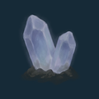
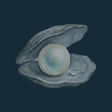
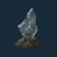

# Research and breeding

This document holds the rules of what a player does with a mibi's genome at the
Station. That covers reading a pod, shaping and growing a founder, crossing two
mibis, pinning a wish, and what each of these costs and shows. It is written for
anyone building or designing the game.

How genes behave lives in [Genomics](creatures-and-genomics.md): the kinds of
part, the two copies, what a child inherits and the stamp. This document covers
only the play built on them. The wider loop is in [the game](game.md), and
expeditions are in [world and exploration](world-and-exploration.md).

## An example

A first Loika pod comes home in a crate. The player identifies it for free and
learns that it is a Loika, a new species. The player reads its Coat chapter,
which is also free because it is the first read ever. The page shows the pod's
markings as plain, with pale hidden underneath. Reading Face costs 2 Data, one
for each of its two traits. On the Create screen the player shapes the markings
to show only pale, which adds 1 Data. Growing it costs 2 Energy, with no Essence
for a first founder. The bud takes five minutes. Meanwhile, the two unread
chapters, Movement and Stamina, clear one after the other. The player then opens
the incubator, and a young Loika with pale markings steps into the vivarium,
known in full.

## Pods and what research is

A pod holds one complete genome. The player learns it a page at a time, and
knowing only part of a pod is normal. Research is optional and works as
discovery, not a quiz: an unread pod can still be grown. What the player has
learned stays even after the pod is used up or the supplies run out. Research
never changes the pod ([Genomics](creatures-and-genomics.md#research)).

Research reads and shows the genome as pictures and short words. More genome
gives fuller pages and more looks to find, never more buttons.

## Identify

Identifying a pod costs 1 Energy, and the first pod ever is free. The seal breaks
and the species shows. The first identified pod of a species teaches the player
that species for good: what it fixes is known from then on, and its page opens
in the Library. An identified pod can be grown straight away, unread.

## Reading a chapter

A **chapter** is one page of a species' genome; Genomics names them
([chapters and traits](creatures-and-genomics.md#chapters-and-traits)). The
Station shows every chapter the species has. Each
chapter holds a few **traits**, and each trait is one picture.

- A read covers one chapter of one pod and shows both copies of every trait in
  it. A read is one press and never a wait.
- A read costs **1 Data per trait** in the chapter. Once that chapter has been
  read on any earlier pod or mibi of the species, it costs **half, rounded up**.
- The first read ever is free. A chapter already read is free to look at again.
- A pod's progress shows as a ring around it that fills chapter by chapter. It
  is never shown as digits.

### What a page shows

Each trait reads as one of these:

| The trait | What the page says |
| --- | --- |
| Shows one look and hides another | the shown look, then the hidden one |
| Both copies give the same look | only that look |
| A blend between two looks | from one look to the other |
| A look switched off in this mibi | the shown look, and what sleeps under it, which can wake in a child |
| A doing that only breeding changes (movement, stamina, character) | the doing, marked "breed to change" |

A hidden copy shows only in a read
([Genomics](creatures-and-genomics.md#how-two-copies-show)). When a
trait shows a look the player has never seen in that species, the trait keeps a
"new" mark on this pod's page.

## Glints and compare

A pod **glints** on a chapter when three things hold: that chapter has been read
before on the species, it is still unread on this pod, and this pod carries
a look the species has not shown yet. The glint tells the player that something
new is there, never what it is. It tells the player where Data is worth
spending.

**Compare** is free. It puts two identified pods of one species side by side and
marks the traits, read on both, where they differ.

A pod that is not wanted can go back to the wild. That frees its cup and gives
1 Essence.

## Sealed chapters and finds

Some species keep one chapter **sealed**
([Genomics](creatures-and-genomics.md#chapters-and-traits)). A sealed chapter
has no read price. Its page stays shut and shows the find that opens it.

There are three kinds of find, and each is shown on the shut page:

  

*The three finds at 1×: a crystal dug up from the ground, a pearl from water,
and a shard of storm glass left by a storm.*

- The picture always matches the words that name the find. A seal whose words
  name none of the three shows "opens with a find" and no picture.
- The page says where the find turns up. Often that is where a partner of a
  named species can reach it: the Untuva's Character chapter opens with a
  crystal, dug up where an Untuva partner sniffs out a buried pod.
- A find comes home in a crate like other cargo, and the Station keeps it until
  it is used.
- Using a find opens that chapter **for the whole species, for good**. Every pod
  and mibi of the species can then read it at the usual chapter price, and the
  find is used up.
- A shut chapter's looks count as unseen, so a species' field guide is complete
  only after its find.
- A shut chapter does not clear in the incubator. A mibi grown before the find
  reads that chapter afterwards, at the usual price.

## The field guide

The **field guide** is the Library's record of a species. It holds every look the
player has seen for each trait, from read pods and from mibis, and shows "more?"
where looks are still unseen. Its looks use the same words a read gives. The
guide is complete when every look the species can carry has been seen, the
sealed chapter's looks included. Seeing every look of a species is a long goal.

The Library and the field guide are about a species. The Pods and the vivarium, up close,
screens are about one individual, its stamp included.

## Creating a founder

A **founder** is a mibi grown from one pod
([Genomics](creatures-and-genomics.md#creating-a-mibi)).

- **Unedited.** Any identified pod can be grown as it is, with every trait the
  way the pod has it.
- **Shaping.** On Create, each read trait that can be shaped rolls among up to
  three pictures, all drawn from this pod's own two copies: as the pod is, only
  the first copy, or only the second. A trait whose two copies give the same
  look has one picture. Which traits can be shaped is in
  [Genomics](creatures-and-genomics.md#the-four-kinds-of-locus).
- Untouched and unread traits keep the pod's values, including ones the player
  knows nothing about.
- **A shape that won't grow.** Some combinations can't make a body. Create names
  the traits that clash and offers no Grow until one changes. Nothing is spent.
- **Review.** Before the player commits, Create shows the founder large, what
  changed, which chapters stay a surprise, and the full price.
- **Price.** Growing costs **2 Energy and 4 Essence**, plus **1 Data for each
  shaped trait**. The first founder ever costs no Essence.
- **Grow** commits one individual, which incubating and opening reveal
  unchanged. The pod's stamp is pressed and the pod goes into the incubator.

## The bud

- A bud grows for **20 minutes plus 1 minute for each shaped trait**. The first
  bud ever grows in **5 minutes**.
- The Station has one incubator, so only one bud grows at a time. A full
  vivarium refuses the bud before anything is paid. The incubator opens even
  when it is empty.
- **Grow now** costs **1 Essence for every 2 minutes left**, rounded up. The price
  falls as the bud grows.
- A founder's unread chapters clear one by one across the wait. A founder opens
  known in every chapter except a sealed chapter that is still shut, so the
  find stays a discovery.
- New cargo never shortens the wait.
- Opening takes a press. The young mibi steps into a free bay with its name and
  its stamp.

### Names

A new mibi takes its name from the Station's pool of names. **No two living
mibis share a name**, whether they are at home, with the player or returned to
the wild. A name never carries a digit. The pool holds more names than a player
can keep alive at once.

## The cross

Two mibis of one species make one child on the Cross screen. How the child
inherits is in [Genomics](creatures-and-genomics.md); this section covers the
play.

- **Who can cross.** Adults and elders of the same species. A juvenile cannot
  cross, and a mibi cannot cross with itself. Any other pair is refused when it
  is picked, before any price. A mibi out with the Companion is away: it shows
  dimmed and comes back.
- **Price.** A cross costs **2 Energy and 4 Essence**. Its bud grows for 20
  minutes, and Grow now works on it as on any bud.
- **The forecast.** For each trait it shows what the child can be, as pictures:
  - For a switch, it shows four seed pictures. Each is a quarter, never a
    percentage.
  - For a blend, it shows the trait drawn at the two ends of the child's range,
    with the stretch between shaded.
  - A trait known for sure shows one firm picture.
  The player never sees the word "forecast".
- **Only what is read.** The forecast shows a trait only when both parents have
  read its chapter. Every other trait is marked missing, and the page names which
  parent and which chapter to read. A sealed chapter shows shut, with its find.
  This is the pull to keep reading.
- **Kin.** Closer kin make a poorer child ([Genomics](creatures-and-genomics.md)).
  The Cross screen names how related a pair is in words only, never as a number
  or a fraction: wild founders, distant kin, cousins, half kin, close kin, the
  same line.
- **A child that cannot be built** is refused with nothing spent
  ([Genomics](creatures-and-genomics.md#breeding-the-cross)).
- **The bred child.** It has two real parents. Its chapters do not clear in the
  incubator: it opens known only in the chapters where its parents leave no
  doubt. The player reads the rest at a pod's chapter prices. Reading children is
  how the player sees what a family passed on.

## The wish

A **wish** is a dream mibi that the player pins on a species' Library page, made
from looks the field guide holds. Pinning and unpinning are free.

- A pod or mibi that carries a piece of the wish, shown or hidden, glints on the
  chapter that holds the piece, whether that chapter is read or not. Like every
  glint, it says where, never what.
- In the forecast, the seeds that show a pinned look light up, and a blend marks
  the pinned look when the range reaches it. How close a pair comes to the wish
  is shown by the pinned traits that light, never by a number.
- A wish is knowledge only. It never puts a look into any pod or mibi.

## Self-changing traits

A few traits change within a mibi's life, by where it goes as a partner: Glow,
Basking and Phase. How they move is in
[Genomics](creatures-and-genomics.md#self-changing-traits).

- Only the mibi with the player as partner changes. Residents at home keep
  their look.
- The player steers a change only by choosing where the partner walks. No item,
  button or price moves it.
- The vivarium, up close, shows the change in words, never as a number: the look now, and that
  it changed lately.
- The detail view shows the look the mibi was born with, the look now and the
  cause in plain words, for example "brighter after walks in caves and woods".
- A trait in a sealed chapter gives no hint of a change until the chapter is
  read.
- A change never adds a look to the field guide, never counts toward a wish and
  never changes a forecast. Those follow the copies the mibi was born with,
  which are also what a child inherits.

## Stamps and scans

Every mibi has a stamp, which can be printed and scanned
([Genomics](creatures-and-genomics.md#the-genome-stamp)).

- A scanned stamp shows everything its keeper has read, hidden and sleeping
  copies included. Unread and sealed chapters are never in a stamp.
- A scan only shows a mibi. It never creates or moves one.
- A scan never teaches the scanner's Station anything. It adds no look to the
  field guide, counts toward no wish, lowers no read price and makes no glint.

## Data and the other supplies

Energy runs the Station's machines, Data pays for reads and shaping, and
Essence grows bodies. Essence never turns into Energy.

- **Data** comes mostly from expeditions, from creature moments the player
  causes ([world and exploration](world-and-exploration.md)).
- **The bench** adds a little each day. A resident watched for a full minute
  gives **1 Data**, and two residents compared give **1 Data**, up to **2 Data a
  day**. The day turns at midnight on the Station's clock.

| At the Station | Price |
| --- | --- |
| Identify a pod | 1 Energy; the first pod ever is free |
| Read a chapter | 1 Data per trait; half, rounded up, once the chapter has been read on the species; the first read ever is free |
| Look again, compare, wish, the Library | free |
| Grow a founder | 2 Energy and 4 Essence; the first founder ever: 2 Energy |
| Shape a trait | 1 Data each, and 1 more minute on the bud (not on the first bud ever) |
| Cross two mibis | 2 Energy and 4 Essence |
| Grow now | 1 Essence for every 2 minutes left, rounded up |
| Return a pod to the wild | gives 1 Essence |

## What research earns

Research earns **sittings**. A sitting pays for one mibi's portrait. One is earned
by completing a species' field guide, by opening a species' sealed chapter, or by
the first pod of a new drop. One more comes early in the game, to show how a
sitting works. The player holds one sitting at a time.

## Genomes grow with the player

The starter species have small genomes that can be read in a few pages. Later
species leave more open, across more chapters, and some of those chapters are
sealed behind finds. New species arrive in drops. A player who knows the starter
species well has the skills the deep ones ask for.

## What the player sees of the genetics

[The game](game.md#who-it-is-for) says who the game is for. On the Station that
means:

- Traits are pictures and short words. The player never meets the words locus or
  allele, letter pairs such as Pp, ratios, or guesses about unread parts.
- Chances are quarters drawn as seeds and ranges drawn as pictures, never
  percentages.
- Progress shows as rings and marks, not digits. The only numbers are prices and
  supplies.
- A species not yet met gives no cue of what it may be.
- **The detail view** serves players who want the genetics. Any read trait opens
  it with one press, on Pods, the vivarium, up close, and Cross. It shows the trait's parts, each
  as its two copies in pictures, and the rule between them in plain words: one
  shows over the other, or they blend. On Cross it also gives each forecast as
  counts out of four, and each blend's range as values. It never uses the words
  locus or allele.

## Not designed yet

- The prices and waits of the finished game. The values in this document are
  set low so the whole loop can be played through quickly.
- How much Data an expedition yields, by kind of place.
- How deep a family line must be to earn a sitting.
- Editing a copy with a rare item.
- Wonders: how the player finds the combined traits a species can show
  ([Genomics](creatures-and-genomics.md#not-designed-yet)).
