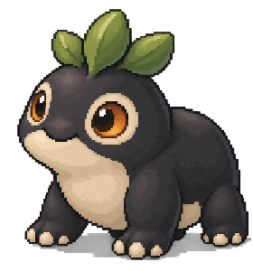
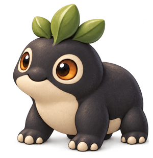

# Style guide

One look for every screen. Pictures lead; rules stay short. Per screen: [Companion screens](companion-screens.md) · [Station screens](station-screens.md).

## Miniature Lives on each device

Creatures are sculpted, rounded and tactile, lit from the top left, with expressive eyes, clear markings and saturated, playful colour. The **Companion** draws them in HiBit: detailed pixel art that keeps that volume at 450×600. The **Station** draws the same creature at full resolution with clean light and shading, keeping the same trait boundaries. The same individual survives both, and four-gray and paper.

<table><tr><td valign="top"><br><em>Companion, 450×600 at 1×. Accepted appearance reference (creature only; layout and type not accepted).</em></td>
<td valign="top"><br><em>Station, 1024×600. Accepted appearance reference (creature only; layout and type not accepted).</em></td></tr></table>

## The Companion

<table><tr><td valign="top"><br><em>companion-map-hands: the north star for the map. Approved concept, generated; a reference, not a master.</em></td>
<td valign="top"><br><em>companion-storm: the north star for a place. Approved concept, generated. The tree is not shelter.</em></td></tr></table>

- **Palette:** the kit's 48 colours as ramps (cool and warm neutrals, grass, teal, blue, violet, red, orange, yellow, pink, white; values in [ui-kit §2](../proposals/ui-kit.md#2-the-kit)). Nothing off palette.
- **Light:** one light, from the top left. Shade in three or four steps of one ramp. Shadows lean cool, highlights warm.
- **Outline:** 1 px in the darkest step of the part's own ramp, never black; one step lighter on the lit side. Touching parts get a contact shade, not a line.
- **No alpha,** no anti-aliasing, no gradients. Blends are palette tables (dark, light, veil, fade) or the 4×4 Bayer dither. Nothing else.
- **Type:** Mibi 7×9, 2× minimum (14 px caps), 3× for titles. Never 1×.
- **Frame:** HUD 32 · view 532 · bottom line 36. 4 px unit, 6–8 px margins, groups 8 px apart.
- **Tokens:** HiBit, never flat blobs. Rounded volume, catch-lit eyes, markings readable at a glance. Storm and veil never darken the pawn or a mibi.
- **Weather:** unexplored land is a lavender-grey cloud bank with volume and a lit rim; a fog bank is pale and washed out, never lavender; rain is one clean diagonal sheet.
- Take mood, light and the scale of signs and pawn from the concepts. Their strings and HUD details are not specs.

## The Station

<table><tr><td valign="top"><br><em>station-research-hands: the quality bar (clean light, real shading, a lit subject). Approved concept, generated; too simple in content.</em></td>
<td valign="top"><br><em>companion-resident-home: the warmth the living window carries, drawn at Station resolution. Approved concept, generated.</em></td></tr></table>

- **1024×600, used to the full.** Native resolution everywhere. Never a scaled-up Companion screen or upscaled tokens.
- **Light like the concept:** one key light from the top left, soft cast shadows, correct form shading, painted gradients. No dither bands, no flat fills.
- **A research instrument:** cool chrome, hairline rules, corner ticks, status lamps, few-word readouts, and equipment: sample bay, pod rack, incubation chamber, Probe dock.
- **One living window per screen,** warm and lively: the only warm light on the screen. Everything outside it is cool and calm.
- **Never a cottage:** no wooden benches, felt, shelves, lamp-lit rooms or evening greens. Glass, enamel, brushed metal, frosted panes.
- **HiBit is allowed:** a fine pixel grain on creatures and world; chrome and type crisp.
- **Type:** a smooth face, Inter (OFL), anti-aliased, with tabular figures. The Companion keeps the bitmap face; the two devices share colour roles, not a typeface.
- **Carry more** than the concept: keep its quality, fill the screen with the instrument and its life.

## Creatures on both devices

<table><tr><td valign="top"><br><em>HiBit, 280×300 at 1×. Accepted.</em></td>
<td valign="top"><br><em>Richer treatment, 300×310 at 1×. Accepted.</em></td>
<td valign="top"><br><em>Juvenile, adult, elder. Approved concept, generated; the elder reads calm, not sad.</em></td></tr></table>

- Subject area: 280×300 on the Companion, 300×310 or larger on the Station. In the field, tokens keep the same parts at tile size (48 px).
- Same anatomy, pose language and light on both devices; only inherited traits differ between individuals.
- Draw only what is known. Unknown parts stay frosted, never guessed. Art never changes genes.
- Age reads from proportion and bearing. Elders are calm and dignified: eyes open, leaves held up.

## Type and colour roles

| Role | Companion | Station |
| --- | --- | --- |
| Name, display | 3× | 4× (28 px caps) |
| Title | 3× (21 px caps) | 3× |
| Body, HUD, bottom line | 2× (14 px caps), cream on ink | Inter 16 px body and readouts, 20 px titles, 28 px names |
| Context | mist (N5) | mist on chrome |
| Confirm's verb · Call · ticking counter | orange O3 · teal T3 · yellow Y2 flash | the same hues |
| Warning | red R1 on paper | red, with a shape |
| Focus | orange corner brackets | a warm cream ring; the focused thing lifts |

Materials keep one shape on both devices: Energy a yellow bolt, Data a blue diamond, Essence a green drop. Text on art gets a 1 px dark shadow. Live text is never baked into art. Colour never carries meaning alone.

## Motion vocabulary

- **Companion, stepped frames:** idle 2 frames at 2 Hz; walk 3 frames, 150 ms a step; flame and crackle 2 frames at 4 Hz; water 2 Hz; Call ring 3 frames over 300 ms; slides 110–170 ms; counters +1 per 90 ms with a 260 ms flash.
- **Station, smooth and eased:** the living window moves all the time (breathing, routines, plants, water). The instrument moves only when something happens: doors, rails and lamps in 200–400 ms. Reveals (a frost wipe, a shell clearing) take about two seconds.
- **Both:** the first frame is the still state; nothing means something only by blinking; presses during a motion are consumed.

## Sign-off

The art director signs off every piece before the owner sees it. Engineers do not draw: no code-drawn screen, sprite, scene or effect is art. Engineers place signed-off assets and set live text. Pieces go brief → generated candidates against the approved references → critique → rounds → masters (hand-pixelled on the Companion, painted on the Station) → sign-off. Generated images are labelled; prompts and originals are kept.

**Decided 2026-10-08** ([art pipeline](../proposals/art-pipeline.md) v2). Mibis are the exception to "masters per piece": every mibi is drawn in the **standard look** rendered from the rig, and the art director signs the **treatment** (the plain render finished to this guide), the species plates, the control contract and the test sets, not each individual. A unique cloud-painted render is a prize a mibi earns by research; no person sees a player's prize render before the player, so the pipeline's validation checks stand in for sign-off there. "Masters hand-pixelled on the Companion" is *superseded* for creatures: the Companion's version is derived from the Station's render.

## Per-screen checklist template

```
Screen: ________  Device: Companion 450×600 | Station 1024×600  Piece: ________
[ ] Reads first: ________, at 1×, within a second
[ ] Judged at device size, 1×, on a true-size screen
[ ] One light from the top left (Station: one warm living window, the rest cool)
[ ] Companion: 48 ramps, no alpha, Bayer only | Station: clean painted light, no dither bands
[ ] Creature keeps volume, eyes and markings; only what is known is drawn
[ ] Type at its role size; live text; six words or fewer a line on the stage
[ ] Frame, one focus, bottom line (✓ · ← | where | conditions or what needs you), one close
[ ] Motion from the vocabulary, with a still state; shape as well as colour
[ ] Provenance recorded; signed off by the art director
```

## Decided

1. **The Loika** is Pip as in the approved art: charcoal, cream belly, orange eyes, three-leaf crest. The lilac long-eared token is retired.
2. **Station type** is a smooth face, Inter, anti-aliased.
3. **Pixel indication on the Station:** a fine grain on creatures and world; chrome and type crisp.
4. **Companion tile size:** 48 px, about 9 across and 11 down; the camera keeps the pawn in the middle third.
